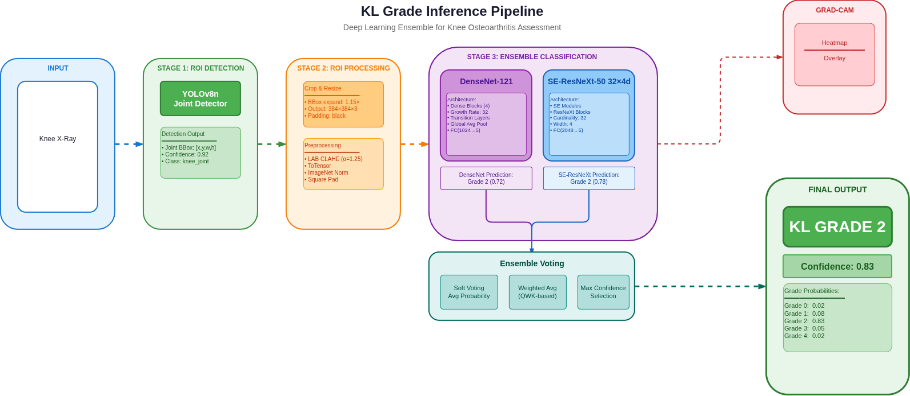

# Inference Architecture

**Architecture Diagrams:** See [ai-architecture.md](ai-architecture.md) for visual diagrams.



*Source: [`diagram/inference-pipeline-v2.drawio`](diagram/inference-pipeline-v2.drawio)*

```text
X-ray upload
  -> YOLOv8 knee detection
  -> expanded square ROI
  -> CLAHE, resize, normalization
  -> classifier
  -> KL grade probabilities and Grad-CAM
```

YOLOv8 only finds knee joints. The classifier assigns the KL grade.

## Input Processing

- The ROI is a square centered on the YOLO box, with side length `1.15 * max(width, height)`.
- Padding is added only outside the original X-ray. Do not center-crop the ROI because this can remove marginal osteophytes.
- The image uses LAB CLAHE, is resized to `384 x 384`, and is normalized with ImageNet values.

## Models

`MODEL_MODE` selects one of these modes:

| Mode | Model |
| --- | --- |
| `densenet121` | DenseNet-121 |
| `se_resnext` | SE-ResNeXt-50 32x4d |
| `ensemble` | Weighted probability vote of both models |

All modes use five KL classes and cross-entropy loss. In ensemble mode, Grad-CAM is generated by the component with the strongest confidence for the final class.

Grad-CAM highlights image regions that influenced a class score. It is not a segmentation mask or proof of a clinical finding.
