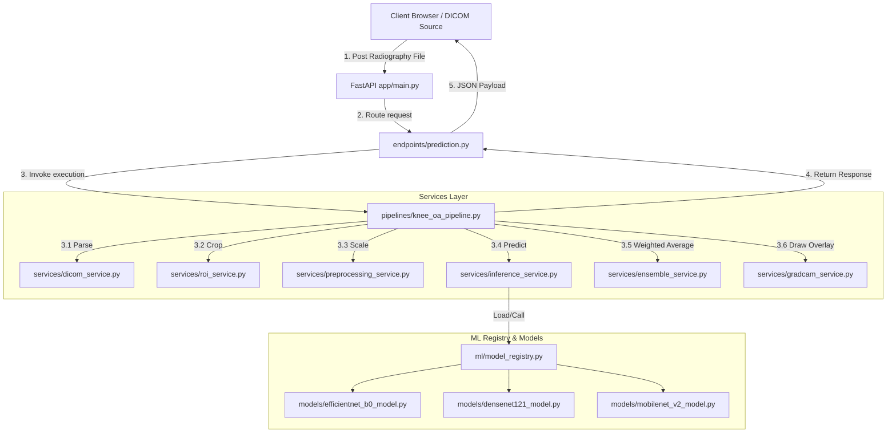

# 🏗 API Architecture and Data Flow

This document details the system design, components boundaries, and the prediction execution pipeline.

---

## 🗺 System Architecture Overview

---

## 🔁 Execution Pipeline Steps

When a request is submitted to the `/predict` endpoint, the following sequential operations are executed:

### 1. File Format Decoding (`dicom_service.py` & `file_utils.py`)
* The service reads the raw input byte stream.
* If a DICOM preamble `"DICM"` is present at offset 128, the service uses `pydicom` to parse headers and extract standard attributes (such as anonymized Patient ID, Patient Sex, etc.).
* Pixel intensity matrices are normalized based on DICOM rescale slope/intercept tags.
* Contrast inversion (MONOCHROME1 vs MONOCHROME2) is handled to ensure consistent bone density representation (bright bones on a dark background).

### 2. Joint Localization (`roi_service.py`)
* Crops the input radiograph to focus only on the joint space area (ROI). This reduces computational noise (e.g. skin, surrounding tissue, or metal implants) and increases classification accuracy.

### 3. Image Standardizing (`preprocessing_service.py`)
* The cropped ROI is converted to RGB mode.
* The image is resized to a fixed square resolution of `224x224` pixels.
* The pixel values are converted to float32 and normalized with ImageNet stats (mean/std) matching the model's training configuration.

### 4. Model Registry & Parallel Inference (`inference_service.py`)
* Backed by `model_registry.py`, the pipeline loads the three classification models in memory (CPU or GPU).
* Each model returns a probability distribution across 5 classes (representing KL Grades 0 to 4).
* A mock fallback is implemented in the base model class to gracefully simulate responses if the actual model weight files are not loaded.

### 5. Ensemble voting (`ensemble_service.py`)
* An ensembled average is computed from individual model outputs using predefined weighting parameters:
  * **EfficientNet-B0**: `40%` weight
  * **DenseNet-121**: `40%` weight
  * **MobileNet-V2**: `20%` weight
* The grade with the highest aggregated probability is declared the prediction winner.

### 6. Grad-CAM Generation (`gradcam_service.py`)
* Extracts features from the final convolutional layer of the classification network (e.g. EfficientNet).
* Computes gradients with respect to the winning class score to construct a spatial attention heatmap.
* Overlays the heatmap on the original cropped ROI and encodes the final diagnostic image into a Base64 string.
