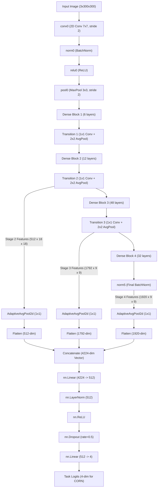

# DenseNet-201 Optimization & Configuration Guide

This interactive guide details all the architectures, parameters, loss functions, data augmentations, and Grad-CAM settings currently configured in [dense_net_201.ipynb](file:///home/viet/Capstone/ml/notebooks/dense_net_201.ipynb).

---

## 🔍 Clickable Interactive Menu
Click on any topic below to expand its full documentation, clinical rationale, and implementation details:

<details>
<summary><b>1. 🚀 Three-Stage Training Pipeline</b></summary>
<br>

The model uses a structured 3-stage training pipeline designed to stabilize transfer learning and prevent representation drift.

| Stage | Name | Target Layers | Loss Function | Data Loader | Epochs |
| :--- | :--- | :--- | :--- | :--- | :---: |
| **Stage 1** | **Warm-up FC** | Head Only (Backbone Frozen) | `corn` | Balanced Sampler | 5 |
| **Stage 2** | **Coarse-tuning** | All Layers Unfrozen | `corn` | Balanced Sampler | 25 |
| **Stage 3** | **Fine-tuning** | All Layers Unfrozen | `focal_corn` | Original Skewed | 15 |

### Phase Details:
*   **Stage 1 (Warm-Up):** Trains the randomly initialized linear classifier head while locking the backbone. This prevents massive gradients from corrupting pre-trained ImageNet weights during early iterations.
*   **Stage 2 (Coarse-Tuning):** Unfreezes all layers and utilizes the `WeightedRandomSampler` to train on balanced batches. This ensures the model learns feature boundaries for rare classes (like Grade 4).
*   **Stage 3 (Fine-Tuning):** Loads the best Stage 2 checkpoint, disables the balanced sampler to return to the natural dataset distribution, and trains with a tiny learning rate (`1e-5` decaying to `1e-7`) and higher regularization to align prediction probabilities with the test split.
</details>

<details>
<summary><b>2. ⚙️ Optimizer & Scheduler (AdamW & Cosine Annealing)</b></summary>
<br>

To optimize the multi-scale model, we implement decoupled learning rates and stage-specific learning rate scheduling.

### A. AdamW Optimizer & Decoupled Learning Rates
We use the **AdamW** optimizer (with decoupled weight decay) to prevent overparameterization and regularize the network.
*   **Decoupled Learning Rates (Stage 2):**
    Because the backbone is already pre-trained (on ImageNet) but the classifier head is initialized from scratch, we use different learning rates for each:
    *   **Backbone LR:** `1e-5` (slow updates to prevent destroying pre-trained feature boundaries).
    *   **Classifier Head LR:** `1e-4` (fast updates to let the head adapt quickly).
*   **Stage-Specific Weight Decay:**
    *   **Stage 1 & 2:** `weight_decay = 1e-4`
    *   **Stage 3:** `1e-3` (multiplied by 10 in Stage 3 to enforce strong regularization during final fine-tuning and prevent overfitting).

### B. Cosine Annealing Schedulers
We implement a **Cosine Annealing Scheduler** to dynamically adjust learning rates across epochs:
*   **Formula:**
    $$\eta_t = \eta_{\text{min}} + \frac{1}{2}(\eta_{\text{max}} - \eta_{\text{min}})\left(1 + \cos\left(\frac{T_{\text{cur}}}{T_{\text{max}}}\pi\right)\right)$$
*   **Parameters:**
    *   `T_max = stage_epochs` (anneals LR down to the minimum at the end of the stage).
    *   `eta_min = 1e-7` (prevents learning rates from hitting absolute zero, keeping gradients active).
*   **Stage 1 Scheduler:** `"none"` (flat learning rate of `1e-3` for fast warm-up).
*   **Stage 2 & 3 Schedulers:** `"cosine"` (smooth cosine decay to prevent representation collapse near the end of training).
</details>

<details>
<summary><b>3. ⚖️ Imbalance Handling (Weighted Sampler & Augmentation)</b></summary>
<br>

To handle the highly skewed dataset (Grade 0: 2286, Grade 4: 173), we combine two SOTA balancing techniques:

### A. Weighted Random Sampler
Enabled via `TrainingConfig.use_balanced_sampler = True` in Stage 1 and Stage 2.
*   **How it works:** Computes weights for each sample inversely proportional to its class frequency:
    $$W_c = \frac{1}{\text{Count of Class } c}$$
*   **Effect:** Each batch generated by the `DataLoader` has a uniform distribution of classes ($20\%$ probability for each of the 5 grades), forcing the model to pay equal attention to all severity stages.

### B. Minority Class Augmentation
Enabled via `TrainingConfig.use_minority_aug = True` in Stage 1 and Stage 2.
*   **How it works:** Applies a stronger, separate transformation pipeline (`minority_train_transform`) exclusively to images belonging to **Grade 3 and Grade 4** during training.
*   **Effect:** Increases the diversity of minority class samples to prevent the network from memorizing their limited instances.
</details>

<details>
<summary><b>4. 📉 Loss Functions (CORN vs. Focal CORN)</b></summary>
<br>

The notebook includes custom implementations of ordinal loss functions that respect the ordered nature of Kellgren-Lawrence grades ($0 \rightarrow 1 \rightarrow 2 \rightarrow 3 \rightarrow 4$).

### A. CORN (Conditional Ordinal Regression for Neural Networks)
*   **Concept:** Decomposes a $K$-class ordinal regression problem into $K-1$ conditional binary classification tasks. 
*   **Formulation:** It computes the conditional probability that a sample exceeds threshold $k$ given that it has already exceeded threshold $k-1$:
    $$P(Y > k \mid Y \ge k) = \sigma(L_k)$$
*   **CORN Loss Formula:**
    $$\mathcal{L}_{\text{CORN}} = - \frac{1}{K-1} \sum_{k=0}^{K-2} \left[ y_k \log \sigma(L_k) + (1 - y_k) \log (1 - \sigma(L_k)) \right]$$
    *Where $y_k = 1$ if the true grade exceeds $k$, else $0$.*

### B. Focal CORN Loss
*   **Concept:** Extends CORN by adding a focal modulation factor $(1 - p_t)^\gamma$ to binary cross-entropy.
*   **Formulation:**
    $$\mathcal{L}_{\text{FocalCORN}} = - \frac{1}{K-1} \sum_{k=0}^{K-2} \left[ \alpha (1 - p_t)^\gamma \cdot \text{BCE}(L_k, y_k) \right]$$
    *Where $p_t = \sigma(L_k)$ for positive targets and $1 - \sigma(L_k)$ for negative targets.*
*   **Effect:** Down-weights easy, well-classified examples (e.g. obvious Grade 0 or Grade 4 cases) and forces the model to focus on hard, ambiguous examples (like the Grade 1 boundary).
</details>

<details>
<summary><b>5. 🧠 Multi-Scale Feature Fusion Backbone</b></summary>
<br>

Instead of using standard DenseNet-201 (which only feeds the last layer `norm5` to the classifier), we implemented a **Parallel Multi-Scale Feature Fusion** network:

```
Input Image (300x300) 
      │
[DenseNet-201]
      ├── Stage 2 (Transition 2) ──> [GAP] ──> (512-dim)  ──┐
      ├── Stage 3 (Transition 3) ──> [GAP] ──> (1792-dim) ──┼──> [Concatenation] ──> (4224-dim Fused Vector) ──> [Classifier Head]
      └── Stage 4 (Norm 5)       ──> [GAP] ──> (1920-dim) ──┘
```

### Why this is SOTA for Knee OA:
*   **Stage 2 Features:** Retain high spatial resolution to capture **local details** (like tiny, early-stage osteophytes).
*   **Stage 4 Features:** Capture deep semantic context to evaluate **global spacing** (like joint space narrowing).
*   **Aggregation:** Concatenating these pooled maps allows the final classifier to make a decision based on both micro-structural features and macro-structural alignments.
</details>

<details>
<summary><b>6. 🖼️ Clinical Data Preprocessing & Augmentations</b></summary>
<br>

### Preprocessing Operations:
1.  **Square Padding (`SquarePadOpenCV`):** Adds black borders to rectangular X-rays to make them square without stretching or altering the anatomical joint space aspect ratio.
2.  **CLAHE (`OpenCVCLAHE`):** Applies Contrast-Limited Adaptive Histogram Equalization to normalize exposure and enhance bone edges.
3.  **Grayscale Normalization:** Standardizes pixel intensities across diverse X-ray machines.

### Augmentation Rules (Clinical Constraints):
*   **Horizontal Flips:** Enabled ($p=0.5$). Clinically valid as left/right knees are symmetric.
*   **Capped Rotations ($\le 8^\circ$):** Image rotation is restricted to $8^\circ$. Large rotations tilt the knee condyles, artificially changing joint space narrowing appearances and confusing the model.
*   **No Color Jitter:** Excluded to prevent distorting the standardized intensity levels output by CLAHE.
*   **Random Erasing (Cutout):** Injected into training ($p=0.2$ standard, $p=0.3$ minority). Randomly masks small patches of the image to force the model to find multiple markers (e.g. check both medial and lateral condyles) rather than overfitting to local artifacts or text markers.
</details>

<details>
<summary><b>7. 🎯 Grad-CAM Visualizer Setup</b></summary>
<br>

The `GradCAM` class is optimized for ordinal backpropagation and feature extraction:

### A. Target Layer: `norm5` (Global Feature Map)
*   **Layer:** Resolved dynamically using `get_target_layer(model)` to locate the last `nn.BatchNorm2d` in the backbone.
*   **Reason:** Targeting `norm5` (containing all $1,920$ channels) ensures the heatmap is computed across the complete aggregated feature space, rather than a single sparse Conv2d block.

### C. Hook Tensor Cloning
*   **Implementation:** Forward and backward hooks clone the tensors (`output.clone()`) to prevent in-place ReLU operations (`inplace=True` in DenseNet) from corrupting activation values.
</details>

---

## 📐 Custom Multi-Scale DenseNet-201 Model Architecture

Below is the complete network block diagram mapping out your model's forward path, spatial shapes, pooling connections, and final head configurations for a $300 \times 300$ input:


