# DenseNet-121 Full API Native-CAM Localization Audit

Exact audit timestamp: `2026-07-25_15-32-33_UTC`.

## Scope and Method

All `105` files in `test_images` were submitted to the live `/api/v1/predict` endpoint. The endpoint returned `209` knee predictions. Each response was checked against the established JSON schema, and every API prediction was cross-checked against the same mounted DenseNet/YOLO pipeline to obtain the raw native-CAM metrics.

The localization gate passes only when joint energy is at least `0.55`, border energy is at most `0.25`, lower-tibia energy is at most `0.25`, and the maximum CAM activation lies inside the broad joint band. This is an engineering anatomy heuristic, not an expert lesion annotation.

The test images have no KL ground-truth labels. This audit measures API operation and CAM geometry; it does not measure classification accuracy.

## Summary

| Item | Result |
| --- | ---: |
| API images completed | 105 / 105 |
| Knee predictions | 209 |
| CAMs passing gate | 71 / 209 (34.0%) |
| CAMs failing gate | 138 / 209 (66.0%) |
| Unique images with at least one failed CAM | 73 / 105 |
| Mean API request time | 0.757 seconds |
| Maximum API request time | 1.032 seconds |
| API schema | Unchanged |

## Common Failure Criteria

Counts overlap because one CAM can fail multiple criteria.

| Criterion | Failed CAMs |
| --- | ---: |
| low joint energy | 130 / 138 |
| peak outside joint | 103 / 138 |
| high border energy | 99 / 138 |
| high lower tibia energy | 41 / 138 |

## Common Spatial Patterns

| Pattern | Failed CAMs |
| --- | ---: |
| upper femur or top border | 54 / 138 |
| far lateral border | 40 / 138 |
| lower tibia or bottom border | 39 / 138 |
| diffuse or off joint | 31 / 138 |
| threshold only | 4 / 138 |

## Aggregate Geometry

| Group | Joint energy | Border energy | Lower-tibia energy | Anatomy score | Square-padding fraction |
| --- | ---: | ---: | ---: | ---: | ---: |
| Passing CAMs | 0.819 | 0.111 | 0.070 | 0.683 | 0.094 |
| Failed CAMs | 0.291 | 0.312 | 0.206 | 0.165 | 0.112 |

## Prediction Distribution

| Predicted grade | All CAMs | Failed CAMs | Failure rate |
| ---: | ---: | ---: | ---: |
| 0 | 141 | 111 | 78.7% |
| 1 | 40 | 14 | 35.0% |
| 2 | 11 | 1 | 9.1% |
| 3 | 9 | 5 | 55.6% |
| 4 | 8 | 7 | 87.5% |

## Visual Review Pages

### Passing Versus Failing CAMs

The left column contains representative CAMs that pass the frozen anatomy gate; the right column contains failed CAMs with the same predicted grade. A pass means that activation is geometrically concentrated around the tibiofemoral joint. It does not establish that the predicted KL grade or localized evidence is clinically correct.

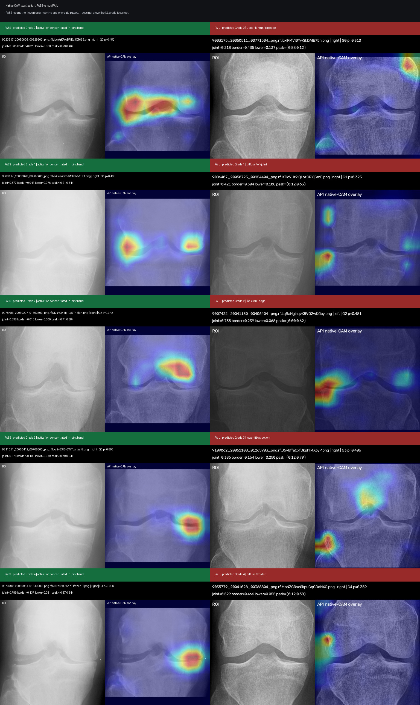

The successful examples place the strongest selected-class evidence across the joint line with little energy at the image boundary. The failures instead show upper-femur, diffuse, lateral-edge, or lower-tibia shortcuts. The Grade 0 pair also demonstrates that a normal-class CAM can sometimes be joint-centered, but this behavior is inconsistent across the full audit.

### Failed CAM Montage 1

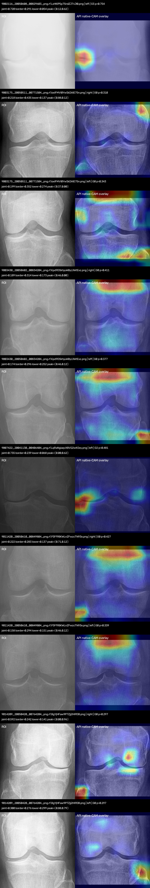

### Failed CAM Montage 2

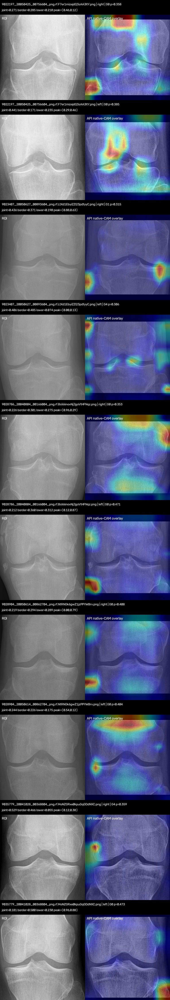

### Failed CAM Montage 3

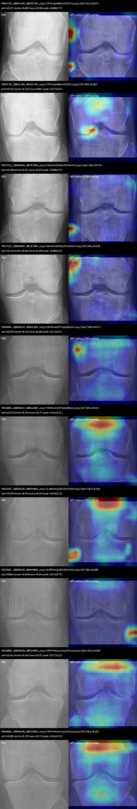

### Failed CAM Montage 4

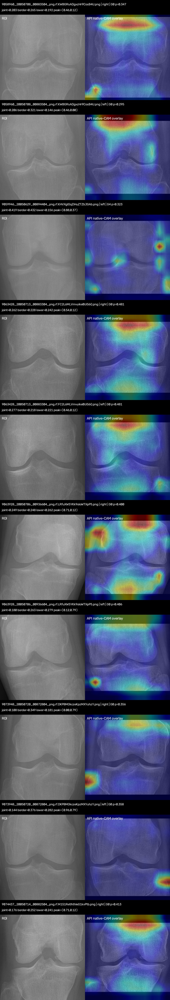

### Failed CAM Montage 5

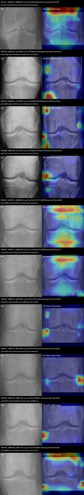

### Failed CAM Montage 6

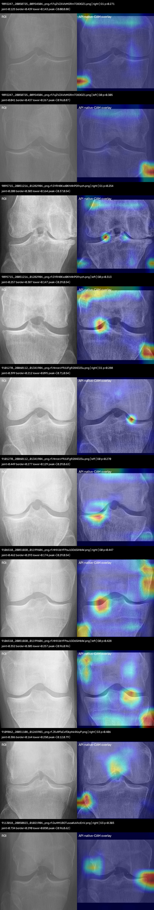

### Failed CAM Montage 7

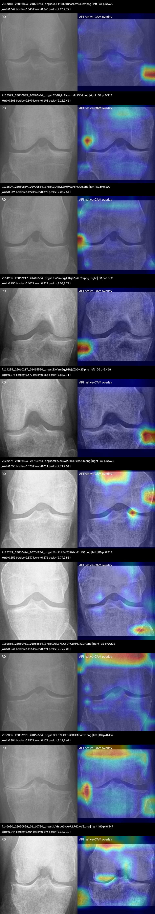

### Failed CAM Montage 8

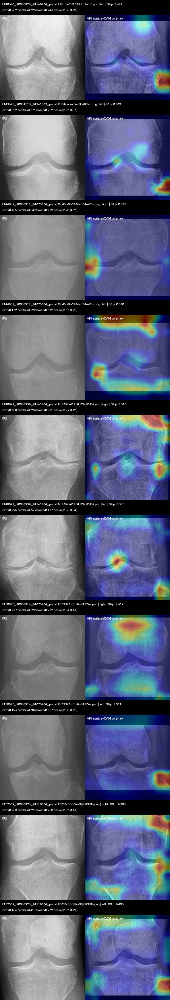

### Failed CAM Montage 9

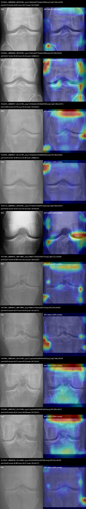

### Failed CAM Montage 10

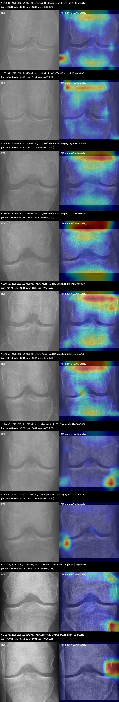

### Failed CAM Montage 11

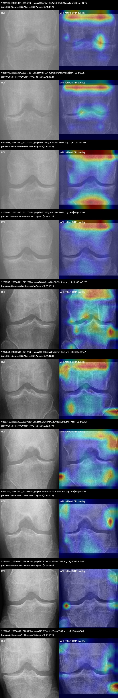

### Failed CAM Montage 12

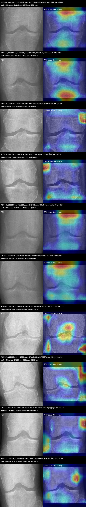

### Failed CAM Montage 13

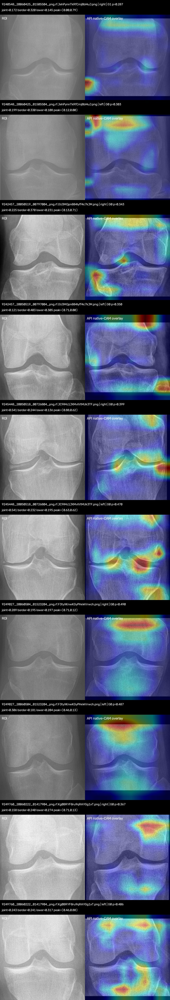

### Failed CAM Montage 14

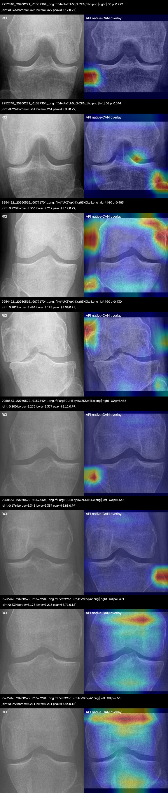

## Every Failed Knee CAM

The complete machine-readable files are [`failed_cams.csv`](assets/2026-07-25_15-32-33_UTC_api_cam_localization_audit/failed_cams.csv) and [`all_knees_cam_audit.csv`](assets/2026-07-25_15-32-33_UTC_api_cam_localization_audit/all_knees_cam_audit.csv).

| # | Image | Side | Pred. | Conf. | Joint | Border | Lower tibia | Peak x,y | Failure reasons |
| ---: | --- | --- | ---: | ---: | ---: | ---: | ---: | --- | --- |
| 1 | `9002116_20050608_00829603_png.rf.LxHKIP5p75roIZJ7vJl0.png` | left | G3 | 0.754 | 0.720 | 0.291 | 0.054 | 0.12, 0.62 | high border energy |
| 2 | `9003175_20050511_00771504_png.rf.IoxlFMVl0YwSkDAlE75n.png` | right | G0 | 0.310 | 0.218 | 0.435 | 0.137 | 0.88, 0.12 | low joint energy;high border energy;peak outside joint |
| 3 | `9003175_20050511_00771504_png.rf.IoxlFMVl0YwSkDAlE75n.png` | left | G0 | 0.343 | 0.199 | 0.352 | 0.274 | 0.37, 0.00 | low joint energy;high border energy;high lower tibia energy;peak outside joint |
| 4 | `9003430_20050602_00834204_png.rf.Kpd9DSkhjuW0yLXWtExz.png` | right | G0 | 0.411 | 0.189 | 0.314 | 0.173 | 0.46, 0.00 | low joint energy;high border energy;peak outside joint |
| 5 | `9003430_20050602_00834204_png.rf.Kpd9DSkhjuW0yLXWtExz.png` | left | G0 | 0.377 | 0.174 | 0.296 | 0.252 | 0.46, 0.12 | low joint energy;high border energy;high lower tibia energy;peak outside joint |
| 6 | `9007422_20041130_00406404_png.rf.LqRaNgiaqvX8VQ2wKGey.png` | left | G2 | 0.481 | 0.735 | 0.239 | 0.068 | 0.00, 0.62 | peak outside joint |
| 7 | `9011420_20050610_00849804_png.rf.P3Ff9BKWLnZFwzcTN93e.png` | right | G0 | 0.427 | 0.222 | 0.283 | 0.137 | 0.71, 0.12 | low joint energy;high border energy;peak outside joint |
| 8 | `9011420_20050610_00849804_png.rf.P3Ff9BKWLnZFwzcTN93e.png` | left | G0 | 0.339 | 0.158 | 0.294 | 0.151 | 0.46, 0.12 | low joint energy;high border energy;peak outside joint |
| 9 | `9014209_20050420_00764204_png.rf.BgYjHFaw9P7Zjj2Hi9DB.png` | right | G0 | 0.297 | 0.592 | 0.242 | 0.141 | 0.00, 0.96 | peak outside joint |
| 10 | `9014209_20050420_00764204_png.rf.BgYjHFaw9P7Zjj2Hi9DB.png` | left | G0 | 0.297 | 0.300 | 0.276 | 0.299 | 0.88, 0.79 | low joint energy;high border energy;high lower tibia energy;peak outside joint |
| 11 | `9022197_20050425_00756604_png.rf.F7er1mizejdQ3sAA3ltY.png` | right | G0 | 0.358 | 0.271 | 0.285 | 0.210 | 0.46, 0.12 | low joint energy;high border energy;peak outside joint |
| 12 | `9022197_20050425_00756604_png.rf.F7er1mizejdQ3sAA3ltY.png` | left | G0 | 0.385 | 0.441 | 0.171 | 0.235 | 0.29, 0.46 | low joint energy |
| 13 | `9023407_20050627_00893604_png.rf.LtXd1EbyiZZl23pdtyyC.png` | right | G1 | 0.315 | 0.436 | 0.371 | 0.190 | 0.88, 0.63 | low joint energy;high border energy |
| 14 | `9023407_20050627_00893604_png.rf.LtXd1EbyiZZl23pdtyyC.png` | left | G4 | 0.306 | 0.406 | 0.485 | 0.074 | 0.00, 0.13 | low joint energy;high border energy;peak outside joint |
| 15 | `9028786_20040804_00166004_png.rf.Bsl66novNjJgoVtHFNqz.png` | right | G0 | 0.353 | 0.226 | 0.301 | 0.275 | 0.96, 0.29 | low joint energy;high border energy;high lower tibia energy;peak outside joint |
| 16 | `9028786_20040804_00166004_png.rf.Bsl66novNjJgoVtHFNqz.png` | left | G0 | 0.471 | 0.212 | 0.360 | 0.312 | 0.12, 0.87 | low joint energy;high border energy;high lower tibia energy;peak outside joint |
| 17 | `9028904_20050614_00862704_png.rf.NtRNOk6gwZ1jzPPYWBrv.png` | right | G0 | 0.408 | 0.219 | 0.294 | 0.289 | 0.00, 0.79 | low joint energy;high border energy;high lower tibia energy;peak outside joint |
| 18 | `9028904_20050614_00862704_png.rf.NtRNOk6gwZ1jzPPYWBrv.png` | left | G0 | 0.404 | 0.244 | 0.226 | 0.175 | 0.54, 0.12 | low joint energy;peak outside joint |
| 19 | `9035779_20041028_00368804_png.rf.MoNZGRxe0kpuGqGDdNXC.png` | right | G4 | 0.359 | 0.529 | 0.466 | 0.055 | 0.12, 0.38 | low joint energy;high border energy |
| 20 | `9035779_20041028_00368804_png.rf.MoNZGRxe0kpuGqGDdNXC.png` | left | G0 | 0.473 | 0.181 | 0.500 | 0.230 | 0.96, 0.88 | low joint energy;high border energy;peak outside joint |
| 21 | `9036770_20041103_00355704_png.rf.JfYUy3p48lj2mDUCIFcy.png` | right | G4 | 0.257 | 0.237 | 0.683 | 0.105 | 0.00, 0.79 | low joint energy;high border energy;peak outside joint |
| 22 | `9036770_20041103_00355704_png.rf.JfYUy3p48lj2mDUCIFcy.png` | left | G0 | 0.384 | 0.433 | 0.163 | 0.027 | 0.37, 0.54 | low joint energy |
| 23 | `9037223_20050504_00787304_png.rf.ONoi3w5ER8WyfOL3hwZV.png` | right | G0 | 0.370 | 0.180 | 0.411 | 0.262 | 0.00, 0.79 | low joint energy;high border energy;high lower tibia energy;peak outside joint |
| 24 | `9037223_20050504_00787304_png.rf.ONoi3w5ER8WyfOL3hwZV.png` | left | G0 | 0.330 | 0.115 | 0.462 | 0.184 | 0.00, 0.13 | low joint energy;high border energy;peak outside joint |
| 25 | `9043005_20050624_00866304_png.rf.MEMbrd4J97iyDpE06sk1.png` | right | G0 | 0.473 | 0.295 | 0.159 | 0.205 | 0.13, 0.21 | low joint energy;peak outside joint |
| 26 | `9043005_20050624_00866304_png.rf.MEMbrd4J97iyDpE06sk1.png` | left | G0 | 0.433 | 0.293 | 0.196 | 0.177 | 0.46, 0.12 | low joint energy;peak outside joint |
| 27 | `9043507_20050628_00894004_png.rf.ILoBR5eUgJ8V3OnFd61t.png` | right | G0 | 0.310 | 0.234 | 0.291 | 0.232 | 0.54, 0.12 | low joint energy;high border energy;peak outside joint |
| 28 | `9043507_20050628_00894004_png.rf.ILoBR5eUgJ8V3OnFd61t.png` | left | G0 | 0.308 | 0.056 | 0.450 | 0.256 | 0.96, 0.79 | low joint energy;high border energy;high lower tibia energy;peak outside joint |
| 29 | `9044005_20050630_00918404_png.rf.HPSTMXezinz1eoHTAuuZ.png` | right | G0 | 0.505 | 0.241 | 0.265 | 0.237 | 0.71, 0.12 | low joint energy;high border energy;peak outside joint |
| 30 | `9044005_20050630_00918404_png.rf.HPSTMXezinz1eoHTAuuZ.png` | left | G0 | 0.436 | 0.305 | 0.199 | 0.173 | 0.46, 0.12 | low joint energy;peak outside joint |
| 31 | `9058960_20050708_00883504_png.rf.KWBGRsADgxzHr9CosB4U.png` | right | G0 | 0.347 | 0.203 | 0.265 | 0.192 | 0.46, 0.12 | low joint energy;high border energy;peak outside joint |
| 32 | `9058960_20050708_00883504_png.rf.KWBGRsADgxzHr9CosB4U.png` | left | G0 | 0.295 | 0.206 | 0.321 | 0.146 | 0.46, 0.00 | low joint energy;high border energy;peak outside joint |
| 33 | `9059946_20050629_00894404_png.rf.KHVXglOqZiHuZTZbJGAb.png` | left | G4 | 0.323 | 0.419 | 0.432 | 0.156 | 0.88, 0.37 | low joint energy;high border energy |
| 34 | `9063428_20050713_00883304_png.rf.FC2L6MLVmvyike0UiS6Q.png` | right | G0 | 0.481 | 0.262 | 0.228 | 0.242 | 0.54, 0.12 | low joint energy;peak outside joint |
| 35 | `9063428_20050713_00883304_png.rf.FC2L6MLVmvyike0UiS6Q.png` | left | G0 | 0.481 | 0.277 | 0.218 | 0.221 | 0.46, 0.12 | low joint energy;peak outside joint |
| 36 | `9063928_20050706_00936604_png.rf.LRfuXW5YKk9oloWTXpP5.png` | right | G0 | 0.400 | 0.249 | 0.248 | 0.262 | 0.71, 0.12 | low joint energy;high lower tibia energy;peak outside joint |
| 37 | `9063928_20050706_00936604_png.rf.LRfuXW5YKk9oloWTXpP5.png` | left | G0 | 0.406 | 0.180 | 0.263 | 0.279 | 0.12, 0.79 | low joint energy;high border energy;high lower tibia energy;peak outside joint |
| 38 | `9073948_20050720_00872804_png.rf.DKP8MOkczeKpzMXYuhzY.png` | right | G0 | 0.356 | 0.108 | 0.349 | 0.181 | 0.00, 0.79 | low joint energy;high border energy;peak outside joint |
| 39 | `9073948_20050720_00872804_png.rf.DKP8MOkczeKpzMXYuhzY.png` | left | G0 | 0.358 | 0.144 | 0.376 | 0.282 | 0.96, 0.79 | low joint energy;high border energy;high lower tibia energy;peak outside joint |
| 40 | `9074437_20050714_00882504_png.rf.M151RetlhthIeG1kvPtb.png` | right | G0 | 0.413 | 0.176 | 0.252 | 0.241 | 0.71, 0.12 | low joint energy;high border energy;peak outside joint |
| 41 | `9074437_20050714_00882504_png.rf.M151RetlhthIeG1kvPtb.png` | left | G0 | 0.439 | 0.273 | 0.232 | 0.195 | 0.29, 0.12 | low joint energy;peak outside joint |
| 42 | `9082640_20060131_01355806_png.rf.Jfoohg20sy10zd2HgoNx.png` | right | G0 | 0.614 | 0.302 | 0.388 | 0.325 | 0.13, 0.96 | low joint energy;high border energy;high lower tibia energy;peak outside joint |
| 43 | `9082640_20060131_01355806_png.rf.Jfoohg20sy10zd2HgoNx.png` | left | G4 | 0.466 | 0.201 | 0.587 | 0.183 | 0.12, 0.12 | low joint energy;high border energy;peak outside joint |
| 44 | `9083500_20051102_01231103_png.rf.LGPWgLqVHmVaqERLhRGf.png` | left | G0 | 0.382 | 0.577 | 0.256 | 0.174 | 0.12, 0.46 | high border energy |
| 45 | `9084244_20050713_00882904_png.rf.KeLFWmXZVUYLTcl0AP46.png` | right | G0 | 0.484 | 0.300 | 0.235 | 0.264 | 0.46, 0.12 | low joint energy;high lower tibia energy;peak outside joint |
| 46 | `9084244_20050713_00882904_png.rf.KeLFWmXZVUYLTcl0AP46.png` | left | G0 | 0.479 | 0.249 | 0.215 | 0.234 | 0.46, 0.13 | low joint energy;peak outside joint |
| 47 | `9086407_20050725_00954404_png.rf.IKDcVHr9lQLozCRYjGmE.png` | right | G1 | 0.325 | 0.421 | 0.304 | 0.108 | 0.12, 0.63 | low joint energy;high border energy |
| 48 | `9086407_20050725_00954404_png.rf.IKDcVHr9lQLozCRYjGmE.png` | left | G0 | 0.458 | 0.569 | 0.352 | 0.119 | 0.88, 0.62 | high border energy |
| 49 | `9090740_20050728_00961104_png.rf.J4XyzfOlcX0GMzLv4lkv.png` | right | G0 | 0.314 | 0.107 | 0.460 | 0.346 | 0.00, 0.79 | low joint energy;high border energy;high lower tibia energy;peak outside joint |
| 50 | `9090740_20050728_00961104_png.rf.J4XyzfOlcX0GMzLv4lkv.png` | left | G0 | 0.350 | 0.068 | 0.390 | 0.241 | 0.96, 0.71 | low joint energy;high border energy;peak outside joint |
| 51 | `9092247_20050725_00954504_png.rf.FqZVZAVbMGRmTOIOIOZ1.png` | right | G1 | 0.271 | 0.125 | 0.439 | 0.143 | 0.00, 0.88 | low joint energy;high border energy;peak outside joint |
| 52 | `9092247_20050725_00954504_png.rf.FqZVZAVbMGRmTOIOIOZ1.png` | left | G0 | 0.305 | 0.041 | 0.437 | 0.267 | 0.96, 0.87 | low joint energy;high border energy;high lower tibia energy;peak outside joint |
| 53 | `9095715_20051216_01282904_png.rf.GYRH8Kxd0KhNhPGfnyzh.png` | right | G1 | 0.254 | 0.208 | 0.303 | 0.164 | 0.37, 0.54 | low joint energy;high border energy |
| 54 | `9095715_20051216_01282904_png.rf.GYRH8Kxd0KhNhPGfnyzh.png` | left | G0 | 0.313 | 0.257 | 0.387 | 0.147 | 0.29, 0.54 | low joint energy;high border energy |
| 55 | `9101270_20060112_01341904_png.rf.HnrorxY9UUFgR284D2Su.png` | right | G1 | 0.288 | 0.399 | 0.212 | 0.095 | 0.71, 0.54 | low joint energy |
| 56 | `9101270_20060112_01341904_png.rf.HnrorxY9UUFgR284D2Su.png` | left | G0 | 0.270 | 0.449 | 0.277 | 0.129 | 0.29, 0.63 | low joint energy;high border energy |
| 57 | `9106510_20051020_01199604_png.rf.HHVUbYFPou1GD6SiHbIW.png` | right | G0 | 0.447 | 0.462 | 0.293 | 0.174 | 0.29, 0.54 | low joint energy;high border energy |
| 58 | `9106510_20051020_01199604_png.rf.HHVUbYFPou1GD6SiHbIW.png` | left | G0 | 0.428 | 0.352 | 0.305 | 0.257 | 0.96, 0.96 | low joint energy;high border energy;high lower tibia energy;peak outside joint |
| 59 | `9109062_20051108_01265903_png.rf.J5v8ffaCxfDkphk4XoyP.png` | right | G3 | 0.406 | 0.386 | 0.164 | 0.250 | 0.12, 0.79 | low joint energy;peak outside joint |
| 60 | `9113018_20050823_01021904_png.rf.OuHM1BOTusoaKaVkcEnV.png` | right | G3 | 0.303 | 0.734 | 0.290 | 0.030 | 0.96, 0.62 | high border energy;peak outside joint |
| 61 | `9113018_20050823_01021904_png.rf.OuHM1BOTusoaKaVkcEnV.png` | left | G1 | 0.309 | 0.340 | 0.345 | 0.243 | 0.96, 0.79 | low joint energy;high border energy;peak outside joint |
| 62 | `9113529_20050809_00990604_png.rf.CD48yLcMciyqzMinCXxt.png` | right | G0 | 0.363 | 0.368 | 0.199 | 0.193 | 0.13, 0.46 | low joint energy |
| 63 | `9113529_20050809_00990604_png.rf.CD48yLcMciyqzMinCXxt.png` | left | G1 | 0.302 | 0.226 | 0.420 | 0.090 | 0.00, 0.54 | low joint energy;high border energy;peak outside joint |
| 64 | `9114285_20060217_01415504_png.rf.ExVzm5qyHBzjsZjx0H23.png` | right | G0 | 0.362 | 0.155 | 0.407 | 0.329 | 0.00, 0.79 | low joint energy;high border energy;high lower tibia energy;peak outside joint |
| 65 | `9114285_20060217_01415504_png.rf.ExVzm5qyHBzjsZjx0H23.png` | left | G0 | 0.468 | 0.275 | 0.377 | 0.266 | 0.88, 0.71 | low joint energy;high border energy;high lower tibia energy |
| 66 | `9123289_20050426_00756904_png.rf.MzcZcL5w2JiHkMxRtUEQ.png` | right | G0 | 0.378 | 0.355 | 0.378 | 0.011 | 0.71, 0.54 | low joint energy;high border energy |
| 67 | `9123289_20050426_00756904_png.rf.MzcZcL5w2JiHkMxRtUEQ.png` | left | G0 | 0.314 | 0.350 | 0.337 | 0.276 | 0.79, 0.88 | low joint energy;high border energy;high lower tibia energy;peak outside joint |
| 68 | `9130855_20050901_01066504_png.rf.OSLq7IuCFDRCDHM7xZCF.png` | right | G1 | 0.292 | 0.241 | 0.416 | 0.091 | 0.79, 0.00 | low joint energy;high border energy;peak outside joint |
| 69 | `9130855_20050901_01066504_png.rf.OSLq7IuCFDRCDHM7xZCF.png` | left | G0 | 0.432 | 0.304 | 0.257 | 0.172 | 0.12, 0.62 | low joint energy;high border energy |
| 70 | `9140600_20050928_01160704_png.rf.IUVhrv61NA6IULRd2wV8.png` | right | G0 | 0.347 | 0.244 | 0.304 | 0.193 | 0.38, 0.12 | low joint energy;high border energy;peak outside joint |
| 71 | `9140600_20050928_01160704_png.rf.IUVhrv61NA6IULRd2wV8.png` | left | G0 | 0.441 | 0.269 | 0.326 | 0.243 | 0.88, 0.79 | low joint energy;high border energy;peak outside joint |
| 72 | `9143628_20051118_01261503_png.rf.FdG1dwxw8evFkkitFtso.png` | left | G0 | 0.309 | 0.529 | 0.271 | 0.252 | 0.96, 0.87 | low joint energy;high border energy;high lower tibia energy;peak outside joint |
| 73 | `9144057_20050912_01075604_png.rf.OxxKxv8WYL4dvgD4mPBv.png` | right | G4 | 0.305 | 0.455 | 0.549 | 0.079 | 0.00, 0.62 | low joint energy;high border energy;peak outside joint |
| 74 | `9144057_20050912_01075604_png.rf.OxxKxv8WYL4dvgD4mPBv.png` | left | G0 | 0.300 | 0.172 | 0.292 | 0.312 | 0.13, 0.71 | low joint energy;high border energy;high lower tibia energy |
| 75 | `9148091_20050930_01161004_png.rf.MfZAR6uPUg9kMXvPKd39.png` | right | G0 | 0.313 | 0.360 | 0.394 | 0.071 | 0.79, 0.12 | low joint energy;high border energy;peak outside joint |
| 76 | `9148091_20050930_01161004_png.rf.MfZAR6uPUg9kMXvPKd39.png` | left | G0 | 0.385 | 0.295 | 0.363 | 0.177 | 0.38, 0.54 | low joint energy;high border energy |
| 77 | `9150876_20050914_01075204_png.rf.FvZJJ2AHOLrfinO11ZAx.png` | right | G0 | 0.412 | 0.217 | 0.222 | 0.272 | 0.54, 0.13 | low joint energy;high lower tibia energy;peak outside joint |
| 78 | `9150876_20050914_01075204_png.rf.FvZJJ2AHOLrfinO11ZAx.png` | left | G0 | 0.511 | 0.193 | 0.304 | 0.327 | 0.88, 0.71 | low joint energy;high border energy;high lower tibia energy |
| 79 | `9152569_20050923_01110604_png.rf.E36WKBOQFNaNfjZ7OEBb.png` | right | G0 | 0.388 | 0.258 | 0.397 | 0.258 | 0.96, 0.13 | low joint energy;high border energy;high lower tibia energy;peak outside joint |
| 80 | `9152569_20050923_01110604_png.rf.E36WKBOQFNaNfjZ7OEBb.png` | left | G0 | 0.406 | 0.166 | 0.417 | 0.239 | 0.96, 0.79 | low joint energy;high border energy;peak outside joint |
| 81 | `9155861_20050503_00786904_png.rf.C8oFpqKfFYEodqwS10Zl.png` | right | G0 | 0.338 | 0.175 | 0.457 | 0.272 | 0.12, 0.88 | low joint energy;high border energy;high lower tibia energy;peak outside joint |
| 82 | `9155861_20050503_00786904_png.rf.C8oFpqKfFYEodqwS10Zl.png` | left | G0 | 0.443 | 0.367 | 0.362 | 0.136 | 0.00, 0.21 | low joint energy;high border energy;peak outside joint |
| 83 | `9156694_20050927_01115704_png.rf.J4JKpNek135J8aDKD4Z5.png` | right | G0 | 0.371 | 0.203 | 0.378 | 0.132 | 0.96, 0.62 | low joint energy;high border energy;peak outside joint |
| 84 | `9156694_20050927_01115704_png.rf.J4JKpNek135J8aDKD4Z5.png` | left | G0 | 0.353 | 0.149 | 0.385 | 0.109 | 0.00, 0.21 | low joint energy;high border energy;peak outside joint |
| 85 | `9156716_20050812_02452901_png.rf.M74Saer5VCjpPQry7ppJ.png` | right | G0 | 0.619 | 0.542 | 0.261 | 0.154 | 0.96, 0.54 | low joint energy;high border energy;peak outside joint |
| 86 | `9157384_20050921_00972004_png.rf.I8ljDYc7A3y6UuSetn72.png` | right | G1 | 0.289 | 0.257 | 0.304 | 0.123 | 0.87, 0.63 | low joint energy;high border energy |
| 87 | `9157384_20050921_00972004_png.rf.I8ljDYc7A3y6UuSetn72.png` | left | G4 | 0.253 | 0.276 | 0.579 | 0.242 | 0.12, 0.71 | low joint energy;high border energy |
| 88 | `9159401_20051013_01127304_png.rf.LrppOnkIDYjASRMCUHuP.png` | right | G0 | 0.418 | 0.252 | 0.271 | 0.219 | 0.71, 0.12 | low joint energy;high border energy;peak outside joint |
| 89 | `9159401_20051013_01127304_png.rf.LrppOnkIDYjASRMCUHuP.png` | left | G0 | 0.417 | 0.192 | 0.267 | 0.230 | 0.79, 0.12 | low joint energy;high border energy;peak outside joint |
| 90 | `9174216_20050928_01115804_png.rf.BsFZbCBfLWl1efhF5Ssr.png` | left | G1 | 0.333 | 0.449 | 0.305 | 0.157 | 0.96, 0.79 | low joint energy;high border energy;peak outside joint |
| 91 | `9175204_20051010_01049404_png.rf.IcbG1jLJcU6DIpEOay8E.png` | right | G0 | 0.317 | 0.180 | 0.285 | 0.307 | 0.00, 0.79 | low joint energy;high border energy;high lower tibia energy;peak outside joint |
| 92 | `9175204_20051010_01049404_png.rf.IcbG1jLJcU6DIpEOay8E.png` | left | G0 | 0.288 | 0.282 | 0.202 | 0.161 | 0.13, 0.12 | low joint energy;peak outside joint |
| 93 | `9175691_20050928_01115904_png.rf.DyY0pf7jhhGAPCGDvLl3.png` | right | G0 | 0.458 | 0.241 | 0.230 | 0.213 | 0.71, 0.12 | low joint energy;peak outside joint |
| 94 | `9175691_20050928_01115904_png.rf.DyY0pf7jhhGAPCGDvLl3.png` | left | G0 | 0.484 | 0.229 | 0.267 | 0.247 | 0.46, 0.12 | low joint energy;high border energy;peak outside joint |
| 95 | `9184556_20051012_01049804_png.rf.N4jBqxcN7yl4T1WnqInh.png` | right | G0 | 0.399 | 0.257 | 0.223 | 0.249 | 0.54, 0.12 | low joint energy;peak outside joint |
| 96 | `9184556_20051012_01049804_png.rf.N4jBqxcN7yl4T1WnqInh.png` | left | G0 | 0.425 | 0.241 | 0.234 | 0.244 | 0.46, 0.12 | low joint energy;peak outside joint |
| 97 | `9194860_20051013_01167704_png.rf.MlvwcjwqCfyluj75LsSA.png` | right | G0 | 0.334 | 0.108 | 0.372 | 0.449 | 0.87, 0.87 | low joint energy;high border energy;high lower tibia energy;peak outside joint |
| 98 | `9194860_20051013_01167704_png.rf.MlvwcjwqCfyluj75LsSA.png` | left | G1 | 0.316 | 0.399 | 0.273 | 0.197 | 0.12, 0.71 | low joint energy;high border energy |
| 99 | `9197274_20051118_01264204_png.rf.Odscjw6oWDI9bf5axevZ.png` | right | G0 | 0.306 | 0.242 | 0.418 | 0.242 | 0.88, 0.88 | low joint energy;high border energy;peak outside joint |
| 100 | `9197274_20051118_01264204_png.rf.Odscjw6oWDI9bf5axevZ.png` | left | G3 | 0.362 | 0.694 | 0.350 | 0.001 | 0.88, 0.46 | high border energy |
| 101 | `9206908_20051004_01139304_png.rf.CpWGwHfQsWejBXEtqKfU.png` | right | G1 | 0.275 | 0.252 | 0.257 | 0.029 | 0.71, 0.12 | low joint energy;high border energy;peak outside joint |
| 102 | `9206908_20051004_01139304_png.rf.CpWGwHfQsWejBXEtqKfU.png` | left | G1 | 0.267 | 0.283 | 0.191 | 0.038 | 0.71, 0.12 | low joint energy;peak outside joint |
| 103 | `9207905_20051017_01170404_png.rf.MS7V0CjqV4nbiReJHyNc.png` | right | G0 | 0.384 | 0.186 | 0.309 | 0.297 | 0.54, 0.88 | low joint energy;high border energy;high lower tibia energy;peak outside joint |
| 104 | `9207905_20051017_01170404_png.rf.MS7V0CjqV4nbiReJHyNc.png` | left | G0 | 0.387 | 0.174 | 0.280 | 0.122 | 0.71, 0.12 | low joint energy;high border energy;peak outside joint |
| 105 | `9209533_20050516_00727004_png.rf.CM0Sggw7OUGjef6MRtYs.png` | right | G0 | 0.283 | 0.445 | 0.201 | 0.167 | 0.88, 0.71 | low joint energy |
| 106 | `9209533_20050516_00727004_png.rf.CM0Sggw7OUGjef6MRtYs.png` | left | G0 | 0.467 | 0.241 | 0.259 | 0.217 | 0.96, 0.88 | low joint energy;high border energy;peak outside joint |
| 107 | `9211751_20051027_01196605_png.rf.KE409NhzYAbQCZ1wCBZi.png` | right | G0 | 0.486 | 0.256 | 0.300 | 0.273 | 0.00, 0.79 | low joint energy;high border energy;high lower tibia energy;peak outside joint |
| 108 | `9211751_20051027_01196605_png.rf.KE409NhzYAbQCZ1wCBZi.png` | left | G0 | 0.448 | 0.375 | 0.234 | 0.218 | 0.87, 0.38 | low joint energy |
| 109 | `9221040_20050617_00859604_png.rf.I5LRYvYoUs93imwjYtOT.png` | right | G0 | 0.476 | 0.354 | 0.428 | 0.099 | 0.13, 0.62 | low joint energy;high border energy |
| 110 | `9221040_20050617_00859604_png.rf.I5LRYvYoUs93imwjYtOT.png` | left | G0 | 0.385 | 0.409 | 0.315 | 0.158 | 0.96, 0.79 | low joint energy;high border energy;peak outside joint |
| 111 | `9224866_20060412_01476204_png.rf.L1nP9Xcg59jClZwOgxDY.png` | right | G0 | 0.460 | 0.252 | 0.206 | 0.242 | 0.54, 0.12 | low joint energy;peak outside joint |
| 112 | `9224866_20060412_01476204_png.rf.L1nP9Xcg59jClZwOgxDY.png` | left | G0 | 0.456 | 0.270 | 0.193 | 0.325 | 0.54, 0.87 | low joint energy;high lower tibia energy;peak outside joint |
| 113 | `9226514_20050523_00801204_png.rf.EVaOFSlvKzApIyWiYGBh.png` | right | G0 | 0.368 | 0.190 | 0.350 | 0.286 | 0.96, 0.29 | low joint energy;high border energy;high lower tibia energy;peak outside joint |
| 114 | `9226514_20050523_00801204_png.rf.EVaOFSlvKzApIyWiYGBh.png` | left | G0 | 0.326 | 0.124 | 0.315 | 0.382 | 0.00, 0.21 | low joint energy;high border energy;high lower tibia energy;peak outside joint |
| 115 | `9230363_20060503_01516804_png.rf.MIGftIPDm2odAQQuTrdE.png` | right | G0 | 0.428 | 0.282 | 0.186 | 0.206 | 0.54, 0.12 | low joint energy;peak outside joint |
| 116 | `9230363_20060503_01516804_png.rf.MIGftIPDm2odAQQuTrdE.png` | left | G0 | 0.492 | 0.327 | 0.190 | 0.219 | 0.46, 0.12 | low joint energy;peak outside joint |
| 117 | `9233869_20060315_01442704_png.rf.D7d6CW8GVwKQ7jt8CAcI.png` | right | G0 | 0.273 | 0.580 | 0.187 | 0.179 | 0.96, 0.87 | peak outside joint |
| 118 | `9233869_20060315_01442704_png.rf.D7d6CW8GVwKQ7jt8CAcI.png` | left | G0 | 0.356 | 0.302 | 0.323 | 0.201 | 0.88, 0.29 | low joint energy;high border energy |
| 119 | `9237473_20050620_00859904_png.rf.JVsHfc30mkvXWUwv9UxA.png` | right | G0 | 0.370 | 0.336 | 0.308 | 0.308 | 0.96, 0.29 | low joint energy;high border energy;high lower tibia energy;peak outside joint |
| 120 | `9237473_20050620_00859904_png.rf.JVsHfc30mkvXWUwv9UxA.png` | left | G0 | 0.348 | 0.363 | 0.195 | 0.271 | 0.79, 0.37 | low joint energy;high lower tibia energy |
| 121 | `9240548_20060425_01505504_png.rf.JehPynnTkRfCmj8bl4uJ.png` | right | G1 | 0.287 | 0.172 | 0.320 | 0.145 | 0.00, 0.79 | low joint energy;high border energy;peak outside joint |
| 122 | `9240548_20060425_01505504_png.rf.JehPynnTkRfCmj8bl4uJ.png` | left | G0 | 0.303 | 0.199 | 0.330 | 0.108 | 0.12, 0.00 | low joint energy;high border energy;peak outside joint |
| 123 | `9242457_20050519_00797004_png.rf.OU3MQpn884Iyff4c7kJM.png` | right | G0 | 0.343 | 0.225 | 0.370 | 0.231 | 0.13, 0.71 | low joint energy;high border energy |
| 124 | `9242457_20050519_00797004_png.rf.OU3MQpn884Iyff4c7kJM.png` | left | G0 | 0.350 | 0.121 | 0.403 | 0.305 | 0.71, 0.00 | low joint energy;high border energy;high lower tibia energy;peak outside joint |
| 125 | `9245448_20050518_00726804_png.rf.JC9iMc1JXMvlVtMUk3TF.png` | right | G0 | 0.399 | 0.541 | 0.244 | 0.136 | 0.88, 0.62 | low joint energy |
| 126 | `9245448_20050518_00726804_png.rf.JC9iMc1JXMvlVtMUk3TF.png` | left | G0 | 0.470 | 0.541 | 0.232 | 0.195 | 0.63, 0.62 | low joint energy |
| 127 | `9249027_20060504_01523204_png.rf.F3tyXKnwKGyPHxWVrwch.png` | right | G0 | 0.490 | 0.289 | 0.195 | 0.197 | 0.71, 0.12 | low joint energy;peak outside joint |
| 128 | `9249027_20060504_01523204_png.rf.F3tyXKnwKGyPHxWVrwch.png` | left | G0 | 0.487 | 0.306 | 0.181 | 0.204 | 0.46, 0.13 | low joint energy;peak outside joint |
| 129 | `9249760_20060222_01417904_png.rf.Kg0BRYF8ru9qRAYGg1xT.png` | right | G0 | 0.367 | 0.158 | 0.240 | 0.274 | 0.71, 0.13 | low joint energy;high lower tibia energy;peak outside joint |
| 130 | `9249760_20060222_01417904_png.rf.Kg0BRYF8ru9qRAYGg1xT.png` | left | G0 | 0.406 | 0.243 | 0.241 | 0.317 | 0.46, 0.88 | low joint energy;high lower tibia energy;peak outside joint |
| 131 | `9252748_20060221_01387304_png.rf.Jdkdta7ph5qJHZF1g1hb.png` | right | G3 | 0.272 | 0.266 | 0.406 | 0.429 | 0.12, 0.71 | low joint energy;high border energy;high lower tibia energy |
| 132 | `9252748_20060221_01387304_png.rf.Jdkdta7ph5qJHZF1g1hb.png` | left | G0 | 0.544 | 0.324 | 0.314 | 0.261 | 0.88, 0.79 | low joint energy;high border energy;high lower tibia energy;peak outside joint |
| 133 | `9254422_20050510_00771704_png.rf.NdYUX5YqKKKxz83XDka8.png` | right | G0 | 0.483 | 0.228 | 0.366 | 0.212 | 0.12, 0.29 | low joint energy;high border energy |
| 134 | `9254422_20050510_00771704_png.rf.NdYUX5YqKKKxz83XDka8.png` | left | G0 | 0.430 | 0.282 | 0.404 | 0.198 | 0.00, 0.21 | low joint energy;high border energy;peak outside joint |
| 135 | `9258563_20060522_01573404_png.rf.P0rgZCUMTeyWwZDUwSNe.png` | right | G0 | 0.486 | 0.200 | 0.275 | 0.377 | 0.12, 0.79 | low joint energy;high border energy;high lower tibia energy;peak outside joint |
| 136 | `9258563_20060522_01573404_png.rf.P0rgZCUMTeyWwZDUwSNe.png` | left | G0 | 0.545 | 0.176 | 0.343 | 0.337 | 0.88, 0.79 | low joint energy;high border energy;high lower tibia energy;peak outside joint |
| 137 | `9262046_20060522_01573204_png.rf.BVwM9brENrzJKyVkdq4V.png` | right | G0 | 0.491 | 0.339 | 0.178 | 0.215 | 0.71, 0.12 | low joint energy;peak outside joint |
| 138 | `9262046_20060522_01573204_png.rf.BVwM9brENrzJKyVkdq4V.png` | left | G0 | 0.518 | 0.292 | 0.211 | 0.211 | 0.46, 0.12 | low joint energy;peak outside joint |

## Interpretation

A failed gate result does not prove that the KL prediction is incorrect, and a passing result does not prove lesion-level localization. The common failure modes identify where the selected-class evidence is geometrically inconsistent with the tibiofemoral joint. The raw images are unlabeled, so clinical correctness requires expert review or a labeled external set.

### Common mistakes observed

1. **Upper-femur and top-edge shortcut:** `54 / 138` failed CAMs peak on the superior femur or the top image boundary instead of the tibiofemoral joint space.
2. **Lateral crop-edge shortcut:** `40 / 138` peak at the far left or right boundary. A marginal osteophyte can be clinically relevant, but activation centered on the crop boundary is not a reliable joint-space explanation.
3. **Lower-tibia shortcut:** `39 / 138` emphasize the inferior tibia or bottom boundary, far below the main KL evidence region.
4. **Diffuse evidence:** `31 / 138` spread weak activation across multiple off-joint regions. Per-image min-max color normalization can make the largest weak response look strongly red, so red alone must not be interpreted as strong evidence.
5. **Grade 0 is especially problematic:** `111 / 141` Grade 0 CAMs fail (`78.7%`). A Grade 0 score represents absence of OA features, so its positive class map is not guaranteed to be a lesion map and often uses broad shape, exposure, or boundary evidence.
6. **Low confidence tracks poor localization:** `80 / 90` predictions below `0.40` confidence fail the gate (`88.9%`). Failed CAMs average `0.387` confidence versus `0.529` for passing CAMs.
7. **ROI padding contributes but is not the only cause:** failure increases from `55.3%` for less than `5%` square padding to `74.1%` for at least `15%` padding. However, the high failure rate among nearly square crops shows that changing the YOLO box alone will not solve the learned shortcut.
8. **No meaningful left/right imbalance was found:** failed CAMs are almost even (`71` left, `67` right). This audit does not support laterality canonicalization as the primary fix.

The selected DenseNet head produces a coarse final feature grid that is enlarged to the ROI size. This explains blocky heatmaps, but not the repeated off-joint peaks: those indicate that the classifier has learned non-joint evidence from the training distribution.

### Recommended next action

Do not make a visually better result by clipping the CAM to a joint mask or relaxing the gate. That would conceal, rather than correct, the model evidence. Retrain the final experiment using the exact production YOLO crop pipeline, limited ROI scale/translation augmentation, and explicit localization supervision or an auxiliary joint-mask loss. Compare it against the current checkpoint on a labeled, patient-separated holdout using both KL metrics and the same frozen CAM criteria. Until that experiment passes predefined thresholds, expose the heatmap as model attention rather than a lesion-localization claim.
