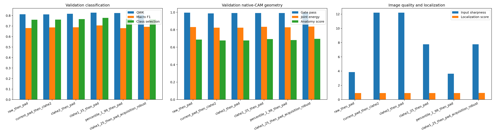
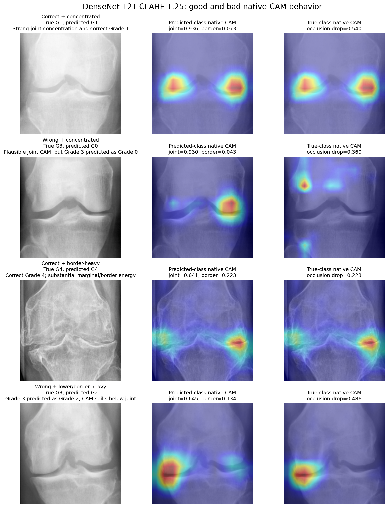
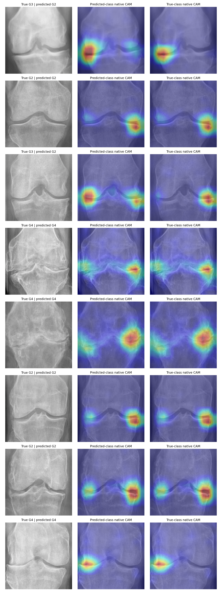

# DenseNet-121 Preprocessing Quality Ablation

Exact run timestamp: `2026-07-25_23-48-22_997435_UTC`.

## Executive Decision

`clahe1_25_then_pad` is the best validation candidate. It applies LAB-space
CLAHE with `clipLimit=1.25` to the knee image before square padding. It reached
QWK `0.8274`, macro F1 `0.7061`, Grade 1 recall `0.5294`, macro AP `0.7411`, and
the highest classification selection score (`0.7781`). Its CAM geometry also
improved over the current `pad -> CLAHE 2.0` pipeline.

This checkpoint is **not yet approved for production**. The test split was not
opened, the experiment selected on one validation split, and the current
baseline arm crossed an interrupted run with a fresh optimizer. The result is
strong evidence for a short confirmation run and an external YOLO-crop audit,
not evidence of final generalization.

## Controlled Configuration

| Item | Fixed value |
| --- | --- |
| Backbone/head | ImageNet DenseNet-121; five `1x1` class maps; spatial-mean CE logits |
| Orientation | Natural left/right orientation; no deterministic canonicalization |
| ROI geometry | Preserve full ROI; square pad; direct resize to `384x384`; no center crop |
| Loss/sampler | Cross-entropy; full inverse-frequency weighted sampler |
| Training | 30 epochs: 5 head warm-up + 15 coarse + 10 full fine-tune |
| Learning rates | `3e-4`; backbone/head `3e-5/3e-4`; full model `1e-5` |
| Batch/seed | 48 / 42 |
| Shared augmentation | Horizontal flip `p=0.50`; rotation `+/-5`; brightness/contrast `0.08`; erasing `p=0.10`, scale `0.02-0.05` |
| Checkpoint selection | `0.55*QWK + 0.30*macro_F1 + 0.15*macro_AP`, validation only |
| CAM audit | Up to 50 validation images per grade; 227 total; predicted- and true-class native CAMs |

All evaluation transforms were deterministic and matched their arm. The
selected evaluation order was: LAB CLAHE `1.25` -> square pad -> resize
`384x384` -> tensor -> ImageNet normalization.

## Complete Results

| Preprocessing arm | Best epoch | Accuracy | QWK | Macro F1 | G1 recall | AP | AUC | Selection | Joint | Border | Gate pass |
| --- | ---: | ---: | ---: | ---: | ---: | ---: | ---: | ---: | ---: | ---: | ---: |
| Raw -> pad | 29 | 0.6489 | 0.8117 | 0.6810 | 0.4444 | 0.7305 | 0.8899 | 0.7603 | 0.8310 | 0.1111 | 0.9956 |
| Pad -> CLAHE 2.0 (current) | 30 | 0.6489 | 0.8110 | 0.6867 | 0.4314 | 0.7317 | 0.8881 | 0.7618 | 0.8237 | 0.1158 | 0.9868 |
| CLAHE 2.0 -> pad | 27 | 0.6598 | 0.8176 | 0.6879 | 0.4248 | 0.7341 | 0.8896 | 0.7661 | 0.8243 | 0.1171 | 0.9912 |
| **CLAHE 1.25 -> pad** | **30** | **0.6695** | **0.8274** | **0.7061** | **0.5294** | **0.7411** | 0.8951 | **0.7781** | 0.8339 | **0.1092** | 0.9912 |
| Percentile 1-99 -> pad | 27 | 0.6671 | 0.8242 | 0.6797 | 0.4444 | 0.7310 | **0.8964** | 0.7669 | 0.8283 | 0.1124 | 0.9912 |
| CLAHE 1.25 -> pad + acquisition robustness | 30 | 0.6477 | 0.8082 | 0.6930 | 0.4837 | **0.7458** | 0.8941 | 0.7643 | **0.8360** | 0.1115 | **0.9956** |

## What Improved

Relative to the current `pad -> CLAHE 2.0` arm, the selected arm improved
Accuracy by `0.0206`, QWK by `0.0164`, macro F1 by `0.0195`, Grade 1 recall by
`0.0980`, AP by `0.0093`, and AUC by `0.0069`. Joint energy increased by
`0.0101`, border energy decreased by `0.0067`, and flip prediction consistency
improved from `0.7930` to `0.8590`.

The likely mechanism is moderate enhancement before padding. Padding first
introduces a large artificial black region into CLAHE's local histograms.
CLAHE `2.0` also increased the audit's mean sharpness to `12.20`; `1.25`
reduced it to `7.76`, retained trabecular/joint contrast, and avoided the
strongest edge amplification. This is an evidence-based inference from this
run, not proof of a universal optimal CLAHE value.

The acquisition-robust follow-up added gamma `0.85-1.15` at `p=0.30`, blur at
`p=0.15`, sharpness at `p=0.15`, and Gaussian noise at `p=0.20` with standard
deviation `0.005-0.020`. It slightly improved AP and the aggregate localization
score but reduced QWK, macro F1, and Grade 1 recall. It is rejected for the
current objective.

## CAM Findings

For the selected arm, 225/227 predicted-class CAMs passed the broad anatomy
gate. Mean joint, border, and lower-tibia energies were `0.8339`, `0.1092`, and
`0.0719`; all peaks were inside the broad joint band. Mean joint-occlusion
probability drop was `0.5007` and flip-CAM correlation was `0.9619`.

| True grade | Audited | Correct | Joint energy | Border energy | Occlusion drop | Flip-consistent |
| ---: | ---: | ---: | ---: | ---: | ---: | ---: |
| 0 | 50 | 36 | 0.8526 | 0.0995 | 0.4349 | 0.88 |
| 1 | 50 | 27 | 0.8552 | 0.0938 | 0.4197 | 0.78 |
| 2 | 50 | 33 | 0.8207 | 0.1130 | 0.4405 | 0.78 |
| 3 | 50 | 37 | 0.8367 | 0.1111 | 0.6567 | 0.92 |
| 4 | 27 | 25 | **0.7790** | **0.1452** | 0.5949 | 1.00 |

Grade 4 has the lowest joint energy and highest border energy. Some marginal
activation is clinically plausible because osteophytes occur at joint margins,
but the current rectangular gate cannot distinguish osteophytes from detector
borders or other shortcuts.

### Good and Bad Examples

The first row is the desired behavior: correct Grade 1 and bilateral joint-line
concentration. The second row is an important counterexample: its predicted
Grade 0 CAM looks anatomically plausible, but the true label is Grade 3. A good
CAM position therefore does not make the prediction correct. The third row is
correct Grade 4 but strongly margin-focused. The fourth is the clearest failed
case: Grade 3 -> 2 with excessive lower-joint/tibial energy.

The two formal gate failures were:

- `9360034L.png`: true Grade 3, predicted Grade 2; lower-tibia energy `0.2547`.
- `9645612L.png`: correctly predicted Grade 4; border energy `0.2540`.

The notebook's eight lowest-anatomy-score cases provide additional context:

## Interpretation Limits

- The anatomy gate is a broad rectangular proxy, not an expert JSN or osteophyte annotation.
- Native CAM is faithful to this linear class-map head, but faithfulness does not prove clinical correctness.
- The final feature map is `12x12`; upsampling cannot create lesion-level spatial precision.
- Positive-only, independently normalized overlays hide negative evidence and absolute activation strength.
- The 227-image CAM sample includes 69 wrong predictions; classification correctness and localization must be reported separately.
- The current baseline was interrupted and resumed with fresh optimizer state. The selected arm itself has a complete 30-epoch checkpoint, but the exact current-vs-selected delta is not a perfectly controlled estimate.
- No test, external labeled holdout, or production YOLO crop was evaluated in this experiment.

## Research Context

Tiulpin et al. established a knee-localized CNN approach for radiographic OA
grading and later showed that supervising individual OA features is a distinct,
more anatomically specific task. This supports ROI standardization and explains
why KL-only labels cannot validate exact JSN/osteophyte localization. CLAHE is
parameter-sensitive; Moré et al. explicitly frame its clip settings as a
multi-objective tuning problem rather than a universally fixed enhancement.

Grad-CAM and native CAM visualize class-discriminative evidence, but CAM
plausibility alone is insufficient. Saliency sanity-check work shows that an
explanation must be tested against model parameters/data, and HiResCAM work
distinguishes mathematical faithfulness from a merely attractive heatmap. The
present occlusion and flip tests move in that direction, but expert lesion masks
remain necessary for a clinical localization claim.

Primary references:

1. Tiulpin et al., *Automatic Knee Osteoarthritis Diagnosis from Plain Radiographs* (Scientific Reports, 2018), [DOI 10.1038/s41598-018-20132-7](https://doi.org/10.1038/s41598-018-20132-7).
2. Tiulpin and Saarakkala, *Automatic Grading of Individual Knee Osteoarthritis Features* (Diagnostics, 2020), [DOI 10.3390/diagnostics10110932](https://doi.org/10.3390/diagnostics10110932).
3. Pizer et al., *Adaptive Histogram Equalization and Its Variations* (1987), [DOI 10.1016/S0734-189X(87)80186-X](https://doi.org/10.1016/S0734-189X(87)80186-X).
4. Moré et al., *Parameter Tuning of CLAHE Based on Multi-objective Optimization* (ICIP, 2015), [DOI 10.1109/ICIP.2015.7351687](https://doi.org/10.1109/ICIP.2015.7351687).
5. Selvaraju et al., *Grad-CAM: Visual Explanations from Deep Networks* (IJCV, 2020), [DOI 10.1007/s11263-019-01228-7](https://doi.org/10.1007/s11263-019-01228-7).
6. Adebayo et al., *Sanity Checks for Saliency Maps* (NeurIPS, 2018), [proceedings](https://proceedings.neurips.cc/paper/2018/hash/294a8ed24b1ad22ec2e7efea049b8737-Abstract.html).
7. Draelos and Carin, *Use HiResCAM Instead of Grad-CAM for Faithful Explanations of CNNs* (2021), [DOI 10.1007/s11548-021-02492-6](https://doi.org/10.1007/s11548-021-02492-6).

## Recommended Next Step

Run one short confirmation with only `current_pad_then_clahe2` and
`clahe1_25_then_pad`, from scratch and without interruption, ideally across
three seeds. Select using validation only. If CLAHE 1.25 remains ahead, evaluate
that single checkpoint once on a newly locked labeled holdout and repeat the
full production-YOLO CAM audit using the exact `CLAHE -> pad -> resize`
inference order. Do not replace production preprocessing before those checks.
