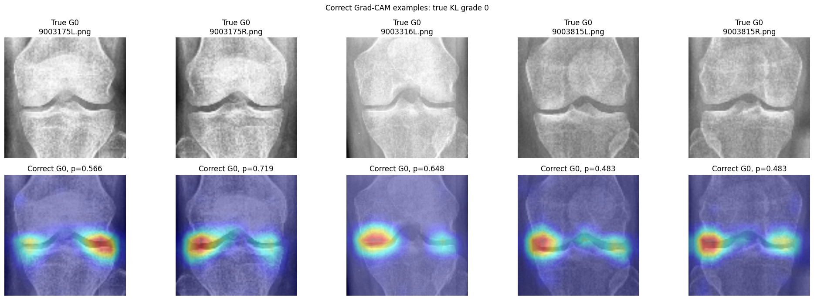
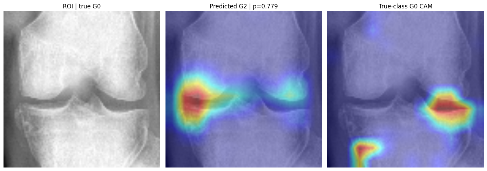
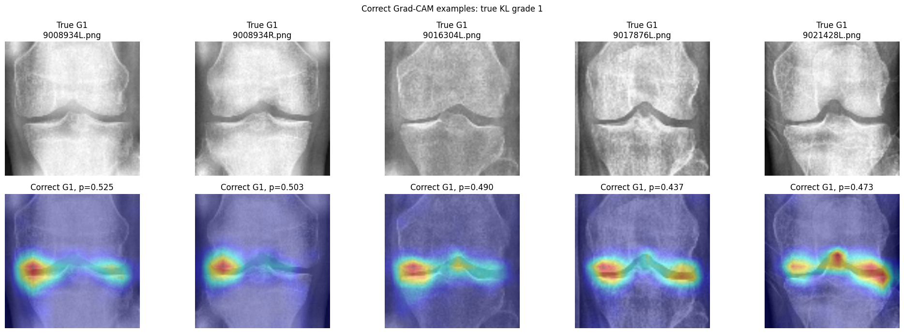
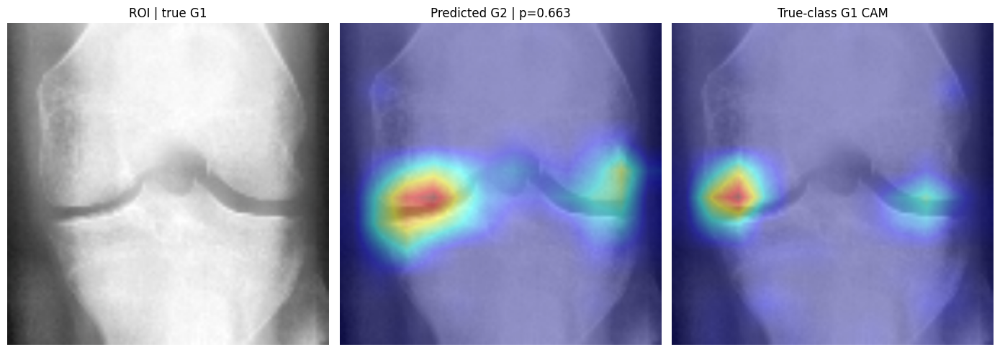
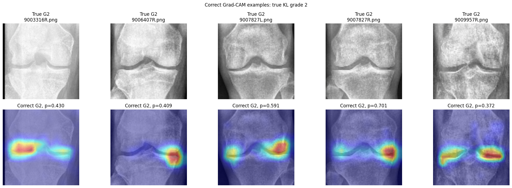
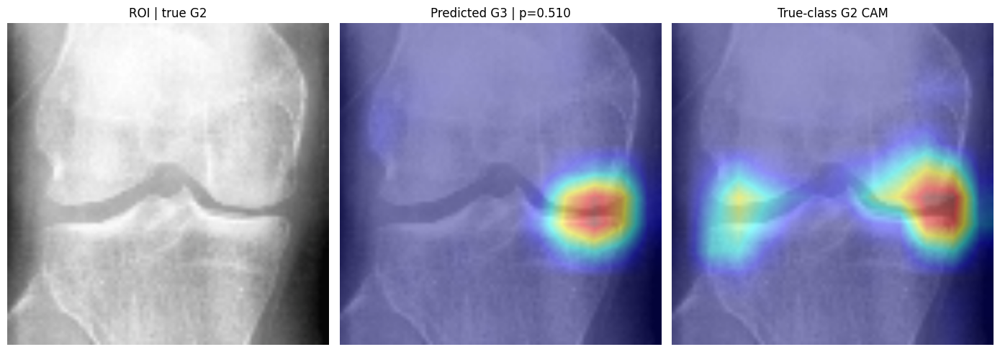
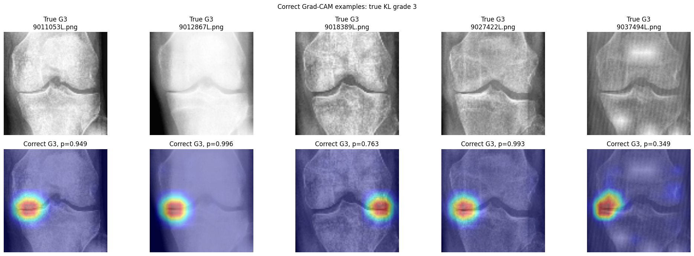
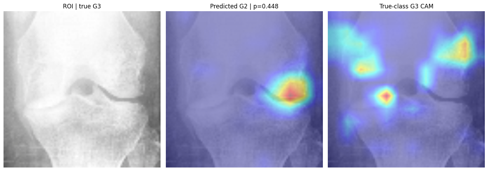
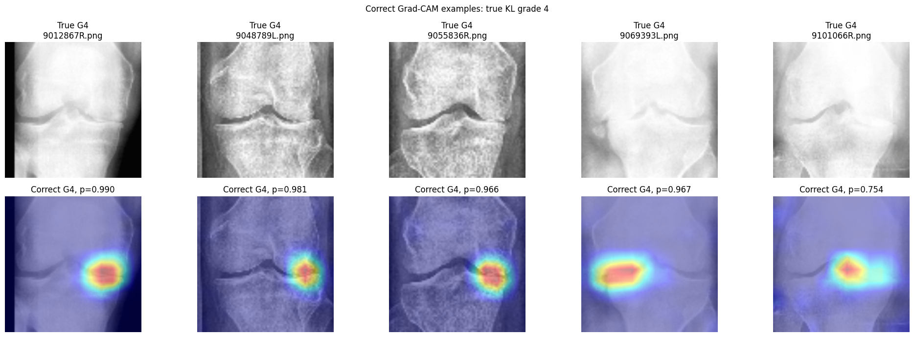
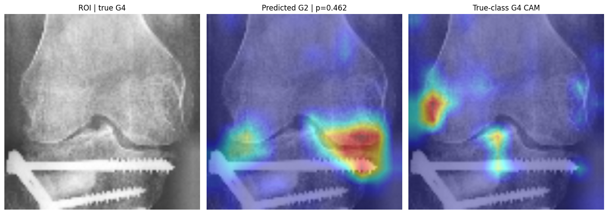

# DenseNet-121 Experiment Register

This is the single human-readable index for DenseNet-121. It records configuration and results only. Complete notebooks and figures are stored under [`runs/`](runs/); the single machine-readable index is [`experiment_summary.csv`](experiment_summary.csv). Metrics from validation, published-crop test, and production-YOLO-ROI test are labeled separately and must not be compared as if they used the same image domain.

## Current Production Configuration

Run: `2026-07-30 09:03:29 UTC`
Artifact: [`2026-07-30_09-03-29_paired_view_yolo_roi`](runs/2026-07-30_09-03-29_paired_view_yolo_roi/)
Checkpoint: `checkpoints/densenet121/2026-07-30_09-03-29_850983_UTC_paired_view_yolo_roi/best_model.pth`
SHA-256: `c9561cb4a76b64b11b5f4848036e3553f65aae3cc310099dbe638077c92578ca`

| Item | Production value |
| --- | --- |
| Architecture | ImageNet-initialized `timm` DenseNet-121; global average pooling; dropout `0.20`; linear `1024 -> 5` head |
| Output/loss | Five KL logits; cross-entropy |
| Input | `384 x 384` RGB |
| YOLO ROI | Centered square with side `1.15 * max(box width, box height)`; black padding only outside source image |
| Deterministic preprocessing | LAB CLAHE `clipLimit=1.25`, grid `8x8` -> square pad -> resize -> tensor -> ImageNet normalization |
| Laterality | Natural left/right orientation; no deterministic canonicalization |
| Training augmentation | horizontal flip `p=0.50`; rotation `+/-5 degrees`; brightness/contrast `0.08`; erasing `p=0.10`, area `0.02-0.05` |
| Balancing | Full inverse-frequency `WeightedRandomSampler`, replacement enabled |
| Base training | 5 head-only epochs at `3e-4`; 15 coarse epochs at backbone/head `3e-5/3e-4`; 10 full epochs at `1e-5` |
| Base optimization | AdamW; weight decay `1e-4` then `1e-3`; cosine schedules; AMP; gradient clipping `1.0`; batch `48`; seed `42` |
| Adaptation | Five full-network epochs at `1e-5`; each item is published crop or production YOLO ROI with probability `0.50`; selected epoch `4` |
| Checkpoint selection | Validation only: `0.55 QWK + 0.30 macro F1 + 0.15 macro AP`; adaptation averages this score across published and YOLO domains |
| Explanation | Predicted-class Grad-CAM from `backbone.features.norm5`; no native-CAM head |

### Production Result

Locked production-style YOLO ROI test, `n=1,656`:

| Accuracy | QWK | Macro precision | Macro recall | Macro F1 | Macro AP | Macro AUC |
| ---: | ---: | ---: | ---: | ---: | ---: | ---: |
| 0.5972 | 0.7702 | 0.6177 | 0.6420 | 0.6215 | 0.6696 | 0.8611 |

| KL grade | Support | Precision | Recall | F1 |
| ---: | ---: | ---: | ---: | ---: |
| 0 | 639 | 0.6967 | 0.7371 | 0.7163 |
| 1 | 296 | 0.2832 | 0.3750 | 0.3227 |
| 2 | 447 | 0.6588 | 0.4362 | 0.5249 |
| 3 | 223 | 0.7269 | 0.7399 | 0.7333 |
| 4 | 51 | 0.7231 | 0.9216 | 0.8103 |

## 224 x 224 Paired-ROI Resolution Comparison

Run date: `2026-08-04` to `2026-08-05 UTC`
Archived notebooks: [01 dataset preparation](runs/2026-08-04_224_paired_view_yolo/01_prepare_original_and_yolo_roi_datasets.ipynb), [02 original-crop training](runs/2026-08-04_224_paired_view_yolo/02_train_densenet121_original_224.ipynb), [03 paired-view adaptation](runs/2026-08-04_224_paired_view_yolo/03_train_densenet121_paired_view_yolo_224.ipynb), and [04 locked ROI evaluation](runs/2026-08-04_224_paired_view_yolo/04_evaluate_densenet121_paired_view_yolo_gradcam_224.ipynb).

Notebook 01 did not need to rebuild the derived YOLO ROI images: Notebook 03 successfully consumed the existing `densenet121_yolo_square_roi_trainvaltest_v2` train/validation set. Notebook 02 trained the same five-logit CE DenseNet-121 configuration at `224 x 224`; the selected base checkpoint was from epoch `28` (validation selection `0.7193`). Its published-crop test result was Accuracy `0.6184`, QWK `0.7931`, AP `0.6796`, and AUC `0.8722`.

Notebook 03 fine-tuned this checkpoint for five epochs with the same `50/50` published-crop and YOLO-square-ROI mixture. Epoch `4` was selected by the validation-only mean-domain score: published QWK `0.7778`, YOLO-ROI QWK `0.7191`, and robust selection `0.6988`. Notebook 04 then evaluated that selected checkpoint once on the locked `n=1,656` YOLO-ROI test set and generated post-hoc Grad-CAM evidence.

| Input | Accuracy | QWK | Macro F1 | Macro AP | Macro AUC | Decision |
| --- | ---: | ---: | ---: | ---: | ---: | --- |
| `224 x 224` paired view | 0.5743 | 0.7366 | 0.5906 | 0.6367 | 0.8479 | rejected |
| `384 x 384` paired view | **0.5972** | **0.7702** | **0.6215** | **0.6696** | **0.8611** | retained |

The two rows use the same locked production-style ROI test split, YOLO square-crop policy, CE loss, five-epoch paired-view adaptation, and predicted-class Grad-CAM procedure. `384 x 384` improved every reported locked-test metric: QWK by `0.0336`, macro F1 by `0.0309`, AP by `0.0329`, and AUC by `0.0132`. The 224 Grad-CAM grids still commonly activated near the joint line, but visible border/one-sided activations remained in both correct and failed cases; no anatomy-mask metric establishes a heatmap-localization improvement at 224. Therefore, changing to 224 does not solve the ROI/heatmap issue and must not replace the 384 production checkpoint.

### Production Grad-CAM Examples

Each panel contains the ROI, predicted-class Grad-CAM, and true-class Grad-CAM. “Success” means a correct prediction with joint-related evidence. “Failure” is a misclassification and shows why a plausible heatmap does not prove a correct KL grade.

| True grade | Successful prediction | Failed prediction |
| ---: | --- | --- |
| 0 |  |  |
| 1 |  |  |
| 2 |  |  |
| 3 |  |  |
| 4 |  |  |

## Base Production Training

Run: `2026-07-30 07:08:32 UTC`
Artifact: [`2026-07-30_07-08-32_original_224_ce_3stage`](runs/2026-07-30_07-08-32_original_224_ce_3stage/)

Configuration: the production architecture, CE, sampler, augmentation, CLAHE `1.25 -> pad`, and three-stage schedule listed above, trained on published `224 x 224` crops. Published-crop test, `n=1,656`:

| Accuracy | QWK | Macro F1 | Macro AP | Macro AUC |
| ---: | ---: | ---: | ---: | ---: |
| 0.6697 | 0.8330 | 0.6800 | 0.7305 | 0.8980 |

Decision: use as initialization for paired-view production adaptation, not as the final production-domain result.

## Loss Comparison

Run: `2026-07-25 06:30:25 UTC`
Artifact: [`2026-07-25_06-30-25_final_noncanonical_loss_ablation`](runs/2026-07-25_06-30-25_final_noncanonical_loss_ablation/)

Fixed configuration: natural orientation, full sampler, `384 x 384`, native linear-map research head, identical split/seed/augmentation, and 5+15+10 stages. Validation result:

| Loss arm | Accuracy | QWK | Macro F1 | Grade 1 recall | Macro AP | Decision |
| --- | ---: | ---: | ---: | ---: | ---: | --- |
| CE | 0.6465 | **0.8083** | **0.6819** | 0.3856 | **0.7310** | selected |
| Ordinal PD-2 | 0.3862 | 0.6679 | 0.3352 | **0.8824** | 0.3521 | rejected; collapsed other classes |
| CE + 0.25 PD-2 | 0.6453 | 0.8066 | 0.6783 | 0.4314 | 0.7308 | rejected; no composite gain |

Selected CE locked-test result: Accuracy `0.6504`, QWK `0.8197`, macro F1 `0.6823`, AP `0.7309`, AUC `0.8935`.

## Preprocessing Comparison

Run: `2026-07-25 23:48:22 UTC`
Artifact: [`2026-07-25_23-48-22_preprocessing_quality_ablation`](runs/2026-07-25_23-48-22_preprocessing_quality_ablation/)

Fixed configuration: CE, natural orientation, full sampler, same split, augmentation, schedule, and checkpoint rule. Validation result:

| Preprocessing arm | Epoch | Accuracy | QWK | Macro F1 | G1 recall | AP | AUC | Decision |
| --- | ---: | ---: | ---: | ---: | ---: | ---: | ---: | --- |
| Raw -> pad | 29 | 0.6489 | 0.8117 | 0.6810 | 0.4444 | 0.7305 | 0.8899 | rejected |
| Pad -> CLAHE 2.0 | 30 | 0.6489 | 0.8110 | 0.6867 | 0.4314 | 0.7317 | 0.8881 | control |
| CLAHE 2.0 -> pad | 27 | 0.6598 | 0.8176 | 0.6879 | 0.4248 | 0.7341 | 0.8896 | rejected |
| CLAHE 1.25 -> pad | 30 | **0.6695** | **0.8274** | **0.7061** | **0.5294** | 0.7411 | 0.8951 | selected candidate |
| Percentile 1-99 -> pad | 27 | 0.6671 | 0.8242 | 0.6797 | 0.4444 | 0.7310 | **0.8964** | rejected |
| CLAHE 1.25 -> pad + acquisition robustness | 30 | 0.6477 | 0.8082 | 0.6930 | 0.4837 | **0.7458** | 0.8941 | rejected; lower QWK/F1 |

## Preprocessing Confirmation

Run: `2026-07-26 06:44:07 UTC`
Artifact: [`2026-07-26_06-44-07_preprocessing_confirmation`](runs/2026-07-26_06-44-07_preprocessing_confirmation/)

| Arm | QWK | Macro F1 | Grade 1 recall | AP | Decision |
| --- | ---: | ---: | ---: | ---: | --- |
| Pad -> CLAHE 2.0 | 0.8065 | **0.6878** | 0.4314 | 0.7316 | control |
| CLAHE 1.25 -> pad | **0.8142** | 0.6846 | **0.4837** | **0.7366** | retained for production training |

## Orientation Comparison

Run: `2026-07-25 00:34:38 UTC`
Artifact: [`2026-07-25_00-34-38_orientation_augmentation_ablation`](runs/2026-07-25_00-34-38_orientation_augmentation_ablation/)

| Arm | QWK | Macro F1 | Grade 1 recall | AP | Decision |
| --- | ---: | ---: | ---: | ---: | --- |
| Canonical baseline | **0.8196** | **0.6980** | **0.4575** | **0.7193** | validation winner, not adopted because production retains natural orientation |
| Natural orientation + flip | 0.8053 | 0.6820 | 0.3987 | 0.7119 | selected non-canonical arm; test QWK `0.8224` |
| Natural orientation + flip + mild affine | 0.8011 | 0.6800 | 0.3072 | 0.7067 | rejected |

## Joint-Guidance Comparison

Run: `2026-07-22 11:52:13 UTC`
Artifact: [`2026-07-22_11-52-13_joint_guided_cam_ablation`](runs/2026-07-22_11-52-13_joint_guided_cam_ablation/)

| Arm | QWK | Macro F1 | Grade 1 recall | Result |
| --- | ---: | ---: | ---: | --- |
| CE control | 0.8054 | **0.6927** | **0.3987** | retained |
| Joint guidance 0.02 | 0.8047 | 0.6919 | 0.3922 | rejected |
| Joint guidance 0.05 | **0.8082** | 0.6832 | 0.3856 | rejected; small QWK gain with F1/recall loss |

The hand-defined joint band was not a lesion annotation, so this comparison did not justify production localization supervision.

## ROI Robustness Comparison

Run: `2026-07-28 04:58:51 UTC`
Artifact: [`2026-07-28_04-58-51_roi_robustness_ablation`](runs/2026-07-28_04-58-51_roi_robustness_ablation/)

| Arm | QWK | Macro F1 | Grade 1 recall | AP | Decision |
| --- | ---: | ---: | ---: | ---: | --- |
| Single-cutout control | **0.8177** | **0.6836** | **0.4641** | **0.7526** | retained |
| ROI geometry jitter | 0.7999 | 0.6797 | 0.4510 | 0.7371 | rejected |
| Geometry + acquisition augmentation | 0.8000 | 0.6625 | 0.4510 | 0.7329 | rejected |

No robustness candidate passed the classification and localization gates.

## YOLO Crop Expansion Comparison

Run: `2026-07-29 04:54:34 UTC`
Artifact: [`2026-07-29_04-54-34_yolo_crop_expansion_ablation`](runs/2026-07-29_04-54-34_yolo_crop_expansion_ablation/)

Configuration: the same checkpoint and deterministic transform were evaluated across YOLO crop expansion factors. Result: `1.00` was the validation recommendation for that checkpoint. This was a diagnostic result, later superseded by paired-view training and the production `1.15` crop policy.

## Paired-View Comparison

Run: `2026-07-29 12:21:26 UTC`
Artifact: [`2026-07-29_12-21-26_paired_view_ablation`](runs/2026-07-29_12-21-26_paired_view_ablation/)

Selected arm: `paired_expanded_x1_15`, epoch `5`. Published-domain QWK `0.8043`; target YOLO-domain QWK `0.7189`, macro F1 `0.6064`, AP `0.6551`. Decision: paired views substantially reduced the target-domain failure and established the method used by the later production run.

## Production-ROI Robustness Fine-Tune

Run: `2026-07-30 15:45:03 UTC`
Artifact: [`2026-07-30_15-45-03_production_roi_robustness`](runs/2026-07-30_15-45-03_production_roi_robustness/)

| Arm | Accuracy | QWK | Macro F1 | AP | Decision |
| --- | ---: | ---: | ---: | ---: | --- |
| Fixed-ROI production baseline | 0.5884 | 0.7405 | 0.6220 | 0.6665 | retained |
| Crop-jitter candidate, epoch 4 | **0.6186** | **0.7650** | **0.6451** | **0.6756** | rejected; aggregate Grad-CAM geometry regressed |

## Deep/GLCM Feature Fusion

Run: `2026-07-31 00:49:00 UTC`
Artifact: [`2026-07-31_00-49-00_glcm_fusion_comparison`](runs/2026-07-31_00-49-00_glcm_fusion_comparison/)

Selected additive deep+GLCM arm, epoch `5`: Accuracy `0.6235`, QWK `0.7737`, macro F1 `0.6519`, Grade 1 recall `0.4379`, AP `0.6963`, AUC `0.8739`. Decision: not promoted because the predeclared multi-seed improvement gates were not met.

## Historical Single-Configuration Runs

These use older published-crop protocols and remain historical evidence, not production-domain comparisons.

| Timestamp UTC | Configuration | Accuracy | QWK | Macro AP | Status/artifact |
| --- | --- | ---: | ---: | ---: | --- |
| 2026-07-15 13:42:33 | CE baseline | 0.6691 | 0.8058 | 0.7009 | [completed](runs/2026-07-15_13-42-33_ce_baseline/) |
| 2026-07-15 17:30:22 | CE + full sampler + minority augmentation + double cutout | 0.6594 | 0.8283 | 0.7287 | [completed](runs/2026-07-15_17-30-22_ce_regularized/) |
| 2026-07-16 20:45:12 | focal CORN, low LR | 0.6087 | 0.7388 | 0.6775 | [underfit](runs/2026-07-16_20-45-12_focal_corn_underfit/) |
| 2026-07-17 10:33:24 | focal CORN, corrected LR | 0.6612 | 0.8271 | 0.7280 | [completed](runs/2026-07-17_10-33-24_focal_corn_optimized_lr/) |
| 2026-07-17 16:06:42 | focal CORN, corrected LR/patience | **0.6733** | **0.8394** | **0.7439** | [best historical published-crop metric](runs/2026-07-17_16-06-42_focal_corn_optimized_lr_patience/) |
| 2026-07-17 22:15:13 | focal CORN, gradual unfreeze | 0.6498 | 0.7564 | 0.7059 | [invalid unfreeze implementation](runs/2026-07-17_22-15-13_focal_corn_gradual_unfreeze/) |
| 2026-07-18 20:27:46 | focal CORN, moderated sampler | 0.6534 | 0.7624 | 0.7124 | [invalid unfreeze implementation](runs/2026-07-18_20-27-46_focal_corn_moderated_sampler/) |
| 2026-07-18 22:03:35 | focal CORN, 384px | 0.6564 | 0.7796 | 0.7297 | [invalid unfreeze implementation](runs/2026-07-18_22-03-35_focal_corn_384_resolution_frozen/) |
| 2026-07-20 12:36:36 | CORN, three-stage | 0.6715 | 0.8246 | 0.7337 | [completed](runs/2026-07-20_12-36-36_corn/) |
| 2026-07-20 17:09:20 | final-layer Grad-CAM checkpoint | 0.6685 | 0.8223 | 0.7345 | [provenance incomplete](runs/2026-07-20_17-09-20_final_layer_gradcam/) |
| 2026-07-21 15:07:17 | canonical CE + native-CAM head | 0.6534 | 0.8238 | 0.7311 | [completed](runs/2026-07-21_15-07-17_canonical_final_linear_cam/) |
| 2026-07-23 01:31:37 | canonical CE + native-CAM head | 0.6612 | 0.8178 | 0.7334 | [historical production](runs/2026-07-23_01-31-37_canonical_production_native_cam/) |
| 2026-07-25 04:34:08 | natural orientation + flip/gamma + EMA | 0.4553 | 0.7248 | 0.6663 | [rejected](runs/2026-07-25_04-34-08_natural_orientation_flip_gamma_ema/) |

## Archive Notes

- [`2026-07-25_15-32-33_api_cam_localization_audit`](runs/2026-07-25_15-32-33_api_cam_localization_audit/) and [`2026-07-27_gradcam_test_images_audit`](runs/2026-07-27_gradcam_test_images_audit/) retain one representative montage each; unlabeled API images cannot establish accuracy.
- [`2026-07-28_cutout_ablation_notebook`](runs/2026-07-28_cutout_ablation_notebook/) retains the notebook source, but no executed output was present locally; it is not treated as result evidence.
- [`2026-07-29_roi_annotation_reference`](runs/2026-07-29_roi_annotation_reference/) contains ROI examples, not a training run.
- A proposed unexecuted `512 x 512` notebook was removed because it had no result and was superseded by the production `384 x 384` configuration.
