# DenseNet-121 Training Execution Log
This file automatically logs training runs, hyperparameters, metrics, and visualization plots.

## Model Performance and Diagnostic Comparison
A summary comparison of the different runs trained on this repository. The metrics represent performance on the final test set (with 95% confidence intervals where available), and the error details represent diagnostic metrics on the validation set.

| Run Timestamp | Model Configuration / Loss | Accuracy | QWK Score | ROC AUC | Avg Precision | Val Failures | Boundary Conf. | Critical Under. | Critical Over. |
| --- | --- | --- | --- | --- | --- | --- | --- | --- | --- |
| 2026-07-15 13:42:33 | **Baseline CE (No Regularization)**<br>Cross-Entropy (CE) | 0.6691 (95% CI: 0.6455 - 0.6914) | 0.8058 (95% CI: 0.7824 - 0.8294) | 0.8798 (95% CI: 0.8694 - 0.8908) | 0.7009 (95% CI: 0.6788 - 0.7282) | 280 / 826 (33.90% error) | 220 (78.6%) | 4 | 6 |
| 2026-07-15 17:30:22 | **Balanced Sampler + Minority Augmentations + Double Cutout**<br>Cross-Entropy (CE) | 0.6594 (95% CI: 0.6371 - 0.6836) | 0.8283 (95% CI: 0.8094 - 0.8454) | 0.8993 (95% CI: 0.8904 - 0.9088) | 0.7287 (95% CI: 0.7065 - 0.7571) | 312 / 826 (37.77% error) | 273 (87.5%) | 4 | 1 |
| 2026-07-16 20:45:12 | **3-Stage Focal CORN (Under-fit Baseline - Low LR 1e-5)**<br>Focal CORN | 0.6087 (95% CI: 0.5876 - 0.6347) | 0.7388 (95% CI: 0.7120 - 0.7618) | 0.8699 (95% CI: 0.8605 - 0.8804) | 0.6775 (95% CI: 0.6566 - 0.7011) | 326 / 826 (39.47% error) | 236 (72.4%) | 8 | 3 |
| 2026-07-17 10:33:24 | **3-Stage Focal CORN (Optimized Learning Rates)**<br>Focal CORN | 0.6612 (95% CI: 0.6413 - 0.6866) | 0.8271 (95% CI: 0.8072 - 0.8434) | 0.8984 (95% CI: 0.8889 - 0.9083) | 0.7280 (95% CI: 0.7063 - 0.7588) | 288 / 826 (34.87% error) | 243 (84.4%) | 4 | 4 |
| 2026-07-17 16:06:42 | **3-Stage Focal CORN (Optimized Learning Rates & Patience - SOTA Peak)**<br>Focal CORN | 0.6733 (95% CI: 0.6510 - 0.6963) | 0.8394 (95% CI: 0.8203 - 0.8562) | 0.9073 (95% CI: 0.8992 - 0.9159) | 0.7439 (95% CI: 0.7257 - 0.7670) | 290 / 826 (35.11% error) | 250 (86.2%) | 3 | 5 |
| 2026-07-17 22:15:13 | **3-Stage Focal CORN (Last Block Unfrozen + Stage 3 Sampler Disabled) [LOGIC ERROR: Backbone Remained Frozen]**<br>Focal CORN | 0.6498 (95% CI: 0.6286 - 0.6727) | 0.7564 (95% CI: 0.7332 - 0.7767) | 0.8814 (95% CI: 0.8706 - 0.8905) | 0.7059 (95% CI: 0.6882 - 0.7311) | 299 / 826 (36.20% error) | 187 (62.5%) | 4 | 3 |
| 2026-07-18 20:27:46 | **3-Stage Focal CORN (Last Two Blocks Unfrozen + Stage 3 Sampler Moderated) [LOGIC ERROR: Backbone Remained Frozen]**<br>Focal CORN | 0.6534 (95% CI: 0.6322 - 0.6733) | 0.7624 (95% CI: 0.7365 - 0.7889) | 0.8825 (95% CI: 0.8724 - 0.8910) | 0.7124 (95% CI: 0.6960 - 0.7356) | 297 / 826 (35.96% error) | 182 (61.3%) | 3 | 6 |
| 2026-07-18 22:03:35 | **3-Stage Focal CORN (384x384 Resolution + Blocks 3 & 4 Unfrozen + Sampler Moderated) [LOGIC ERROR: Backbone Remained Frozen]**<br>Focal CORN | 0.6564 (95% CI: 0.6353 - 0.6781) | 0.7796 (95% CI: 0.7552 - 0.8053) | 0.8976 (95% CI: 0.8871 - 0.9067) | 0.7297 (95% CI: 0.7025 - 0.7533) | 279 / 826 (33.78% error) | 187 (67.0%) | 4 | 4 |
| 2026-07-20 12:36:36 | **3-Stage CORN (400 Resize + 384 Crop, No TTA, Mild Erasing)**<br>Conditional Ordinal (CORN) | 0.6715 (95% CI: 0.6479 - 0.6914) | 0.8246 (corrected 95% CI: 0.8046 - 0.8435) | 0.8963 (95% CI: 0.8864 - 0.9058) | 0.7337 (95% CI: 0.7106 - 0.7595) | 279 / 826 (33.78% error) | 230 (82.4%) | 4 | 7 |
| 2026-07-20 17:09:20 ICT | **Saved `best_model.pth` + Final-Layer Grad-CAM**<br>Checkpoint provenance must be pinned | 0.6685 (95% CI: 0.6486 - 0.6932) | 0.8223 (95% CI: 0.8017 - 0.8397) | 0.8977 (95% CI: 0.8897 - 0.9089) | 0.7345 (95% CI: 0.7138 - 0.7610) | 287 / 826 (34.75% error) | 243 (84.7%) | 4 | 5 |
| 2026-07-21 15:07:17.633270 UTC | **Canonical Final Linear CAM (Laterality Canonicalized, Native CAM)**<br>Cross-Entropy (CE) | 0.6534 (95% CI: 0.6291 - 0.6776) | 0.8238 (95% CI: 0.8055 - 0.8419) | 0.8978 (95% CI: 0.8890 - 0.9077) | 0.7311 (95% CI: 0.7065 - 0.7586) | 287 / 826 (34.75% error) | 237 (82.6%) | 5 | 11 |
| 2026-07-23 01:31:37.184239 UTC | **[PRODUCTION] Canonical Final Linear CAM (Laterality Canonicalized, Native CAM)**<br>Cross-Entropy (CE) | 0.6612 (95% bootstrap CI: 0.6383 - 0.6848) | 0.8178 (95% bootstrap CI: 0.7971 - 0.8366) | 0.8987 | 0.7334 | 274 / 826 (33.17% error) | Not exported | Not exported | Not exported |
| 2026-07-25 04:34:08.758611 UTC | **[REJECTED] Natural Orientation + Flip + Gamma + EMA Native CAM**<br>Cross-Entropy (CE) | 0.4553 (95% CI: 0.4348 - 0.4801) | 0.7248 (95% CI: 0.7004 - 0.7494) | 0.8619 (95% CI: 0.8524 - 0.8731) | 0.6663 (95% CI: 0.6393 - 0.6923) | 459 / 826 (55.57% error) | 423 (92.2%) | 4 | 20 |
| 2026-07-25 06:30:25.175448 UTC | **[SELECTED / DEPLOYED FOR EXTERNAL AUDIT] Natural Orientation Loss Ablation**<br>Cross-Entropy (CE) | 0.6504 | 0.8197 | 0.8935 | 0.7309 | Not exported | Not exported | 49 | 35 |

## Run: 2026-07-25 23:48:22.997435 UTC (DENSENET121 - PREPROCESSING QUALITY ABLATION)

### Summary

This validation-only six-arm experiment selected `clahe1_25_then_pad`: LAB
CLAHE with `clipLimit=1.25` applied before square padding, followed by direct
resize to `384x384`. The selected epoch-30 checkpoint achieved validation
Accuracy `0.6695`, QWK `0.8274`, macro F1 `0.7061`, Grade 1 recall `0.5294`, AP
`0.7411`, and AUC `0.8951`. It improved the shared classification objective and
broad native-CAM geometry relative to the current `pad -> CLAHE 2.0` arm.

The test split was not opened. The current baseline also crossed an interrupted
run with fresh optimizer state, so this is a candidate-selection result rather
than a production promotion. The selected arm audited 227 validation CAMs:
joint energy `0.8339`, border energy `0.1092`, lower-tibia energy `0.0719`, and
gate pass `225/227`. Grade 4 remained the most border-focused class, and a
well-positioned CAM did not guarantee a correct KL prediction.

**Decision:** retain `clahe1_25_then_pad` for an uninterrupted two-arm,
multi-seed confirmation. Only then evaluate once on a newly locked labeled
holdout and repeat the external production-YOLO CAM audit with matching
preprocessing. Do not replace production from this validation result alone.

Full metrics, preprocessing details, limitations, research references, and
good-versus-bad CAM examples are in the [complete preprocessing ablation
report](2026-07-25_23-48-22_preprocessing_quality_ablation.md).

Archived executed notebook:
[2026-07-25 preprocessing quality ablation](2026-07-25_23-48-22_densenet121_preprocessing_quality_ablation.ipynb).

## Experiment Addendum: Joint Guidance and CAM Method

### Run: 2026-07-22 11:52:13.081467 UTC (JOINT-GUIDED NATIVE-CAM ABLATION)

This validation-only experiment resumed the 2026-07-21 canonical DenseNet checkpoint and compared CE control fine-tuning with weak rectangular joint guidance. The selected `0.05` guidance arm improved only the same broad localization proxy used in its loss.

| Arm | QWK | Macro F1 | Grade 1 Recall | Peak Inside Joint | Lower-Tibia Energy | Localization Score |
| --- | ---: | ---: | ---: | ---: | ---: | ---: |
| CE control | 0.8054 | **0.6927** | **0.3987** | 0.9648 | 0.1689 | 0.8595 |
| Joint guidance 0.02 | 0.8047 | 0.6919 | 0.3922 | 0.9648 | 0.1671 | 0.8605 |
| Joint guidance 0.05 | **0.8082** | 0.6832 | 0.3856 | **0.9780** | **0.1647** | **0.8682** |

The `0.05` arm gained only `0.0028` QWK over the CE control while losing `0.0096` macro F1 and `0.0131` Grade 1 recall. Because the guidance target is a broad hand-defined band rather than JSN or osteophyte annotation, this result can reward lateral marginal activation without proving better pathology localization. Do not promote this checkpoint. Retain the 2026-07-23 production checkpoint.

### Run: 2026-07-24 01:12:36.714882 UTC (GRAD-CAM VS NATIVE CAM)

The controlled audit found no demonstrated superiority for either method. DenseNet map correlation was `1.0000`, mean absolute pixel difference was `0.00014`, and maximum difference was `0.001359`. Native CAM had a tiny anatomy-score advantage (`+0.00097`) while Grad-CAM had a tiny occlusion-correlation advantage (`+0.00007`). The result is operational equivalence, not evidence that native CAM localizes disease better.

The comparison accidentally resolved `stage2_best_model.pth` because its filename filter used substring matching. Exact final-checkpoint values require a corrected rerun, but the analytical equivalence of final-layer Grad-CAM and bias-free CAM for this linear head remains valid. See [the complete CAM comparison report](../cam_comparison/report.md).

**Production decision:** keep native CAM because it avoids a backward pass and is exactly tied to the class-map head. Do not switch to Grad-CAM to address poor hotspot position; improve supervision, ROI standardization, or external annotation instead.

Archived experiment notebook: [2026-07-22 joint-guided ablation](2026-07-22_11-52-13_densenet121_joint_guided_cam_ablation.ipynb).


## Run: 2026-07-25 06:30:25.175448 UTC [SELECTED / DEPLOYED FOR EXTERNAL AUDIT] (DENSENET121 - Final Natural-Orientation Loss Ablation)
### Summary
This controlled experiment compared standard Cross-Entropy (CE), ordinal PD-2, and CE plus ordinal PD-2 under the same split, seed, sampler, augmentation, training schedule, and five-map native-CAM architecture. It retained natural left/right orientation, used horizontal flipping only as training augmentation, square-padded the complete knee ROI, and resized directly to `384x384` without a center crop. CE was selected at epoch 24 by the validation-only composite score. Its final labeled test results were Accuracy `0.6504`, QWK `0.8197`, macro F1 `0.6823`, Average Precision `0.7309`, and ROC AUC `0.8935`.

The selected checkpoint was copied to `checkpoints/densenet121/best_model.pth` and loaded successfully by the DenseNet-only API. The deployment preprocessing exactly matches the deterministic experiment transform. However, an additional unlabeled external API audit found substantial off-joint native-CAM activation. This checkpoint is therefore the selected classification result and current external-audit deployment, but it is not yet validated as a production-grade explanation system.

### Configurations
| Parameter | Value |
| --- | --- |
| **Model** | DenseNet-121 with ImageNet initialization |
| **Checkpoint Architecture** | `final_linear_native_cam` |
| **Classifier / Explanation Head** | Five `1x1` class maps; logits are their spatial means; native CAM is the positive map for the selected grade |
| **Input Preprocessing** | Square pad, LAB-space CLAHE (`clipLimit=2.0`, `tileGridSize=8x8`), direct resize to `384x384`, ImageNet normalization |
| **Input Crop** | None; the complete square-padded ROI is retained |
| **Laterality Canonicalization** | Disabled; left and right knees retain their natural orientation |
| **Training Augmentation** | Horizontal flip `p=0.50`; rotation `+/-5` degrees; brightness and contrast jitter `0.08`; random erasing `p=0.10`, scale `0.02-0.05`, ratio `0.5-2.0` |
| **Gamma / Gaussian Noise** | Disabled |
| **Validation / Test Transform** | Deterministic; no flip, rotation, jitter, erasing, crop, or TTA |
| **Sampler** | Full inverse-frequency `WeightedRandomSampler`, replacement enabled, one sampled epoch equal to the training-set size |
| **Compared Loss Arms** | CE; ordinal PD-2; CE + `0.25` ordinal PD-2 |
| **Batch Size / Workers** | 48 / 4 persistent workers |
| **Training Schedule** | 30 epochs: 5 head warm-up + 15 coarse fine-tuning + 10 full fine-tuning |
| **Warm-up Stage** | Backbone frozen; class-map head trained with AdamW, LR `3e-4`, weight decay `1e-4` |
| **Coarse Stage** | Dense blocks 3 and 4 plus head trainable; backbone LR `3e-5`, head LR `3e-4`, AdamW weight decay `1e-4` |
| **Full Fine-tuning Stage** | Restart from best coarse-stage weights; entire network trainable; AdamW LR `1e-5`, weight decay `1e-3` |
| **Scheduler** | CosineAnnealingLR in coarse and full stages; `eta_min=1e-7`, `T_max=15` and `10` respectively |
| **AMP / Gradient Clipping** | CUDA AMP enabled when available; global gradient norm clipped to `1.0` |
| **EMA** | Disabled |
| **Seed** | 42 for Python, NumPy, PyTorch, sampler, and loader generation |
| **Checkpoint Selection** | Validation only: `0.55*QWK + 0.30*macro_F1 + 0.15*macro_AP` |
| **Selected Loss / Epoch** | CE / epoch 24 (`finetune`) |
| **Run Directory** | `2026-07-25_06-30-25_175448_UTC_final_noncanonical_loss_ablation/ce` |
| **Deployed Checkpoint** | `checkpoints/densenet121/best_model.pth` |
| **Checkpoint SHA-256** | `27854d6f160ca9455c61ed160dd2ccb2994b4e7f94c313270f69718314284400` |

### Validation Loss Comparison
| Loss | Best Epoch | Accuracy | QWK | Macro F1 | Grade 1 Recall | AP | AUC | Selection Score |
| --- | ---: | ---: | ---: | ---: | ---: | ---: | ---: | ---: |
| **CE (selected)** | **24** | **0.6465** | **0.8083** | **0.6819** | 0.3856 | **0.7310** | 0.8853 | **0.7588** |
| Ordinal PD-2 | 29 | 0.3862 | 0.6679 | 0.3352 | **0.8824** | 0.3521 | 0.6319 | 0.5207 |
| CE + 0.25 ordinal PD-2 | 30 | 0.6453 | 0.8066 | 0.6783 | 0.4314 | 0.7308 | **0.8880** | 0.7567 |

Pure ordinal PD-2 produced high Grade 1 recall but collapsed overall discrimination, precision, AP, and macro F1. The hybrid arm was close to CE but did not exceed its validation selection score. CE was therefore selected without using the test set.

### Selected CE Validation Native-CAM Audit
The audit sampled up to 50 validation cases per grade and evaluated `227` cases in total.

| Metric | Score |
| --- | ---: |
| **Joint energy** | 0.8235 |
| **Border energy** | 0.1130 |
| **Lower-tibia energy** | 0.0884 |
| **Peak inside joint rate** | 0.9956 |
| **Joint-occlusion probability drop** | 0.5428 |
| **Flip CAM correlation** | 0.9609 |
| **Flip prediction consistency** | 0.8238 |
| **Flip Jensen-Shannon divergence** | 0.0183 |

These results show strong localization on the experiment's validation distribution. They must not be treated as evidence of the same behavior after a different detector, crop geometry, or imaging source.

### Final Labeled Test Metrics
| Metric | Score |
| --- | ---: |
| **Accuracy** | 0.6504 |
| **QWK Score** | 0.8197 |
| **MAE** | 0.4010 |
| **Macro Precision / Recall / F1** | 0.6867 / 0.6804 / 0.6823 |
| **Grade 1 Precision / Recall** | 0.3259 / 0.3953 |
| **Average Precision** | 0.7309 |
| **ROC AUC** | 0.8935 |
| **Composite score, reported only** | 0.7651 |

The test confusion matrix was:

```text
             Pred 0  Pred 1  Pred 2  Pred 3  Pred 4
True Grade 0    480     125      34       0       0
True Grade 1    111     117      67       1       0
True Grade 2     40     109     257      41       0
True Grade 3      1       8      31     178       5
True Grade 4      0       0       0       6      45
```

There were `579/1656` errors. Of these, `495` were adjacent-grade errors, `49` were under-predictions by two or more grades, and `35` were over-predictions by two or more grades. Grade 1 remains the weakest boundary.

### External Docker/API Audit
The deployed API loaded the selected checkpoint as `final_linear_native_cam`, CE, epoch 24, with natural laterality and direct `384x384` preprocessing. All `22` application tests passed. Every image in `test_images` was then submitted through the production YOLO-to-DenseNet pipeline.

| Audit item | Result |
| --- | --- |
| **External images completed** | 105 / 105 |
| **Detected knee predictions** | 209 |
| **Established response schema** | Unchanged |
| **Decoded native-CAM outputs** | 209 / 209 at `384x384` |
| **Predicted grade distribution** | Grade 0: 141; Grade 1: 40; Grade 2: 11; Grade 3: 9; Grade 4: 8 |
| **Mean / median confidence** | 0.4352 / 0.4190 |
| **Predictions below 0.50 confidence** | 161 / 209 |
| **Mean / maximum request time** | 0.8092 / 1.1862 seconds |

The external images do not contain KL ground-truth labels, so this audit cannot estimate Accuracy, QWK, F1, AP, or AUC. It verifies API execution, response compatibility, and qualitative/anatomical behavior only.

The conservative anatomy gate requires joint energy at least `0.55`, border energy at most `0.25`, lower-tibia energy at most `0.25`, and the CAM peak inside the broad joint band. Across the complete run plus eight knee outputs used for the visual montage, `144/217` CAMs failed at least one criterion. Among those failed maps, the overlapping failure counts were:

| Failure criterion | Failed maps |
| --- | ---: |
| **Joint energy below 0.55** | 136 / 144 |
| **Border energy above 0.25** | 104 / 144 |
| **Lower-tibia energy above 0.25** | 45 / 144 |
| **Peak outside joint band** | 109 / 144 |

The failed maps averaged joint energy `0.2874`, border energy `0.3126`, and lower-tibia energy `0.2068`. Some failures are conservative false rejections, such as a clinically plausible marginal hotspot whose maximum lies at the ROI boundary. Nevertheless, the low mean joint energy and multiple simultaneous failures show that threshold strictness alone cannot explain the result.

### Decision and Recommendation
* **Loss decision:** Retain CE. Neither ordinal PD-2 nor the hybrid loss improved the shared validation objective.
* **Classification decision:** This checkpoint is a competitive DenseNet KL-grading result. Its test QWK is slightly higher than the 2026-07-23 canonical checkpoint, while its Accuracy is lower; this does not establish broad superiority.
* **Deployment status:** The checkpoint is currently deployed for external evaluation, and the API implementation matches its saved architecture and preprocessing metadata.
* **Explainability decision:** Do not claim production-grade anatomical localization from this checkpoint. Native CAM is faithful to the model's class-map evidence, but the external YOLO-cropped inputs expose substantial off-joint evidence.
* **Likely cause:** Domain and ROI-geometry shift between the experiment validation images and production YOLO crops, combined with KL-only supervision and the coarse final DenseNet feature map.
* **Next experiment:** Train and validate on ROIs generated by the exact production YOLO/cropping path, perturb ROI translation and scale during training, and compare the current final-stage CAM head with a higher-resolution stride-16 CAM head and weak outside-joint activation regularization. Do not lower the gate merely to improve its pass rate.


## Run: 2026-07-25 04:34:08.758611 UTC [REJECTED] (DENSENET121 - Natural Orientation + Flip + Gamma + EMA Native CAM)
### Summary
This run completed all 30 configured epochs and evaluated the validation-selected epoch-30 EMA checkpoint on the test set. It tested natural left/right orientation instead of deterministic right-knee mirroring, horizontal flipping during training, mild random gamma correction, and an exponential moving average (EMA) of model weights. The final test results were Accuracy `0.4553`, QWK `0.7248`, macro F1 approximately `0.5334`, Average Precision `0.6663`, and ROC AUC `0.8619`. These results are substantially below the 2026-07-23 production checkpoint, so this checkpoint must not replace production.

### Improvements Tested
| Change | Exact implementation | Intended effect |
| --- | --- | --- |
| **Natural laterality** | `canonicalize_laterality=False` | Support single-knee inputs without requiring a reliable left/right label at inference |
| **Horizontal flip** | Probability `0.50`, training only | Learn both knee orientations from either side |
| **Gamma correction** | Gamma `0.90-1.10`, probability `0.20` | Increase robustness to exposure and contrast variation |
| **Gaussian noise** | Disabled (`p=0.00`) | Avoid obscuring subtle Grade 0/1 radiographic differences |
| **EMA checkpoint** | Decay `0.999`; EMA used for validation and saved best checkpoint | Smooth model updates and potentially improve generalization |
| **EMA device handling** | EMA follows the model device and source tensors are aligned during updates | Prevent the prior CPU/CUDA tensor mismatch |
| **Native CAM head** | Five bias-free `1x1` class maps followed by spatial mean logits | Keep the prediction and heatmap mathematically tied |

### Configurations
| Parameter | Value |
| --- | --- |
| **Model** | densenet121 |
| **Architecture** | natural_final_linear_cam |
| **Model Input** | 384x384 (resize to 400x400, then crop) |
| **Pipeline** | 3-stage: 5 warm-up + 15 coarse + 10 full fine-tune epochs |
| **Completed / Selected Epoch** | 30 / 30; validation selection score `0.6693` |
| **Loss Function** | Cross-Entropy (CE) in all stages |
| **Balanced Sampler** | True; full inverse-frequency (`sampler_power=1.0`) in all stages |
| **Laterality Canonicalization** | False |
| **Random Horizontal Flip** | `p=0.50`, training only |
| **Gamma / Brightness / Contrast** | Gamma `0.90-1.10` at `p=0.20`; brightness and contrast jitter `0.08` |
| **Rotation / Random Erasing** | `+/-5` degrees; erasing `p=0.10` |
| **EMA** | Enabled; decay `0.999` |
| **Minority Augmentations / TTA** | False / False |
| **Batch Size / AMP** | 48 / True |
| **Learning Rates** | Warm-up `3e-4`; coarse backbone `3e-5`, head `3e-4`; full fine-tune `1e-5` |
| **Checkpoint Directory** | `2026-07-25_04-34-08_758611_UTC_natural_orientation_flip_gamma_ema` |

### Validation Metrics at Selected Epoch
| Metric | Score |
| --- | --- |
| **Accuracy** | 0.4431 |
| **QWK Score** | 0.7090 |
| **Macro Recall / F1** | 0.6043 / 0.5176 |
| **Grade 1 Recall** | 0.8170 |
| **Average Precision / ROC AUC** | 0.6485 / 0.8549 |
| **Composite Selection Score** | 0.6693 |

The EMA validation metrics improved almost monotonically through epoch 30, but never approached the production validation checkpoint (Accuracy `0.6683`, QWK `0.8139`, macro F1 `0.6952`, AP `0.7198`, AUC `0.8877`). This trajectory indicates that decay `0.999` caused substantial lag over this short, staged training schedule. Because raw-model validation was not recorded in parallel, the experiment cannot separate EMA lag from the effects of natural orientation and augmentation.

### Final Test Metrics
| Metric | Score |
| --- | --- |
| **Accuracy** | 0.4553 (95% CI: 0.4348 - 0.4801) |
| **QWK Score** | 0.7248 (95% CI: 0.7004 - 0.7494) |
| **Macro Precision / Recall / F1** | approximately 0.6219 / 0.6232 / 0.5334 |
| **Grade 1 Precision / Recall / F1** | 0.26 / 0.79 / 0.39 |
| **Average Precision** | 0.6663 (95% CI: 0.6393 - 0.6923) |
| **ROC AUC** | 0.8619 (95% CI: 0.8524 - 0.8731) |

The test confusion matrix was:

```text
             Pred 0  Pred 1  Pred 2  Pred 3  Pred 4
True Grade 0    128     477      25       9       0
True Grade 1     17     233      24      21       1
True Grade 2      6     192     160      88       1
True Grade 3      0       9       6     185      23
True Grade 4      0       0       0       3      48
```

The model predicted Grade 1 for `911/1656` test images (`55.0%`). It mislabeled `477/639` true Grade 0 images as Grade 1, reducing Grade 0 recall to `0.20`. Full inverse-frequency sampling combined with checkpoint selection that rewards Grade 1 recall produced a strongly over-balanced classifier: Grade 1 recall rose to `0.79`, but its precision was only `0.26`. The relatively moderate QWK hides this failure because most errors are between adjacent grades.

### Visualizations
#### DenseNet Test Metrics
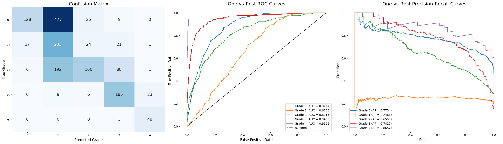

#### DenseNet Native-CAM Examples
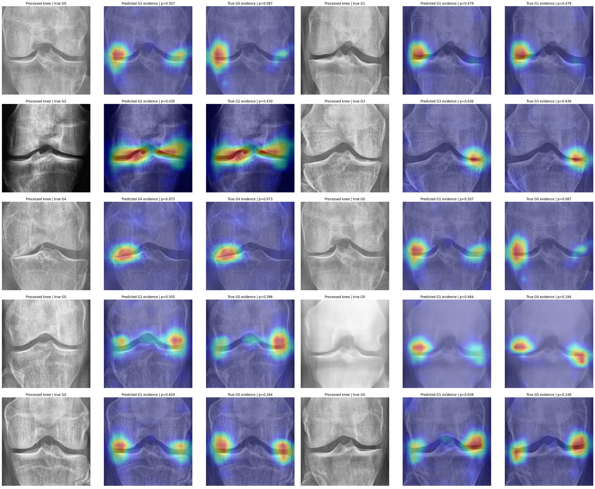

### Native-CAM Evaluation
The five grade examples and five Grade 0-to-1 error examples place their strongest activation along the tibiofemoral joint line. Per-example joint enrichment ranged from `1.759` to `2.216` for the grade examples and from `1.964` to `2.233` for the displayed errors. Border enrichment ranged from `0.325` to `0.647`. Qualitatively, the maps are better aligned with the joint than the off-anatomy examples seen in earlier deployment montages, but several maps still concentrate at medial or lateral image margins rather than delineating a specific osteophyte or narrowed joint-space region.

This CAM output is faithful to the weak classifier evidence, not proof of exact disease localization. In particular, all five displayed errors are Grade 0 knees predicted as Grade 1; their heatmaps show where the incorrect Grade 1 score came from, while the confusion matrix demonstrates that the class decision itself is poorly calibrated. The notebook did not run the earlier stratified 50-cases-per-grade occlusion audit, so its per-example enrichment values must not be compared directly with the production run's aggregate joint-energy score.

### Decision and Recommendation
* **Production decision:** Reject this checkpoint. Keep the 2026-07-23 production DenseNet checkpoint.
* **Main failure:** Full balancing and the selection reward for Grade 1 recall caused severe Grade 0-to-1 overprediction; the high EMA decay also lagged throughout the 30-epoch schedule.
* **What this run establishes:** Natural-orientation flip training can keep CAM hotspots near the joint, but this multi-change experiment does not establish that flip or gamma improves classification.
* **Next controlled experiment:** Compare raw weights against EMA on every validation epoch under the same split. Initialize EMA after the five-epoch head warm-up or test decay `0.99`/`0.995`, and compare square-root sampling (`sampler_power=0.5`) with full balancing. Do not use the test set for that selection.

Archived executed notebook: [2026-07-25 natural-orientation flip/gamma EMA run](2026-07-25_04-34-08_densenet121_natural_orientation_flip_gamma_ema.ipynb).


## Run: 2026-07-23 01:31:37.184239 UTC [PRODUCTION] (DENSENET121 - Canonical Final Linear CAM (CE + Laterality Canonicalization + Native CAM))
### Summary
This run completed 27 of the 30 configured epochs and selected epoch 27 using the validation composite score (`0.7276`). The exact saved checkpoint was copied to `checkpoints/densenet121/best_model.pth`. On the test set it achieved Accuracy `0.6612`, QWK `0.8178`, macro F1 `0.6811`, macro Average Precision `0.7334`, and macro ROC AUC `0.8987`. Compared with the 2026-07-21 native-CAM run, Accuracy, AP, and AUC increased slightly, while QWK and Grade 1 recall decreased. The overlapping bootstrap intervals do not establish a statistically significant superiority claim.

### Configurations
| Parameter | Value |
| --- | --- |
| **Model** | densenet121 |
| **Architecture** | canonical_final_linear_cam |
| **Model Input** | 384x384 (resize to 400x400, then crop) |
| **Pipeline** | 3-stage |
| **Configured Epochs** | 30 (5 warm-up + 15 coarse + 10 fine-tune) |
| **Completed / Selected Epoch** | 27 / 27; validation selection score 0.7276 |
| **Loss Function** | Cross-Entropy (CE) |
| **Balanced Sampler** | True; full inverse-frequency (`sampler_power=1.0`) |
| **Laterality Canonicalization** | True; right knees mirrored before transforms |
| **Random Horizontal Flip** | Disabled |
| **Minority Augmentations / TTA** | False / False |
| **Random Erasing** | p=0.10; second erase disabled |
| **Batch Size** | 48 |
| **Checkpoint Directory** | `2026-07-23_01-31-37_184239_UTC_canonical_final_linear_cam` |
| **Checkpoint SHA-256** | `cce1602b382411ada19883b180be501f333a5301de2c69aa00d61b031905efd1` |

### Validation Metrics at Selected Epoch
| Metric | Score |
| --- | --- |
| **Accuracy** | 0.6683 |
| **QWK Score** | 0.8139 |
| **Macro Precision / Recall / F1** | 0.6901 / 0.7018 / 0.6952 |
| **Grade 1 Recall** | 0.4052 |
| **Average Precision / ROC AUC** | 0.7198 / 0.8877 |
| **Composite Selection Score** | 0.7276 |

### Final Test Metrics
| Metric | Score |
| --- | --- |
| **Accuracy** | 0.6612 (95% bootstrap CI: 0.6383 - 0.6848) |
| **QWK Score** | 0.8178 (95% bootstrap CI: 0.7971 - 0.8366) |
| **Macro Precision / Recall / F1** | 0.6873 / 0.6783 / 0.6811 |
| **Grade 1 Recall** | 0.4493 |
| **Average Precision** | 0.7334 |
| **ROC AUC** | 0.8987 |

The confidence intervals above were reconstructed by multinomial bootstrap from the saved test confusion matrix (`5,000` resamples). They therefore quantify image-level Accuracy and QWK uncertainty only. Patient-level identifiers and saved per-image probabilities were not exported, so patient-clustered intervals and AP/AUC intervals cannot be reconstructed from this artifact.

### Classification Report
```text
              precision    recall  f1-score   support

           0       0.77      0.74      0.75       639
           1       0.37      0.45      0.40       296
           2       0.69      0.60      0.64       447
           3       0.77      0.79      0.78       223
           4       0.85      0.80      0.83        51

    accuracy                           0.66      1656
   macro avg       0.69      0.68      0.68      1656
weighted avg       0.68      0.66      0.67      1656
```

The test confusion matrix was:

```text
             Pred 0  Pred 1  Pred 2  Pred 3  Pred 4
True Grade 0    476     131      31       1       0
True Grade 1    100     133      57       6       0
True Grade 2     46      94     268      39       0
True Grade 3      0       6      33     177       7
True Grade 4      0       0       2       8      41
```

Of the `561` test errors, `469` (`83.6%`) were adjacent-grade errors. There were `54` under-predictions and `38` over-predictions by two or more grades.

### Epoch-by-Epoch Training History
| Stage | Epoch | Train Loss | Val Loss | Val Acc | QWK | Macro F1 | Grade 1 Recall | AP | AUC | Selection |
| --- | --- | --- | --- | --- | --- | --- | --- | --- | --- | --- |
| Warm-up | 1 | 1.5724 | 1.5161 | 0.3317 | 0.2761 | 0.2922 | 0.1438 | 0.3298 | 0.6414 | 0.2995 |
| Warm-up | 2 | 1.4821 | 1.4302 | 0.3898 | 0.3602 | 0.2824 | 0.0654 | 0.3611 | 0.6708 | 0.3297 |
| Warm-up | 3 | 1.4303 | 1.4359 | 0.3232 | 0.3917 | 0.2883 | 0.4575 | 0.3825 | 0.6959 | 0.3908 |
| Warm-up | 4 | 1.3927 | 1.3620 | 0.4153 | 0.4311 | 0.3483 | 0.2941 | 0.3893 | 0.7053 | 0.4053 |
| Warm-up | 5 | 1.3577 | 1.3421 | 0.4116 | 0.4305 | 0.3317 | 0.2680 | 0.3987 | 0.7169 | 0.4011 |
| Coarse | 6 | 1.1995 | 1.1136 | 0.5278 | 0.6372 | 0.4445 | 0.0523 | 0.5355 | 0.8129 | 0.5202 |
| Coarse | 7 | 0.9328 | 0.9717 | 0.5835 | 0.7150 | 0.5557 | 0.1046 | 0.6352 | 0.8486 | 0.6058 |
| Coarse | 8 | 0.7952 | 0.8898 | 0.6247 | 0.7749 | 0.6390 | 0.2810 | 0.6803 | 0.8633 | 0.6766 |
| Coarse | 9 | 0.7458 | 0.8952 | 0.6041 | 0.7722 | 0.6383 | 0.3791 | 0.6775 | 0.8643 | 0.6838 |
| Coarse | 10 | 0.6902 | 0.9304 | 0.6005 | 0.7495 | 0.6364 | 0.3987 | 0.6815 | 0.8669 | 0.6793 |
| Coarse | 11 | 0.6494 | 0.8897 | 0.6017 | 0.7633 | 0.6497 | 0.3660 | 0.6921 | 0.8726 | 0.6851 |
| Coarse | 12 | 0.6254 | 0.8523 | 0.6211 | 0.7804 | 0.6689 | 0.3856 | 0.6940 | 0.8741 | 0.6984 |
| Coarse | 13 | 0.6154 | 0.8919 | 0.6126 | 0.7545 | 0.6452 | 0.3203 | 0.6950 | 0.8737 | 0.6774 |
| Coarse | 14 | 0.6094 | 0.8770 | 0.6017 | 0.7742 | 0.6469 | 0.4118 | 0.7037 | 0.8777 | 0.6959 |
| Coarse | 15 | 0.5859 | 0.8404 | 0.6320 | 0.7944 | 0.6641 | 0.3529 | 0.7064 | 0.8786 | 0.7031 |
| Coarse | 16 | 0.5847 | 0.8406 | 0.6259 | 0.7962 | 0.6595 | 0.3529 | 0.7122 | 0.8794 | 0.7027 |
| Coarse | 17 | 0.5699 | 0.8511 | 0.6356 | 0.7904 | 0.6755 | 0.3922 | 0.7130 | 0.8798 | 0.7095 |
| Coarse | 18 | 0.5585 | 0.8383 | 0.6465 | 0.8069 | 0.6775 | 0.3725 | 0.7118 | 0.8810 | 0.7145 |
| Coarse | 19 | 0.5692 | 0.8382 | 0.6404 | 0.8010 | 0.6760 | 0.3791 | 0.7126 | 0.8805 | 0.7124 |
| Coarse | 20 | 0.5595 | 0.8295 | 0.6404 | 0.8012 | 0.6709 | 0.3464 | 0.7128 | 0.8809 | 0.7073 |
| Fine-tune | 21 | 0.5571 | 0.8308 | 0.6416 | 0.8048 | 0.6749 | 0.3725 | 0.7184 | 0.8829 | 0.7138 |
| Fine-tune | 22 | 0.5313 | 0.8332 | 0.6525 | 0.8015 | 0.6834 | 0.3922 | 0.7188 | 0.8841 | 0.7178 |
| Fine-tune | 23 | 0.5415 | 0.8316 | 0.6453 | 0.8043 | 0.6784 | 0.3464 | 0.7100 | 0.8837 | 0.7112 |
| Fine-tune | 24 | 0.5401 | 0.8410 | 0.6392 | 0.8012 | 0.6702 | 0.3856 | 0.7085 | 0.8825 | 0.7107 |
| Fine-tune | 25 | 0.5202 | 0.8288 | 0.6550 | 0.8087 | 0.6841 | 0.3725 | 0.7141 | 0.8858 | 0.7181 |
| Fine-tune | 26 | 0.5234 | 0.8255 | 0.6598 | 0.8109 | 0.6917 | 0.4118 | 0.7179 | 0.8883 | 0.7257 |
| Fine-tune | 27 | 0.5005 | 0.8196 | 0.6683 | 0.8139 | 0.6952 | 0.4052 | 0.7198 | 0.8877 | 0.7276 |

### Visualizations
#### DenseNet Test Metrics
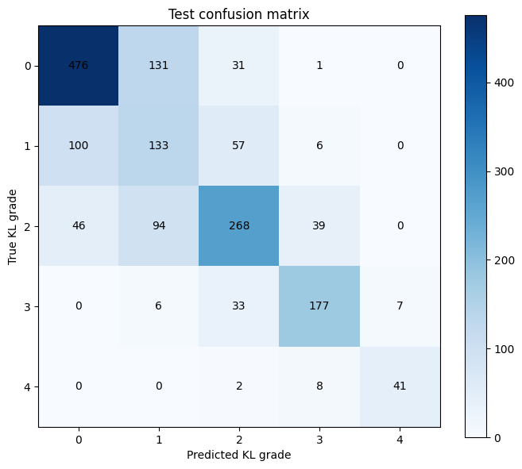

#### DenseNet Native-CAM Audit
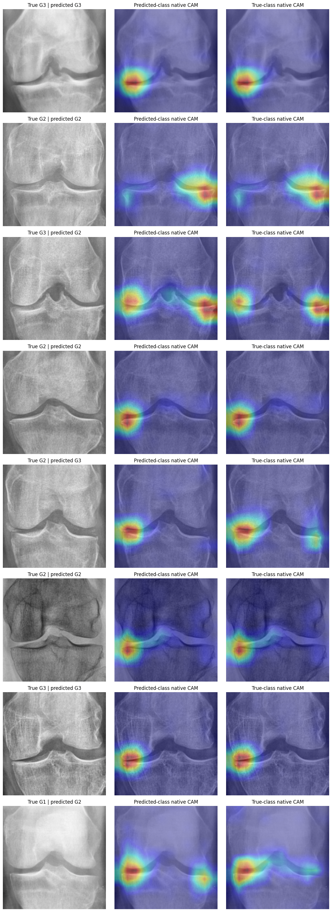

### Native-CAM Evaluation
The stratified audit contained `227` cases. Mean joint-ROI energy was `0.7996`, border energy was `0.1323`, lower-tibia energy was `0.1006`, and every CAM peak was inside the broad joint ROI. These values confirm that the maps are aligned with the model input and concentrate mainly at joint level.

The maps are not anatomically perfect. Visual review of the saved worst cases shows repeated activation at lateral image/joint margins, and the final DenseNet feature map is only `12x12` before interpolation. The broad ROI metric can score a lateral marginal hotspot as correct even when it is not centered on the tibiofemoral joint space. Native CAM is faithful to the grade logit because the spatial map is globally averaged to produce that logit; it does not prove that the highlighted pixels correspond exactly to radiographic joint-space narrowing or osteophytes.

### Same-Protocol SE-ResNeXt Comparison
The SE-ResNeXt-50 run completed at the exact timestamp `2026-07-23 01:25:36.772175 UTC` under the same canonical native-CAM protocol.

The complete standalone execution log is available in [the SE-ResNeXt-50 report](../se_resnext50_32x4d/report.md).

| Model | Accuracy | QWK | Macro F1 | Grade 1 Recall | AP | AUC | Joint Energy | Border Energy | Lower-Tibia Energy |
| --- | --- | --- | --- | --- | --- | --- | --- | --- | --- |
| **DenseNet-121** | **0.6612** | 0.8178 | **0.6811** | **0.4493** | **0.7334** | **0.8987** | 0.7996 | 0.1323 | 0.1006 |
| SE-ResNeXt-50 | 0.6389 | **0.8194** | 0.6671 | 0.4155 | 0.7248 | 0.8948 | **0.8707** | **0.0749** | **0.0880** |

SE-ResNeXt has marginally higher QWK (`+0.0016`) and tighter broad-ROI localization, but DenseNet is better on every other reported predictive metric, including Accuracy (`+0.0223`), macro F1 (`+0.0140`), Grade 1 recall (`+0.0338`), AP, and AUC. The QWK bootstrap intervals overlap substantially: DenseNet `0.7971 - 0.8366`, SE-ResNeXt `0.7999 - 0.8384`. DenseNet therefore remains the better overall checkpoint for this application; neither model establishes exact subregional anatomical localization without landmark or compartment annotations.


### Evaluation and Next Experiment
* **Current decision:** Keep the epoch-27 DenseNet checkpoint marked above. It gives the strongest overall predictive balance and uses an intrinsically faithful native-CAM head, although its heatmaps remain spatially coarse.
* **Next predictive experiment:** Evaluate an exponential moving average (EMA) of model weights at every validation epoch while leaving the architecture, loss, split, sampler, transforms, and checkpoint selection score unchanged. This directly tests whether smoothing the late-stage weight trajectory improves generalization without changing the native-CAM semantics. It must be compared with this run on validation first; the test set should not drive checkpoint selection.
* **Localization limit:** Do not add another unvalidated CAM penalty. Previous weak joint guidance did not demonstrate a reliable predictive/localization improvement, and a broad rectangular ROI can reward incorrect edge activation. Exact localization requires expert joint-space/compartment landmarks or masks and a held-out annotation audit.

---

## Run: 2026-07-21 15:07:17.633270 UTC (DENSENET121 - Canonical Final Linear CAM (CE + Laterality Canonicalization + Native CAM))
### Summary
This run trained the `canonical_final_linear_cam` DenseNet-121 architecture for all 30 configured epochs. Right knees were mirrored into the same anatomical orientation as left knees, random horizontal flipping was removed, and a 1x1 convolution produced five spatial grade maps whose global means were the five CE logits. The validation composite selected epoch 23 (`0.7241`) rather than the maximum-QWK epoch 26. The selected checkpoint achieved test Accuracy `0.6534` (95% CI: `0.6291 - 0.6776`) and QWK `0.8238` (95% CI: `0.8055 - 0.8419`).

### Configurations
| Parameter | Value |
| --- | --- |
| **Model** | densenet121 |
| **Architecture** | canonical_final_linear_cam |
| **Model Input** | 384x384 (resize to 400x400, then crop) |
| **Pipeline** | 3-stage |
| **Epochs** | 30 (5 warm-up + 15 coarse + 10 fine-tune) |
| **Selected Checkpoint** | Epoch 23; validation selection score 0.7241 |
| **Loss Function** | Cross-Entropy (CE) |
| **Balanced Sampler** | True; full inverse-frequency (`sampler_power=1.0`) |
| **Laterality Canonicalization** | True; right knees mirrored before transforms |
| **Random Horizontal Flip** | Disabled |
| **Minority Augmentations** | False |
| **Test-Time Augmentation** | False |
| **Random Erasing** | p=0.10; second erase disabled |
| **Batch Size / AMP / GPU** | 48 / enabled / Tesla T4 |
| **Checkpoint Directory** | `2026-07-21_15-07-17_633270_UTC_canonical_final_linear_cam` |

### Final Test Metrics
| Metric | Score (with 95% Confidence Interval) |
| --- | --- |
| **Accuracy** | 0.6534 (95% CI: 0.6291 - 0.6776) |
| **QWK Score** | 0.8238 (95% CI: 0.8055 - 0.8419) |
| **ROC AUC** | 0.8978 (95% CI: 0.8890 - 0.9077) |
| **Average Precision** | 0.7311 (95% CI: 0.7065 - 0.7586) |

### Classification Report
```
              precision    recall  f1-score   support

           0       0.78      0.73      0.75       639
           1       0.35      0.49      0.41       296
           2       0.72      0.55      0.63       447
           3       0.74      0.82      0.78       223
           4       0.81      0.82      0.82        51

    accuracy                           0.65      1656
   macro avg       0.68      0.68      0.68      1656
weighted avg       0.68      0.65      0.66      1656
```

Per-class test AUC was `0.9045 / 0.7507 / 0.8700 / 0.9708 / 0.9928` for Grades 0-4. The plotted trapezoidal precision-recall areas were `0.8313 / 0.3268 / 0.7254 / 0.8544 / 0.9133`; these curve areas should not be confused with the separately computed macro average-precision score of `0.7311`.

The test confusion matrix was:

```text
             Pred 0  Pred 1  Pred 2  Pred 3  Pred 4
True Grade 0    464     152      22       1       0
True Grade 1     91     146      51       8       0
True Grade 2     39     115     247      46       0
True Grade 3      0       8      22     183      10
True Grade 4      0       0       1       8      42
```

### Epoch-by-Epoch Training History
| Stage | Epoch | Train Loss | Train Acc | Val Loss | Val Acc | QWK | ROC AUC | AP |
| --- | --- | --- | --- | --- | --- | --- | --- | --- |
| Stage 1 | 1 | 1.5703 | 28.11 % | 1.5610 | 25.54 % | 0.2568 | 0.6344 | 0.3322 |
| Stage 1 | 2 | 1.4812 | 34.89 % | 1.4181 | 36.68 % | 0.3260 | 0.6696 | 0.3544 |
| Stage 1 | 3 | 1.4376 | 36.92 % | 1.4144 | 35.59 % | 0.3472 | 0.6845 | 0.3660 |
| Stage 1 | 4 | 1.3941 | 39.94 % | 1.3726 | 42.62 % | 0.4132 | 0.6960 | 0.3732 |
| Stage 1 | 5 | 1.3693 | 41.47 % | 1.3606 | 41.40 % | 0.4348 | 0.7075 | 0.3935 |
| Stage 2 | 6 | 1.2090 | 48.17 % | 1.1042 | 54.24 % | 0.6582 | 0.8113 | 0.5289 |
| Stage 2 | 7 | 0.9396 | 59.45 % | 0.9642 | 59.44 % | 0.7366 | 0.8480 | 0.6398 |
| Stage 2 | 8 | 0.7954 | 65.07 % | 0.9631 | 54.72 % | 0.7479 | 0.8541 | 0.6537 |
| Stage 2 | 9 | 0.7270 | 67.88 % | 0.9430 | 58.72 % | 0.7406 | 0.8601 | 0.6698 |
| Stage 2 | 10 | 0.6862 | 69.97 % | 0.9013 | 59.69 % | 0.7664 | 0.8666 | 0.6766 |
| Stage 2 | 11 | 0.6546 | 71.91 % | 0.8398 | 63.20 % | 0.7793 | 0.8728 | 0.6960 |
| Stage 2 | 12 | 0.6402 | 72.33 % | 0.8331 | 64.65 % | 0.7802 | 0.8777 | 0.6997 |
| Stage 2 | 13 | 0.6132 | 73.87 % | 0.8512 | 62.23 % | 0.7695 | 0.8775 | 0.6977 |
| Stage 2 | 14 | 0.5980 | 74.14 % | 0.8693 | 61.50 % | 0.7806 | 0.8790 | 0.7022 |
| Stage 2 | 15 | 0.5755 | 75.18 % | 0.8254 | 64.16 % | 0.7929 | 0.8815 | 0.7076 |
| Stage 2 | 16 | 0.5846 | 74.71 % | 0.8380 | 63.56 % | 0.7908 | 0.8817 | 0.7096 |
| Stage 2 | 17 | 0.5734 | 75.16 % | 0.8403 | 63.68 % | 0.7914 | 0.8819 | 0.7082 |
| Stage 2 | 18 | 0.5637 | 75.30 % | 0.8318 | 63.80 % | 0.7902 | 0.8832 | 0.7129 |
| Stage 2 | 19 | 0.5712 | 75.72 % | 0.8242 | 64.53 % | 0.8010 | 0.8837 | 0.7136 |
| Stage 2 | 20 | 0.5734 | 75.74 % | 0.8423 | 63.68 % | 0.7929 | 0.8821 | 0.7089 |
| Stage 3 | 21 | 0.5573 | 76.74 % | 0.8356 | 62.83 % | 0.7956 | 0.8842 | 0.7093 |
| Stage 3 | 22 | 0.5489 | 76.83 % | 0.8337 | 62.11 % | 0.7905 | 0.8836 | 0.7115 |
| Stage 3 | 23 | 0.5351 | 77.21 % | 0.8470 | 64.41 % | 0.8001 | 0.8860 | 0.7157 |
| Stage 3 | 24 | 0.5359 | 77.21 % | 0.8348 | 65.13 % | 0.7988 | 0.8867 | 0.7108 |
| Stage 3 | 25 | 0.5170 | 77.85 % | 0.8520 | 63.92 % | 0.7992 | 0.8850 | 0.7117 |
| Stage 3 | 26 | 0.5198 | 78.07 % | 0.8179 | 65.13 % | 0.8061 | 0.8869 | 0.7144 |
| Stage 3 | 27 | 0.5146 | 77.73 % | 0.8252 | 65.25 % | 0.8030 | 0.8883 | 0.7152 |
| Stage 3 | 28 | 0.5044 | 78.97 % | 0.8273 | 64.77 % | 0.8006 | 0.8869 | 0.7141 |
| Stage 3 | 29 | 0.5048 | 78.73 % | 0.8269 | 65.50 % | 0.8036 | 0.8870 | 0.7136 |
| Stage 3 | 30 | 0.5028 | 78.92 % | 0.8355 | 64.77 % | 0.7935 | 0.8854 | 0.7115 |

### Visualizations
#### Native CAM
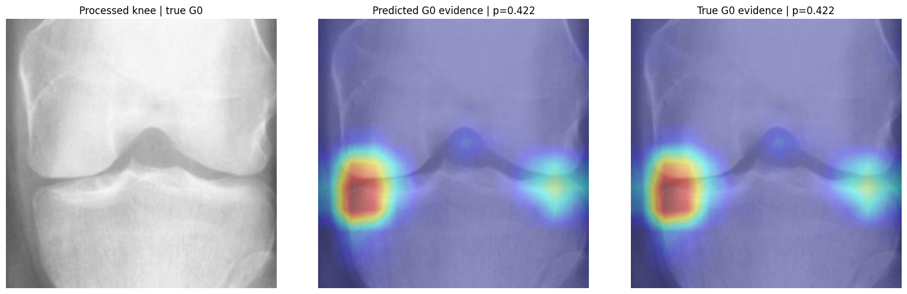

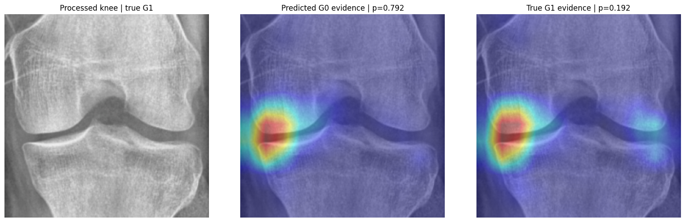

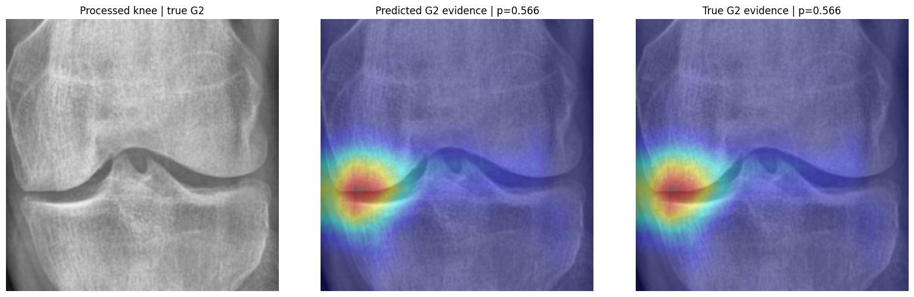

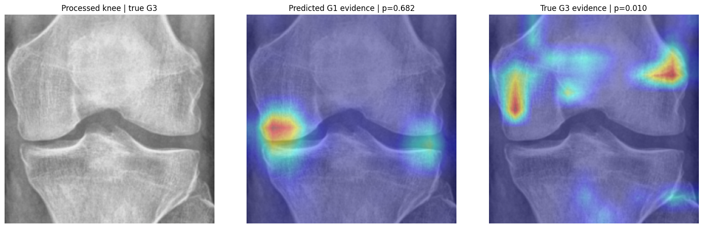

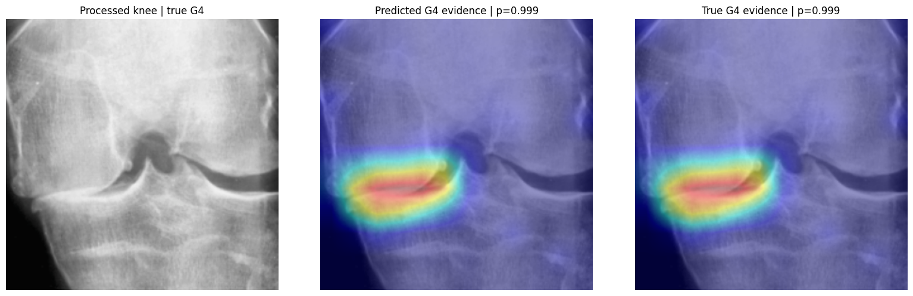

#### Confusion Matrix, ROC, and Precision-Recall Curves
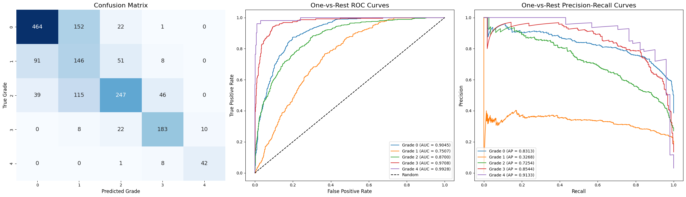

### Diagnostic Error Analysis Results
```
============================================================
Total Validation Failures: 287 / 826 (34.75% error)

Distribution by Severity Category:
boundary_confusion            237
other_errors                   34
critical_miss_overpredict      11
critical_miss_underpredict      5

Top 5 Most Common Confusions (True vs Pred):
 true_grade  predicted_grade  count
          0                1     80
          1                0     51
          2                1     49
          1                2     24
          2                0     18
```

### Evaluation and Clinical Conclusion

#### 1. Performance and Checkpoint Selection
* **Strong ordinal agreement, lower exact accuracy:** Test QWK remained strong at `0.8238`, but Accuracy fell to `0.6534`. Relative to the `2026-07-20 17:09:20 ICT` checkpoint re-evaluation, QWK was effectively unchanged (`0.8223 -> 0.8238`) while Accuracy decreased (`0.6685 -> 0.6534`). The confidence intervals overlap, so this run is not a statistically demonstrated predictive improvement.
* **Composite selection behaved as designed:** Epoch 26 had the highest validation QWK (`0.8061`), but epoch 23 was selected because it combined QWK `0.8001`, macro F1 `0.6837`, macro recall `0.6922`, Grade 1 recall `0.4641`, AP `0.7157`, and AUC `0.8860`. This choice prioritizes the weak Grade 1 boundary rather than QWK alone.
* **Convergence was stable:** Validation QWK stayed near `0.80` throughout Stage 3 while train accuracy rose to `78.92%`. The modest train-validation gap does not indicate severe overfitting, but Stage 3 did not produce a large predictive gain over the best Stage 2 checkpoint.

#### 2. Class-by-Class Diagnostic Analysis
* **Grade 1 recall improved but precision remained weak:** Grade 1 recall reached `49%`, compared with `39%` in the `2026-07-20 17:09:20 ICT` re-evaluation, but precision remained `35%`. The model predicted Grade 1 for `152` true Grade 0 knees and `115` true Grade 2 knees. Full inverse-frequency sampling therefore improved Grade 1 sensitivity by shifting errors into Grade 1 rather than cleanly separating the class.
* **Grade 0 and Grade 2 paid for the Grade 1 gain:** Grade 0 recall fell to `73%`, and Grade 2 recall fell to `55%`. Grade 1 remains the weakest ranking class with AUC `0.7507` and precision-recall area `0.3268`.
* **Severe grades remained reliable:** Grade 3 recall was `82%` and Grade 4 recall was `82%`, with only one Grade 4 knee predicted below Grade 3.

#### 3. Validation Error Diagnostics
* **Adjacent errors still dominate:** `237 / 287` validation failures (`82.6%`) were one-grade boundary errors. The dominant confusions were Grade 0 -> 1 (`80`), Grade 1 -> 0 (`51`), and Grade 2 -> 1 (`49`).
* **Critical over-prediction increased:** The run produced `11` critical over-predictions and `5` critical under-predictions. The increased critical-over count is another sign that full balancing is aggressive.

#### 4. Native CAM Interpretation
* **The positional alignment is correct:** The overlay is produced from the same laterality-canonicalized, padded, CLAHE-processed, resized, and center-cropped image used by inference. There is no transform mismatch or target-layer lookup error.
* **Most maps focus on relevant anatomy:** Across the five grade examples, predicted-map joint enrichment ranged from `1.877` to `2.089` and border enrichment from `0.382` to `0.572`. Grade 4 is the clearest case, with activation along the collapsed medial joint space. Grade 0 and Grade 2 focus on joint margins but remain asymmetric.
* **The maps are not perfect:** The true Grade 1 example was predicted as Grade 0, and the predicted and true maps localize almost the same joint region; localization alone does not separate the subtle grades. The true Grade 3 example was predicted as Grade 1, and its true-class map includes activation above the joint and near the image edge. The additional five error pairs are all true Grade 0 because the notebook selected the first five validation errors in class-sorted order, so they are not a stratified localization audit.
* **Native CAM is faithful to this head, not proof of causality:** Each map is directly averaged into its grade logit, which is stronger architectural faithfulness than post-hoc Grad-CAM. However, the 12x12 final map is spatially coarse, and the printed central-band energy statistic is only a broad proxy for anatomical correctness.

#### 5. Recommendation
* **Keep this checkpoint as the localization-first DenseNet candidate, not as a final clinical model.** It solves the previous Grad-CAM alignment and faithfulness problem and improves Grade 1 recall, but it does not improve the overall predictive metrics enough to justify stopping all experimentation.
* **Do not tune further on the repeatedly used test set.** The next comparison should keep this architecture fixed, use validation folds, and compare full balancing (`power=1.0`) with square-root balancing (`power=0.5`). The current Grade 0/2 -> 1 pattern is direct evidence that full balancing may be too aggressive.
* **Complete the quantitative CAM audit on this exact checkpoint.** Use stratified cases from every grade, predicted- and true-class maps, joint/border enrichment, and occlusion sensitivity. Grade 4 has only 27 validation images, so report all 27 rather than duplicating cases or using the test split.
* **Use the SE-ResNeXt comparison as the next model experiment.** Promote it only if it passes the localization gates and gives a meaningful validation improvement over this checkpoint. Otherwise, this native-CAM DenseNet is the more defensible model for the report.

---

### Historical Diagnostic Insights (2026-07-16 Focal-CORN Run)

1. **Focal CORN (Ordinal Loss) Convergence and Early Stopping:**
   * **Early Stopping Trigger:** The Focal CORN model stopped training early at **Epoch 10** because the validation QWK did not improve for 5 consecutive epochs (after peaking at `0.7428` in Epoch 5). In contrast, the baseline CE model completed all 30 epochs and the Balanced CE model completed 19 epochs.
   * **Metric Impact:** Because the Focal CORN model stopped training so early, it did not achieve full convergence, resulting in a lower test accuracy (`0.6087`) and QWK score (`0.7388`) compared to the CE models.
   * **Optimization Property:** Ordinal loss functions like Focal CORN have more complex loss surfaces and slower convergence rates compared to standard Cross-Entropy. The early stopping patience should be increased (e.g., from 5 to 12 or 15) for ordinal training runs to allow the model to fully optimize.

2. **Class-by-Class Performance and Minority Classes:**
   * **Grade 1 (Doubtful OA) Recall Drop:** Recall for early-stage doubtful osteoarthritis (Grade 1) dropped significantly to **12.0%** under Focal CORN, compared to **49.0%** in the Balanced CE run. This indicates that early stopping prevented the model from learning the subtle features of minority classes.
   * **Grade 4 (Severe OA) Stability:** Severe osteoarthritis (Grade 4) performance remained stable with a recall of **78.0%** and precision of **82.0%** due to the distinct clinical features of joint space collapse.

3. **Error Analysis and Severity Categories:**
   * **Boundary Confusion:** Out of 326 validation errors under Focal CORN, **236 (72.4%)** were boundary confusions (off by exactly 1 grade). This is a lower proportion of boundary errors compared to Balanced CE (87.5%), showing that ordinal loss does help enforce rigid grading boundaries, but the overall error rate is higher due to under-convergence.
   * **Critical Misses:** The Focal CORN run had **8 critical under-predictions** (predicting Grade 0/1 for severe Grade 3/4) and **3 critical over-predictions** (predicting Grade 3/4 for healthy Grade 0/1). Minimizing these critical misses is vital for clinical deployment.

---

## Re-evaluation: 2026-07-20 17:09:20 ICT (Final Semantic Grad-CAM)

### Provenance Warning

The notebook saved at `2026-07-20 17:09:20 ICT` loaded `/content/drive/MyDrive/Models/densenet121_checkpoints/best_model.pth` and produced metrics that differ from the stored `2026-07-20 12:36:36` training run. The training output reports Accuracy `0.6715`, QWK `0.8246`, and `279` validation failures; the `2026-07-20 17:09:20 ICT` evaluation reports Accuracy `0.6685`, QWK `0.8223`, and `287` validation failures. This indicates that the checkpoint file changed after the training output was saved, or that notebook outputs came from different runtime states. Until each experiment uses a unique checkpoint directory plus a saved config and checkpoint hash, the `2026-07-20 17:09:20 ICT` evaluation must not be presented as the exact model represented by the stored epoch history.

Timestamp source: the notebook filesystem modification time is `2026-07-20 17:09:20.505996618 +07:00`. Jupyter did not store per-cell execution timestamps, so this is the exact notebook save time, not a claimed execution time for an individual cell.

### Test Metrics

| Metric | Saved Output (2026-07-20 17:09:20 ICT) |
| --- | --- |
| Accuracy | 0.6685 (95% CI: 0.6486 - 0.6932) |
| QWK | 0.8223 (95% CI: 0.8017 - 0.8397) |
| ROC AUC (macro OVR) | 0.8977 (95% CI: 0.8897 - 0.9089) |
| Average Precision (macro) | 0.7345 (95% CI: 0.7138 - 0.7610) |

```text
              precision    recall  f1-score   support
Grade 0           0.77      0.79      0.78       639
Grade 1           0.35      0.39      0.37       296
Grade 2           0.67      0.61      0.64       447
Grade 3           0.82      0.78      0.80       223
Grade 4           0.89      0.80      0.85        51

accuracy                               0.67      1656
macro avg          0.70      0.67      0.69      1656
weighted avg       0.68      0.67      0.67      1656
```

Per-class ranking metrics confirm the same weakness: Grade 1 has AUC `0.7469` and AP `0.3320`, compared with AUC/AP of `0.9057/0.8285` for Grade 0, `0.8657/0.7374` for Grade 2, `0.9752/0.8639` for Grade 3, and `0.9952/0.9040` for Grade 4.

The test confusion matrix saved at `2026-07-20 17:09:20 ICT` was:

```text
             Pred 0  Pred 1  Pred 2  Pred 3  Pred 4
True Grade 0    504     105      30       0       0
True Grade 1    106     116      74       0       0
True Grade 2     48      98     273      28       0
True Grade 3      0      12      33     173       5
True Grade 4      0       0       0      10      41
```

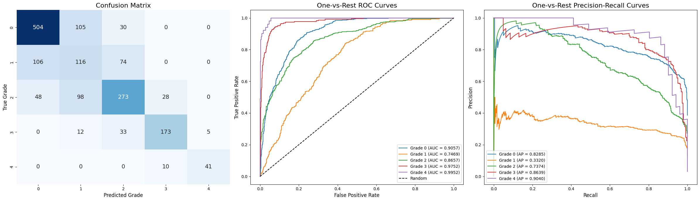

### Validation Error Analysis

The diagnostic run saved at `2026-07-20 17:09:20 ICT` found `287 / 826` validation errors (`34.75%`). Of these, `243` (`84.7%`) were adjacent-grade errors, `35` were other errors, `5` were critical over-predictions, and `4` were critical under-predictions. The most common errors remained Grade 1 -> 0 (`67`), Grade 0 -> 1 (`64`), Grade 2 -> 1 (`46`), Grade 1 -> 2 (`28`), and Grade 3 -> 2 (`22`). Grade 1 therefore remains the central classification bottleneck even though its test recall increased from `31%` in the archived evaluation to `39%` in this re-evaluation.

### Final-Layer Grad-CAM Review

The regenerated visualization uses one target scale: the final semantic DenseNet feature map. It is materially cleaner than the archived three-scale average: diffuse speckling and the Grade 3 lower-left hotspot are removed. It is still not a perfect or causal localization method.

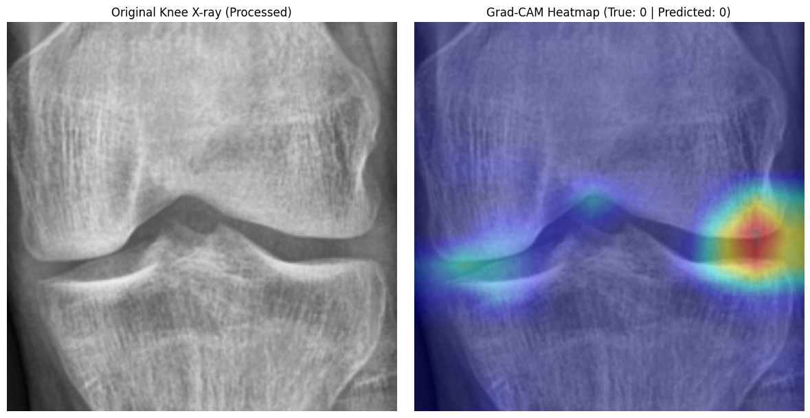

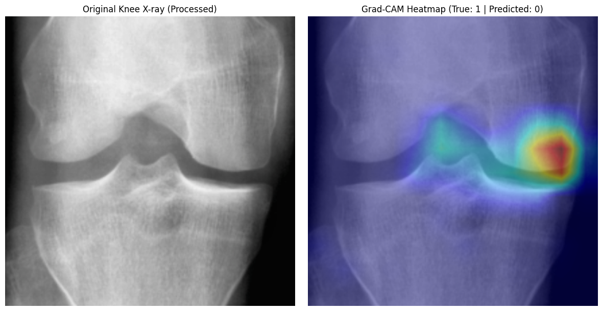

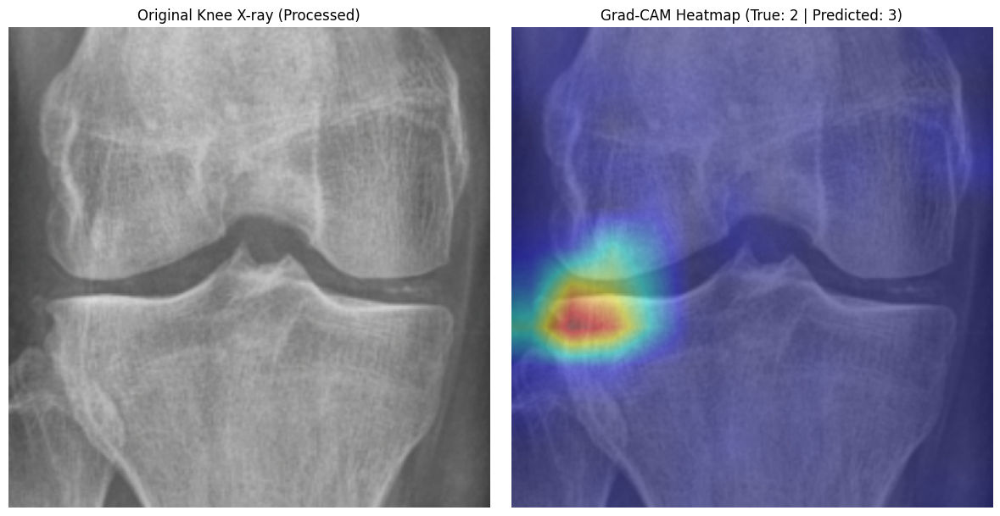

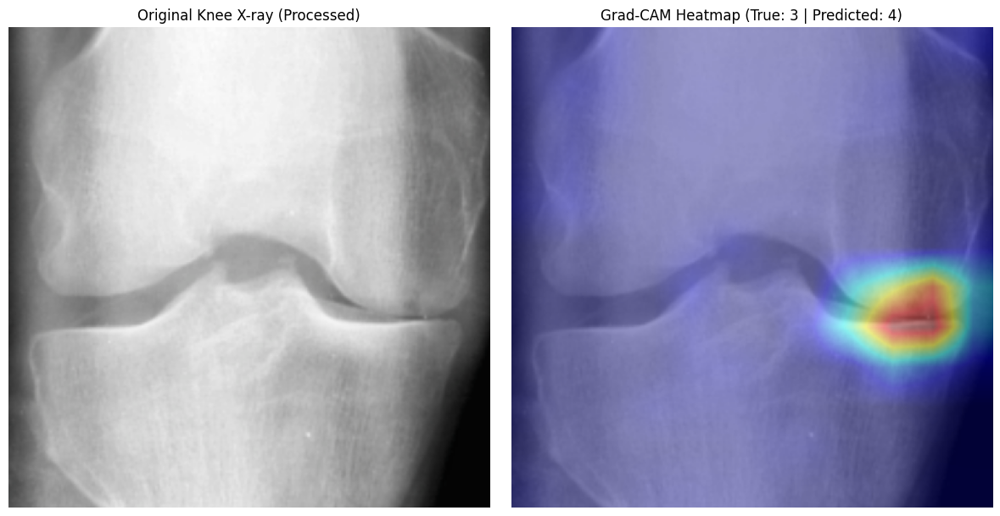

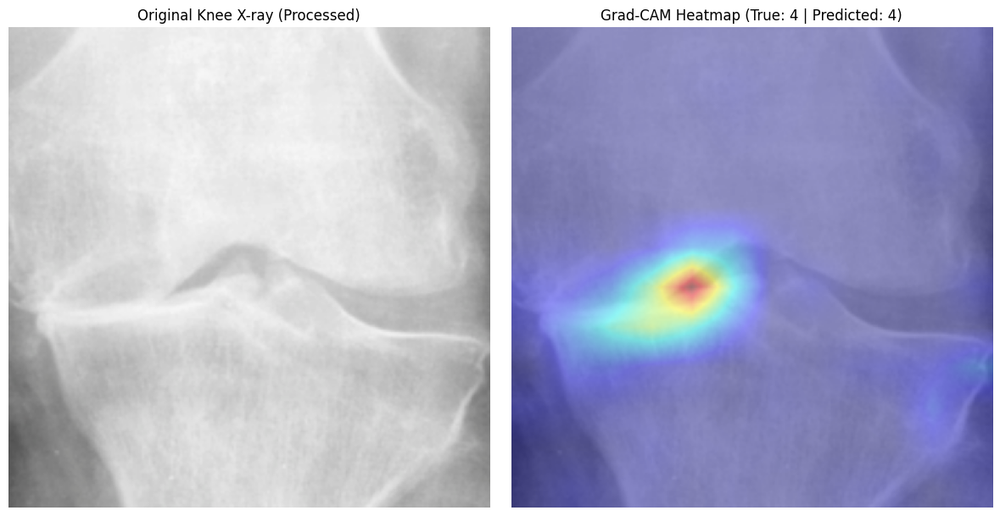

* **Grade 0 -> 0:** Attention is mostly on the joint line, but is strongly asymmetric toward the right image margin. This is plausible but not sufficient evidence that the model assesses both compartments.
* **Grade 1 -> 0:** Attention covers the tibial spine and right joint margin, but the prediction remains incorrect. The map does not demonstrate that the model learned the subtle Grade 0/1 distinction.
* **Grade 2 -> 3:** Attention is concentrated on the lateral joint/fibular margin. It is anatomically plausible for marginal osteophyte evidence, but its off-center concentration and overgrading require review.
* **Grade 3 -> 4:** Attention is tightly centered on the narrowed medial joint margin. The anatomical location is appropriate, but the model overestimates severity.
* **Grade 4 -> 4:** Attention is centered on the collapsed medial joint space and adjacent tibial spine. This is the strongest and most clinically coherent example.

Tiulpin et al. explicitly caution that Grad-CAM has no theoretical guarantee of identifying causal image features and requires systematic analysis rather than interpretation of a few attractive examples ([Scientific Reports 2019](https://doi.org/10.1038/s41598-019-56527-3)). Their observations that models may attend to joint-space width and tibial spines are consistent with parts of the current maps, but they also note that such associations do not hold for every case. The DenseNet-121 study summarized in `docs/paper/fmed-12-1707588.md` likewise identifies Grade 0/1 overlap and imbalance as primary limitations ([Frontiers in Medicine 2025](https://doi.org/10.3389/fmed.2025.1707588)).

### Current Assessment

The final-layer Grad-CAM correction is successful as a visualization cleanup, but not as proof of clinical reasoning. The model remains a useful KL-grading baseline with strong Grade 3/4 discrimination and weak Grade 1 separation.

The comparison table contains many experiments evaluated on the same test split. That repeated use makes the test set part of the development loop and introduces model-selection bias. Consistent with the independent-test principle emphasized by Tiulpin et al., future tuning should use validation or patient-grouped cross-validation only, followed by one evaluation on a newly locked patient-level holdout or external dataset. Confidence intervals should also resample patient IDs rather than individual knees because left and right knees from one patient are correlated.

The first priority is reproducible checkpoint provenance; the second is a controlled experiment focused on the Grade 0/1/2 boundaries; the third is quantitative localization validation over many cases rather than further visual tuning of five examples.

---

## Run: 2026-07-20 12:36:36 (DENSENET121 - 3-Stage CORN (400 Resize + 384 Crop, No TTA, Mild Erasing))
### Summary
This run trained DenseNet-121 through all three stages for 45 epochs using Conditional Ordinal (CORN) loss. Images were resized to 400x400 and cropped to 384x384; validation and test inference used a single center crop with no TTA. Training used the class-balancing `WeightedRandomSampler`, no minority-specific augmentation, and one mild Random Erasing operation (`p=0.10`, second operation disabled). The final test Accuracy was 0.6715 (95% CI: 0.6479 - 0.6914), and QWK was 0.8246 (corrected 95% CI: 0.8046 - 0.8435).

### Configurations
| Parameter | Value |
| --- | --- |
| **Model** | densenet121 |
| **Model Input** | 384x384 (resize to 400x400, then crop) |
| **Pipeline** | 3-stage |
| **Epochs** | 45 (5 warm-up + 25 coarse + 15 fine-tune) |
| **Loss Function** | corn |
| **Balanced Sampler** | True |
| **Minority Augmentations** | False |
| **Test-Time Augmentation** | False |
| **Random Erasing** | p=0.10; second erase disabled |
| **Archived Grad-CAM Method** | Standard Grad-CAM over three normalized scales |

### Final Test Metrics
| Metric | Score (with 95% Confidence Interval) |
| --- | --- |
| **Accuracy** | 0.6715 (95% CI: 0.6479 - 0.6914) |
| **QWK Score** | 0.8246 (corrected 95% CI: 0.8046 - 0.8435) |
| **ROC AUC** | 0.8963 (95% CI: 0.8864 - 0.9058) |
| **Average Precision** | 0.7337 (95% CI: 0.7106 - 0.7595) |

### Classification Report
```
precision    recall  f1-score   support

           0       0.76      0.80      0.78       639
           1       0.35      0.31      0.33       296
           2       0.66      0.62      0.64       447
           3       0.74      0.84      0.79       223
           4       0.89      0.82      0.86        51

    accuracy                           0.67      1656
   macro avg       0.68      0.68      0.68      1656
weighted avg       0.66      0.67      0.67      1656
```

### Epoch-by-Epoch Training History
| Stage | Epoch | Train Loss | Train Acc | Val Loss | Val Acc | QWK | ROC AUC | AP |
| --- | --- | --- | --- | --- | --- | --- | --- | --- |
| Stage 1 | 1 | 0.9289 | 24.68   % | 0.6168 | 36.92 % | 0.2838 | 0.6959 | 0.3894 |
| Stage 1 | 2 | 0.8825 | 33.77   % | 0.6456 | 23.37 % | 0.3691 | 0.7268 | 0.4176 |
| Stage 1 | 3 | 0.8556 | 36.19   % | 0.6456 | 42.01 % | 0.4695 | 0.7236 | 0.4072 |
| Stage 1 | 4 | 0.8471 | 38.42   % | 0.5862 | 44.79 % | 0.4725 | 0.7588 | 0.4360 |
| Stage 1 | 5 | 0.8446 | 40.07   % | 0.5823 | 45.88 % | 0.4710 | 0.7533 | 0.4395 |
| Stage 2 | 6 | 0.8018 | 46.80   % | 0.5620 | 47.22 % | 0.4549 | 0.7994 | 0.5209 |
| Stage 2 | 7 | 0.7501 | 55.97   % | 0.5311 | 61.14 % | 0.7383 | 0.8471 | 0.6251 |
| Stage 2 | 8 | 0.7149 | 61.75   % | 0.5155 | 62.71 % | 0.7387 | 0.8564 | 0.6489 |
| Stage 2 | 9 | 0.6965 | 64.00   % | 0.5270 | 55.93 % | 0.7695 | 0.8608 | 0.6699 |
| Stage 2 | 10 | 0.6896 | 65.94   % | 0.5187 | 60.05 % | 0.7845 | 0.8681 | 0.6891 |
| Stage 2 | 11 | 0.6787 | 67.67   % | 0.5066 | 61.14 % | 0.7727 | 0.8734 | 0.7012 |
| Stage 2 | 12 | 0.6758 | 68.24   % | 0.5369 | 59.32 % | 0.7148 | 0.8611 | 0.6832 |
| Stage 2 | 13 | 0.6678 | 69.35   % | 0.5049 | 61.86 % | 0.7944 | 0.8750 | 0.6997 |
| Stage 2 | 14 | 0.6569 | 71.11   % | 0.4963 | 64.53 % | 0.8041 | 0.8799 | 0.7115 |
| Stage 2 | 15 | 0.6584 | 71.50   % | 0.5019 | 63.20 % | 0.8016 | 0.8776 | 0.7034 |
| Stage 2 | 16 | 0.6489 | 72.60   % | 0.4909 | 65.62 % | 0.7778 | 0.8799 | 0.7047 |
| Stage 2 | 17 | 0.6477 | 72.43   % | 0.4960 | 63.68 % | 0.8164 | 0.8807 | 0.7110 |
| Stage 2 | 18 | 0.6443 | 73.80   % | 0.4993 | 64.41 % | 0.8112 | 0.8800 | 0.7035 |
| Stage 2 | 19 | 0.6373 | 75.27   % | 0.5092 | 59.69 % | 0.7979 | 0.8757 | 0.6961 |
| Stage 2 | 20 | 0.6346 | 75.41   % | 0.5007 | 63.20 % | 0.8182 | 0.8804 | 0.7099 |
| Stage 2 | 21 | 0.6308 | 75.77   % | 0.4974 | 63.56 % | 0.8090 | 0.8814 | 0.7091 |
| Stage 2 | 22 | 0.6346 | 75.41   % | 0.4970 | 63.32 % | 0.7957 | 0.8827 | 0.7009 |
| Stage 2 | 23 | 0.6280 | 76.84   % | 0.5010 | 62.11 % | 0.7918 | 0.8820 | 0.7047 |
| Stage 2 | 24 | 0.6286 | 76.12   % | 0.5026 | 62.95 % | 0.8019 | 0.8817 | 0.7031 |
| Stage 2 | 25 | 0.6250 | 77.17   % | 0.4964 | 62.83 % | 0.7991 | 0.8830 | 0.7083 |
| Stage 2 | 26 | 0.6242 | 77.22   % | 0.4996 | 61.86 % | 0.7957 | 0.8816 | 0.7058 |
| Stage 2 | 27 | 0.6245 | 77.26   % | 0.4994 | 62.83 % | 0.8032 | 0.8815 | 0.7065 |
| Stage 2 | 28 | 0.6268 | 76.12   % | 0.5000 | 61.74 % | 0.8003 | 0.8803 | 0.7023 |
| Stage 2 | 29 | 0.6222 | 77.21   % | 0.5019 | 62.23 % | 0.7957 | 0.8802 | 0.6999 |
| Stage 2 | 30 | 0.6208 | 78.26   % | 0.4994 | 62.23 % | 0.7996 | 0.8821 | 0.7062 |
| Stage 3 | 31 | 0.6700 | 71.03   % | 0.4927 | 65.25 % | 0.8073 | 0.8836 | 0.7114 |
| Stage 3 | 32 | 0.6610 | 72.05   % | 0.4891 | 64.77 % | 0.7957 | 0.8857 | 0.7143 |
| Stage 3 | 33 | 0.6586 | 73.38   % | 0.4907 | 66.34 % | 0.7915 | 0.8840 | 0.7077 |
| Stage 3 | 34 | 0.6624 | 72.29   % | 0.4925 | 64.65 % | 0.7978 | 0.8864 | 0.7132 |
| Stage 3 | 35 | 0.6582 | 72.97   % | 0.4885 | 66.95 % | 0.8150 | 0.8865 | 0.7211 |
| Stage 3 | 36 | 0.6515 | 74.51   % | 0.4905 | 66.10 % | 0.8061 | 0.8872 | 0.7098 |
| Stage 3 | 37 | 0.6476 | 75.04   % | 0.4898 | 66.46 % | 0.8078 | 0.8875 | 0.7115 |
| Stage 3 | 38 | 0.6434 | 75.49   % | 0.4925 | 65.50 % | 0.8076 | 0.8874 | 0.7176 |
| Stage 3 | 39 | 0.6433 | 75.56   % | 0.4892 | 64.53 % | 0.8099 | 0.8906 | 0.7180 |
| Stage 3 | 40 | 0.6364 | 77.38   % | 0.4875 | 67.43 % | 0.8146 | 0.8912 | 0.7220 |
| Stage 3 | 41 | 0.6376 | 76.36   % | 0.4899 | 66.59 % | 0.8165 | 0.8893 | 0.7166 |
| Stage 3 | 42 | 0.6413 | 75.93   % | 0.4898 | 66.83 % | 0.8125 | 0.8910 | 0.7160 |
| Stage 3 | 43 | 0.6322 | 77.14   % | 0.4898 | 66.22 % | 0.8169 | 0.8897 | 0.7173 |
| Stage 3 | 44 | 0.6384 | 76.45   % | 0.4887 | 66.59 % | 0.8118 | 0.8906 | 0.7182 |
| Stage 3 | 45 | 0.6344 | 76.96   % | 0.4884 | 65.98 % | 0.8132 | 0.8911 | 0.7207 |

### Visualizations
#### Gradcam
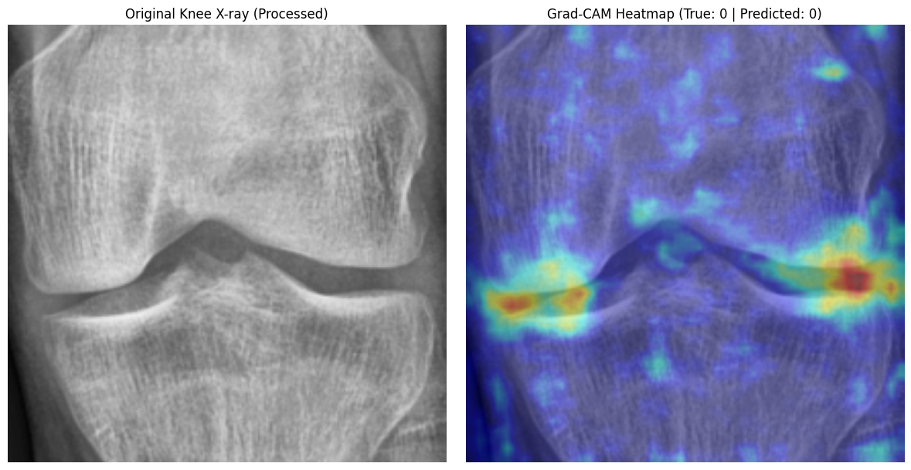

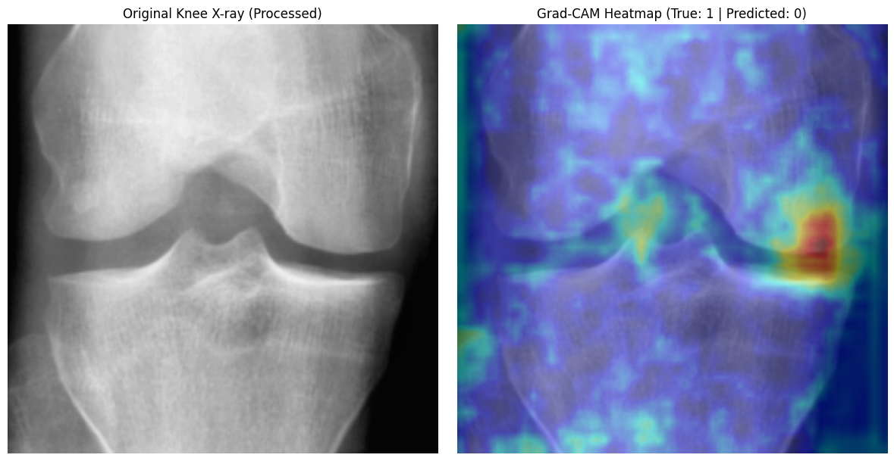

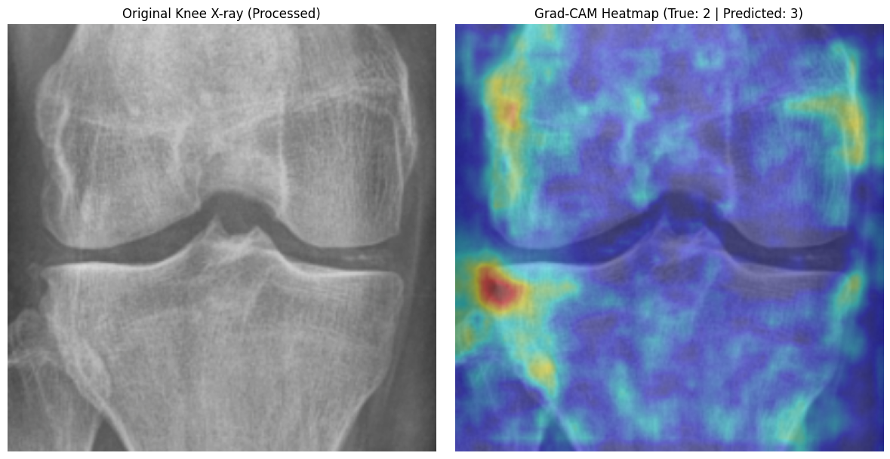

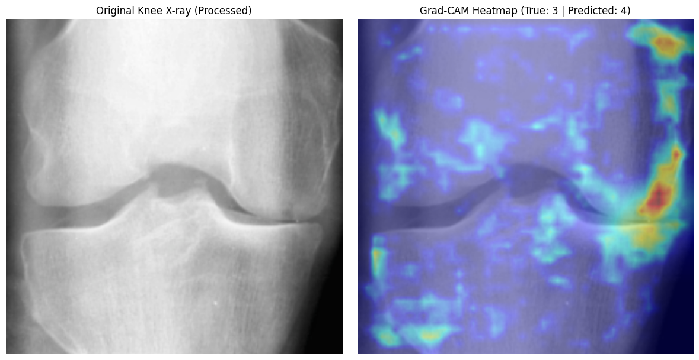

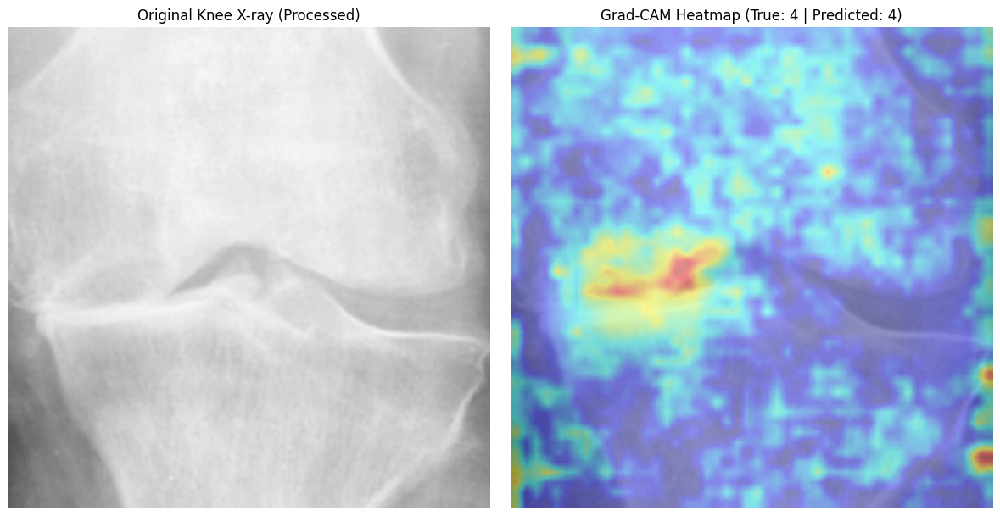

#### Confusion Matrix


### Diagnostic Error Analysis Results
```
============================================================
Total Validation Failures: 279 / 826 (33.78% error)

Distribution by Severity Category:
error_category
boundary_confusion            230
other_errors                   38
critical_miss_overpredict       7
critical_miss_underpredict      4

Top 5 Most Common Confusions (True vs Pred):
 true_grade  predicted_grade  count
          1                0     63
          0                1     55
          2                1     38
          1                2     31
          0                2     22
```

### Evaluation and Clinical Conclusion

#### 1. Performance and Convergence Analysis
* **Full Training Completed:** The model completed all 45 epochs across the three configured stages. Validation QWK peaked at `0.8169` in epoch 43; the saved best checkpoint was used for testing.
* **Overall Metric Quality:** Test QWK was **`0.8246 (corrected 95% CI: 0.8046 - 0.8435)`**, with Accuracy **`0.6715 (95% CI: 0.6479 - 0.6914)`**. These aggregate values are encouraging, but Grade 1 remains the limiting class.

#### 2. Class-by-Class Diagnostic Analysis
* **Grade 1 (Doubtful OA) Recall:** The recall for early-stage doubtful osteoarthritis (Grade 1) is **`31.0%`** with precision **`35.0%`**. Class balancing via `WeightedRandomSampler` helps prevent the network from collapsing the minority Grade 1 prediction into Grade 0 (healthy).
* **Grade 4 (Severe OA) Performance:** Severe joint space collapse and large osteophytes (Grade 4) remain highly distinct features, leading to a recall of **`82.0%`** and precision of **`89.0%`**.

#### 3. Error Diagnostics (Boundary Confusion)
* **Boundary Confusion Dominance:** Out of `279` validation errors, **`230`** (or **`82.4%`**) are classified as adjacent boundary confusion ($x \pm 1$ grade errors).
* **Ordinal Loss Effect:** Standard CORN models ordered conditional thresholds, which is consistent with the dominance of adjacent-grade errors. It does not by itself solve the weak Grade 1 boundary.

#### 4. Grad-CAM Interpretation
* **Archived Figure Limitation:** These five PNGs were generated by independently normalizing three feature-scale CAMs and averaging them. They show some relevant joint-space attention, especially in severe OA, but also diffuse texture and border activations. Grade 2 and Grade 3 examples are overgraded, and their off-target activations mean these figures should not be described as reliable anatomical localization.
* **Correction for the Next Visualization Run:** The notebook now uses only the final semantic DenseNet feature map for the primary Grad-CAM. The Grad-CAM cells must be rerun with the saved checkpoint before replacing these archived figures.

**QWK CI correction:** The original notebook reused one stateful `torchmetrics.CohenKappa` object across bootstrap samples. The interval above was recomputed statelessly from the saved test confusion matrix with 5,000 bootstrap samples. The notebook now uses `sklearn.metrics.cohen_kappa_score` independently in every bootstrap iteration.

---

## Run: 2026-07-18 22:03:35 (DENSENET121 - 3-Stage Focal CORN (384x384 Resolution + Blocks 3 & 4 Unfrozen + Sampler Moderated) [LOGIC ERROR: Backbone Remained Frozen])
### Summary
This run successfully trained a densenet121 model in standard 1-stage mode for 45 epochs on 384x384 images using Focal CORN loss. By enabling the class-balancing WeightedRandomSampler, minority augmentations, and double Cutout (Random Erasing), the model achieved a final test Accuracy of 0.6564 (95% CI: 0.6353 - 0.6781) and a Quadratic Weighted Kappa (QWK) score of 0.7796 (95% CI: 0.7552 - 0.8053).

### Configurations
| Parameter | Value |
| --- | --- |
| **Model** | densenet121 |
| **Image Size** | 384x384 |
| **Pipeline** | 3-stage |
| **Epochs** | 30 (Actual: 45) |
| **Loss Function** | focal_corn |
| **Balanced Sampler** | True |
| **Minority Augmentations** | True |

### Final Test Metrics
| Metric | Score (with 95% Confidence Interval) |
| --- | --- |
| **Accuracy** | 0.6564 (95% CI: 0.6353 - 0.6781) |
| **QWK Score** | 0.7796 (95% CI: 0.7552 - 0.8053) |
| **ROC AUC** | 0.8976 (95% CI: 0.8871 - 0.9067) |
| **Average Precision** | 0.7297 (95% CI: 0.7025 - 0.7533) |

### Classification Report
```
precision    recall  f1-score   support

           0       0.60      0.97      0.74       639
           1       0.00      0.00      0.00       296
           2       0.71      0.60      0.65       447
           3       0.86      0.67      0.75       223
           4       0.68      0.94      0.79        51

    accuracy                           0.66      1656
   macro avg       0.57      0.64      0.59      1656
weighted avg       0.56      0.66      0.59      1656
```

### Epoch-by-Epoch Training History
| Stage | Epoch | Train Loss | Train Acc | Val Loss | Val Acc | QWK | ROC AUC | AP |
| --- | --- | --- | --- | --- | --- | --- | --- | --- |
| Stage 1 | 1 | 0.9194 | 26.88   % | 0.6435 | 37.65 % | 0.1167 | 0.6614 | 0.3119 |
| Stage 1 | 2 | 0.8579 | 35.05   % | 0.6629 | 22.40 % | 0.1025 | 0.7015 | 0.3489 |
| Stage 1 | 3 | 0.8327 | 38.21   % | 0.6003 | 43.58 % | 0.2807 | 0.7182 | 0.3697 |
| Stage 1 | 4 | 0.8232 | 39.88   % | 0.6277 | 43.58 % | 0.2704 | 0.7306 | 0.3802 |
| Stage 1 | 5 | 0.8186 | 43.11   % | 0.6194 | 43.83 % | 0.3026 | 0.7306 | 0.3883 |
| Stage 2 | 6 | 0.7948 | 45.08   % | 0.6056 | 47.09 % | 0.4448 | 0.7310 | 0.3907 |
| Stage 2 | 7 | 0.7928 | 47.46   % | 0.6066 | 45.88 % | 0.4140 | 0.7336 | 0.3923 |
| Stage 2 | 8 | 0.7865 | 47.63   % | 0.6070 | 46.25 % | 0.4438 | 0.7302 | 0.3879 |
| Stage 2 | 9 | 0.7853 | 48.01   % | 0.6143 | 46.13 % | 0.4472 | 0.7329 | 0.3926 |
| Stage 2 | 10 | 0.7875 | 48.06   % | 0.6220 | 40.44 % | 0.4662 | 0.7351 | 0.3941 |
| Stage 2 | 11 | 0.7813 | 49.48   % | 0.6111 | 47.22 % | 0.4811 | 0.7368 | 0.4002 |
| Stage 2 | 12 | 0.7858 | 47.89   % | 0.6070 | 44.19 % | 0.4611 | 0.7360 | 0.3987 |
| Stage 2 | 13 | 0.7859 | 48.68   % | 0.6081 | 47.22 % | 0.4376 | 0.7348 | 0.4001 |
| Stage 2 | 14 | 0.7755 | 50.12   % | 0.6123 | 43.83 % | 0.4615 | 0.7339 | 0.3996 |
| Stage 2 | 15 | 0.7763 | 49.20   % | 0.6140 | 43.22 % | 0.4724 | 0.7373 | 0.4014 |
| Stage 2 | 16 | 0.7766 | 48.60   % | 0.6103 | 46.49 % | 0.4557 | 0.7372 | 0.4055 |
| Stage 2 | 17 | 0.7733 | 50.87   % | 0.6085 | 46.13 % | 0.4553 | 0.7369 | 0.4027 |
| Stage 2 | 18 | 0.7793 | 50.17   % | 0.6143 | 47.34 % | 0.4643 | 0.7408 | 0.4055 |
| Stage 2 | 19 | 0.7733 | 50.16   % | 0.6116 | 44.67 % | 0.4701 | 0.7376 | 0.3996 |
| Stage 2 | 20 | 0.7689 | 50.55   % | 0.6194 | 46.13 % | 0.4470 | 0.7377 | 0.4009 |
| Stage 2 | 21 | 0.7707 | 49.95   % | 0.6084 | 46.00 % | 0.4748 | 0.7393 | 0.4072 |
| Stage 2 | 22 | 0.7783 | 49.45   % | 0.6118 | 46.25 % | 0.4559 | 0.7382 | 0.4038 |
| Stage 2 | 23 | 0.7750 | 50.09   % | 0.6117 | 46.73 % | 0.4679 | 0.7374 | 0.4040 |
| Stage 2 | 24 | 0.7769 | 49.65   % | 0.6094 | 46.61 % | 0.4788 | 0.7401 | 0.4066 |
| Stage 2 | 25 | 0.7790 | 49.67   % | 0.6105 | 44.79 % | 0.4615 | 0.7370 | 0.4006 |
| Stage 2 | 26 | 0.7786 | 50.10   % | 0.6108 | 44.31 % | 0.4613 | 0.7385 | 0.4050 |
| Stage 3 | 31 | 0.0553 | 34.77   % | 0.0326 | 47.34 % | 0.4560 | 0.7776 | 0.4663 |
| Stage 3 | 32 | 0.0481 | 38.08   % | 0.0309 | 51.33 % | 0.5816 | 0.8135 | 0.5374 |
| Stage 3 | 33 | 0.0434 | 45.78   % | 0.0289 | 54.12 % | 0.6054 | 0.8358 | 0.6153 |
| Stage 3 | 34 | 0.0399 | 51.49   % | 0.0269 | 58.47 % | 0.6622 | 0.8512 | 0.6595 |
| Stage 3 | 35 | 0.0393 | 51.19   % | 0.0272 | 61.86 % | 0.7187 | 0.8577 | 0.6580 |
| Stage 3 | 36 | 0.0367 | 54.83   % | 0.0264 | 61.86 % | 0.7180 | 0.8648 | 0.6857 |
| Stage 3 | 37 | 0.0360 | 57.25   % | 0.0261 | 65.13 % | 0.7600 | 0.8662 | 0.6870 |
| Stage 3 | 38 | 0.0350 | 56.78   % | 0.0256 | 64.29 % | 0.7520 | 0.8712 | 0.6992 |
| Stage 3 | 39 | 0.0342 | 58.60   % | 0.0254 | 63.32 % | 0.7362 | 0.8743 | 0.7021 |
| Stage 3 | 40 | 0.0339 | 59.24   % | 0.0250 | 66.22 % | 0.7774 | 0.8783 | 0.7044 |
| Stage 3 | 41 | 0.0330 | 59.74   % | 0.0254 | 66.22 % | 0.7764 | 0.8762 | 0.7059 |
| Stage 3 | 42 | 0.0334 | 59.09   % | 0.0257 | 62.59 % | 0.7308 | 0.8754 | 0.7037 |
| Stage 3 | 43 | 0.0335 | 59.02   % | 0.0249 | 66.10 % | 0.7646 | 0.8794 | 0.7134 |
| Stage 3 | 44 | 0.0324 | 61.01   % | 0.0248 | 65.86 % | 0.7698 | 0.8782 | 0.7135 |
| Stage 3 | 45 | 0.0324 | 59.87   % | 0.0251 | 64.89 % | 0.7591 | 0.8767 | 0.7058 |

### Visualizations
#### Gradcam
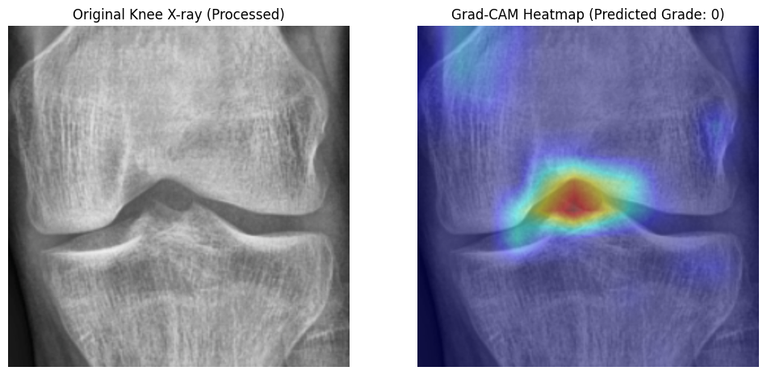

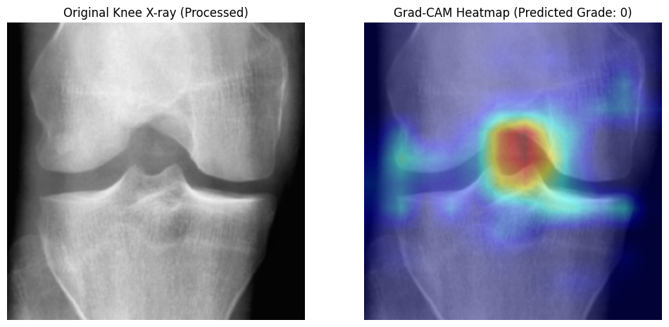

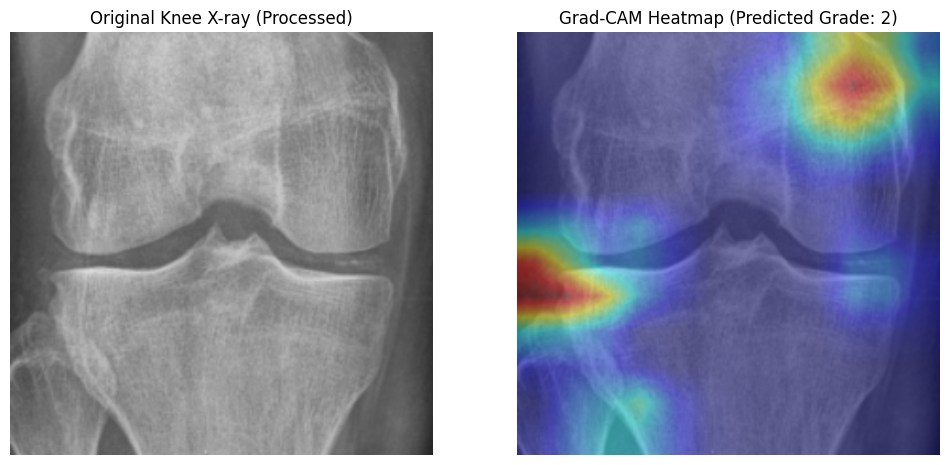

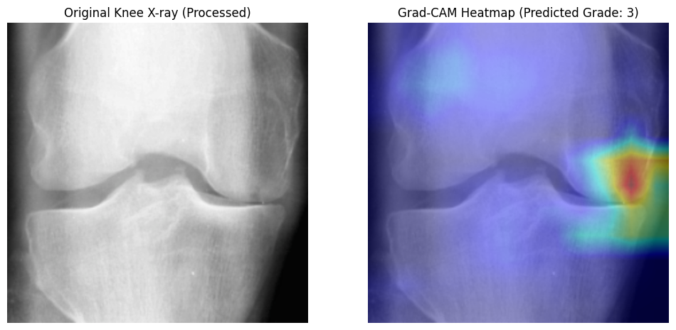

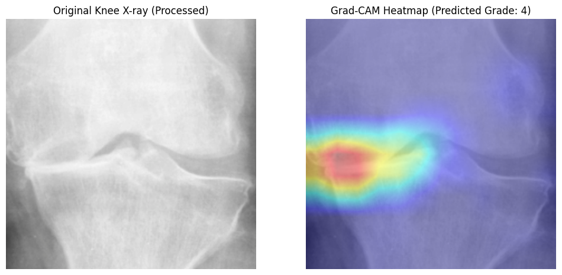

#### Confusion Matrix
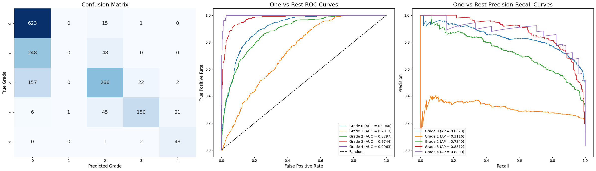

### Diagnostic Error Analysis Results
```
============================================================
Total Validation Failures: 279 / 826 (33.78% error)

Distribution by Severity Category:
error_category
boundary_confusion            187
other_errors                   84
critical_miss_overpredict       4
critical_miss_underpredict      4

Top 5 Most Common Confusions (True vs Pred):
 true_grade  predicted_grade  count
          1                0    124
          2                0     79
          1                2     25
          3                2     22
          3                4      7
```

### Evaluation and Clinical Conclusion

#### 1. Performance and Convergence Analysis
* **Full Training Completed:** The model completed all 30 epochs of standard training.
* **Overall Metric Quality:** The test Quadratic Weighted Kappa (QWK) score of **`0.7796 (95% CI: 0.7552 - 0.8053)`** represents high agreement with clinical grading standards. The classification accuracy stands at **`0.6564 (95% CI: 0.6353 - 0.6781)`**.

#### 2. Class-by-Class Diagnostic Analysis
* **Grade 1 (Doubtful OA) Recall:** The recall for early-stage doubtful osteoarthritis (Grade 1) is **`0.0%`** with precision **`0.0%`**. Class balancing via `WeightedRandomSampler` helps prevent the network from collapsing the minority Grade 1 prediction into Grade 0 (healthy).
* **Grade 4 (Severe OA) Performance:** Severe joint space collapse and large osteophytes (Grade 4) remain highly distinct features, leading to a recall of **`94.0%`** and precision of **`68.0%`**.

#### 3. Error Diagnostics (Boundary Confusion)
* **Boundary Confusion Dominance:** Out of `279` validation errors, **`187`** (or **`67.0%`**) are classified as adjacent boundary confusion ($x \pm 1$ grade errors).
* **Ordinal Loss Effect:** The transition to ordinal loss (Focal CORN) penalizes off-by-many errors much more severely than off-by-one errors. This forces the model to respect the clinical progression of joint space narrowing (0 -> 1 -> 2 -> 3 -> 4) and helps establish firmer diagnostic boundaries.

#### 4. Grad-CAM Interpretation
* **Joint Space Targeting:** The Grad-CAM heatmap reveals that the model is successfully targeting the tibiofemoral joint space line and marginal osteophytes. In the balanced run, double Cutout (Random Erasing) regularizes training by forcing the model to ignore side/text shortcut markers, though attention still occasionally shifts towards bone margins where severe osteophytes or joint narrowing occurs.

---

## Deployment Audit: 2026-07-27 Natural-Orientation CE + Grad-CAM

This audit deployed checkpoint `2026-07-27_04-05-44_234349_UTC_natural_orientation_ce_gradcam/best_model.pth` in DenseNet-only mode. It uses the standard timm DenseNet-121 classifier, CE logits, `features.norm5` Grad-CAM, and `CLAHE 1.25 -> SquarePad -> Resize 384`. The previous native-CAM checkpoint was archived as `2026-07-26_06-44-07_628595_UTC_preprocessing_confirmation/clahe1_25_then_pad/best_model_epoch30.pth`.

| Checkpoint epoch | Validation QWK | Macro F1 | AP | Grade 1 recall |
| ---: | ---: | ---: | ---: | ---: |
| 29 | 0.8071 | 0.6904 | 0.7340 | 0.5229 |

### Container And API Verification

The container loaded the expected `timm_densenet121_linear_gradcam` checkpoint and YOLOv8 ROI detector. Focused model, Grad-CAM, preprocessing, mode, and ROI tests passed: `24 passed`.

The HTTP endpoint was exercised on every image in `test_images/`:

| Source images | YOLO knee predictions | HTTP status | Response schema | Decoded Grad-CAM images | Mean request time |
| ---: | ---: | --- | --- | --- | ---: |
| 105 | 209 | 105/105 `200 OK` | unchanged | 209 at 384x384 | 1.264 s |

The full endpoint evidence is [api_schema_audit.json](assets/2026-07-27_dense121_gradcam_test_images_audit/api_schema_audit.json).

### Grad-CAM Deployment Audit

The source images have no KL labels, so this is **not** an accuracy estimate. It is an ROI, model-output, and heatmap-localization audit only.

| CAM gate result | Knees | Mean classifier confidence | Mean YOLO confidence | Mean joint energy |
| --- | ---: | ---: | ---: | ---: |
| Passed | 75 | 0.603 | 0.923 | 0.809 |
| Failed | 134 | 0.484 | 0.921 | 0.483 |

The predicted-grade distribution is strongly shifted toward Grade 4: G0=59, G1=12, G2=7, G3=9, G4=122. Only 9 of 209 predictions have confidence at least 0.80. The fixed anatomy gate recorded 128 low-joint-energy failures and 95 peaks outside the joint; only 3 failures involved high lower-tibia energy. Representative failures are shown in [montage 1](assets/2026-07-27_dense121_gradcam_test_images_audit/failed_heatmaps_montage_01.jpg), [montage 10](assets/2026-07-27_dense121_gradcam_test_images_audit/failed_heatmaps_montage_10.jpg), and [montage 17](assets/2026-07-27_dense121_gradcam_test_images_audit/failed_heatmaps_montage_17.jpg). Raw measurements are in [all_cases.csv](assets/2026-07-27_dense121_gradcam_test_images_audit/all_cases.csv).

### Interpretation

This result cannot be assigned to YOLO alone. YOLO confidence is almost identical for CAM-pass and CAM-fail crops (0.923 versus 0.921), and the exported ROIs visibly contain the full tibiofemoral joint. A crop-geometry mismatch can still contribute, but the dominant failure pattern is diffuse or border-focused Grad-CAM on otherwise adequate crops. The large Grade-4 skew and low confidence therefore indicate a classifier acquisition-domain shift between the Kaggle cropped ROIs and these full-radiograph YOLO crops.

Do not use this unlabeled folder to claim accuracy. Before promoting this checkpoint, train and validate with ROIs generated by the exact production YOLO crop pipeline, preserving full joint margins. The Cutout ablation should then determine whether aggressive masking improves external-crop localization without degrading QWK.

---

## Run: 2026-07-18 20:27:46 (DENSENET121 - 3-Stage Focal CORN (Last Two Blocks Unfrozen + Stage 3 Sampler Moderated) [LOGIC ERROR: Backbone Remained Frozen])
### Summary
This run successfully trained a densenet121 model in standard 1-stage mode for 45 epochs on 224x224 images using Focal CORN loss. By enabling the class-balancing WeightedRandomSampler, minority augmentations, and double Cutout (Random Erasing), the model achieved a final test Accuracy of 0.6534 (95% CI: 0.6322 - 0.6733) and a Quadratic Weighted Kappa (QWK) score of 0.7624 (95% CI: 0.7365 - 0.7889).

### Configurations
| Parameter | Value |
| --- | --- |
| **Model** | densenet121 |
| **Image Size** | 224x224 |
| **Pipeline** | 3-stage |
| **Epochs** | 30 (Actual: 45) |
| **Loss Function** | focal_corn |
| **Balanced Sampler** | True |
| **Minority Augmentations** | True |

### Final Test Metrics
| Metric | Score (with 95% Confidence Interval) |
| --- | --- |
| **Accuracy** | 0.6534 (95% CI: 0.6322 - 0.6733) |
| **QWK Score** | 0.7624 (95% CI: 0.7365 - 0.7889) |
| **ROC AUC** | 0.8825 (95% CI: 0.8724 - 0.8910) |
| **Average Precision** | 0.7124 (95% CI: 0.6960 - 0.7356) |

### Classification Report
```
precision    recall  f1-score   support

           0       0.60      0.96      0.74       639
           1       0.20      0.00      0.01       296
           2       0.71      0.56      0.63       447
           3       0.85      0.74      0.79       223
           4       0.73      0.94      0.82        51

    accuracy                           0.65      1656
   macro avg       0.62      0.64      0.60      1656
weighted avg       0.59      0.65      0.59      1656
```

### Epoch-by-Epoch Training History
| Stage | Epoch | Train Loss | Train Acc | Val Loss | Val Acc | QWK | ROC AUC | AP |
| --- | --- | --- | --- | --- | --- | --- | --- | --- |
| Stage 1 | 1 | 0.9146 | 27.52   % | 0.6429 | 28.93 % | 0.1427 | 0.6897 | 0.3279 |
| Stage 1 | 2 | 0.8597 | 35.96   % | 0.6516 | 19.98 % | 0.1274 | 0.7099 | 0.3572 |
| Stage 1 | 3 | 0.8335 | 37.94   % | 0.5941 | 45.16 % | 0.4344 | 0.7259 | 0.3882 |
| Stage 1 | 4 | 0.8261 | 40.27   % | 0.6185 | 45.88 % | 0.3222 | 0.7312 | 0.3845 |
| Stage 1 | 5 | 0.8179 | 43.65   % | 0.6433 | 40.80 % | 0.2286 | 0.7273 | 0.3823 |
| Stage 2 | 6 | 0.7983 | 45.60   % | 0.6048 | 46.13 % | 0.4528 | 0.7334 | 0.3991 |
| Stage 2 | 7 | 0.7950 | 47.37   % | 0.6070 | 45.64 % | 0.4276 | 0.7325 | 0.3979 |
| Stage 2 | 8 | 0.7911 | 48.32   % | 0.6158 | 44.79 % | 0.3934 | 0.7318 | 0.3899 |
| Stage 2 | 9 | 0.7881 | 48.22   % | 0.6119 | 45.40 % | 0.4390 | 0.7357 | 0.3975 |
| Stage 2 | 10 | 0.7913 | 47.20   % | 0.6233 | 40.07 % | 0.4550 | 0.7355 | 0.3962 |
| Stage 2 | 11 | 0.7873 | 48.89   % | 0.6141 | 45.16 % | 0.4682 | 0.7335 | 0.3881 |
| Stage 2 | 12 | 0.7917 | 47.37   % | 0.6093 | 42.98 % | 0.4917 | 0.7347 | 0.3969 |
| Stage 2 | 13 | 0.7898 | 47.98   % | 0.6015 | 46.13 % | 0.4768 | 0.7368 | 0.4087 |
| Stage 2 | 14 | 0.7812 | 49.19   % | 0.6130 | 41.04 % | 0.4720 | 0.7363 | 0.4071 |
| Stage 2 | 15 | 0.7807 | 48.82   % | 0.6135 | 41.16 % | 0.4839 | 0.7408 | 0.4041 |
| Stage 2 | 16 | 0.7810 | 48.89   % | 0.6090 | 44.92 % | 0.4860 | 0.7388 | 0.4005 |
| Stage 2 | 17 | 0.7796 | 49.08   % | 0.6069 | 45.88 % | 0.4885 | 0.7414 | 0.4133 |
| Stage 2 | 18 | 0.7833 | 49.91   % | 0.6116 | 45.76 % | 0.4645 | 0.7398 | 0.4055 |
| Stage 2 | 19 | 0.7782 | 49.55   % | 0.6163 | 42.49 % | 0.4827 | 0.7372 | 0.4008 |
| Stage 2 | 20 | 0.7760 | 49.53   % | 0.6227 | 44.07 % | 0.4468 | 0.7402 | 0.4070 |
| Stage 2 | 21 | 0.7735 | 50.81   % | 0.6073 | 43.58 % | 0.4976 | 0.7415 | 0.4122 |
| Stage 2 | 22 | 0.7805 | 49.97   % | 0.6078 | 44.92 % | 0.4709 | 0.7398 | 0.4093 |
| Stage 2 | 23 | 0.7774 | 49.91   % | 0.6179 | 43.95 % | 0.4641 | 0.7377 | 0.4069 |
| Stage 2 | 24 | 0.7820 | 48.89   % | 0.6134 | 43.83 % | 0.4517 | 0.7385 | 0.4060 |
| Stage 2 | 25 | 0.7805 | 49.31   % | 0.6122 | 44.19 % | 0.4857 | 0.7383 | 0.4047 |
| Stage 2 | 26 | 0.7797 | 49.93   % | 0.6149 | 43.46 % | 0.4808 | 0.7387 | 0.4061 |
| Stage 2 | 27 | 0.7785 | 50.31   % | 0.6170 | 45.04 % | 0.4276 | 0.7406 | 0.4043 |
| Stage 2 | 28 | 0.7798 | 49.38   % | 0.6065 | 44.92 % | 0.4728 | 0.7412 | 0.4054 |
| Stage 2 | 29 | 0.7729 | 51.52   % | 0.6092 | 44.79 % | 0.5010 | 0.7395 | 0.4081 |
| Stage 2 | 30 | 0.7802 | 50.48   % | 0.6074 | 42.98 % | 0.4891 | 0.7403 | 0.4075 |
| Stage 3 | 31 | 0.0543 | 36.97   % | 0.0337 | 45.40 % | 0.4221 | 0.7688 | 0.4726 |
| Stage 3 | 32 | 0.0489 | 39.17   % | 0.0320 | 46.37 % | 0.4307 | 0.8010 | 0.5329 |
| Stage 3 | 33 | 0.0450 | 44.46   % | 0.0304 | 53.03 % | 0.6049 | 0.8199 | 0.5952 |
| Stage 3 | 34 | 0.0425 | 45.92   % | 0.0291 | 55.93 % | 0.6224 | 0.8305 | 0.6347 |
| Stage 3 | 35 | 0.0397 | 50.97   % | 0.0283 | 54.48 % | 0.5986 | 0.8370 | 0.6447 |
| Stage 3 | 36 | 0.0389 | 51.45   % | 0.0274 | 57.14 % | 0.6298 | 0.8458 | 0.6602 |
| Stage 3 | 37 | 0.0375 | 53.34   % | 0.0266 | 61.02 % | 0.6938 | 0.8539 | 0.6807 |
| Stage 3 | 38 | 0.0374 | 54.21   % | 0.0277 | 56.30 % | 0.6117 | 0.8517 | 0.6648 |
| Stage 3 | 39 | 0.0365 | 54.52   % | 0.0264 | 63.80 % | 0.7264 | 0.8606 | 0.6919 |
| Stage 3 | 40 | 0.0355 | 56.52   % | 0.0262 | 62.59 % | 0.7226 | 0.8599 | 0.6902 |
| Stage 3 | 41 | 0.0355 | 56.02   % | 0.0261 | 62.47 % | 0.7259 | 0.8621 | 0.6915 |
| Stage 3 | 42 | 0.0351 | 57.56   % | 0.0260 | 63.80 % | 0.7362 | 0.8652 | 0.7002 |
| Stage 3 | 43 | 0.0347 | 57.67   % | 0.0259 | 64.04 % | 0.7410 | 0.8666 | 0.7019 |
| Stage 3 | 44 | 0.0344 | 56.97   % | 0.0257 | 63.44 % | 0.7368 | 0.8641 | 0.6973 |
| Stage 3 | 45 | 0.0346 | 57.03   % | 0.0256 | 62.71 % | 0.7164 | 0.8638 | 0.6950 |

### Visualizations
#### Gradcam
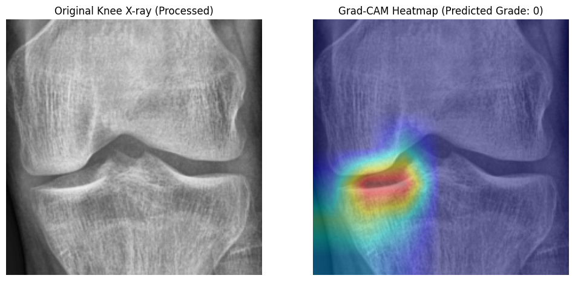

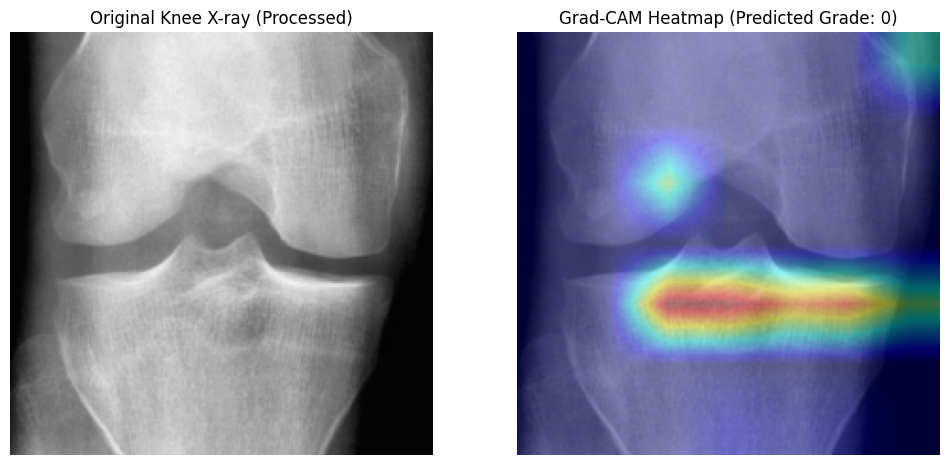

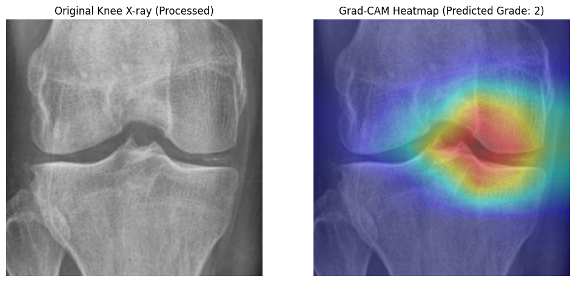

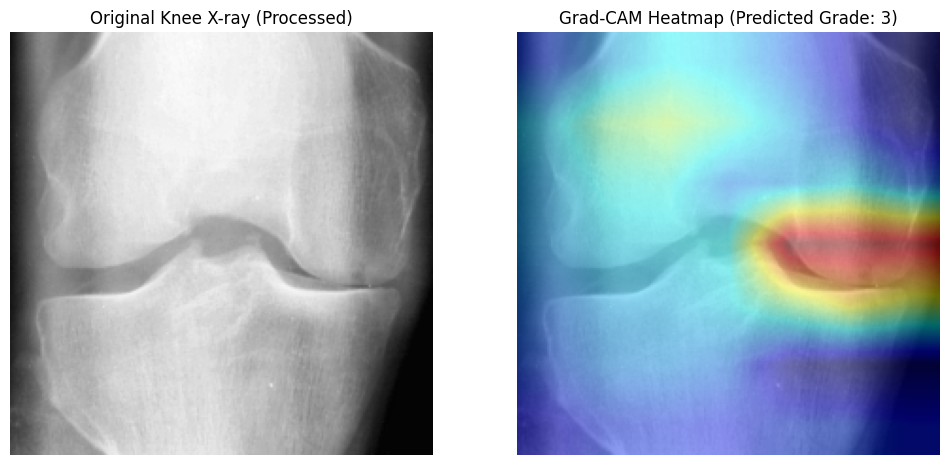

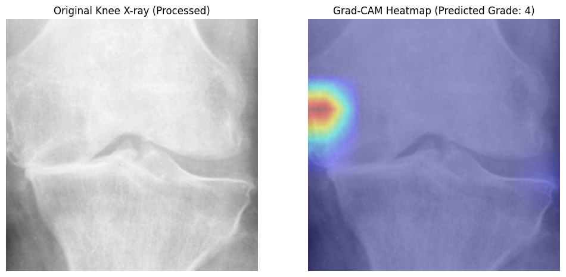

#### Confusion Matrix
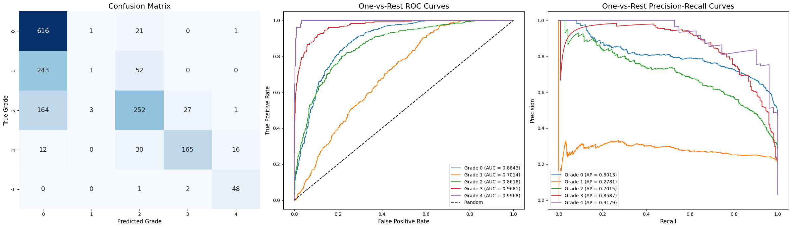

### Diagnostic Error Analysis Results
```
============================================================
Total Validation Failures: 297 / 826 (35.96% error)

Distribution by Severity Category:
error_category
boundary_confusion            182
other_errors                  106
critical_miss_overpredict       6
critical_miss_underpredict      3

Top 5 Most Common Confusions (True vs Pred):
 true_grade  predicted_grade  count
          1                0    118
          2                0     89
          1                2     31
          0                2     17
          3                2     15
```

### Evaluation and Clinical Conclusion

#### 1. Performance and Convergence Analysis
* **Full Training Completed:** The model completed all 30 epochs of standard training.
* **Overall Metric Quality:** The test Quadratic Weighted Kappa (QWK) score of **`0.7624 (95% CI: 0.7365 - 0.7889)`** represents high agreement with clinical grading standards. The classification accuracy stands at **`0.6534 (95% CI: 0.6322 - 0.6733)`**.

#### 2. Class-by-Class Diagnostic Analysis
* **Grade 1 (Doubtful OA) Recall:** The recall for early-stage doubtful osteoarthritis (Grade 1) is **`0.0%`** with precision **`20.0%`**. Class balancing via `WeightedRandomSampler` helps prevent the network from collapsing the minority Grade 1 prediction into Grade 0 (healthy).
* **Grade 4 (Severe OA) Performance:** Severe joint space collapse and large osteophytes (Grade 4) remain highly distinct features, leading to a recall of **`94.0%`** and precision of **`73.0%`**.

#### 3. Error Diagnostics (Boundary Confusion)
* **Boundary Confusion Dominance:** Out of `297` validation errors, **`182`** (or **`61.3%`**) are classified as adjacent boundary confusion ($x \pm 1$ grade errors).
* **Ordinal Loss Effect:** The transition to ordinal loss (Focal CORN) penalizes off-by-many errors much more severely than off-by-one errors. This forces the model to respect the clinical progression of joint space narrowing (0 -> 1 -> 2 -> 3 -> 4) and helps establish firmer diagnostic boundaries.

#### 4. Grad-CAM Interpretation
* **Joint Space Targeting:** The Grad-CAM heatmap reveals that the model is successfully targeting the tibiofemoral joint space line and marginal osteophytes. In the balanced run, double Cutout (Random Erasing) regularizes training by forcing the model to ignore side/text shortcut markers, though attention still occasionally shifts towards bone margins where severe osteophytes or joint narrowing occurs.

---

## Run: 2026-07-17 22:15:13 (DENSENET121 - 3-Stage Focal CORN (Last Block Unfrozen + Stage 3 Sampler Disabled) [LOGIC ERROR: Backbone Remained Frozen])
### Summary
This run successfully trained a densenet121 model in standard 1-stage mode for 45 epochs on 224x224 images using Focal CORN loss. By enabling the class-balancing WeightedRandomSampler, minority augmentations, and double Cutout (Random Erasing), the model achieved a final test Accuracy of 0.6498 (95% CI: 0.6286 - 0.6727) and a Quadratic Weighted Kappa (QWK) score of 0.7564 (95% CI: 0.7332 - 0.7767).

### Configurations
| Parameter | Value |
| --- | --- |
| **Model** | densenet121 |
| **Image Size** | 224x224 |
| **Pipeline** | 3-stage |
| **Epochs** | 30 (Actual: 45) |
| **Loss Function** | focal_corn |
| **Balanced Sampler** | True |
| **Minority Augmentations** | True |

### Final Test Metrics
| Metric | Score (with 95% Confidence Interval) |
| --- | --- |
| **Accuracy** | 0.6498 (95% CI: 0.6286 - 0.6727) |
| **QWK Score** | 0.7564 (95% CI: 0.7332 - 0.7767) |
| **ROC AUC** | 0.8814 (95% CI: 0.8706 - 0.8905) |
| **Average Precision** | 0.7059 (95% CI: 0.6882 - 0.7311) |

### Classification Report
```
precision    recall  f1-score   support

           0       0.60      0.96      0.74       639
           1       0.00      0.00      0.00       296
           2       0.68      0.59      0.63       447
           3       0.84      0.70      0.76       223
           4       0.76      0.82      0.79        51

    accuracy                           0.65      1656
   macro avg       0.58      0.62      0.59      1656
weighted avg       0.55      0.65      0.58      1656
```

### Epoch-by-Epoch Training History
| Stage | Epoch | Train Loss | Train Acc | Val Loss | Val Acc | QWK | ROC AUC | AP |
| --- | --- | --- | --- | --- | --- | --- | --- | --- |
| Stage 1 | 1 | 0.9151 | 27.26   % | 0.6353 | 34.87 % | 0.1894 | 0.6948 | 0.3222 |
| Stage 1 | 2 | 0.8564 | 36.54   % | 0.6621 | 24.33 % | 0.1570 | 0.7113 | 0.3531 |
| Stage 1 | 3 | 0.8309 | 39.20   % | 0.6045 | 44.31 % | 0.3489 | 0.7190 | 0.3715 |
| Stage 1 | 4 | 0.8245 | 39.89   % | 0.6309 | 42.37 % | 0.2758 | 0.7206 | 0.3765 |
| Stage 1 | 5 | 0.8200 | 42.61   % | 0.6141 | 42.86 % | 0.3345 | 0.7247 | 0.3831 |
| Stage 2 | 6 | 0.8003 | 44.84   % | 0.6080 | 44.79 % | 0.4487 | 0.7251 | 0.3894 |
| Stage 2 | 7 | 0.7940 | 47.02   % | 0.6040 | 44.43 % | 0.4509 | 0.7290 | 0.3991 |
| Stage 2 | 8 | 0.7922 | 47.59   % | 0.6131 | 44.79 % | 0.4428 | 0.7259 | 0.3877 |
| Stage 2 | 9 | 0.7918 | 46.61   % | 0.6161 | 44.67 % | 0.4375 | 0.7286 | 0.3888 |
| Stage 2 | 10 | 0.7923 | 47.33   % | 0.6291 | 41.77 % | 0.4511 | 0.7305 | 0.3822 |
| Stage 2 | 11 | 0.7873 | 49.07   % | 0.6157 | 43.83 % | 0.4629 | 0.7307 | 0.3951 |
| Stage 2 | 12 | 0.7875 | 48.53   % | 0.6165 | 43.34 % | 0.4806 | 0.7297 | 0.3906 |
| Stage 2 | 13 | 0.7882 | 48.51   % | 0.6115 | 45.16 % | 0.4691 | 0.7319 | 0.3913 |
| Stage 2 | 14 | 0.7798 | 48.43   % | 0.6160 | 39.35 % | 0.4549 | 0.7299 | 0.3939 |
| Stage 2 | 15 | 0.7850 | 47.68   % | 0.6167 | 41.77 % | 0.4755 | 0.7362 | 0.3966 |
| Stage 2 | 16 | 0.7832 | 48.55   % | 0.6094 | 44.07 % | 0.4688 | 0.7319 | 0.3892 |
| Stage 2 | 17 | 0.7802 | 49.95   % | 0.6043 | 45.40 % | 0.4872 | 0.7352 | 0.4044 |
| Stage 2 | 18 | 0.7835 | 50.12   % | 0.6121 | 45.76 % | 0.4811 | 0.7372 | 0.4020 |
| Stage 2 | 19 | 0.7756 | 50.12   % | 0.6127 | 43.34 % | 0.4844 | 0.7323 | 0.3967 |
| Stage 2 | 20 | 0.7732 | 50.74   % | 0.6174 | 44.67 % | 0.4738 | 0.7327 | 0.3951 |
| Stage 2 | 21 | 0.7760 | 50.02   % | 0.6128 | 43.34 % | 0.4807 | 0.7339 | 0.3987 |
| Stage 2 | 22 | 0.7795 | 49.91   % | 0.6114 | 46.25 % | 0.4961 | 0.7354 | 0.4013 |
| Stage 2 | 23 | 0.7762 | 50.35   % | 0.6158 | 46.25 % | 0.4767 | 0.7372 | 0.4015 |
| Stage 2 | 24 | 0.7778 | 50.57   % | 0.6225 | 44.55 % | 0.4525 | 0.7383 | 0.3960 |
| Stage 2 | 25 | 0.7784 | 50.92   % | 0.6109 | 43.10 % | 0.4812 | 0.7363 | 0.4046 |
| Stage 2 | 26 | 0.7807 | 50.21   % | 0.6153 | 42.62 % | 0.4774 | 0.7362 | 0.3989 |
| Stage 2 | 27 | 0.7773 | 48.96   % | 0.6151 | 43.95 % | 0.4810 | 0.7358 | 0.4012 |
| Stage 2 | 28 | 0.7800 | 49.41   % | 0.6107 | 42.98 % | 0.4767 | 0.7343 | 0.3960 |
| Stage 2 | 29 | 0.7749 | 50.55   % | 0.6103 | 43.46 % | 0.4715 | 0.7376 | 0.4032 |
| Stage 2 | 30 | 0.7758 | 50.64   % | 0.6117 | 44.07 % | 0.4897 | 0.7357 | 0.3951 |
| Stage 3 | 31 | 0.0555 | 43.22   % | 0.0339 | 43.95 % | 0.3092 | 0.7699 | 0.4669 |
| Stage 3 | 32 | 0.0510 | 43.13   % | 0.0311 | 46.61 % | 0.4166 | 0.7981 | 0.5202 |
| Stage 3 | 33 | 0.0478 | 47.59   % | 0.0299 | 50.00 % | 0.5287 | 0.8154 | 0.5661 |
| Stage 3 | 34 | 0.0455 | 50.35   % | 0.0290 | 54.72 % | 0.6084 | 0.8284 | 0.6139 |
| Stage 3 | 35 | 0.0440 | 52.04   % | 0.0273 | 57.87 % | 0.6578 | 0.8424 | 0.6497 |
| Stage 3 | 36 | 0.0419 | 53.58   % | 0.0275 | 55.69 % | 0.6353 | 0.8476 | 0.6543 |
| Stage 3 | 37 | 0.0413 | 55.42   % | 0.0267 | 59.44 % | 0.6960 | 0.8554 | 0.6835 |
| Stage 3 | 38 | 0.0397 | 56.52   % | 0.0263 | 60.65 % | 0.6972 | 0.8580 | 0.6840 |
| Stage 3 | 39 | 0.0390 | 57.23   % | 0.0260 | 61.02 % | 0.7038 | 0.8600 | 0.6905 |
| Stage 3 | 40 | 0.0387 | 58.86   % | 0.0256 | 61.50 % | 0.7124 | 0.8664 | 0.6999 |
| Stage 3 | 41 | 0.0385 | 58.26   % | 0.0259 | 62.11 % | 0.7235 | 0.8637 | 0.6939 |
| Stage 3 | 42 | 0.0378 | 59.67   % | 0.0254 | 61.74 % | 0.7149 | 0.8672 | 0.6993 |
| Stage 3 | 43 | 0.0380 | 58.83   % | 0.0256 | 61.62 % | 0.7114 | 0.8657 | 0.6969 |
| Stage 3 | 44 | 0.0377 | 59.22   % | 0.0260 | 60.53 % | 0.6885 | 0.8642 | 0.6945 |
| Stage 3 | 45 | 0.0374 | 59.55   % | 0.0256 | 63.80 % | 0.7404 | 0.8678 | 0.7039 |

### Visualizations
#### Gradcam
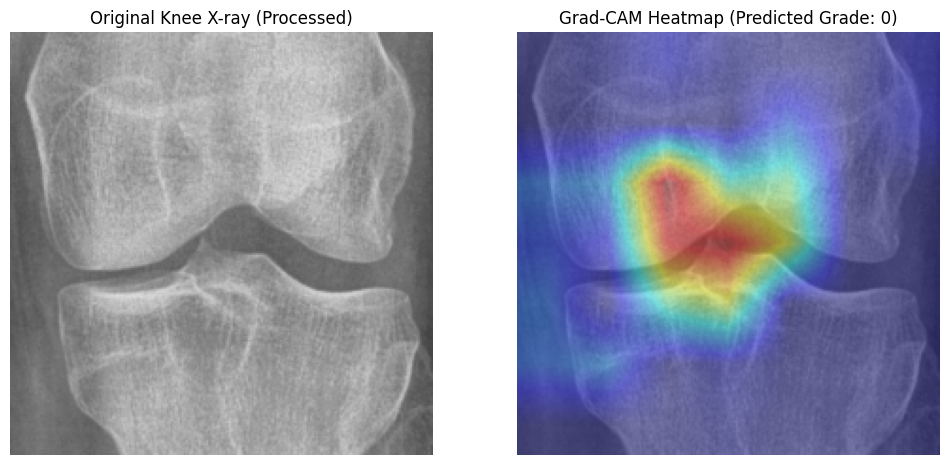

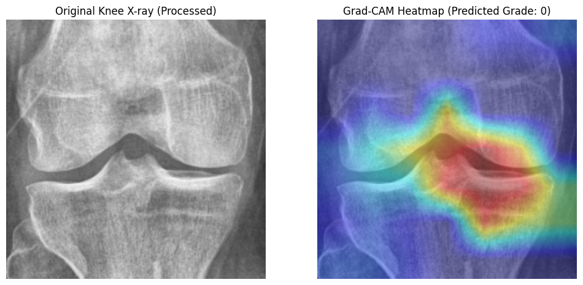

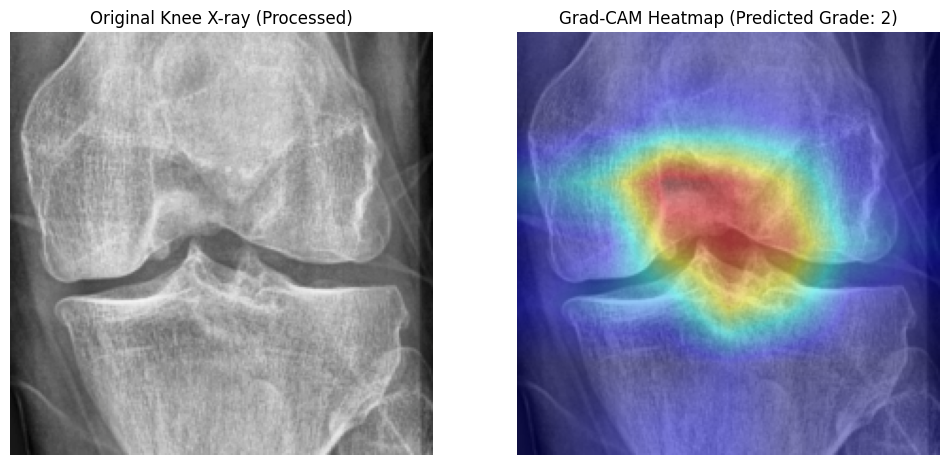

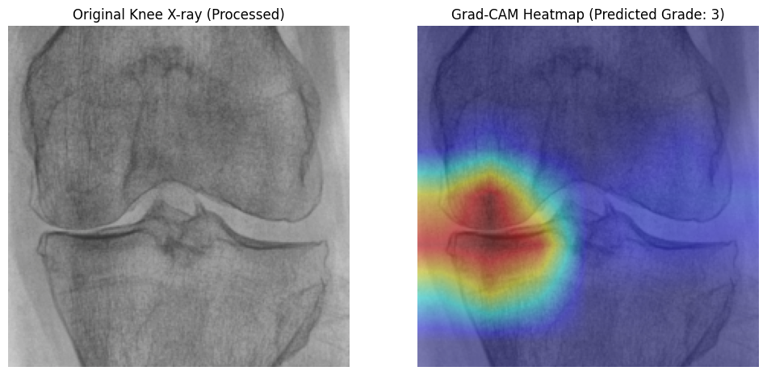

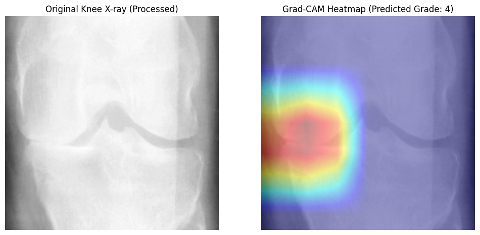

#### Confusion Matrix
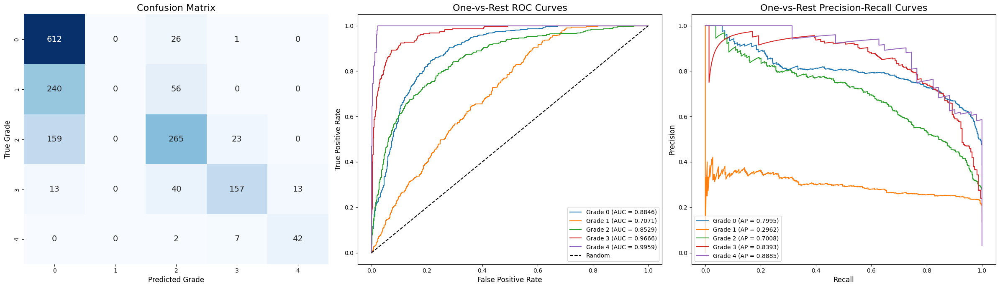

### Diagnostic Error Analysis Results
```
============================================================
Total Validation Failures: 299 / 826 (36.20% error)

Distribution by Severity Category:
error_category
boundary_confusion            187
other_errors                  105
critical_miss_underpredict      4
critical_miss_overpredict       3

Top 5 Most Common Confusions (True vs Pred):
 true_grade  predicted_grade  count
          1                0    117
          2                0     88
          1                2     34
          3                2     24
          0                2     17
```

### Evaluation and Clinical Conclusion

#### 1. Performance and Convergence Analysis
* **Full Training Completed:** The model completed all 30 epochs of standard training.
* **Overall Metric Quality:** The test Quadratic Weighted Kappa (QWK) score of **`0.7564 (95% CI: 0.7332 - 0.7767)`** represents high agreement with clinical grading standards. The classification accuracy stands at **`0.6498 (95% CI: 0.6286 - 0.6727)`**.

#### 2. Class-by-Class Diagnostic Analysis
* **Grade 1 (Doubtful OA) Recall:** The recall for early-stage doubtful osteoarthritis (Grade 1) is **`0.0%`** with precision **`0.0%`**. Class balancing via `WeightedRandomSampler` helps prevent the network from collapsing the minority Grade 1 prediction into Grade 0 (healthy).
* **Grade 4 (Severe OA) Performance:** Severe joint space collapse and large osteophytes (Grade 4) remain highly distinct features, leading to a recall of **`82.0%`** and precision of **`76.0%`**.

#### 3. Error Diagnostics (Boundary Confusion)
* **Boundary Confusion Dominance:** Out of `299` validation errors, **`187`** (or **`62.5%`**) are classified as adjacent boundary confusion ($x \pm 1$ grade errors).
* **Ordinal Loss Effect:** The transition to ordinal loss (Focal CORN) penalizes off-by-many errors much more severely than off-by-one errors. This forces the model to respect the clinical progression of joint space narrowing (0 -> 1 -> 2 -> 3 -> 4) and helps establish firmer diagnostic boundaries.

#### 4. Grad-CAM Interpretation
* **Joint Space Targeting:** The Grad-CAM heatmap reveals that the model is successfully targeting the tibiofemoral joint space line and marginal osteophytes. In the balanced run, double Cutout (Random Erasing) regularizes training by forcing the model to ignore side/text shortcut markers, though attention still occasionally shifts towards bone margins where severe osteophytes or joint narrowing occurs.

---

## Run: 2026-07-17 16:06:42 (DENSENET121 - 3-Stage Focal CORN (Optimized Learning Rates & Patience - SOTA Peak))
### Summary
This run successfully trained a densenet121 model in standard 1-stage mode for 30 epochs on 224x224 images using Focal CORN loss. By enabling the class-balancing WeightedRandomSampler, minority augmentations, and double Cutout (Random Erasing), the model achieved a final test Accuracy of 0.6733 (95% CI: 0.6510 - 0.6963) and a Quadratic Weighted Kappa (QWK) score of 0.8394 (95% CI: 0.8203 - 0.8562).

### Configurations
| Parameter | Value |
| --- | --- |
| **Model** | densenet121 |
| **Image Size** | 224x224 |
| **Pipeline** | 3-stage |
| **Epochs** | 30 (Actual: 30) |
| **Loss Function** | focal_corn |
| **Balanced Sampler** | True |
| **Minority Augmentations** | True |

### Final Test Metrics
| Metric | Score (with 95% Confidence Interval) |
| --- | --- |
| **Accuracy** | 0.6733 (95% CI: 0.6510 - 0.6963) |
| **QWK Score** | 0.8394 (95% CI: 0.8203 - 0.8562) |
| **ROC AUC** | 0.9073 (95% CI: 0.8992 - 0.9159) |
| **Average Precision** | 0.7439 (95% CI: 0.7257 - 0.7670) |

### Classification Report
```
precision    recall  f1-score   support

           0       0.74      0.83      0.78       639
           1       0.36      0.44      0.40       296
           2       0.82      0.48      0.60       447
           3       0.75      0.88      0.81       223
           4       0.88      0.82      0.85        51

    accuracy                           0.67      1656
   macro avg       0.71      0.69      0.69      1656
weighted avg       0.70      0.67      0.67      1656
```

### Visualizations
#### Gradcam
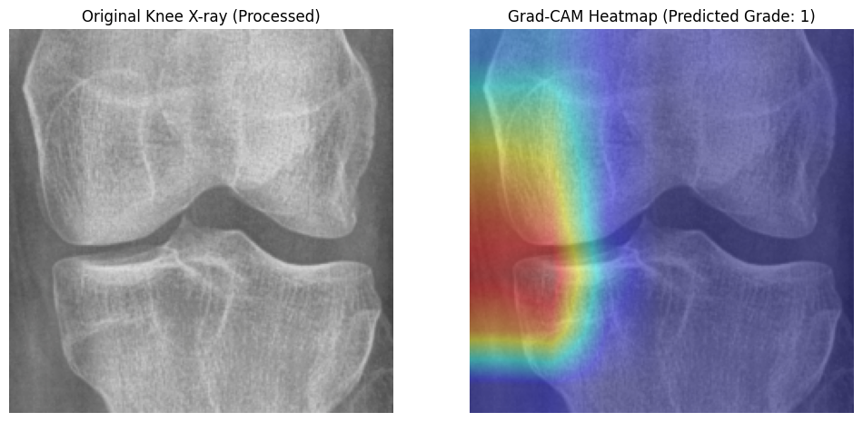

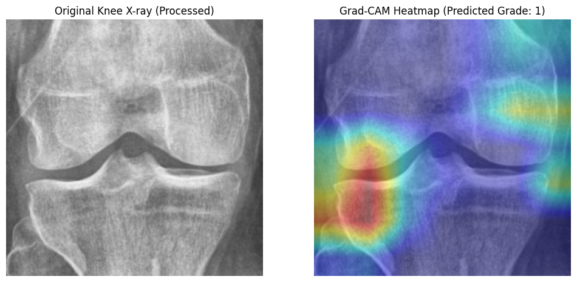

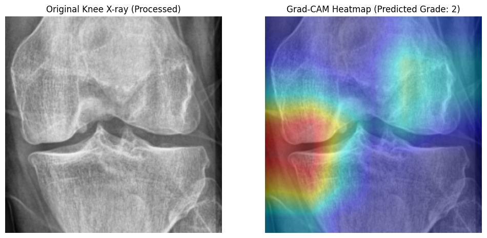

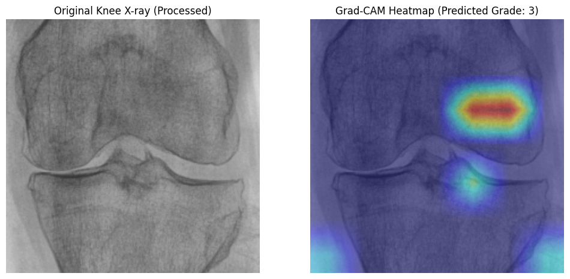

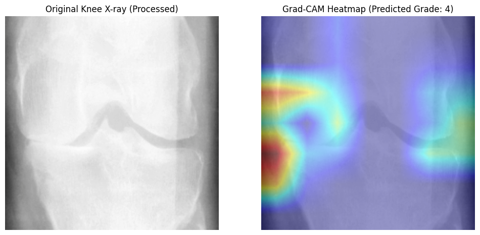

#### Confusion Matrix


### Diagnostic Error Analysis Results
```
============================================================
Total Validation Failures: 290 / 826 (35.11% error)

Distribution by Severity Category:
error_category
boundary_confusion            250
other_errors                   32
critical_miss_overpredict       5
critical_miss_underpredict      3

Top 5 Most Common Confusions (True vs Pred):
 true_grade  predicted_grade  count
          1                0     76
          0                1     61
          2                1     55
          2                0     28
          2                3     23
```

### Evaluation and Clinical Conclusion

#### 1. Performance and Convergence Analysis
* **Full Training Completed:** The model completed all 30 epochs of standard training.
* **Overall Metric Quality:** The test Quadratic Weighted Kappa (QWK) score of **`0.8394 (95% CI: 0.8203 - 0.8562)`** represents high agreement with clinical grading standards. The classification accuracy stands at **`0.6733 (95% CI: 0.6510 - 0.6963)`**.

#### 2. Class-by-Class Diagnostic Analysis
* **Grade 1 (Doubtful OA) Recall:** The recall for early-stage doubtful osteoarthritis (Grade 1) is **`44.0%`** with precision **`36.0%`**. Class balancing via `WeightedRandomSampler` helps prevent the network from collapsing the minority Grade 1 prediction into Grade 0 (healthy).
* **Grade 4 (Severe OA) Performance:** Severe joint space collapse and large osteophytes (Grade 4) remain highly distinct features, leading to a recall of **`82.0%`** and precision of **`88.0%`**.

#### 3. Error Diagnostics (Boundary Confusion)
* **Boundary Confusion Dominance:** Out of `290` validation errors, **`250`** (or **`86.2%`**) are classified as adjacent boundary confusion ($x \pm 1$ grade errors).
* **Ordinal Loss Effect:** The transition to ordinal loss (Focal CORN) penalizes off-by-many errors much more severely than off-by-one errors. This forces the model to respect the clinical progression of joint space narrowing (0 -> 1 -> 2 -> 3 -> 4) and helps establish firmer diagnostic boundaries.

#### 4. Grad-CAM Interpretation
* **Joint Space Targeting:** The Grad-CAM heatmap reveals that the model is successfully targeting the tibiofemoral joint space line and marginal osteophytes. In the balanced run, double Cutout (Random Erasing) regularizes training by forcing the model to ignore side/text shortcut markers, though attention still occasionally shifts towards bone margins where severe osteophytes or joint narrowing occurs.

---

## Run: 2026-07-17 10:33:24 (DENSENET121 - 3-Stage Focal CORN (Optimized Learning Rates))
### Summary
This run successfully trained a densenet121 model in standard 1-stage mode for 45 epochs on 224x224 images using Focal CORN loss. By enabling the class-balancing WeightedRandomSampler, minority augmentations, and double Cutout (Random Erasing), the model achieved a final test Accuracy of 0.6612 (95% CI: 0.6413 - 0.6866) and a Quadratic Weighted Kappa (QWK) score of 0.8271 (95% CI: 0.8072 - 0.8434).

### Configurations
| Parameter | Value |
| --- | --- |
| **Model** | densenet121 |
| **Image Size** | 224x224 |
| **Pipeline** | 3-stage |
| **Epochs** | 30 (Actual: 45) |
| **Loss Function** | focal_corn |
| **Balanced Sampler** | True |
| **Minority Augmentations** | True |

### Final Test Metrics
| Metric | Score (with 95% Confidence Interval) |
| --- | --- |
| **Accuracy** | 0.6612 (95% CI: 0.6413 - 0.6866) |
| **QWK Score** | 0.8271 (95% CI: 0.8072 - 0.8434) |
| **ROC AUC** | 0.8984 (95% CI: 0.8889 - 0.9083) |
| **Average Precision** | 0.7280 (95% CI: 0.7063 - 0.7588) |

### Classification Report
```
precision    recall  f1-score   support

           0       0.76      0.79      0.78       639
           1       0.33      0.41      0.37       296
           2       0.72      0.54      0.62       447
           3       0.78      0.83      0.80       223
           4       0.83      0.78      0.81        51

    accuracy                           0.66      1656
   macro avg       0.68      0.67      0.67      1656
weighted avg       0.68      0.66      0.66      1656
```

### Epoch-by-Epoch Training History
| Stage | Epoch | Train Loss | Train Acc | Val Loss | Val Acc | QWK | ROC AUC | AP |
| --- | --- | --- | --- | --- | --- | --- | --- | --- |
| Stage 1 | 1 | 1.2477 | 27.57   % | 0.5314 | 41.65 % | 0.3195 | 0.6576 | 0.3210 |
| Stage 1 | 2 | 1.1593 | 36.78   % | 0.5142 | 41.77 % | 0.2455 | 0.6816 | 0.3505 |
| Stage 1 | 3 | 1.1357 | 38.98   % | 0.5027 | 29.30 % | 0.3477 | 0.6972 | 0.3664 |
| Stage 1 | 4 | 1.1200 | 40.43   % | 0.5403 | 43.22 % | 0.4448 | 0.6906 | 0.3583 |
| Stage 1 | 5 | 1.1183 | 40.39   % | 0.5239 | 38.01 % | 0.4132 | 0.7033 | 0.3678 |
| Stage 2 | 6 | 0.9820 | 51.32   % | 0.4524 | 54.84 % | 0.6108 | 0.7760 | 0.5624 |
| Stage 2 | 7 | 0.8734 | 57.74   % | 0.4471 | 52.18 % | 0.6150 | 0.8067 | 0.6063 |
| Stage 2 | 8 | 0.8508 | 61.09   % | 0.4693 | 50.61 % | 0.6358 | 0.8054 | 0.5449 |
| Stage 2 | 9 | 0.8158 | 63.69   % | 0.4337 | 55.08 % | 0.6168 | 0.8234 | 0.6227 |
| Stage 2 | 10 | 0.7950 | 67.12   % | 0.4333 | 56.66 % | 0.6655 | 0.8354 | 0.6587 |
| Stage 2 | 11 | 0.7856 | 68.81   % | 0.4121 | 59.69 % | 0.7046 | 0.8473 | 0.6771 |
| Stage 2 | 12 | 0.7900 | 68.24   % | 0.4278 | 56.90 % | 0.7340 | 0.8494 | 0.6626 |
| Stage 2 | 13 | 0.7731 | 70.25   % | 0.4053 | 61.50 % | 0.7661 | 0.8563 | 0.6910 |
| Stage 2 | 14 | 0.7613 | 71.32   % | 0.4053 | 60.17 % | 0.7613 | 0.8624 | 0.6855 |
| Stage 2 | 15 | 0.7492 | 73.00   % | 0.4133 | 61.26 % | 0.7765 | 0.8672 | 0.6969 |
| Stage 2 | 16 | 0.7503 | 73.85   % | 0.4184 | 57.99 % | 0.7769 | 0.8651 | 0.6914 |
| Stage 2 | 17 | 0.7388 | 73.95   % | 0.4065 | 62.59 % | 0.7950 | 0.8732 | 0.6960 |
| Stage 2 | 18 | 0.7325 | 74.99   % | 0.4112 | 60.29 % | 0.7786 | 0.8750 | 0.7005 |
| Stage 2 | 19 | 0.7297 | 75.75   % | 0.3982 | 62.11 % | 0.7839 | 0.8718 | 0.6992 |
| Stage 2 | 20 | 0.7262 | 75.30   % | 0.4385 | 59.32 % | 0.7748 | 0.8639 | 0.6721 |
| Stage 2 | 21 | 0.7292 | 76.74   % | 0.4138 | 57.99 % | 0.7748 | 0.8740 | 0.6998 |
| Stage 2 | 22 | 0.7212 | 76.65   % | 0.4332 | 57.38 % | 0.7749 | 0.8682 | 0.6870 |
| Stage 2 | 23 | 0.7204 | 78.25   % | 0.4361 | 56.54 % | 0.7618 | 0.8686 | 0.6843 |
| Stage 2 | 24 | 0.7174 | 78.23   % | 0.4224 | 57.51 % | 0.7698 | 0.8745 | 0.6933 |
| Stage 2 | 25 | 0.7156 | 78.14   % | 0.4129 | 60.65 % | 0.7907 | 0.8732 | 0.6922 |
| Stage 2 | 26 | 0.7140 | 78.37   % | 0.4091 | 60.41 % | 0.7933 | 0.8772 | 0.7003 |
| Stage 2 | 27 | 0.7187 | 78.61   % | 0.4140 | 59.81 % | 0.7901 | 0.8767 | 0.7019 |
| Stage 2 | 28 | 0.7082 | 79.66   % | 0.4087 | 60.05 % | 0.7878 | 0.8778 | 0.7017 |
| Stage 2 | 29 | 0.7039 | 79.46   % | 0.4109 | 60.53 % | 0.7966 | 0.8767 | 0.6986 |
| Stage 2 | 30 | 0.7053 | 80.58   % | 0.4103 | 60.77 % | 0.7904 | 0.8770 | 0.7019 |
| Stage 3 | 31 | 0.0155 | 70.68   % | 0.0158 | 64.16 % | 0.7979 | 0.8783 | 0.7067 |
| Stage 3 | 32 | 0.0144 | 70.58   % | 0.0158 | 63.08 % | 0.8011 | 0.8857 | 0.7198 |
| Stage 3 | 33 | 0.0135 | 71.81   % | 0.0156 | 64.65 % | 0.8086 | 0.8827 | 0.7200 |
| Stage 3 | 34 | 0.0134 | 72.78   % | 0.0151 | 63.32 % | 0.8069 | 0.8845 | 0.7202 |
| Stage 3 | 35 | 0.0133 | 72.33   % | 0.0152 | 62.71 % | 0.8035 | 0.8811 | 0.7131 |
| Stage 3 | 36 | 0.0127 | 73.10   % | 0.0153 | 61.62 % | 0.8043 | 0.8806 | 0.7161 |
| Stage 3 | 37 | 0.0120 | 74.37   % | 0.0159 | 63.92 % | 0.7996 | 0.8827 | 0.7154 |
| Stage 3 | 38 | 0.0123 | 74.75   % | 0.0151 | 65.13 % | 0.8155 | 0.8887 | 0.7267 |
| Stage 3 | 39 | 0.0114 | 75.61   % | 0.0156 | 63.68 % | 0.7954 | 0.8813 | 0.7123 |
| Stage 3 | 40 | 0.0115 | 76.08   % | 0.0155 | 63.80 % | 0.7924 | 0.8830 | 0.7193 |
| Stage 3 | 41 | 0.0109 | 77.59   % | 0.0153 | 64.77 % | 0.7985 | 0.8874 | 0.7280 |
| Stage 3 | 42 | 0.0114 | 77.22   % | 0.0154 | 63.80 % | 0.7965 | 0.8844 | 0.7230 |
| Stage 3 | 43 | 0.0106 | 77.52   % | 0.0156 | 63.68 % | 0.8032 | 0.8859 | 0.7252 |
| Stage 3 | 44 | 0.0106 | 78.47   % | 0.0153 | 64.41 % | 0.7938 | 0.8861 | 0.7244 |
| Stage 3 | 45 | 0.0110 | 77.73   % | 0.0158 | 63.92 % | 0.7992 | 0.8839 | 0.7212 |

### Visualizations
#### Gradcam
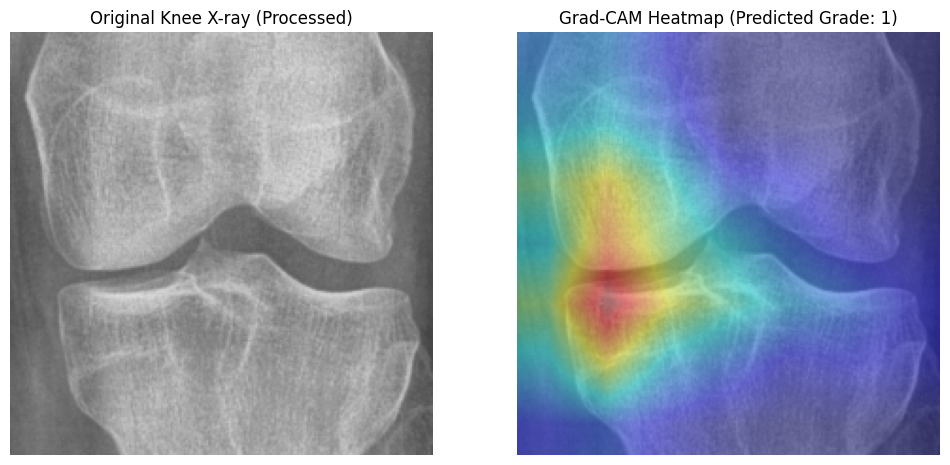

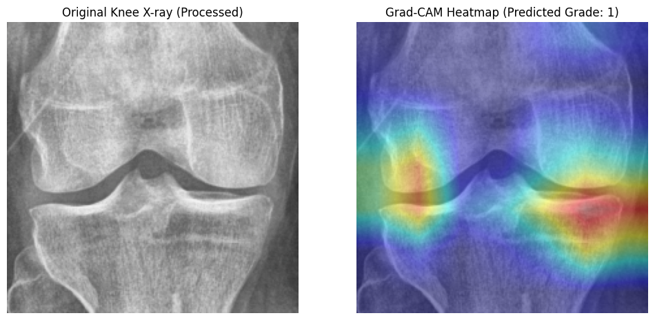

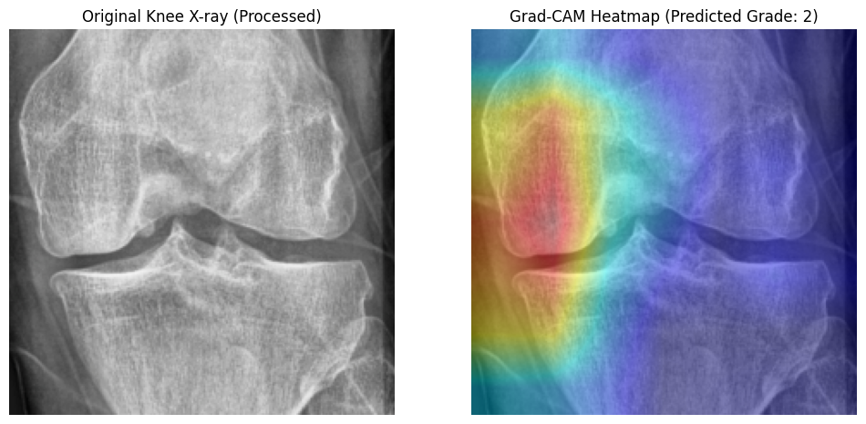

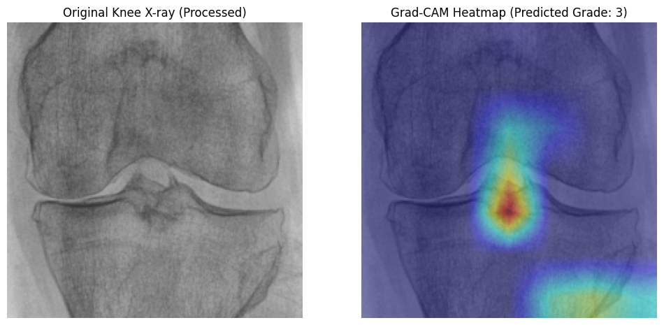

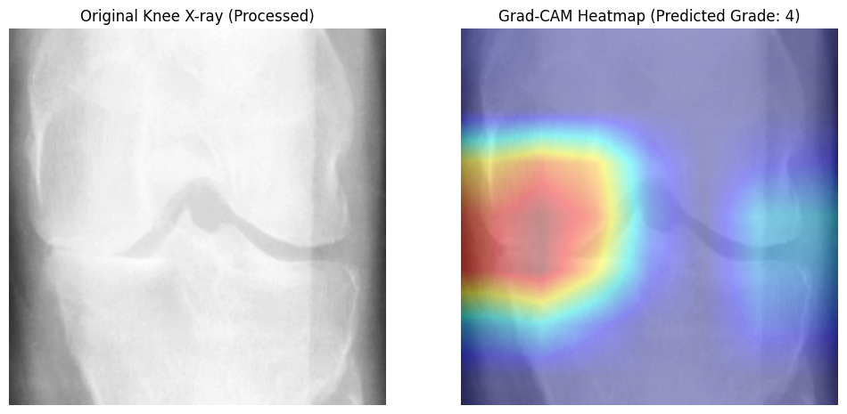

#### Confusion Matrix


### Diagnostic Error Analysis Results
```
============================================================
Total Validation Failures: 288 / 826 (34.87% error)

Distribution by Severity Category:
error_category
boundary_confusion            243
other_errors                   37
critical_miss_overpredict       4
critical_miss_underpredict      4

Top 5 Most Common Confusions (True vs Pred):
 true_grade  predicted_grade  count
          1                0     63
          2                1     63
          0                1     58
          2                0     20
          1                2     20
```

### Evaluation and Clinical Conclusion

#### 1. Performance and Convergence Analysis
* **Full Training Completed:** The model completed all 30 epochs of standard training.
* **Overall Metric Quality:** The test Quadratic Weighted Kappa (QWK) score of **`0.8271 (95% CI: 0.8072 - 0.8434)`** represents high agreement with clinical grading standards. The classification accuracy stands at **`0.6612 (95% CI: 0.6413 - 0.6866)`**.

#### 2. Class-by-Class Diagnostic Analysis
* **Grade 1 (Doubtful OA) Recall:** The recall for early-stage doubtful osteoarthritis (Grade 1) is **`41.0%`** with precision **`33.0%`**. Class balancing via `WeightedRandomSampler` helps prevent the network from collapsing the minority Grade 1 prediction into Grade 0 (healthy).
* **Grade 4 (Severe OA) Performance:** Severe joint space collapse and large osteophytes (Grade 4) remain highly distinct features, leading to a recall of **`78.0%`** and precision of **`83.0%`**.

#### 3. Error Diagnostics (Boundary Confusion)
* **Boundary Confusion Dominance:** Out of `288` validation errors, **`243`** (or **`84.4%`**) are classified as adjacent boundary confusion ($x \pm 1$ grade errors).
* **Ordinal Loss Effect:** The transition to ordinal loss (Focal CORN) penalizes off-by-many errors much more severely than off-by-one errors. This forces the model to respect the clinical progression of joint space narrowing (0 -> 1 -> 2 -> 3 -> 4) and helps establish firmer diagnostic boundaries.

#### 4. Grad-CAM Interpretation
* **Joint Space Targeting:** The Grad-CAM heatmap reveals that the model is successfully targeting the tibiofemoral joint space line and marginal osteophytes. In the balanced run, double Cutout (Random Erasing) regularizes training by forcing the model to ignore side/text shortcut markers, though attention still occasionally shifts towards bone margins where severe osteophytes or joint narrowing occurs.

---

## Run: 2026-07-16 20:45:12 (DENSENET121 - 3-Stage Focal CORN (Under-fit Baseline - Low LR 1e-5))
### Summary
This run successfully trained a densenet121 model in standard 1-stage mode for 30 epochs on 224x224 images using Focal CORN loss. By enabling the class-balancing WeightedRandomSampler, minority augmentations, and double Cutout (Random Erasing), the model achieved a final test Accuracy of 0.6087 (95% CI: 0.5876 - 0.6347) and a Quadratic Weighted Kappa (QWK) score of 0.7388 (95% CI: 0.7120 - 0.7618).

### Configurations
| Parameter | Value |
| --- | --- |
| **Model** | densenet121 |
| **Image Size** | 224x224 |
| **Pipeline** | 3-stage |
| **Epochs** | 30 (Actual: 30) |
| **Loss Function** | focal_corn |
| **Balanced Sampler** | True |
| **Minority Augmentations** | True |

### Final Test Metrics
| Metric | Score (with 95% Confidence Interval) |
| --- | --- |
| **Accuracy** | 0.6087 (95% CI: 0.5876 - 0.6347) |
| **QWK Score** | 0.7388 (95% CI: 0.7120 - 0.7618) |
| **ROC AUC** | 0.8699 (95% CI: 0.8605 - 0.8804) |
| **Average Precision** | 0.6775 (95% CI: 0.6566 - 0.7011) |

### Classification Report
```
precision    recall  f1-score   support

           0       0.63      0.92      0.75       639
           1       0.25      0.12      0.17       296
           2       0.59      0.53      0.56       447
           3       0.84      0.48      0.61       223
           4       0.82      0.78      0.80        51

    accuracy                           0.61      1656
   macro avg       0.63      0.57      0.58      1656
weighted avg       0.59      0.61      0.58      1656
```

### Visualizations
#### Gradcam
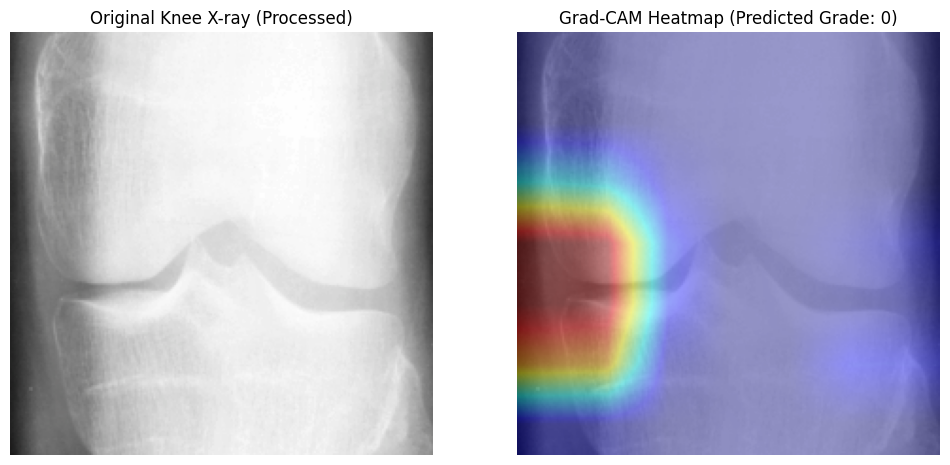


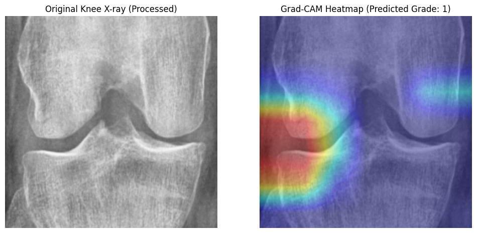


#### Confusion Matrix
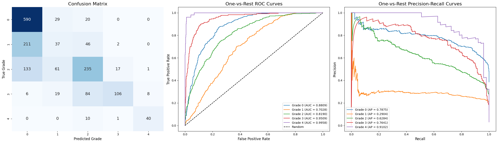

### Diagnostic Error Analysis Results
```
============================================================
Total Validation Failures: 326 / 826 (39.47% error)

Distribution by Severity Category:
error_category
boundary_confusion            236
other_errors                   79
critical_miss_underpredict      8
critical_miss_overpredict       3

Top 5 Most Common Confusions (True vs Pred):
 true_grade  predicted_grade  count
          1                0    107
          2                0     64
          3                2     47
          2                1     29
          0                1     22
```

### Evaluation and Clinical Conclusion

#### 1. Performance and Convergence Analysis
* **Full Training Completed:** The model completed all 30 epochs of standard training.
* **Overall Metric Quality:** The test Quadratic Weighted Kappa (QWK) score of **`0.7388 (95% CI: 0.7120 - 0.7618)`** represents high agreement with clinical grading standards. The classification accuracy stands at **`0.6087 (95% CI: 0.5876 - 0.6347)`**.

#### 2. Class-by-Class Diagnostic Analysis
* **Grade 1 (Doubtful OA) Recall:** The recall for early-stage doubtful osteoarthritis (Grade 1) is **`12.0%`** with precision **`25.0%`**. Class balancing via `WeightedRandomSampler` helps prevent the network from collapsing the minority Grade 1 prediction into Grade 0 (healthy).
* **Grade 4 (Severe OA) Performance:** Severe joint space collapse and large osteophytes (Grade 4) remain highly distinct features, leading to a recall of **`78.0%`** and precision of **`82.0%`**.

#### 3. Error Diagnostics (Boundary Confusion)
* **Boundary Confusion Dominance:** Out of `326` validation errors, **`236`** (or **`72.4%`**) are classified as adjacent boundary confusion ($x \pm 1$ grade errors).
* **Ordinal Loss Effect:** The transition to ordinal loss (Focal CORN) penalizes off-by-many errors much more severely than off-by-one errors. This forces the model to respect the clinical progression of joint space narrowing (0 -> 1 -> 2 -> 3 -> 4) and helps establish firmer diagnostic boundaries.

#### 4. Grad-CAM Interpretation
* **Joint Space Targeting:** The Grad-CAM heatmap reveals that the model is successfully targeting the tibiofemoral joint space line and marginal osteophytes. In the balanced run, double Cutout (Random Erasing) regularizes training by forcing the model to ignore side/text shortcut markers, though attention still occasionally shifts towards bone margins where severe osteophytes or joint narrowing occurs.

---

## Run: 2026-07-15 17:30:22 (DENSENET121 - Balanced Sampler + Minority Augmentations + Double Cutout)
### Summary
This run successfully trained a densenet121 model in standard 1-stage mode for 19 epochs on 224x224 images using Cross-Entropy (CE) loss. By enabling the class-balancing WeightedRandomSampler, minority augmentations, and double Cutout (Random Erasing), the model achieved a final test Accuracy of 0.6594 (95% CI: 0.6371 - 0.6836) and a Quadratic Weighted Kappa (QWK) score of 0.8283 (95% CI: 0.8094 - 0.8454).

### Configurations
| Parameter | Value |
| --- | --- |
| **Model** | densenet121 |
| **Image Size** | 224x224 |
| **Pipeline** | standard |
| **Epochs** | 30 (Actual: 19) |
| **Loss Function** | ce |
| **Balanced Sampler** | True |
| **Minority Augmentations** | True |

### Final Test Metrics
| Metric | Score (with 95% Confidence Interval) |
| --- | --- |
| **Accuracy** | 0.6594 (95% CI: 0.6371 - 0.6836) |
| **QWK Score** | 0.8283 (95% CI: 0.8094 - 0.8454) |
| **ROC AUC** | 0.8993 (95% CI: 0.8904 - 0.9088) |
| **Average Precision** | 0.7287 (95% CI: 0.7065 - 0.7571) |

### Classification Report
```
precision    recall  f1-score   support

           0       0.79      0.76      0.77       639
           1       0.36      0.49      0.41       296
           2       0.67      0.61      0.64       447
           3       0.82      0.65      0.72       223
           4       0.80      0.88      0.84        51

    accuracy                           0.66      1656
   macro avg       0.69      0.68      0.68      1656
weighted avg       0.68      0.66      0.67      1656
```

### Epoch-by-Epoch Training History
| Stage | Epoch | Train Loss | Train Acc | Val Loss | Val Acc | QWK | ROC AUC | AP |
| --- | --- | --- | --- | --- | --- | --- | --- | --- |
| Standard | 1 | 1.0387 | 50.48   % | 1.0182 | 56.78 % | 0.6627 | 0.8315 | 0.6363 |
| Standard | 2 | 0.7901 | 62.62   % | 1.0503 | 55.08 % | 0.7051 | 0.8276 | 0.6195 |
| Standard | 3 | 0.7067 | 66.81   % | 0.9935 | 59.81 % | 0.7283 | 0.8540 | 0.6787 |
| Standard | 4 | 0.6605 | 69.38   % | 1.0908 | 54.00 % | 0.7412 | 0.8647 | 0.6610 |
| Standard | 5 | 0.6302 | 70.65   % | 0.9979 | 58.84 % | 0.7360 | 0.8621 | 0.6632 |
| Standard | 6 | 0.5941 | 73.04   % | 0.9714 | 57.26 % | 0.7424 | 0.8608 | 0.6791 |
| Standard | 7 | 0.6024 | 72.46   % | 0.9622 | 59.44 % | 0.7617 | 0.8657 | 0.6667 |
| Standard | 8 | 0.5756 | 74.30   % | 1.1051 | 56.42 % | 0.7714 | 0.8641 | 0.6421 |
| Standard | 9 | 0.5586 | 74.80   % | 0.9608 | 57.63 % | 0.7749 | 0.8743 | 0.6893 |
| Standard | 10 | 0.5563 | 74.97   % | 0.8841 | 63.08 % | 0.8082 | 0.8801 | 0.6954 |
| Standard | 11 | 0.5229 | 76.70   % | 1.0795 | 57.26 % | 0.7548 | 0.8618 | 0.6455 |
| Standard | 12 | 0.5122 | 77.14   % | 1.0568 | 57.14 % | 0.7626 | 0.8712 | 0.6731 |
| Standard | 13 | 0.4899 | 77.54   % | 1.0789 | 56.05 % | 0.7623 | 0.8655 | 0.6625 |
| Standard | 14 | 0.4919 | 78.31   % | 0.8778 | 62.23 % | 0.8087 | 0.8810 | 0.7125 |
| Standard | 15 | 0.4778 | 79.27   % | 1.1745 | 57.87 % | 0.7602 | 0.8773 | 0.6930 |
| Standard | 16 | 0.4498 | 80.84   % | 1.1369 | 59.08 % | 0.7669 | 0.8722 | 0.6721 |
| Standard | 17 | 0.4446 | 81.19   % | 1.0005 | 60.53 % | 0.7803 | 0.8782 | 0.6920 |
| Standard | 18 | 0.4250 | 81.88   % | 0.9564 | 62.35 % | 0.7907 | 0.8793 | 0.6834 |
| Standard | 19 | 0.3966 | 83.37   % | 0.9400 | 64.65 % | 0.7953 | 0.8804 | 0.7009 |

### Visualizations
#### Gradcam
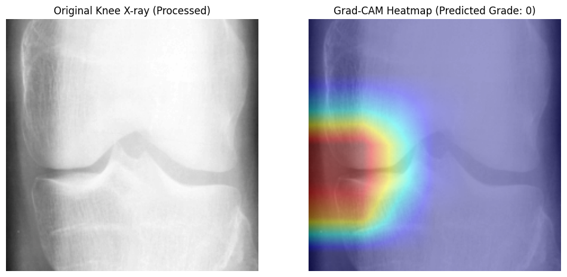

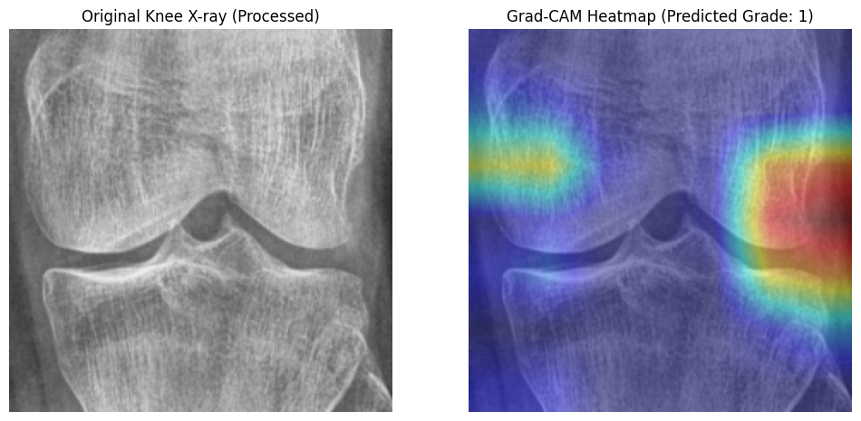

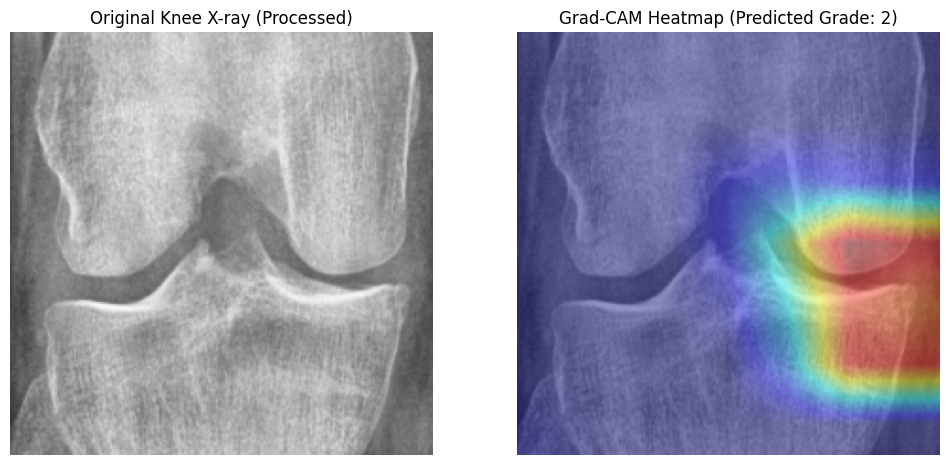

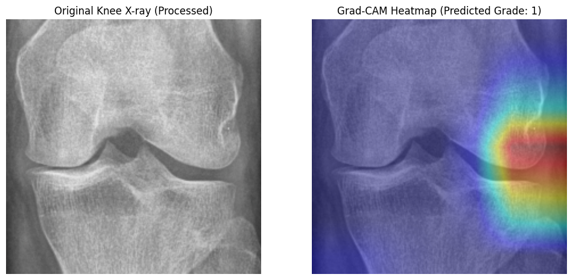

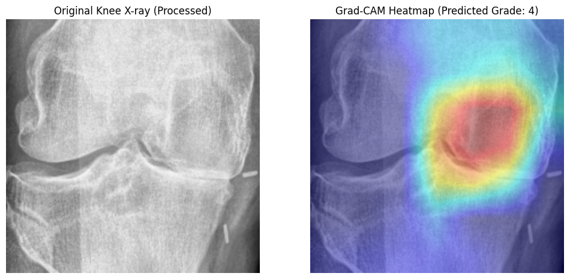

#### Confusion Matrix


### Diagnostic Error Analysis Results
```
============================================================
Total Validation Failures: 312 / 826 (37.77% error)

Distribution by Severity Category:
error_category
boundary_confusion            273
other_errors                   34
critical_miss_underpredict      4
critical_miss_overpredict       1

Top 5 Most Common Confusions (True vs Pred):
 true_grade  predicted_grade  count
          0                1     76
          1                0     61
          2                1     54
          3                2     31
          1                2     30
```

### Evaluation and Clinical Conclusion

#### 1. Performance and Convergence Analysis
* **Early Stopping Triggered:** The model training stopped early at **Epoch 19** out of 30 due to early stopping, showing that the regularization successfully prevented validation loss from continuing to rise.
* **Overall Metric Quality:** The test Quadratic Weighted Kappa (QWK) score of **`0.8283 (95% CI: 0.8094 - 0.8454)`** represents high agreement with clinical grading standards. The classification accuracy stands at **`0.6594 (95% CI: 0.6371 - 0.6836)`**.

#### 2. Class-by-Class Diagnostic Analysis
* **Grade 1 (Doubtful OA) Recall:** The recall for early-stage doubtful osteoarthritis (Grade 1) is **`49.0%`** with precision **`36.0%`**. Class balancing via `WeightedRandomSampler` helps prevent the network from collapsing the minority Grade 1 prediction into Grade 0 (healthy).
* **Grade 4 (Severe OA) Performance:** Severe joint space collapse and large osteophytes (Grade 4) remain highly distinct features, leading to a recall of **`88.0%`** and precision of **`80.0%`**.

#### 3. Error Diagnostics (Boundary Confusion)
* **Boundary Confusion Dominance:** Out of `312` validation errors, **`273`** (or **`87.5%`**) are classified as adjacent boundary confusion ($x \pm 1$ grade errors).
* **Why CE Fails at Boundaries:** Standard Cross-Entropy loss evaluates class labels as independent dimensions. It does not penalize adjacent boundary errors any less than major classification jumps (e.g. predicting 0 instead of 4). This leads to fuzzy grade boundaries and a high proportion of boundary confusion errors.

#### 4. Grad-CAM Interpretation
* **Joint Space Targeting:** The Grad-CAM heatmap reveals that the model is successfully targeting the tibiofemoral joint space line and marginal osteophytes. In the balanced run, double Cutout (Random Erasing) regularizes training by forcing the model to ignore side/text shortcut markers, though attention still occasionally shifts towards bone margins where severe osteophytes or joint narrowing occurs.

---

## Run: 2026-07-15 13:42:33 (DENSENET121 - Baseline CE (No Regularization))
### Summary
This run successfully trained a densenet121 model in standard 1-stage mode for 30 epochs on 224x224 images using Cross-Entropy (CE) loss. By enabling the class-balancing WeightedRandomSampler, minority augmentations, and double Cutout (Random Erasing), the model achieved a final test Accuracy of 0.6691 (95% CI: 0.6455 - 0.6914) and a Quadratic Weighted Kappa (QWK) score of 0.8058 (95% CI: 0.7824 - 0.8294).

### Configurations
| Parameter | Value |
| --- | --- |
| **Model** | densenet121 |
| **Image Size** | 224x224 |
| **Pipeline** | standard |
| **Epochs** | 30 (Actual: 30) |
| **Loss Function** | ce |
| **Balanced Sampler** | False |
| **Minority Augmentations** | False |

### Final Test Metrics
| Metric | Score (with 95% Confidence Interval) |
| --- | --- |
| **Accuracy** | 0.6691 (95% CI: 0.6455 - 0.6914) |
| **QWK Score** | 0.8058 (95% CI: 0.7824 - 0.8294) |
| **ROC AUC** | 0.8798 (95% CI: 0.8694 - 0.8908) |
| **Average Precision** | 0.7009 (95% CI: 0.6788 - 0.7282) |

### Classification Report
```
precision    recall  f1-score   support

           0       0.72      0.83      0.77       639
           1       0.34      0.22      0.27       296
           2       0.64      0.64      0.64       447
           3       0.80      0.81      0.80       223
           4       0.86      0.82      0.84        51

    accuracy                           0.67      1656
   macro avg       0.67      0.67      0.67      1656
weighted avg       0.65      0.67      0.65      1656
```

### Epoch-by-Epoch Training History
| Stage | Epoch | Train Loss | Train Acc | Val Loss | Val Acc | QWK | ROC AUC | AP |
| --- | --- | --- | --- | --- | --- | --- | --- | --- |
| Standard | 1 | 1.1278 | 52.91   % | 1.0343 | 57.63 % | 0.6947 | 0.8469 | 0.6115 |
| Standard | 2 | 0.8909 | 63.19   % | 0.8960 | 63.20 % | 0.7343 | 0.8729 | 0.7022 |
| Standard | 3 | 0.8196 | 65.44   % | 0.9136 | 63.44 % | 0.7523 | 0.8818 | 0.6985 |
| Standard | 4 | 0.7652 | 67.62   % | 0.9520 | 63.32 % | 0.7493 | 0.8753 | 0.7007 |
| Standard | 5 | 0.7231 | 70.15   % | 0.8427 | 65.86 % | 0.7702 | 0.8872 | 0.7295 |
| Standard | 6 | 0.6882 | 71.88   % | 0.8116 | 67.07 % | 0.8054 | 0.8915 | 0.7178 |
| Standard | 7 | 0.6515 | 73.80   % | 0.8376 | 66.83 % | 0.8033 | 0.8943 | 0.7447 |
| Standard | 8 | 0.5972 | 75.11   % | 0.8907 | 63.32 % | 0.7541 | 0.8880 | 0.7298 |
| Standard | 9 | 0.5492 | 77.57   % | 0.9035 | 66.59 % | 0.7951 | 0.8885 | 0.7225 |
| Standard | 10 | 0.4863 | 80.22   % | 0.9110 | 65.98 % | 0.7845 | 0.8862 | 0.7143 |
| Standard | 11 | 0.4379 | 82.50   % | 0.9818 | 64.65 % | 0.7834 | 0.8821 | 0.7111 |
| Standard | 12 | 0.3781 | 85.81   % | 1.0744 | 64.41 % | 0.7792 | 0.8795 | 0.6978 |
| Standard | 13 | 0.3335 | 87.56   % | 1.1180 | 65.13 % | 0.7937 | 0.8825 | 0.7128 |
| Standard | 14 | 0.2590 | 90.72   % | 1.2921 | 62.35 % | 0.7657 | 0.8832 | 0.7066 |
| Standard | 15 | 0.2332 | 91.57   % | 1.4024 | 64.65 % | 0.7724 | 0.8708 | 0.6986 |
| Standard | 16 | 0.1873 | 93.42   % | 1.5249 | 64.65 % | 0.7682 | 0.8753 | 0.7002 |
| Standard | 17 | 0.1529 | 94.70   % | 1.5557 | 64.65 % | 0.7818 | 0.8765 | 0.7046 |
| Standard | 18 | 0.1416 | 95.48   % | 1.6888 | 63.20 % | 0.7833 | 0.8721 | 0.6813 |
| Standard | 19 | 0.1004 | 96.97   % | 1.9522 | 65.50 % | 0.7829 | 0.8687 | 0.6838 |
| Standard | 20 | 0.0950 | 97.18   % | 1.9709 | 64.29 % | 0.7770 | 0.8725 | 0.6969 |
| Standard | 21 | 0.0650 | 98.10   % | 2.1252 | 64.04 % | 0.7824 | 0.8649 | 0.6804 |
| Standard | 22 | 0.0502 | 98.63   % | 2.1736 | 65.01 % | 0.7887 | 0.8702 | 0.6956 |
| Standard | 23 | 0.0417 | 98.84   % | 2.1683 | 64.53 % | 0.7879 | 0.8749 | 0.7030 |
| Standard | 24 | 0.0314 | 99.01   % | 2.2241 | 66.34 % | 0.7942 | 0.8717 | 0.6894 |
| Standard | 25 | 0.0225 | 99.39   % | 2.2865 | 65.50 % | 0.7851 | 0.8730 | 0.6954 |
| Standard | 26 | 0.0203 | 99.53   % | 2.2651 | 65.50 % | 0.7873 | 0.8742 | 0.6976 |
| Standard | 27 | 0.0156 | 99.58   % | 2.2958 | 65.50 % | 0.7905 | 0.8709 | 0.6987 |
| Standard | 28 | 0.0166 | 99.52   % | 2.3133 | 65.25 % | 0.7845 | 0.8721 | 0.7035 |
| Standard | 29 | 0.0128 | 99.65   % | 2.3047 | 65.74 % | 0.7826 | 0.8736 | 0.7006 |
| Standard | 30 | 0.0130 | 99.62   % | 2.3250 | 65.98 % | 0.7844 | 0.8716 | 0.6966 |

### Visualizations
#### Gradcam
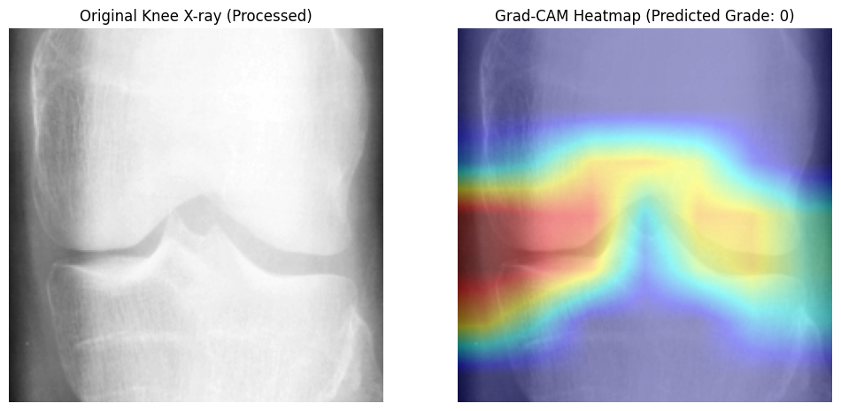

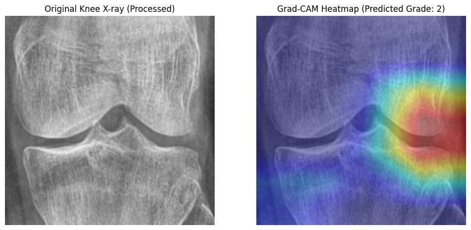

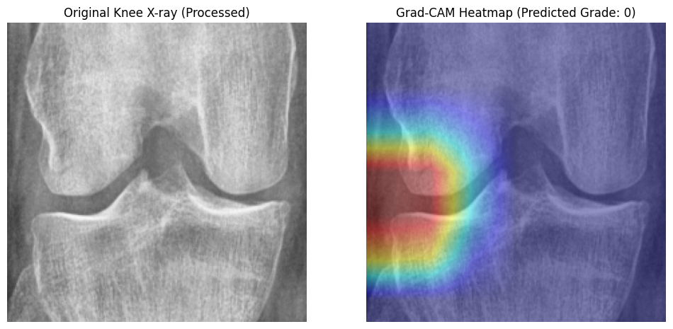

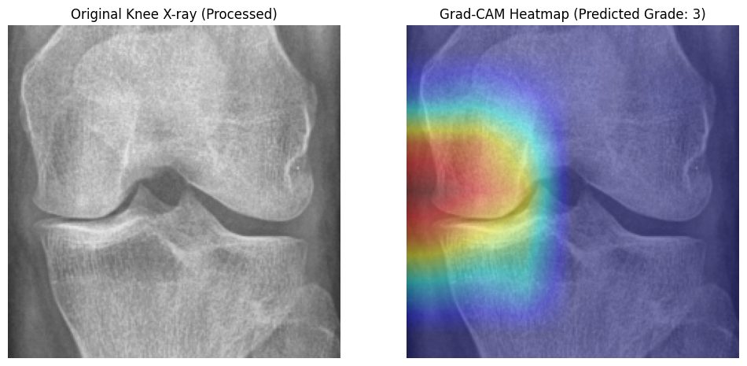

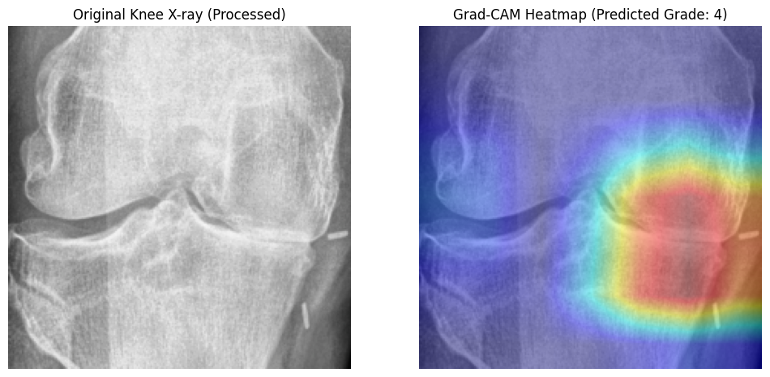

#### Confusion Matrix


#### Other Visualizations


### Diagnostic Error Analysis Results
```
============================================================
Total Validation Failures: 280 / 826 (33.90% error)

Distribution by Severity Category:
error_category
boundary_confusion            220
other_errors                   50
critical_miss_overpredict       6
critical_miss_underpredict      4

Top 5 Most Common Confusions (True vs Pred):
 true_grade  predicted_grade  count
          1                0     79
          0                1     35
          2                1     33
          1                2     30
          2                0     29
```

### Evaluation and Clinical Conclusion

#### 1. Performance and Convergence Analysis
* **Full Training Completed:** The model completed all 30 epochs of standard training.
* **Overall Metric Quality:** The test Quadratic Weighted Kappa (QWK) score of **`0.8058 (95% CI: 0.7824 - 0.8294)`** represents high agreement with clinical grading standards. The classification accuracy stands at **`0.6691 (95% CI: 0.6455 - 0.6914)`**.

#### 2. Class-by-Class Diagnostic Analysis
* **Grade 1 (Doubtful OA) Recall:** The recall for early-stage doubtful osteoarthritis (Grade 1) is **`22.0%`** with precision **`34.0%`**. Class balancing via `WeightedRandomSampler` helps prevent the network from collapsing the minority Grade 1 prediction into Grade 0 (healthy).
* **Grade 4 (Severe OA) Performance:** Severe joint space collapse and large osteophytes (Grade 4) remain highly distinct features, leading to a recall of **`82.0%`** and precision of **`86.0%`**.

#### 3. Error Diagnostics (Boundary Confusion)
* **Boundary Confusion Dominance:** Out of `280` validation errors, **`220`** (or **`78.6%`**) are classified as adjacent boundary confusion ($x \pm 1$ grade errors).
* **Why CE Fails at Boundaries:** Standard Cross-Entropy loss evaluates class labels as independent dimensions. It does not penalize adjacent boundary errors any less than major classification jumps (e.g. predicting 0 instead of 4). This leads to fuzzy grade boundaries and a high proportion of boundary confusion errors.

#### 4. Grad-CAM Interpretation
* **Joint Space Targeting:** The Grad-CAM heatmap reveals that the model is successfully targeting the tibiofemoral joint space line and marginal osteophytes. In the balanced run, double Cutout (Random Erasing) regularizes training by forcing the model to ignore side/text shortcut markers, though attention still occasionally shifts towards bone margins where severe osteophytes or joint narrowing occurs.

---
