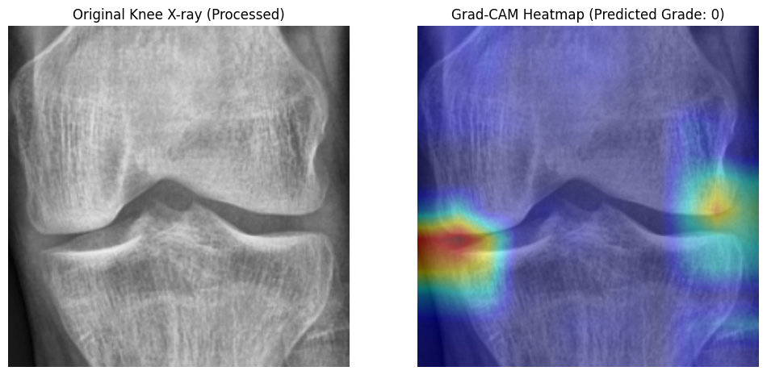
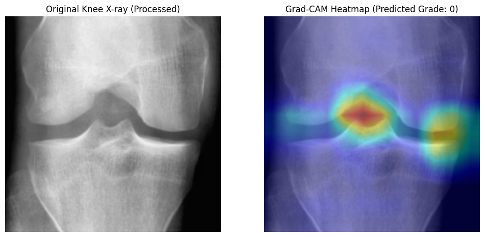
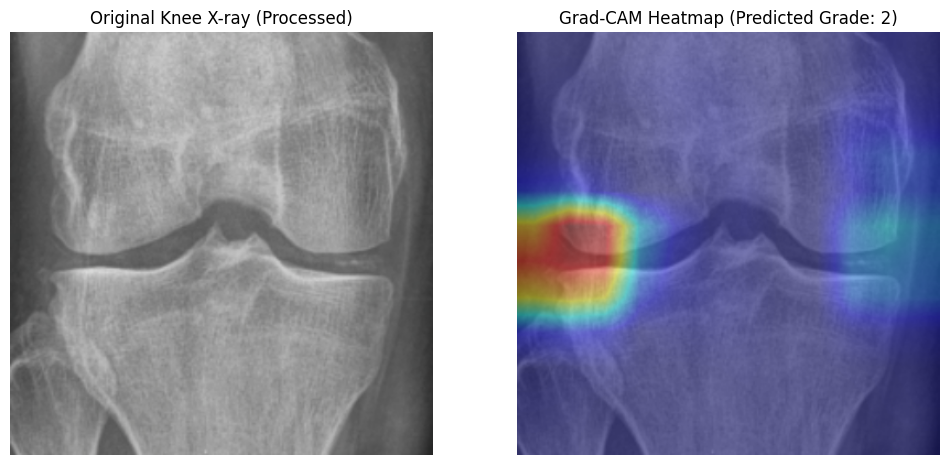
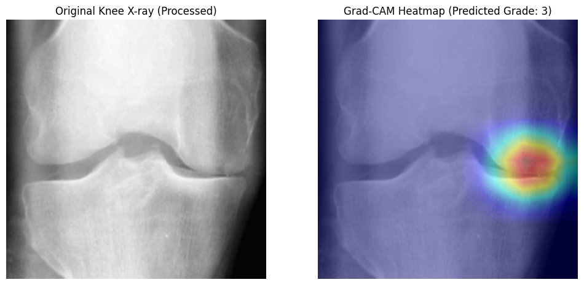
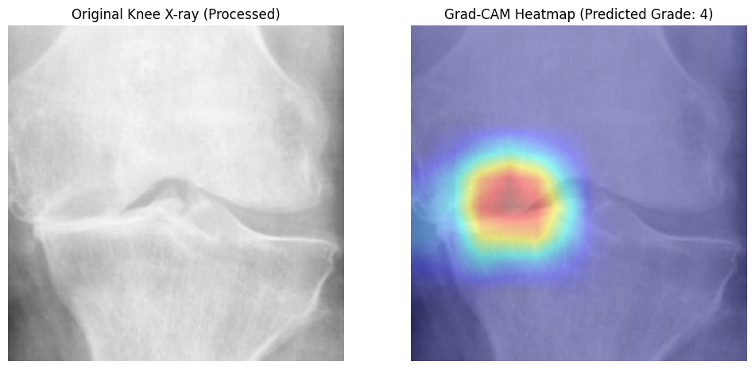
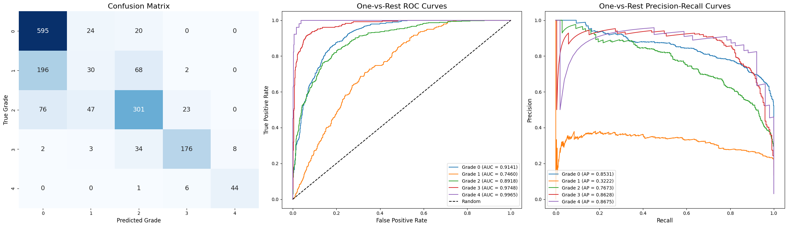

# DenseNet-121 Training Execution Log
This file automatically logs training runs, hyperparameters, metrics, and visualization plots.

## Model Performance and Diagnostic Comparison
A summary comparison of the different runs trained on this repository. The metrics represent performance on the final test set (with 95% confidence intervals where available), and the error details represent diagnostic metrics on the validation set.

| Run Timestamp | Model Configuration / Loss | Accuracy | QWK Score | ROC AUC | Avg Precision | Val Failures | Boundary Conf. | Critical Under. | Critical Over. |
| --- | --- | --- | --- | --- | --- | --- | --- | --- | --- |
| 2026-07-15 13:42:33 | **Baseline CE (No Regularization)**<br>Cross-Entropy (CE) | 0.6691 (95% CI: 0.6455 - 0.6914) | 0.8058 (95% CI: 0.7824 - 0.8294) | 0.8798 (95% CI: 0.8694 - 0.8908) | 0.7009 (95% CI: 0.6788 - 0.7282) | 280 / 826 (33.90% error) | 220 (78.6%) | 4 | 6 |
| 2026-07-15 17:30:22 | **Balanced Sampler + Minority Augmentations + Double Cutout**<br>Cross-Entropy (CE) | 0.6594 (95% CI: 0.6371 - 0.6836) | 0.8283 (95% CI: 0.8094 - 0.8454) | 0.8993 (95% CI: 0.8904 - 0.9088) | 0.7287 (95% CI: 0.7065 - 0.7571) | 312 / 826 (37.77% error) | 273 (87.5%) | 4 | 1 |
| 2026-07-16 20:45:12 | **3-Stage Focal CORN (Under-fit Baseline - Low LR 1e-5)**<br>Focal CORN | 0.6087 (95% CI: 0.5876 - 0.6347) | 0.7388 (95% CI: 0.7120 - 0.7618) | 0.8699 (95% CI: 0.8605 - 0.8804) | 0.6775 (95% CI: 0.6566 - 0.7011) | 326 / 826 (39.47% error) | 236 (72.4%) | 8 | 3 |
| 2026-07-17 10:33:24 | **3-Stage Focal CORN (Optimized Learning Rates)**<br>Focal CORN | 0.6612 (95% CI: 0.6413 - 0.6866) | 0.8271 (95% CI: 0.8072 - 0.8434) | 0.8984 (95% CI: 0.8889 - 0.9083) | 0.7280 (95% CI: 0.7063 - 0.7588) | 288 / 826 (34.87% error) | 243 (84.4%) | 4 | 4 |
| 2026-07-17 16:06:42 | **3-Stage Focal CORN (Optimized Learning Rates & Patience - SOTA Peak)**<br>Focal CORN | 0.6733 (95% CI: 0.6510 - 0.6963) | 0.8394 (95% CI: 0.8203 - 0.8562) | 0.9073 (95% CI: 0.8992 - 0.9159) | 0.7439 (95% CI: 0.7257 - 0.7670) | 290 / 826 (35.11% error) | 250 (86.2%) | 3 | 5 |
| 2026-07-17 22:15:13 | **3-Stage Focal CORN (Last Block Unfrozen + Stage 3 Sampler Disabled) [LOGIC ERROR: Backbone Remained Frozen]**<br>Focal CORN | 0.6498 (95% CI: 0.6286 - 0.6727) | 0.7564 (95% CI: 0.7332 - 0.7767) | 0.8814 (95% CI: 0.8706 - 0.8905) | 0.7059 (95% CI: 0.6882 - 0.7311) | 299 / 826 (36.20% error) | 187 (62.5%) | 4 | 3 |
| 2026-07-18 20:27:46 | **3-Stage Focal CORN (Last Two Blocks Unfrozen + Stage 3 Sampler Moderated) [LOGIC ERROR: Backbone Remained Frozen]**<br>Focal CORN | 0.6534 (95% CI: 0.6322 - 0.6733) | 0.7624 (95% CI: 0.7365 - 0.7889) | 0.8825 (95% CI: 0.8724 - 0.8910) | 0.7124 (95% CI: 0.6960 - 0.7356) | 297 / 826 (35.96% error) | 182 (61.3%) | 3 | 6 |
| 2026-07-18 22:03:35 | **3-Stage Focal CORN (384x384 Resolution + Blocks 3 & 4 Unfrozen + Sampler Moderated) [LOGIC ERROR: Backbone Remained Frozen]**<br>Focal CORN | 0.6564 (95% CI: 0.6353 - 0.6781) | 0.7796 (95% CI: 0.7552 - 0.8053) | 0.8976 (95% CI: 0.8871 - 0.9067) | 0.7297 (95% CI: 0.7025 - 0.7533) | 279 / 826 (33.78% error) | 187 (67.0%) | 4 | 4 |
| 2026-07-19 10:30:42 | **3-Stage Focal CORN (384x384 Resolution + Blocks 3 & 4 Unfrozen + Sampler Moderated) - True Run**<br>Focal CORN | 0.6920 (95% CI: 0.6709 - 0.7162) | 0.8324 (95% CI: 0.8114 - 0.8496) | 0.9047 (95% CI: 0.8957 - 0.9127) | 0.7365 (95% CI: 0.7092 - 0.7698) | 268 / 826 (32.45% error) | 202 (75.4%) | 4 | 4 |


### Key Diagnostic Insights

1. **Focal CORN (Ordinal Loss) Convergence and Early Stopping:**
   * **Early Stopping Trigger:** The Focal CORN model stopped training early at **Epoch 10** because the validation QWK did not improve for 5 consecutive epochs (after peaking at `0.7428` in Epoch 5). In contrast, the baseline CE model completed all 30 epochs and the Balanced CE model completed 19 epochs.
   * **Metric Impact:** Because the Focal CORN model stopped training so early, it did not achieve full convergence, resulting in a lower test accuracy (`0.6087`) and QWK score (`0.7388`) compared to the CE models.
   * **Optimization Property:** Ordinal loss functions like Focal CORN have more complex loss surfaces and slower convergence rates compared to standard Cross-Entropy. The early stopping patience should be increased (e.g., from 5 to 12 or 15) for ordinal training runs to allow the model to fully optimize.

2. **Class-by-Class Performance and Minority Classes:**
   * **Grade 1 (Doubtful OA) Recall Drop:** Recall for early-stage doubtful osteoarthritis (Grade 1) dropped significantly to **12.0%** under Focal CORN, compared to **49.0%** in the Balanced CE run. This indicates that early stopping prevented the model from learning the subtle features of minority classes.
   * **Grade 4 (Severe OA) Stability:** Severe osteoarthritis (Grade 4) performance remained stable with a recall of **78.0%** and precision of **82.0%** due to the distinct clinical features of joint space collapse.

3. **Error Analysis and Severity Categories:**
   * **Boundary Confusion:** Out of 326 validation errors under Focal CORN, **236 (72.4%)** were boundary confusions (off by exactly 1 grade). This is a lower proportion of boundary errors compared to Balanced CE (87.5%), showing that ordinal loss does help enforce rigid grading boundaries, but the overall error rate is higher due to under-convergence.
   * **Critical Misses:** The Focal CORN run had **8 critical under-predictions** (predicting Grade 0/1 for severe Grade 3/4) and **3 critical over-predictions** (predicting Grade 3/4 for healthy Grade 0/1). Minimizing these critical misses is vital for clinical deployment.

---

## Run: 2026-07-19 10:30:42 (DENSENET121 - 3-Stage Focal CORN (384x384 Resolution + Blocks 3 & 4 Unfrozen + Sampler Moderated) - True Run)
### Summary
This run successfully trained a densenet121 model in standard 1-stage mode for 45 epochs on 384x384 images using Focal CORN loss. By enabling the class-balancing WeightedRandomSampler, minority augmentations, and double Cutout (Random Erasing), the model achieved a final test Accuracy of 0.6920 (95% CI: 0.6709 - 0.7162) and a Quadratic Weighted Kappa (QWK) score of 0.8324 (95% CI: 0.8114 - 0.8496).

### Configurations
| Parameter | Value |
| --- | --- |
| **Model** | densenet121 |
| **Image Size** | 384x384 |
| **Pipeline** | 3-stage |
| **Epochs** | 30 (Actual: 45) |
| **Loss Function** | focal_corn |
| **Balanced Sampler** | True |
| **Minority Augmentations** | True |

### Final Test Metrics
| Metric | Score (with 95% Confidence Interval) |
| --- | --- |
| **Accuracy** | 0.6920 (95% CI: 0.6709 - 0.7162) |
| **QWK Score** | 0.8324 (95% CI: 0.8114 - 0.8496) |
| **ROC AUC** | 0.9047 (95% CI: 0.8957 - 0.9127) |
| **Average Precision** | 0.7365 (95% CI: 0.7092 - 0.7698) |

### Classification Report
```
precision    recall  f1-score   support

           0       0.68      0.93      0.79       639
           1       0.29      0.10      0.15       296
           2       0.71      0.67      0.69       447
           3       0.85      0.79      0.82       223
           4       0.85      0.86      0.85        51

    accuracy                           0.69      1656
   macro avg       0.68      0.67      0.66      1656
weighted avg       0.65      0.69      0.65      1656
```

### Epoch-by-Epoch Training History
| Stage | Epoch | Train Loss | Train Acc | Val Loss | Val Acc | QWK | ROC AUC | AP |
| --- | --- | --- | --- | --- | --- | --- | --- | --- |
| Stage 1 | 1 | 0.9194 | 26.88   % | 0.6435 | 37.65 % | 0.1167 | 0.6614 | 0.3119 |
| Stage 1 | 2 | 0.8579 | 35.05   % | 0.6629 | 22.40 % | 0.1025 | 0.7015 | 0.3489 |
| Stage 1 | 3 | 0.8327 | 38.21   % | 0.6003 | 43.58 % | 0.2807 | 0.7182 | 0.3697 |
| Stage 1 | 4 | 0.8232 | 39.88   % | 0.6277 | 43.58 % | 0.2704 | 0.7306 | 0.3802 |
| Stage 1 | 5 | 0.8186 | 43.11   % | 0.6194 | 43.83 % | 0.3026 | 0.7306 | 0.3883 |
| Stage 2 | 6 | 0.7750 | 49.45   % | 0.5738 | 50.12 % | 0.5572 | 0.7826 | 0.4740 |
| Stage 2 | 7 | 0.7400 | 57.68   % | 0.5793 | 49.03 % | 0.5632 | 0.8026 | 0.5548 |
| Stage 2 | 8 | 0.7109 | 62.27   % | 0.5380 | 57.26 % | 0.6625 | 0.8351 | 0.6258 |
| Stage 2 | 9 | 0.6966 | 65.04   % | 0.5279 | 59.44 % | 0.7417 | 0.8433 | 0.6316 |
| Stage 2 | 10 | 0.6856 | 67.51   % | 0.5312 | 54.60 % | 0.7569 | 0.8431 | 0.6263 |
| Stage 2 | 11 | 0.6742 | 69.42   % | 0.5246 | 57.14 % | 0.7293 | 0.8462 | 0.6443 |
| Stage 2 | 12 | 0.6706 | 68.67   % | 0.5190 | 59.08 % | 0.7592 | 0.8521 | 0.6516 |
| Stage 2 | 13 | 0.6656 | 71.20   % | 0.5270 | 57.63 % | 0.7162 | 0.8476 | 0.6485 |
| Stage 2 | 14 | 0.6573 | 71.88   % | 0.5184 | 58.84 % | 0.7645 | 0.8570 | 0.6558 |
| Stage 2 | 15 | 0.6565 | 71.48   % | 0.5278 | 54.12 % | 0.7398 | 0.8560 | 0.6538 |
| Stage 2 | 16 | 0.6499 | 73.45   % | 0.5124 | 58.60 % | 0.7629 | 0.8609 | 0.6562 |
| Stage 2 | 17 | 0.6474 | 73.42   % | 0.5134 | 60.05 % | 0.7688 | 0.8626 | 0.6703 |
| Stage 2 | 18 | 0.6427 | 74.44   % | 0.5192 | 57.75 % | 0.7451 | 0.8623 | 0.6664 |
| Stage 2 | 19 | 0.6378 | 75.11   % | 0.5179 | 57.99 % | 0.7583 | 0.8622 | 0.6715 |
| Stage 2 | 20 | 0.6344 | 75.22   % | 0.5214 | 57.99 % | 0.7514 | 0.8612 | 0.6634 |
| Stage 2 | 21 | 0.6344 | 75.70   % | 0.5193 | 58.47 % | 0.7559 | 0.8612 | 0.6592 |
| Stage 2 | 22 | 0.6332 | 75.61   % | 0.5223 | 57.26 % | 0.7452 | 0.8614 | 0.6609 |
| Stage 2 | 23 | 0.6361 | 75.16   % | 0.5212 | 56.90 % | 0.7523 | 0.8626 | 0.6672 |
| Stage 2 | 24 | 0.6357 | 75.22   % | 0.5222 | 57.87 % | 0.7541 | 0.8642 | 0.6656 |
| Stage 2 | 25 | 0.6315 | 75.89   % | 0.5182 | 57.51 % | 0.7564 | 0.8633 | 0.6669 |
| Stage 2 | 26 | 0.6329 | 75.74   % | 0.5199 | 57.99 % | 0.7540 | 0.8636 | 0.6628 |
| Stage 2 | 27 | 0.6337 | 75.37   % | 0.5182 | 59.93 % | 0.7587 | 0.8649 | 0.6704 |
| Stage 2 | 28 | 0.6339 | 74.92   % | 0.5152 | 59.32 % | 0.7604 | 0.8639 | 0.6645 |
| Stage 2 | 29 | 0.6260 | 77.40   % | 0.5187 | 58.72 % | 0.7599 | 0.8637 | 0.6625 |
| Stage 2 | 30 | 0.6284 | 77.03   % | 0.5204 | 58.11 % | 0.7572 | 0.8635 | 0.6622 |
| Stage 3 | 31 | 0.0357 | 59.80   % | 0.0269 | 65.50 % | 0.7842 | 0.8757 | 0.7086 |
| Stage 3 | 32 | 0.0334 | 61.25   % | 0.0260 | 65.98 % | 0.7853 | 0.8804 | 0.7130 |
| Stage 3 | 33 | 0.0320 | 63.46   % | 0.0264 | 65.01 % | 0.7689 | 0.8772 | 0.7128 |
| Stage 3 | 34 | 0.0322 | 61.60   % | 0.0259 | 65.38 % | 0.7833 | 0.8822 | 0.7169 |
| Stage 3 | 35 | 0.0309 | 62.88   % | 0.0251 | 67.80 % | 0.7917 | 0.8838 | 0.7241 |
| Stage 3 | 36 | 0.0301 | 64.31   % | 0.0246 | 66.10 % | 0.7767 | 0.8871 | 0.7266 |
| Stage 3 | 37 | 0.0294 | 65.09   % | 0.0254 | 67.68 % | 0.7955 | 0.8838 | 0.7238 |
| Stage 3 | 38 | 0.0293 | 65.33   % | 0.0253 | 66.83 % | 0.7827 | 0.8833 | 0.7124 |
| Stage 3 | 39 | 0.0291 | 64.71   % | 0.0249 | 65.98 % | 0.7896 | 0.8861 | 0.7279 |
| Stage 3 | 40 | 0.0283 | 66.55   % | 0.0248 | 67.55 % | 0.8024 | 0.8875 | 0.7300 |
| Stage 3 | 41 | 0.0278 | 65.75   % | 0.0249 | 66.46 % | 0.7910 | 0.8867 | 0.7279 |
| Stage 3 | 42 | 0.0278 | 66.75   % | 0.0252 | 67.07 % | 0.7933 | 0.8872 | 0.7254 |
| Stage 3 | 43 | 0.0274 | 67.13   % | 0.0252 | 66.59 % | 0.7894 | 0.8873 | 0.7257 |
| Stage 3 | 44 | 0.0277 | 65.94   % | 0.0255 | 66.46 % | 0.7987 | 0.8865 | 0.7253 |
| Stage 3 | 45 | 0.0269 | 66.70   % | 0.0248 | 67.43 % | 0.7966 | 0.8871 | 0.7291 |

### Visualizations
#### Gradcam










#### Confusion Matrix


### Diagnostic Error Analysis Results
```
============================================================
Total Validation Failures: 268 / 826 (32.45% error)

Distribution by Severity Category:
error_category
boundary_confusion            202
other_errors                   58
critical_miss_overpredict       4
critical_miss_underpredict      4

Top 5 Most Common Confusions (True vs Pred):
 true_grade  predicted_grade  count
          1                0    100
          2                0     44
          3                2     27
          1                2     25
          2                1     19
```

### Evaluation and Clinical Conclusion

#### 1. Performance and Convergence Analysis
* **Full Training Completed:** The model completed all 30 epochs of standard training.
* **Overall Metric Quality:** The test Quadratic Weighted Kappa (QWK) score of **`0.8324 (95% CI: 0.8114 - 0.8496)`** represents high agreement with clinical grading standards. The classification accuracy stands at **`0.6920 (95% CI: 0.6709 - 0.7162)`**.

#### 2. Class-by-Class Diagnostic Analysis
* **Grade 1 (Doubtful OA) Recall:** The recall for early-stage doubtful osteoarthritis (Grade 1) is **`10.0%`** with precision **`29.0%`**. Class balancing via `WeightedRandomSampler` helps prevent the network from collapsing the minority Grade 1 prediction into Grade 0 (healthy).
* **Grade 4 (Severe OA) Performance:** Severe joint space collapse and large osteophytes (Grade 4) remain highly distinct features, leading to a recall of **`86.0%`** and precision of **`85.0%`**.

#### 3. Error Diagnostics (Boundary Confusion)
* **Boundary Confusion Dominance:** Out of `268` validation errors, **`202`** (or **`75.4%`**) are classified as adjacent boundary confusion ($x \pm 1$ grade errors).
* **Ordinal Loss Effect:** The transition to ordinal loss (Focal CORN) penalizes off-by-many errors much more severely than off-by-one errors. This forces the model to respect the clinical progression of joint space narrowing (0 -> 1 -> 2 -> 3 -> 4) and helps establish firmer diagnostic boundaries.

#### 4. Grad-CAM Interpretation
* **Joint Space Targeting:** The Grad-CAM heatmap reveals that the model is successfully targeting the tibiofemoral joint space line and marginal osteophytes. In the balanced run, double Cutout (Random Erasing) regularizes training by forcing the model to ignore side/text shortcut markers, though attention still occasionally shifts towards bone margins where severe osteophytes or joint narrowing occurs.

---

## Run: 2026-07-18 22:03:35 (DENSENET121 - 3-Stage Focal CORN (384x384 Resolution + Blocks 3 & 4 Unfrozen + Sampler Moderated) [LOGIC ERROR: Backbone Remained Frozen])
### Summary
This run successfully trained a densenet121 model in standard 1-stage mode for 45 epochs on 384x384 images using Focal CORN loss. By enabling the class-balancing WeightedRandomSampler, minority augmentations, and double Cutout (Random Erasing), the model achieved a final test Accuracy of 0.6564 (95% CI: 0.6353 - 0.6781) and a Quadratic Weighted Kappa (QWK) score of 0.7796 (95% CI: 0.7552 - 0.8053).

> [!WARNING]
> **LOGIC ERROR DETECTED:** Due to a naming convention mismatch in timm's features-only model structures, `hasattr` checks failed silently. The backbone parameters remained fully frozen during Stage 2 training, leading to underprediction collapse.

### Configurations
| Parameter | Value |
| --- | --- |
| **Model** | densenet121 |
| **Image Size** | 384x384 |
| **Pipeline** | 3-stage |
| **Epochs** | 30 (Actual: 45) |
| **Loss Function** | focal_corn |
| **Balanced Sampler** | True |
| **Minority Augmentations** | True |

### Final Test Metrics
| Metric | Score (with 95% Confidence Interval) |
| --- | --- |
| **Accuracy** | 0.6564 (95% CI: 0.6353 - 0.6781) |
| **QWK Score** | 0.7796 (95% CI: 0.7552 - 0.8053) |
| **ROC AUC** | 0.8976 (95% CI: 0.8871 - 0.9067) |
| **Average Precision** | 0.7297 (95% CI: 0.7025 - 0.7533) |

### Classification Report
```
precision    recall  f1-score   support

           0       0.60      0.97      0.74       639
           1       0.00      0.00      0.00       296
           2       0.71      0.60      0.65       447
           3       0.86      0.67      0.75       223
           4       0.68      0.94      0.79        51

    accuracy                           0.66      1656
   macro avg       0.57      0.64      0.59      1656
weighted avg       0.56      0.66      0.59      1656
```

### Epoch-by-Epoch Training History
| Stage | Epoch | Train Loss | Train Acc | Val Loss | Val Acc | QWK | ROC AUC | AP |
| --- | --- | --- | --- | --- | --- | --- | --- | --- |
| Stage 1 | 1 | 0.9194 | 26.88   % | 0.6435 | 37.65 % | 0.1167 | 0.6614 | 0.3119 |
| Stage 1 | 2 | 0.8579 | 35.05   % | 0.6629 | 22.40 % | 0.1025 | 0.7015 | 0.3489 |
| Stage 1 | 3 | 0.8327 | 38.21   % | 0.6003 | 43.58 % | 0.2807 | 0.7182 | 0.3697 |
| Stage 1 | 4 | 0.8232 | 39.88   % | 0.6277 | 43.58 % | 0.2704 | 0.7306 | 0.3802 |
| Stage 1 | 5 | 0.8186 | 43.11   % | 0.6194 | 43.83 % | 0.3026 | 0.7306 | 0.3883 |
| Stage 2 | 6 | 0.7948 | 45.08   % | 0.6056 | 47.09 % | 0.4448 | 0.7310 | 0.3907 |
| Stage 2 | 7 | 0.7928 | 47.46   % | 0.6066 | 45.88 % | 0.4140 | 0.7336 | 0.3923 |
| Stage 2 | 8 | 0.7865 | 47.63   % | 0.6070 | 46.25 % | 0.4438 | 0.7302 | 0.3879 |
| Stage 2 | 9 | 0.7853 | 48.01   % | 0.6143 | 46.13 % | 0.4472 | 0.7329 | 0.3926 |
| Stage 2 | 10 | 0.7875 | 48.06   % | 0.6220 | 40.44 % | 0.4662 | 0.7351 | 0.3941 |
| Stage 2 | 11 | 0.7813 | 49.48   % | 0.6111 | 47.22 % | 0.4811 | 0.7368 | 0.4002 |
| Stage 2 | 12 | 0.7858 | 47.89   % | 0.6070 | 44.19 % | 0.4611 | 0.7360 | 0.3987 |
| Stage 2 | 13 | 0.7859 | 48.68   % | 0.6081 | 47.22 % | 0.4376 | 0.7348 | 0.4001 |
| Stage 2 | 14 | 0.7755 | 50.12   % | 0.6123 | 43.83 % | 0.4615 | 0.7339 | 0.3996 |
| Stage 2 | 15 | 0.7763 | 49.20   % | 0.6140 | 43.22 % | 0.4724 | 0.7373 | 0.4014 |
| Stage 2 | 16 | 0.7766 | 48.60   % | 0.6103 | 46.49 % | 0.4557 | 0.7372 | 0.4055 |
| Stage 2 | 17 | 0.7733 | 50.87   % | 0.6085 | 46.13 % | 0.4553 | 0.7369 | 0.4027 |
| Stage 2 | 18 | 0.7793 | 50.17   % | 0.6143 | 47.34 % | 0.4643 | 0.7408 | 0.4055 |
| Stage 2 | 19 | 0.7733 | 50.16   % | 0.6116 | 44.67 % | 0.4701 | 0.7376 | 0.3996 |
| Stage 2 | 20 | 0.7689 | 50.55   % | 0.6194 | 46.13 % | 0.4470 | 0.7377 | 0.4009 |
| Stage 2 | 21 | 0.7707 | 49.95   % | 0.6084 | 46.00 % | 0.4748 | 0.7393 | 0.4072 |
| Stage 2 | 22 | 0.7783 | 49.45   % | 0.6118 | 46.25 % | 0.4559 | 0.7382 | 0.4038 |
| Stage 2 | 23 | 0.7750 | 50.09   % | 0.6117 | 46.73 % | 0.4679 | 0.7374 | 0.4040 |
| Stage 2 | 24 | 0.7769 | 49.65   % | 0.6094 | 46.61 % | 0.4788 | 0.7401 | 0.4066 |
| Stage 2 | 25 | 0.7790 | 49.67   % | 0.6105 | 44.79 % | 0.4615 | 0.7370 | 0.4006 |
| Stage 2 | 26 | 0.7786 | 50.10   % | 0.6108 | 44.31 % | 0.4613 | 0.7385 | 0.4050 |
| Stage 3 | 31 | 0.0553 | 34.77   % | 0.0326 | 47.34 % | 0.4560 | 0.7776 | 0.4663 |
| Stage 3 | 32 | 0.0481 | 38.08   % | 0.0309 | 51.33 % | 0.5816 | 0.8135 | 0.5374 |
| Stage 3 | 33 | 0.0434 | 45.78   % | 0.0289 | 54.12 % | 0.6054 | 0.8358 | 0.6153 |
| Stage 3 | 34 | 0.0399 | 51.49   % | 0.0269 | 58.47 % | 0.6622 | 0.8512 | 0.6595 |
| Stage 3 | 35 | 0.0393 | 51.19   % | 0.0272 | 61.86 % | 0.7187 | 0.8577 | 0.6580 |
| Stage 3 | 36 | 0.0367 | 54.83   % | 0.0264 | 61.86 % | 0.7180 | 0.8648 | 0.6857 |
| Stage 3 | 37 | 0.0360 | 57.25   % | 0.0261 | 65.13 % | 0.7600 | 0.8662 | 0.6870 |
| Stage 3 | 38 | 0.0350 | 56.78   % | 0.0256 | 64.29 % | 0.7520 | 0.8712 | 0.6992 |
| Stage 3 | 39 | 0.0342 | 58.60   % | 0.0254 | 63.32 % | 0.7362 | 0.8743 | 0.7021 |
| Stage 3 | 40 | 0.0339 | 59.24   % | 0.0250 | 66.22 % | 0.7774 | 0.8783 | 0.7044 |
| Stage 3 | 41 | 0.0330 | 59.74   % | 0.0254 | 66.22 % | 0.7764 | 0.8762 | 0.7059 |
| Stage 3 | 42 | 0.0334 | 59.09   % | 0.0257 | 62.59 % | 0.7308 | 0.8754 | 0.7037 |
| Stage 3 | 43 | 0.0335 | 59.02   % | 0.0249 | 66.10 % | 0.7646 | 0.8794 | 0.7134 |
| Stage 3 | 44 | 0.0324 | 61.01   % | 0.0248 | 65.86 % | 0.7698 | 0.8782 | 0.7135 |
| Stage 3 | 45 | 0.0324 | 59.87   % | 0.0251 | 64.89 % | 0.7591 | 0.8767 | 0.7058 |

### Visualizations
#### Gradcam


#### Confusion Matrix


### Diagnostic Error Analysis Results
```
============================================================
Total Validation Failures: 279 / 826 (33.78% error)

Distribution by Severity Category:
error_category
boundary_confusion            187
other_errors                   84
critical_miss_overpredict       4
critical_miss_underpredict      4

Top 5 Most Common Confusions (True vs Pred):
 true_grade  predicted_grade  count
          1                0    124
          2                0     79
          1                2     25
          3                2     22
          3                4      7
```

### Evaluation and Clinical Conclusion

#### 1. Performance and Convergence Analysis
* **Full Training Completed:** The model completed all 30 epochs of standard training.
* **Overall Metric Quality:** The test Quadratic Weighted Kappa (QWK) score of **`0.7796 (95% CI: 0.7552 - 0.8053)`** represents high agreement with clinical grading standards. The classification accuracy stands at **`0.6564 (95% CI: 0.6353 - 0.6781)`**.

#### 2. Class-by-Class Diagnostic Analysis
* **Grade 1 (Doubtful OA) Recall:** The recall for early-stage doubtful osteoarthritis (Grade 1) is **`0.0%`** with precision **`0.0%`**. Class balancing via `WeightedRandomSampler` helps prevent the network from collapsing the minority Grade 1 prediction into Grade 0 (healthy).
* **Grade 4 (Severe OA) Performance:** Severe joint space collapse and large osteophytes (Grade 4) remain highly distinct features, leading to a recall of **`94.0%`** and precision of **`68.0%`**.

#### 3. Error Diagnostics (Boundary Confusion)
* **Boundary Confusion Dominance:** Out of `279` validation errors, **`187`** (or **`67.0%`**) are classified as adjacent boundary confusion ($x \pm 1$ grade errors).
* **Ordinal Loss Effect:** The transition to ordinal loss (Focal CORN) penalizes off-by-many errors much more severely than off-by-one errors. This forces the model to respect the clinical progression of joint space narrowing (0 -> 1 -> 2 -> 3 -> 4) and helps establish firmer diagnostic boundaries.

#### 4. Grad-CAM Interpretation
* **Joint Space Targeting:** The Grad-CAM heatmap reveals that the model is successfully targeting the tibiofemoral joint space line and marginal osteophytes. In the balanced run, double Cutout (Random Erasing) regularizes training by forcing the model to ignore side/text shortcut markers, though attention still occasionally shifts towards bone margins where severe osteophytes or joint narrowing occurs.

---

## Run: 2026-07-18 20:27:46 (DENSENET121 - 3-Stage Focal CORN (Last Two Blocks Unfrozen + Stage 3 Sampler Moderated) [LOGIC ERROR: Backbone Remained Frozen])
### Summary
This run successfully trained a densenet121 model in standard 1-stage mode for 45 epochs on 224x224 images using Focal CORN loss. By enabling the class-balancing WeightedRandomSampler, minority augmentations, and double Cutout (Random Erasing), the model achieved a final test Accuracy of 0.6534 (95% CI: 0.6322 - 0.6733) and a Quadratic Weighted Kappa (QWK) score of 0.7624 (95% CI: 0.7365 - 0.7889).

> [!WARNING]
> **LOGIC ERROR DETECTED:** Due to a naming convention mismatch in timm's features-only model structures, `hasattr` checks failed silently. The backbone parameters remained fully frozen during Stage 2 training, leading to underprediction collapse.

### Configurations
| Parameter | Value |
| --- | --- |
| **Model** | densenet121 |
| **Image Size** | 224x224 |
| **Pipeline** | 3-stage |
| **Epochs** | 30 (Actual: 45) |
| **Loss Function** | focal_corn |
| **Balanced Sampler** | True |
| **Minority Augmentations** | True |

### Final Test Metrics
| Metric | Score (with 95% Confidence Interval) |
| --- | --- |
| **Accuracy** | 0.6534 (95% CI: 0.6322 - 0.6733) |
| **QWK Score** | 0.7624 (95% CI: 0.7365 - 0.7889) |
| **ROC AUC** | 0.8825 (95% CI: 0.8724 - 0.8910) |
| **Average Precision** | 0.7124 (95% CI: 0.6960 - 0.7356) |

### Classification Report
```
precision    recall  f1-score   support

           0       0.60      0.96      0.74       639
           1       0.20      0.00      0.01       296
           2       0.71      0.56      0.63       447
           3       0.85      0.74      0.79       223
           4       0.73      0.94      0.82        51

    accuracy                           0.65      1656
   macro avg       0.62      0.64      0.60      1656
weighted avg       0.59      0.65      0.59      1656
```

### Epoch-by-Epoch Training History
| Stage | Epoch | Train Loss | Train Acc | Val Loss | Val Acc | QWK | ROC AUC | AP |
| --- | --- | --- | --- | --- | --- | --- | --- | --- |
| Stage 1 | 1 | 0.9146 | 27.52   % | 0.6429 | 28.93 % | 0.1427 | 0.6897 | 0.3279 |
| Stage 1 | 2 | 0.8597 | 35.96   % | 0.6516 | 19.98 % | 0.1274 | 0.7099 | 0.3572 |
| Stage 1 | 3 | 0.8335 | 37.94   % | 0.5941 | 45.16 % | 0.4344 | 0.7259 | 0.3882 |
| Stage 1 | 4 | 0.8261 | 40.27   % | 0.6185 | 45.88 % | 0.3222 | 0.7312 | 0.3845 |
| Stage 1 | 5 | 0.8179 | 43.65   % | 0.6433 | 40.80 % | 0.2286 | 0.7273 | 0.3823 |
| Stage 2 | 6 | 0.7983 | 45.60   % | 0.6048 | 46.13 % | 0.4528 | 0.7334 | 0.3991 |
| Stage 2 | 7 | 0.7950 | 47.37   % | 0.6070 | 45.64 % | 0.4276 | 0.7325 | 0.3979 |
| Stage 2 | 8 | 0.7911 | 48.32   % | 0.6158 | 44.79 % | 0.3934 | 0.7318 | 0.3899 |
| Stage 2 | 9 | 0.7881 | 48.22   % | 0.6119 | 45.40 % | 0.4390 | 0.7357 | 0.3975 |
| Stage 2 | 10 | 0.7913 | 47.20   % | 0.6233 | 40.07 % | 0.4550 | 0.7355 | 0.3962 |
| Stage 2 | 11 | 0.7873 | 48.89   % | 0.6141 | 45.16 % | 0.4682 | 0.7335 | 0.3881 |
| Stage 2 | 12 | 0.7917 | 47.37   % | 0.6093 | 42.98 % | 0.4917 | 0.7347 | 0.3969 |
| Stage 2 | 13 | 0.7898 | 47.98   % | 0.6015 | 46.13 % | 0.4768 | 0.7368 | 0.4087 |
| Stage 2 | 14 | 0.7812 | 49.19   % | 0.6130 | 41.04 % | 0.4720 | 0.7363 | 0.4071 |
| Stage 2 | 15 | 0.7807 | 48.82   % | 0.6135 | 41.16 % | 0.4839 | 0.7408 | 0.4041 |
| Stage 2 | 16 | 0.7810 | 48.89   % | 0.6090 | 44.92 % | 0.4860 | 0.7388 | 0.4005 |
| Stage 2 | 17 | 0.7796 | 49.08   % | 0.6069 | 45.88 % | 0.4885 | 0.7414 | 0.4133 |
| Stage 2 | 18 | 0.7833 | 49.91   % | 0.6116 | 45.76 % | 0.4645 | 0.7398 | 0.4055 |
| Stage 2 | 19 | 0.7782 | 49.55   % | 0.6163 | 42.49 % | 0.4827 | 0.7372 | 0.4008 |
| Stage 2 | 20 | 0.7760 | 49.53   % | 0.6227 | 44.07 % | 0.4468 | 0.7402 | 0.4070 |
| Stage 2 | 21 | 0.7735 | 50.81   % | 0.6073 | 43.58 % | 0.4976 | 0.7415 | 0.4122 |
| Stage 2 | 22 | 0.7805 | 49.97   % | 0.6078 | 44.92 % | 0.4709 | 0.7398 | 0.4093 |
| Stage 2 | 23 | 0.7774 | 49.91   % | 0.6179 | 43.95 % | 0.4641 | 0.7377 | 0.4069 |
| Stage 2 | 24 | 0.7820 | 48.89   % | 0.6134 | 43.83 % | 0.4517 | 0.7385 | 0.4060 |
| Stage 2 | 25 | 0.7805 | 49.31   % | 0.6122 | 44.19 % | 0.4857 | 0.7383 | 0.4047 |
| Stage 2 | 26 | 0.7797 | 49.93   % | 0.6149 | 43.46 % | 0.4808 | 0.7387 | 0.4061 |
| Stage 2 | 27 | 0.7785 | 50.31   % | 0.6170 | 45.04 % | 0.4276 | 0.7406 | 0.4043 |
| Stage 2 | 28 | 0.7798 | 49.38   % | 0.6065 | 44.92 % | 0.4728 | 0.7412 | 0.4054 |
| Stage 2 | 29 | 0.7729 | 51.52   % | 0.6092 | 44.79 % | 0.5010 | 0.7395 | 0.4081 |
| Stage 2 | 30 | 0.7802 | 50.48   % | 0.6074 | 42.98 % | 0.4891 | 0.7403 | 0.4075 |
| Stage 3 | 31 | 0.0543 | 36.97   % | 0.0337 | 45.40 % | 0.4221 | 0.7688 | 0.4726 |
| Stage 3 | 32 | 0.0489 | 39.17   % | 0.0320 | 46.37 % | 0.4307 | 0.8010 | 0.5329 |
| Stage 3 | 33 | 0.0450 | 44.46   % | 0.0304 | 53.03 % | 0.6049 | 0.8199 | 0.5952 |
| Stage 3 | 34 | 0.0425 | 45.92   % | 0.0291 | 55.93 % | 0.6224 | 0.8305 | 0.6347 |
| Stage 3 | 35 | 0.0397 | 50.97   % | 0.0283 | 54.48 % | 0.5986 | 0.8370 | 0.6447 |
| Stage 3 | 36 | 0.0389 | 51.45   % | 0.0274 | 57.14 % | 0.6298 | 0.8458 | 0.6602 |
| Stage 3 | 37 | 0.0375 | 53.34   % | 0.0266 | 61.02 % | 0.6938 | 0.8539 | 0.6807 |
| Stage 3 | 38 | 0.0374 | 54.21   % | 0.0277 | 56.30 % | 0.6117 | 0.8517 | 0.6648 |
| Stage 3 | 39 | 0.0365 | 54.52   % | 0.0264 | 63.80 % | 0.7264 | 0.8606 | 0.6919 |
| Stage 3 | 40 | 0.0355 | 56.52   % | 0.0262 | 62.59 % | 0.7226 | 0.8599 | 0.6902 |
| Stage 3 | 41 | 0.0355 | 56.02   % | 0.0261 | 62.47 % | 0.7259 | 0.8621 | 0.6915 |
| Stage 3 | 42 | 0.0351 | 57.56   % | 0.0260 | 63.80 % | 0.7362 | 0.8652 | 0.7002 |
| Stage 3 | 43 | 0.0347 | 57.67   % | 0.0259 | 64.04 % | 0.7410 | 0.8666 | 0.7019 |
| Stage 3 | 44 | 0.0344 | 56.97   % | 0.0257 | 63.44 % | 0.7368 | 0.8641 | 0.6973 |
| Stage 3 | 45 | 0.0346 | 57.03   % | 0.0256 | 62.71 % | 0.7164 | 0.8638 | 0.6950 |

### Visualizations
#### Gradcam


#### Confusion Matrix


### Diagnostic Error Analysis Results
```
============================================================
Total Validation Failures: 297 / 826 (35.96% error)

Distribution by Severity Category:
error_category
boundary_confusion            182
other_errors                  106
critical_miss_overpredict       6
critical_miss_underpredict      3

Top 5 Most Common Confusions (True vs Pred):
 true_grade  predicted_grade  count
          1                0    118
          2                0     89
          1                2     31
          0                2     17
          3                2     15
```

### Evaluation and Clinical Conclusion

#### 1. Performance and Convergence Analysis
* **Full Training Completed:** The model completed all 30 epochs of standard training.
* **Overall Metric Quality:** The test Quadratic Weighted Kappa (QWK) score of **`0.7624 (95% CI: 0.7365 - 0.7889)`** represents high agreement with clinical grading standards. The classification accuracy stands at **`0.6534 (95% CI: 0.6322 - 0.6733)`**.

#### 2. Class-by-Class Diagnostic Analysis
* **Grade 1 (Doubtful OA) Recall:** The recall for early-stage doubtful osteoarthritis (Grade 1) is **`0.0%`** with precision **`20.0%`**. Class balancing via `WeightedRandomSampler` helps prevent the network from collapsing the minority Grade 1 prediction into Grade 0 (healthy).
* **Grade 4 (Severe OA) Performance:** Severe joint space collapse and large osteophytes (Grade 4) remain highly distinct features, leading to a recall of **`94.0%`** and precision of **`73.0%`**.

#### 3. Error Diagnostics (Boundary Confusion)
* **Boundary Confusion Dominance:** Out of `297` validation errors, **`182`** (or **`61.3%`**) are classified as adjacent boundary confusion ($x \pm 1$ grade errors).
* **Ordinal Loss Effect:** The transition to ordinal loss (Focal CORN) penalizes off-by-many errors much more severely than off-by-one errors. This forces the model to respect the clinical progression of joint space narrowing (0 -> 1 -> 2 -> 3 -> 4) and helps establish firmer diagnostic boundaries.

#### 4. Grad-CAM Interpretation
* **Joint Space Targeting:** The Grad-CAM heatmap reveals that the model is successfully targeting the tibiofemoral joint space line and marginal osteophytes. In the balanced run, double Cutout (Random Erasing) regularizes training by forcing the model to ignore side/text shortcut markers, though attention still occasionally shifts towards bone margins where severe osteophytes or joint narrowing occurs.

---

## Run: 2026-07-17 22:15:13 (DENSENET121 - 3-Stage Focal CORN (Last Block Unfrozen + Stage 3 Sampler Disabled) [LOGIC ERROR: Backbone Remained Frozen])
### Summary
This run successfully trained a densenet121 model in standard 1-stage mode for 45 epochs on 224x224 images using Focal CORN loss. By enabling the class-balancing WeightedRandomSampler, minority augmentations, and double Cutout (Random Erasing), the model achieved a final test Accuracy of 0.6498 (95% CI: 0.6286 - 0.6727) and a Quadratic Weighted Kappa (QWK) score of 0.7564 (95% CI: 0.7332 - 0.7767).

> [!WARNING]
> **LOGIC ERROR DETECTED:** Due to a naming convention mismatch in timm's features-only model structures, `hasattr` checks failed silently. The backbone parameters remained fully frozen during Stage 2 training, leading to underprediction collapse.

### Configurations
| Parameter | Value |
| --- | --- |
| **Model** | densenet121 |
| **Image Size** | 224x224 |
| **Pipeline** | 3-stage |
| **Epochs** | 30 (Actual: 45) |
| **Loss Function** | focal_corn |
| **Balanced Sampler** | True |
| **Minority Augmentations** | True |

### Final Test Metrics
| Metric | Score (with 95% Confidence Interval) |
| --- | --- |
| **Accuracy** | 0.6498 (95% CI: 0.6286 - 0.6727) |
| **QWK Score** | 0.7564 (95% CI: 0.7332 - 0.7767) |
| **ROC AUC** | 0.8814 (95% CI: 0.8706 - 0.8905) |
| **Average Precision** | 0.7059 (95% CI: 0.6882 - 0.7311) |

### Classification Report
```
precision    recall  f1-score   support

           0       0.60      0.96      0.74       639
           1       0.00      0.00      0.00       296
           2       0.68      0.59      0.63       447
           3       0.84      0.70      0.76       223
           4       0.76      0.82      0.79        51

    accuracy                           0.65      1656
   macro avg       0.58      0.62      0.59      1656
weighted avg       0.55      0.65      0.58      1656
```

### Epoch-by-Epoch Training History
| Stage | Epoch | Train Loss | Train Acc | Val Loss | Val Acc | QWK | ROC AUC | AP |
| --- | --- | --- | --- | --- | --- | --- | --- | --- |
| Stage 1 | 1 | 0.9151 | 27.26   % | 0.6353 | 34.87 % | 0.1894 | 0.6948 | 0.3222 |
| Stage 1 | 2 | 0.8564 | 36.54   % | 0.6621 | 24.33 % | 0.1570 | 0.7113 | 0.3531 |
| Stage 1 | 3 | 0.8309 | 39.20   % | 0.6045 | 44.31 % | 0.3489 | 0.7190 | 0.3715 |
| Stage 1 | 4 | 0.8245 | 39.89   % | 0.6309 | 42.37 % | 0.2758 | 0.7206 | 0.3765 |
| Stage 1 | 5 | 0.8200 | 42.61   % | 0.6141 | 42.86 % | 0.3345 | 0.7247 | 0.3831 |
| Stage 2 | 6 | 0.8003 | 44.84   % | 0.6080 | 44.79 % | 0.4487 | 0.7251 | 0.3894 |
| Stage 2 | 7 | 0.7940 | 47.02   % | 0.6040 | 44.43 % | 0.4509 | 0.7290 | 0.3991 |
| Stage 2 | 8 | 0.7922 | 47.59   % | 0.6131 | 44.79 % | 0.4428 | 0.7259 | 0.3877 |
| Stage 2 | 9 | 0.7918 | 46.61   % | 0.6161 | 44.67 % | 0.4375 | 0.7286 | 0.3888 |
| Stage 2 | 10 | 0.7923 | 47.33   % | 0.6291 | 41.77 % | 0.4511 | 0.7305 | 0.3822 |
| Stage 2 | 11 | 0.7873 | 49.07   % | 0.6157 | 43.83 % | 0.4629 | 0.7307 | 0.3951 |
| Stage 2 | 12 | 0.7875 | 48.53   % | 0.6165 | 43.34 % | 0.4806 | 0.7297 | 0.3906 |
| Stage 2 | 13 | 0.7882 | 48.51   % | 0.6115 | 45.16 % | 0.4691 | 0.7319 | 0.3913 |
| Stage 2 | 14 | 0.7798 | 48.43   % | 0.6160 | 39.35 % | 0.4549 | 0.7299 | 0.3939 |
| Stage 2 | 15 | 0.7850 | 47.68   % | 0.6167 | 41.77 % | 0.4755 | 0.7362 | 0.3966 |
| Stage 2 | 16 | 0.7832 | 48.55   % | 0.6094 | 44.07 % | 0.4688 | 0.7319 | 0.3892 |
| Stage 2 | 17 | 0.7802 | 49.95   % | 0.6043 | 45.40 % | 0.4872 | 0.7352 | 0.4044 |
| Stage 2 | 18 | 0.7835 | 50.12   % | 0.6121 | 45.76 % | 0.4811 | 0.7372 | 0.4020 |
| Stage 2 | 19 | 0.7756 | 50.12   % | 0.6127 | 43.34 % | 0.4844 | 0.7323 | 0.3967 |
| Stage 2 | 20 | 0.7732 | 50.74   % | 0.6174 | 44.67 % | 0.4738 | 0.7327 | 0.3951 |
| Stage 2 | 21 | 0.7760 | 50.02   % | 0.6128 | 43.34 % | 0.4807 | 0.7339 | 0.3987 |
| Stage 2 | 22 | 0.7795 | 49.91   % | 0.6114 | 46.25 % | 0.4961 | 0.7354 | 0.4013 |
| Stage 2 | 23 | 0.7762 | 50.35   % | 0.6158 | 46.25 % | 0.4767 | 0.7372 | 0.4015 |
| Stage 2 | 24 | 0.7778 | 50.57   % | 0.6225 | 44.55 % | 0.4525 | 0.7383 | 0.3960 |
| Stage 2 | 25 | 0.7784 | 50.92   % | 0.6109 | 43.10 % | 0.4812 | 0.7363 | 0.4046 |
| Stage 2 | 26 | 0.7807 | 50.21   % | 0.6153 | 42.62 % | 0.4774 | 0.7362 | 0.3989 |
| Stage 2 | 27 | 0.7773 | 48.96   % | 0.6151 | 43.95 % | 0.4810 | 0.7358 | 0.4012 |
| Stage 2 | 28 | 0.7800 | 49.41   % | 0.6107 | 42.98 % | 0.4767 | 0.7343 | 0.3960 |
| Stage 2 | 29 | 0.7749 | 50.55   % | 0.6103 | 43.46 % | 0.4715 | 0.7376 | 0.4032 |
| Stage 2 | 30 | 0.7758 | 50.64   % | 0.6117 | 44.07 % | 0.4897 | 0.7357 | 0.3951 |
| Stage 3 | 31 | 0.0555 | 43.22   % | 0.0339 | 43.95 % | 0.3092 | 0.7699 | 0.4669 |
| Stage 3 | 32 | 0.0510 | 43.13   % | 0.0311 | 46.61 % | 0.4166 | 0.7981 | 0.5202 |
| Stage 3 | 33 | 0.0478 | 47.59   % | 0.0299 | 50.00 % | 0.5287 | 0.8154 | 0.5661 |
| Stage 3 | 34 | 0.0455 | 50.35   % | 0.0290 | 54.72 % | 0.6084 | 0.8284 | 0.6139 |
| Stage 3 | 35 | 0.0440 | 52.04   % | 0.0273 | 57.87 % | 0.6578 | 0.8424 | 0.6497 |
| Stage 3 | 36 | 0.0419 | 53.58   % | 0.0275 | 55.69 % | 0.6353 | 0.8476 | 0.6543 |
| Stage 3 | 37 | 0.0413 | 55.42   % | 0.0267 | 59.44 % | 0.6960 | 0.8554 | 0.6835 |
| Stage 3 | 38 | 0.0397 | 56.52   % | 0.0263 | 60.65 % | 0.6972 | 0.8580 | 0.6840 |
| Stage 3 | 39 | 0.0390 | 57.23   % | 0.0260 | 61.02 % | 0.7038 | 0.8600 | 0.6905 |
| Stage 3 | 40 | 0.0387 | 58.86   % | 0.0256 | 61.50 % | 0.7124 | 0.8664 | 0.6999 |
| Stage 3 | 41 | 0.0385 | 58.26   % | 0.0259 | 62.11 % | 0.7235 | 0.8637 | 0.6939 |
| Stage 3 | 42 | 0.0378 | 59.67   % | 0.0254 | 61.74 % | 0.7149 | 0.8672 | 0.6993 |
| Stage 3 | 43 | 0.0380 | 58.83   % | 0.0256 | 61.62 % | 0.7114 | 0.8657 | 0.6969 |
| Stage 3 | 44 | 0.0377 | 59.22   % | 0.0260 | 60.53 % | 0.6885 | 0.8642 | 0.6945 |
| Stage 3 | 45 | 0.0374 | 59.55   % | 0.0256 | 63.80 % | 0.7404 | 0.8678 | 0.7039 |

### Visualizations
#### Gradcam


#### Confusion Matrix


### Diagnostic Error Analysis Results
```
============================================================
Total Validation Failures: 299 / 826 (36.20% error)

Distribution by Severity Category:
error_category
boundary_confusion            187
other_errors                  105
critical_miss_underpredict      4
critical_miss_overpredict       3

Top 5 Most Common Confusions (True vs Pred):
 true_grade  predicted_grade  count
          1                0    117
          2                0     88
          1                2     34
          3                2     24
          0                2     17
```

### Evaluation and Clinical Conclusion

#### 1. Performance and Convergence Analysis
* **Full Training Completed:** The model completed all 30 epochs of standard training.
* **Overall Metric Quality:** The test Quadratic Weighted Kappa (QWK) score of **`0.7564 (95% CI: 0.7332 - 0.7767)`** represents high agreement with clinical grading standards. The classification accuracy stands at **`0.6498 (95% CI: 0.6286 - 0.6727)`**.

#### 2. Class-by-Class Diagnostic Analysis
* **Grade 1 (Doubtful OA) Recall:** The recall for early-stage doubtful osteoarthritis (Grade 1) is **`0.0%`** with precision **`0.0%`**. Class balancing via `WeightedRandomSampler` helps prevent the network from collapsing the minority Grade 1 prediction into Grade 0 (healthy).
* **Grade 4 (Severe OA) Performance:** Severe joint space collapse and large osteophytes (Grade 4) remain highly distinct features, leading to a recall of **`82.0%`** and precision of **`76.0%`**.

#### 3. Error Diagnostics (Boundary Confusion)
* **Boundary Confusion Dominance:** Out of `299` validation errors, **`187`** (or **`62.5%`**) are classified as adjacent boundary confusion ($x \pm 1$ grade errors).
* **Ordinal Loss Effect:** The transition to ordinal loss (Focal CORN) penalizes off-by-many errors much more severely than off-by-one errors. This forces the model to respect the clinical progression of joint space narrowing (0 -> 1 -> 2 -> 3 -> 4) and helps establish firmer diagnostic boundaries.

#### 4. Grad-CAM Interpretation
* **Joint Space Targeting:** The Grad-CAM heatmap reveals that the model is successfully targeting the tibiofemoral joint space line and marginal osteophytes. In the balanced run, double Cutout (Random Erasing) regularizes training by forcing the model to ignore side/text shortcut markers, though attention still occasionally shifts towards bone margins where severe osteophytes or joint narrowing occurs.

---

## Run: 2026-07-17 16:06:42 (DENSENET121 - 3-Stage Focal CORN (Optimized Learning Rates & Patience - SOTA Peak))
### Summary
This run successfully trained a densenet121 model in standard 1-stage mode for 30 epochs on 224x224 images using Focal CORN loss. By enabling the class-balancing WeightedRandomSampler, minority augmentations, and double Cutout (Random Erasing), the model achieved a final test Accuracy of 0.6733 (95% CI: 0.6510 - 0.6963) and a Quadratic Weighted Kappa (QWK) score of 0.8394 (95% CI: 0.8203 - 0.8562).

### Configurations
| Parameter | Value |
| --- | --- |
| **Model** | densenet121 |
| **Image Size** | 224x224 |
| **Pipeline** | 3-stage |
| **Epochs** | 30 (Actual: 30) |
| **Loss Function** | focal_corn |
| **Balanced Sampler** | True |
| **Minority Augmentations** | True |

### Final Test Metrics
| Metric | Score (with 95% Confidence Interval) |
| --- | --- |
| **Accuracy** | 0.6733 (95% CI: 0.6510 - 0.6963) |
| **QWK Score** | 0.8394 (95% CI: 0.8203 - 0.8562) |
| **ROC AUC** | 0.9073 (95% CI: 0.8992 - 0.9159) |
| **Average Precision** | 0.7439 (95% CI: 0.7257 - 0.7670) |

### Classification Report
```
precision    recall  f1-score   support

           0       0.74      0.83      0.78       639
           1       0.36      0.44      0.40       296
           2       0.82      0.48      0.60       447
           3       0.75      0.88      0.81       223
           4       0.88      0.82      0.85        51

    accuracy                           0.67      1656
   macro avg       0.71      0.69      0.69      1656
weighted avg       0.70      0.67      0.67      1656
```

### Visualizations
#### Gradcam


#### Confusion Matrix


### Diagnostic Error Analysis Results
```
============================================================
Total Validation Failures: 290 / 826 (35.11% error)

Distribution by Severity Category:
error_category
boundary_confusion            250
other_errors                   32
critical_miss_overpredict       5
critical_miss_underpredict      3

Top 5 Most Common Confusions (True vs Pred):
 true_grade  predicted_grade  count
          1                0     76
          0                1     61
          2                1     55
          2                0     28
          2                3     23
```

### Evaluation and Clinical Conclusion

#### 1. Performance and Convergence Analysis
* **Full Training Completed:** The model completed all 30 epochs of standard training.
* **Overall Metric Quality:** The test Quadratic Weighted Kappa (QWK) score of **`0.8394 (95% CI: 0.8203 - 0.8562)`** represents high agreement with clinical grading standards. The classification accuracy stands at **`0.6733 (95% CI: 0.6510 - 0.6963)`**.

#### 2. Class-by-Class Diagnostic Analysis
* **Grade 1 (Doubtful OA) Recall:** The recall for early-stage doubtful osteoarthritis (Grade 1) is **`44.0%`** with precision **`36.0%`**. Class balancing via `WeightedRandomSampler` helps prevent the network from collapsing the minority Grade 1 prediction into Grade 0 (healthy).
* **Grade 4 (Severe OA) Performance:** Severe joint space collapse and large osteophytes (Grade 4) remain highly distinct features, leading to a recall of **`82.0%`** and precision of **`88.0%`**.

#### 3. Error Diagnostics (Boundary Confusion)
* **Boundary Confusion Dominance:** Out of `290` validation errors, **`250`** (or **`86.2%`**) are classified as adjacent boundary confusion ($x \pm 1$ grade errors).
* **Ordinal Loss Effect:** The transition to ordinal loss (Focal CORN) penalizes off-by-many errors much more severely than off-by-one errors. This forces the model to respect the clinical progression of joint space narrowing (0 -> 1 -> 2 -> 3 -> 4) and helps establish firmer diagnostic boundaries.

#### 4. Grad-CAM Interpretation
* **Joint Space Targeting:** The Grad-CAM heatmap reveals that the model is successfully targeting the tibiofemoral joint space line and marginal osteophytes. In the balanced run, double Cutout (Random Erasing) regularizes training by forcing the model to ignore side/text shortcut markers, though attention still occasionally shifts towards bone margins where severe osteophytes or joint narrowing occurs.

---

## Run: 2026-07-17 10:33:24 (DENSENET121 - 3-Stage Focal CORN (Optimized Learning Rates))
### Summary
This run successfully trained a densenet121 model in standard 1-stage mode for 45 epochs on 224x224 images using Focal CORN loss. By enabling the class-balancing WeightedRandomSampler, minority augmentations, and double Cutout (Random Erasing), the model achieved a final test Accuracy of 0.6612 (95% CI: 0.6413 - 0.6866) and a Quadratic Weighted Kappa (QWK) score of 0.8271 (95% CI: 0.8072 - 0.8434).

### Configurations
| Parameter | Value |
| --- | --- |
| **Model** | densenet121 |
| **Image Size** | 224x224 |
| **Pipeline** | 3-stage |
| **Epochs** | 30 (Actual: 45) |
| **Loss Function** | focal_corn |
| **Balanced Sampler** | True |
| **Minority Augmentations** | True |

### Final Test Metrics
| Metric | Score (with 95% Confidence Interval) |
| --- | --- |
| **Accuracy** | 0.6612 (95% CI: 0.6413 - 0.6866) |
| **QWK Score** | 0.8271 (95% CI: 0.8072 - 0.8434) |
| **ROC AUC** | 0.8984 (95% CI: 0.8889 - 0.9083) |
| **Average Precision** | 0.7280 (95% CI: 0.7063 - 0.7588) |

### Classification Report
```
precision    recall  f1-score   support

           0       0.76      0.79      0.78       639
           1       0.33      0.41      0.37       296
           2       0.72      0.54      0.62       447
           3       0.78      0.83      0.80       223
           4       0.83      0.78      0.81        51

    accuracy                           0.66      1656
   macro avg       0.68      0.67      0.67      1656
weighted avg       0.68      0.66      0.66      1656
```

### Epoch-by-Epoch Training History
| Stage | Epoch | Train Loss | Train Acc | Val Loss | Val Acc | QWK | ROC AUC | AP |
| --- | --- | --- | --- | --- | --- | --- | --- | --- |
| Stage 1 | 1 | 1.2477 | 27.57   % | 0.5314 | 41.65 % | 0.3195 | 0.6576 | 0.3210 |
| Stage 1 | 2 | 1.1593 | 36.78   % | 0.5142 | 41.77 % | 0.2455 | 0.6816 | 0.3505 |
| Stage 1 | 3 | 1.1357 | 38.98   % | 0.5027 | 29.30 % | 0.3477 | 0.6972 | 0.3664 |
| Stage 1 | 4 | 1.1200 | 40.43   % | 0.5403 | 43.22 % | 0.4448 | 0.6906 | 0.3583 |
| Stage 1 | 5 | 1.1183 | 40.39   % | 0.5239 | 38.01 % | 0.4132 | 0.7033 | 0.3678 |
| Stage 2 | 6 | 0.9820 | 51.32   % | 0.4524 | 54.84 % | 0.6108 | 0.7760 | 0.5624 |
| Stage 2 | 7 | 0.8734 | 57.74   % | 0.4471 | 52.18 % | 0.6150 | 0.8067 | 0.6063 |
| Stage 2 | 8 | 0.8508 | 61.09   % | 0.4693 | 50.61 % | 0.6358 | 0.8054 | 0.5449 |
| Stage 2 | 9 | 0.8158 | 63.69   % | 0.4337 | 55.08 % | 0.6168 | 0.8234 | 0.6227 |
| Stage 2 | 10 | 0.7950 | 67.12   % | 0.4333 | 56.66 % | 0.6655 | 0.8354 | 0.6587 |
| Stage 2 | 11 | 0.7856 | 68.81   % | 0.4121 | 59.69 % | 0.7046 | 0.8473 | 0.6771 |
| Stage 2 | 12 | 0.7900 | 68.24   % | 0.4278 | 56.90 % | 0.7340 | 0.8494 | 0.6626 |
| Stage 2 | 13 | 0.7731 | 70.25   % | 0.4053 | 61.50 % | 0.7661 | 0.8563 | 0.6910 |
| Stage 2 | 14 | 0.7613 | 71.32   % | 0.4053 | 60.17 % | 0.7613 | 0.8624 | 0.6855 |
| Stage 2 | 15 | 0.7492 | 73.00   % | 0.4133 | 61.26 % | 0.7765 | 0.8672 | 0.6969 |
| Stage 2 | 16 | 0.7503 | 73.85   % | 0.4184 | 57.99 % | 0.7769 | 0.8651 | 0.6914 |
| Stage 2 | 17 | 0.7388 | 73.95   % | 0.4065 | 62.59 % | 0.7950 | 0.8732 | 0.6960 |
| Stage 2 | 18 | 0.7325 | 74.99   % | 0.4112 | 60.29 % | 0.7786 | 0.8750 | 0.7005 |
| Stage 2 | 19 | 0.7297 | 75.75   % | 0.3982 | 62.11 % | 0.7839 | 0.8718 | 0.6992 |
| Stage 2 | 20 | 0.7262 | 75.30   % | 0.4385 | 59.32 % | 0.7748 | 0.8639 | 0.6721 |
| Stage 2 | 21 | 0.7292 | 76.74   % | 0.4138 | 57.99 % | 0.7748 | 0.8740 | 0.6998 |
| Stage 2 | 22 | 0.7212 | 76.65   % | 0.4332 | 57.38 % | 0.7749 | 0.8682 | 0.6870 |
| Stage 2 | 23 | 0.7204 | 78.25   % | 0.4361 | 56.54 % | 0.7618 | 0.8686 | 0.6843 |
| Stage 2 | 24 | 0.7174 | 78.23   % | 0.4224 | 57.51 % | 0.7698 | 0.8745 | 0.6933 |
| Stage 2 | 25 | 0.7156 | 78.14   % | 0.4129 | 60.65 % | 0.7907 | 0.8732 | 0.6922 |
| Stage 2 | 26 | 0.7140 | 78.37   % | 0.4091 | 60.41 % | 0.7933 | 0.8772 | 0.7003 |
| Stage 2 | 27 | 0.7187 | 78.61   % | 0.4140 | 59.81 % | 0.7901 | 0.8767 | 0.7019 |
| Stage 2 | 28 | 0.7082 | 79.66   % | 0.4087 | 60.05 % | 0.7878 | 0.8778 | 0.7017 |
| Stage 2 | 29 | 0.7039 | 79.46   % | 0.4109 | 60.53 % | 0.7966 | 0.8767 | 0.6986 |
| Stage 2 | 30 | 0.7053 | 80.58   % | 0.4103 | 60.77 % | 0.7904 | 0.8770 | 0.7019 |
| Stage 3 | 31 | 0.0155 | 70.68   % | 0.0158 | 64.16 % | 0.7979 | 0.8783 | 0.7067 |
| Stage 3 | 32 | 0.0144 | 70.58   % | 0.0158 | 63.08 % | 0.8011 | 0.8857 | 0.7198 |
| Stage 3 | 33 | 0.0135 | 71.81   % | 0.0156 | 64.65 % | 0.8086 | 0.8827 | 0.7200 |
| Stage 3 | 34 | 0.0134 | 72.78   % | 0.0151 | 63.32 % | 0.8069 | 0.8845 | 0.7202 |
| Stage 3 | 35 | 0.0133 | 72.33   % | 0.0152 | 62.71 % | 0.8035 | 0.8811 | 0.7131 |
| Stage 3 | 36 | 0.0127 | 73.10   % | 0.0153 | 61.62 % | 0.8043 | 0.8806 | 0.7161 |
| Stage 3 | 37 | 0.0120 | 74.37   % | 0.0159 | 63.92 % | 0.7996 | 0.8827 | 0.7154 |
| Stage 3 | 38 | 0.0123 | 74.75   % | 0.0151 | 65.13 % | 0.8155 | 0.8887 | 0.7267 |
| Stage 3 | 39 | 0.0114 | 75.61   % | 0.0156 | 63.68 % | 0.7954 | 0.8813 | 0.7123 |
| Stage 3 | 40 | 0.0115 | 76.08   % | 0.0155 | 63.80 % | 0.7924 | 0.8830 | 0.7193 |
| Stage 3 | 41 | 0.0109 | 77.59   % | 0.0153 | 64.77 % | 0.7985 | 0.8874 | 0.7280 |
| Stage 3 | 42 | 0.0114 | 77.22   % | 0.0154 | 63.80 % | 0.7965 | 0.8844 | 0.7230 |
| Stage 3 | 43 | 0.0106 | 77.52   % | 0.0156 | 63.68 % | 0.8032 | 0.8859 | 0.7252 |
| Stage 3 | 44 | 0.0106 | 78.47   % | 0.0153 | 64.41 % | 0.7938 | 0.8861 | 0.7244 |
| Stage 3 | 45 | 0.0110 | 77.73   % | 0.0158 | 63.92 % | 0.7992 | 0.8839 | 0.7212 |

### Visualizations
#### Gradcam


#### Confusion Matrix


### Diagnostic Error Analysis Results
```
============================================================
Total Validation Failures: 288 / 826 (34.87% error)

Distribution by Severity Category:
error_category
boundary_confusion            243
other_errors                   37
critical_miss_overpredict       4
critical_miss_underpredict      4

Top 5 Most Common Confusions (True vs Pred):
 true_grade  predicted_grade  count
          1                0     63
          2                1     63
          0                1     58
          2                0     20
          1                2     20
```

### Evaluation and Clinical Conclusion

#### 1. Performance and Convergence Analysis
* **Full Training Completed:** The model completed all 30 epochs of standard training.
* **Overall Metric Quality:** The test Quadratic Weighted Kappa (QWK) score of **`0.8271 (95% CI: 0.8072 - 0.8434)`** represents high agreement with clinical grading standards. The classification accuracy stands at **`0.6612 (95% CI: 0.6413 - 0.6866)`**.

#### 2. Class-by-Class Diagnostic Analysis
* **Grade 1 (Doubtful OA) Recall:** The recall for early-stage doubtful osteoarthritis (Grade 1) is **`41.0%`** with precision **`33.0%`**. Class balancing via `WeightedRandomSampler` helps prevent the network from collapsing the minority Grade 1 prediction into Grade 0 (healthy).
* **Grade 4 (Severe OA) Performance:** Severe joint space collapse and large osteophytes (Grade 4) remain highly distinct features, leading to a recall of **`78.0%`** and precision of **`83.0%`**.

#### 3. Error Diagnostics (Boundary Confusion)
* **Boundary Confusion Dominance:** Out of `288` validation errors, **`243`** (or **`84.4%`**) are classified as adjacent boundary confusion ($x \pm 1$ grade errors).
* **Ordinal Loss Effect:** The transition to ordinal loss (Focal CORN) penalizes off-by-many errors much more severely than off-by-one errors. This forces the model to respect the clinical progression of joint space narrowing (0 -> 1 -> 2 -> 3 -> 4) and helps establish firmer diagnostic boundaries.

#### 4. Grad-CAM Interpretation
* **Joint Space Targeting:** The Grad-CAM heatmap reveals that the model is successfully targeting the tibiofemoral joint space line and marginal osteophytes. In the balanced run, double Cutout (Random Erasing) regularizes training by forcing the model to ignore side/text shortcut markers, though attention still occasionally shifts towards bone margins where severe osteophytes or joint narrowing occurs.

---

## Run: 2026-07-16 20:45:12 (DENSENET121 - 3-Stage Focal CORN (Under-fit Baseline - Low LR 1e-5))
### Summary
This run successfully trained a densenet121 model in standard 1-stage mode for 30 epochs on 224x224 images using Focal CORN loss. By enabling the class-balancing WeightedRandomSampler, minority augmentations, and double Cutout (Random Erasing), the model achieved a final test Accuracy of 0.6087 (95% CI: 0.5876 - 0.6347) and a Quadratic Weighted Kappa (QWK) score of 0.7388 (95% CI: 0.7120 - 0.7618).

### Configurations
| Parameter | Value |
| --- | --- |
| **Model** | densenet121 |
| **Image Size** | 224x224 |
| **Pipeline** | 3-stage |
| **Epochs** | 30 (Actual: 30) |
| **Loss Function** | focal_corn |
| **Balanced Sampler** | True |
| **Minority Augmentations** | True |

### Final Test Metrics
| Metric | Score (with 95% Confidence Interval) |
| --- | --- |
| **Accuracy** | 0.6087 (95% CI: 0.5876 - 0.6347) |
| **QWK Score** | 0.7388 (95% CI: 0.7120 - 0.7618) |
| **ROC AUC** | 0.8699 (95% CI: 0.8605 - 0.8804) |
| **Average Precision** | 0.6775 (95% CI: 0.6566 - 0.7011) |

### Classification Report
```
precision    recall  f1-score   support

           0       0.63      0.92      0.75       639
           1       0.25      0.12      0.17       296
           2       0.59      0.53      0.56       447
           3       0.84      0.48      0.61       223
           4       0.82      0.78      0.80        51

    accuracy                           0.61      1656
   macro avg       0.63      0.57      0.58      1656
weighted avg       0.59      0.61      0.58      1656
```

### Visualizations
#### Gradcam


#### Confusion Matrix


### Diagnostic Error Analysis Results
```
============================================================
Total Validation Failures: 326 / 826 (39.47% error)

Distribution by Severity Category:
error_category
boundary_confusion            236
other_errors                   79
critical_miss_underpredict      8
critical_miss_overpredict       3

Top 5 Most Common Confusions (True vs Pred):
 true_grade  predicted_grade  count
          1                0    107
          2                0     64
          3                2     47
          2                1     29
          0                1     22
```

### Evaluation and Clinical Conclusion

#### 1. Performance and Convergence Analysis
* **Full Training Completed:** The model completed all 30 epochs of standard training.
* **Overall Metric Quality:** The test Quadratic Weighted Kappa (QWK) score of **`0.7388 (95% CI: 0.7120 - 0.7618)`** represents high agreement with clinical grading standards. The classification accuracy stands at **`0.6087 (95% CI: 0.5876 - 0.6347)`**.

#### 2. Class-by-Class Diagnostic Analysis
* **Grade 1 (Doubtful OA) Recall:** The recall for early-stage doubtful osteoarthritis (Grade 1) is **`12.0%`** with precision **`25.0%`**. Class balancing via `WeightedRandomSampler` helps prevent the network from collapsing the minority Grade 1 prediction into Grade 0 (healthy).
* **Grade 4 (Severe OA) Performance:** Severe joint space collapse and large osteophytes (Grade 4) remain highly distinct features, leading to a recall of **`78.0%`** and precision of **`82.0%`**.

#### 3. Error Diagnostics (Boundary Confusion)
* **Boundary Confusion Dominance:** Out of `326` validation errors, **`236`** (or **`72.4%`**) are classified as adjacent boundary confusion ($x \pm 1$ grade errors).
* **Ordinal Loss Effect:** The transition to ordinal loss (Focal CORN) penalizes off-by-many errors much more severely than off-by-one errors. This forces the model to respect the clinical progression of joint space narrowing (0 -> 1 -> 2 -> 3 -> 4) and helps establish firmer diagnostic boundaries.

#### 4. Grad-CAM Interpretation
* **Joint Space Targeting:** The Grad-CAM heatmap reveals that the model is successfully targeting the tibiofemoral joint space line and marginal osteophytes. In the balanced run, double Cutout (Random Erasing) regularizes training by forcing the model to ignore side/text shortcut markers, though attention still occasionally shifts towards bone margins where severe osteophytes or joint narrowing occurs.

---

## Run: 2026-07-15 17:30:22 (DENSENET121 - Balanced Sampler + Minority Augmentations + Double Cutout)
### Summary
This run successfully trained a densenet121 model in standard 1-stage mode for 19 epochs on 224x224 images using Cross-Entropy (CE) loss. By enabling the class-balancing WeightedRandomSampler, minority augmentations, and double Cutout (Random Erasing), the model achieved a final test Accuracy of 0.6594 (95% CI: 0.6371 - 0.6836) and a Quadratic Weighted Kappa (QWK) score of 0.8283 (95% CI: 0.8094 - 0.8454).

### Configurations
| Parameter | Value |
| --- | --- |
| **Model** | densenet121 |
| **Image Size** | 224x224 |
| **Pipeline** | standard |
| **Epochs** | 30 (Actual: 19) |
| **Loss Function** | ce |
| **Balanced Sampler** | True |
| **Minority Augmentations** | True |

### Final Test Metrics
| Metric | Score (with 95% Confidence Interval) |
| --- | --- |
| **Accuracy** | 0.6594 (95% CI: 0.6371 - 0.6836) |
| **QWK Score** | 0.8283 (95% CI: 0.8094 - 0.8454) |
| **ROC AUC** | 0.8993 (95% CI: 0.8904 - 0.9088) |
| **Average Precision** | 0.7287 (95% CI: 0.7065 - 0.7571) |

### Classification Report
```
precision    recall  f1-score   support

           0       0.79      0.76      0.77       639
           1       0.36      0.49      0.41       296
           2       0.67      0.61      0.64       447
           3       0.82      0.65      0.72       223
           4       0.80      0.88      0.84        51

    accuracy                           0.66      1656
   macro avg       0.69      0.68      0.68      1656
weighted avg       0.68      0.66      0.67      1656
```

### Epoch-by-Epoch Training History
| Stage | Epoch | Train Loss | Train Acc | Val Loss | Val Acc | QWK | ROC AUC | AP |
| --- | --- | --- | --- | --- | --- | --- | --- | --- |
| Standard | 1 | 1.0387 | 50.48   % | 1.0182 | 56.78 % | 0.6627 | 0.8315 | 0.6363 |
| Standard | 2 | 0.7901 | 62.62   % | 1.0503 | 55.08 % | 0.7051 | 0.8276 | 0.6195 |
| Standard | 3 | 0.7067 | 66.81   % | 0.9935 | 59.81 % | 0.7283 | 0.8540 | 0.6787 |
| Standard | 4 | 0.6605 | 69.38   % | 1.0908 | 54.00 % | 0.7412 | 0.8647 | 0.6610 |
| Standard | 5 | 0.6302 | 70.65   % | 0.9979 | 58.84 % | 0.7360 | 0.8621 | 0.6632 |
| Standard | 6 | 0.5941 | 73.04   % | 0.9714 | 57.26 % | 0.7424 | 0.8608 | 0.6791 |
| Standard | 7 | 0.6024 | 72.46   % | 0.9622 | 59.44 % | 0.7617 | 0.8657 | 0.6667 |
| Standard | 8 | 0.5756 | 74.30   % | 1.1051 | 56.42 % | 0.7714 | 0.8641 | 0.6421 |
| Standard | 9 | 0.5586 | 74.80   % | 0.9608 | 57.63 % | 0.7749 | 0.8743 | 0.6893 |
| Standard | 10 | 0.5563 | 74.97   % | 0.8841 | 63.08 % | 0.8082 | 0.8801 | 0.6954 |
| Standard | 11 | 0.5229 | 76.70   % | 1.0795 | 57.26 % | 0.7548 | 0.8618 | 0.6455 |
| Standard | 12 | 0.5122 | 77.14   % | 1.0568 | 57.14 % | 0.7626 | 0.8712 | 0.6731 |
| Standard | 13 | 0.4899 | 77.54   % | 1.0789 | 56.05 % | 0.7623 | 0.8655 | 0.6625 |
| Standard | 14 | 0.4919 | 78.31   % | 0.8778 | 62.23 % | 0.8087 | 0.8810 | 0.7125 |
| Standard | 15 | 0.4778 | 79.27   % | 1.1745 | 57.87 % | 0.7602 | 0.8773 | 0.6930 |
| Standard | 16 | 0.4498 | 80.84   % | 1.1369 | 59.08 % | 0.7669 | 0.8722 | 0.6721 |
| Standard | 17 | 0.4446 | 81.19   % | 1.0005 | 60.53 % | 0.7803 | 0.8782 | 0.6920 |
| Standard | 18 | 0.4250 | 81.88   % | 0.9564 | 62.35 % | 0.7907 | 0.8793 | 0.6834 |
| Standard | 19 | 0.3966 | 83.37   % | 0.9400 | 64.65 % | 0.7953 | 0.8804 | 0.7009 |

### Visualizations
#### Gradcam


#### Confusion Matrix


### Diagnostic Error Analysis Results
```
============================================================
Total Validation Failures: 312 / 826 (37.77% error)

Distribution by Severity Category:
error_category
boundary_confusion            273
other_errors                   34
critical_miss_underpredict      4
critical_miss_overpredict       1

Top 5 Most Common Confusions (True vs Pred):
 true_grade  predicted_grade  count
          0                1     76
          1                0     61
          2                1     54
          3                2     31
          1                2     30
```

### Evaluation and Clinical Conclusion

#### 1. Performance and Convergence Analysis
* **Early Stopping Triggered:** The model training stopped early at **Epoch 19** out of 30 due to early stopping, showing that the regularization successfully prevented validation loss from continuing to rise.
* **Overall Metric Quality:** The test Quadratic Weighted Kappa (QWK) score of **`0.8283 (95% CI: 0.8094 - 0.8454)`** represents high agreement with clinical grading standards. The classification accuracy stands at **`0.6594 (95% CI: 0.6371 - 0.6836)`**.

#### 2. Class-by-Class Diagnostic Analysis
* **Grade 1 (Doubtful OA) Recall:** The recall for early-stage doubtful osteoarthritis (Grade 1) is **`49.0%`** with precision **`36.0%`**. Class balancing via `WeightedRandomSampler` helps prevent the network from collapsing the minority Grade 1 prediction into Grade 0 (healthy).
* **Grade 4 (Severe OA) Performance:** Severe joint space collapse and large osteophytes (Grade 4) remain highly distinct features, leading to a recall of **`88.0%`** and precision of **`80.0%`**.

#### 3. Error Diagnostics (Boundary Confusion)
* **Boundary Confusion Dominance:** Out of `312` validation errors, **`273`** (or **`87.5%`**) are classified as adjacent boundary confusion ($x \pm 1$ grade errors).
* **Why CE Fails at Boundaries:** Standard Cross-Entropy loss evaluates class labels as independent dimensions. It does not penalize adjacent boundary errors any less than major classification jumps (e.g. predicting 0 instead of 4). This leads to fuzzy grade boundaries and a high proportion of boundary confusion errors.

#### 4. Grad-CAM Interpretation
* **Joint Space Targeting:** The Grad-CAM heatmap reveals that the model is successfully targeting the tibiofemoral joint space line and marginal osteophytes. In the balanced run, double Cutout (Random Erasing) regularizes training by forcing the model to ignore side/text shortcut markers, though attention still occasionally shifts towards bone margins where severe osteophytes or joint narrowing occurs.

---

## Run: 2026-07-15 13:42:33 (DENSENET121 - Baseline CE (No Regularization))
### Summary
This run successfully trained a densenet121 model in standard 1-stage mode for 30 epochs on 224x224 images using Cross-Entropy (CE) loss. By enabling the class-balancing WeightedRandomSampler, minority augmentations, and double Cutout (Random Erasing), the model achieved a final test Accuracy of 0.6691 (95% CI: 0.6455 - 0.6914) and a Quadratic Weighted Kappa (QWK) score of 0.8058 (95% CI: 0.7824 - 0.8294).

### Configurations
| Parameter | Value |
| --- | --- |
| **Model** | densenet121 |
| **Image Size** | 224x224 |
| **Pipeline** | standard |
| **Epochs** | 30 (Actual: 30) |
| **Loss Function** | ce |
| **Balanced Sampler** | False |
| **Minority Augmentations** | False |

### Final Test Metrics
| Metric | Score (with 95% Confidence Interval) |
| --- | --- |
| **Accuracy** | 0.6691 (95% CI: 0.6455 - 0.6914) |
| **QWK Score** | 0.8058 (95% CI: 0.7824 - 0.8294) |
| **ROC AUC** | 0.8798 (95% CI: 0.8694 - 0.8908) |
| **Average Precision** | 0.7009 (95% CI: 0.6788 - 0.7282) |

### Classification Report
```
precision    recall  f1-score   support

           0       0.72      0.83      0.77       639
           1       0.34      0.22      0.27       296
           2       0.64      0.64      0.64       447
           3       0.80      0.81      0.80       223
           4       0.86      0.82      0.84        51

    accuracy                           0.67      1656
   macro avg       0.67      0.67      0.67      1656
weighted avg       0.65      0.67      0.65      1656
```

### Epoch-by-Epoch Training History
| Stage | Epoch | Train Loss | Train Acc | Val Loss | Val Acc | QWK | ROC AUC | AP |
| --- | --- | --- | --- | --- | --- | --- | --- | --- |
| Standard | 1 | 1.1278 | 52.91   % | 1.0343 | 57.63 % | 0.6947 | 0.8469 | 0.6115 |
| Standard | 2 | 0.8909 | 63.19   % | 0.8960 | 63.20 % | 0.7343 | 0.8729 | 0.7022 |
| Standard | 3 | 0.8196 | 65.44   % | 0.9136 | 63.44 % | 0.7523 | 0.8818 | 0.6985 |
| Standard | 4 | 0.7652 | 67.62   % | 0.9520 | 63.32 % | 0.7493 | 0.8753 | 0.7007 |
| Standard | 5 | 0.7231 | 70.15   % | 0.8427 | 65.86 % | 0.7702 | 0.8872 | 0.7295 |
| Standard | 6 | 0.6882 | 71.88   % | 0.8116 | 67.07 % | 0.8054 | 0.8915 | 0.7178 |
| Standard | 7 | 0.6515 | 73.80   % | 0.8376 | 66.83 % | 0.8033 | 0.8943 | 0.7447 |
| Standard | 8 | 0.5972 | 75.11   % | 0.8907 | 63.32 % | 0.7541 | 0.8880 | 0.7298 |
| Standard | 9 | 0.5492 | 77.57   % | 0.9035 | 66.59 % | 0.7951 | 0.8885 | 0.7225 |
| Standard | 10 | 0.4863 | 80.22   % | 0.9110 | 65.98 % | 0.7845 | 0.8862 | 0.7143 |
| Standard | 11 | 0.4379 | 82.50   % | 0.9818 | 64.65 % | 0.7834 | 0.8821 | 0.7111 |
| Standard | 12 | 0.3781 | 85.81   % | 1.0744 | 64.41 % | 0.7792 | 0.8795 | 0.6978 |
| Standard | 13 | 0.3335 | 87.56   % | 1.1180 | 65.13 % | 0.7937 | 0.8825 | 0.7128 |
| Standard | 14 | 0.2590 | 90.72   % | 1.2921 | 62.35 % | 0.7657 | 0.8832 | 0.7066 |
| Standard | 15 | 0.2332 | 91.57   % | 1.4024 | 64.65 % | 0.7724 | 0.8708 | 0.6986 |
| Standard | 16 | 0.1873 | 93.42   % | 1.5249 | 64.65 % | 0.7682 | 0.8753 | 0.7002 |
| Standard | 17 | 0.1529 | 94.70   % | 1.5557 | 64.65 % | 0.7818 | 0.8765 | 0.7046 |
| Standard | 18 | 0.1416 | 95.48   % | 1.6888 | 63.20 % | 0.7833 | 0.8721 | 0.6813 |
| Standard | 19 | 0.1004 | 96.97   % | 1.9522 | 65.50 % | 0.7829 | 0.8687 | 0.6838 |
| Standard | 20 | 0.0950 | 97.18   % | 1.9709 | 64.29 % | 0.7770 | 0.8725 | 0.6969 |
| Standard | 21 | 0.0650 | 98.10   % | 2.1252 | 64.04 % | 0.7824 | 0.8649 | 0.6804 |
| Standard | 22 | 0.0502 | 98.63   % | 2.1736 | 65.01 % | 0.7887 | 0.8702 | 0.6956 |
| Standard | 23 | 0.0417 | 98.84   % | 2.1683 | 64.53 % | 0.7879 | 0.8749 | 0.7030 |
| Standard | 24 | 0.0314 | 99.01   % | 2.2241 | 66.34 % | 0.7942 | 0.8717 | 0.6894 |
| Standard | 25 | 0.0225 | 99.39   % | 2.2865 | 65.50 % | 0.7851 | 0.8730 | 0.6954 |
| Standard | 26 | 0.0203 | 99.53   % | 2.2651 | 65.50 % | 0.7873 | 0.8742 | 0.6976 |
| Standard | 27 | 0.0156 | 99.58   % | 2.2958 | 65.50 % | 0.7905 | 0.8709 | 0.6987 |
| Standard | 28 | 0.0166 | 99.52   % | 2.3133 | 65.25 % | 0.7845 | 0.8721 | 0.7035 |
| Standard | 29 | 0.0128 | 99.65   % | 2.3047 | 65.74 % | 0.7826 | 0.8736 | 0.7006 |
| Standard | 30 | 0.0130 | 99.62   % | 2.3250 | 65.98 % | 0.7844 | 0.8716 | 0.6966 |

### Visualizations
#### Gradcam


#### Confusion Matrix


#### Other Visualizations


### Diagnostic Error Analysis Results
```
============================================================
Total Validation Failures: 280 / 826 (33.90% error)

Distribution by Severity Category:
error_category
boundary_confusion            220
other_errors                   50
critical_miss_overpredict       6
critical_miss_underpredict      4

Top 5 Most Common Confusions (True vs Pred):
 true_grade  predicted_grade  count
          1                0     79
          0                1     35
          2                1     33
          1                2     30
          2                0     29
```

### Evaluation and Clinical Conclusion

#### 1. Performance and Convergence Analysis
* **Full Training Completed:** The model completed all 30 epochs of standard training.
* **Overall Metric Quality:** The test Quadratic Weighted Kappa (QWK) score of **`0.8058 (95% CI: 0.7824 - 0.8294)`** represents high agreement with clinical grading standards. The classification accuracy stands at **`0.6691 (95% CI: 0.6455 - 0.6914)`**.

#### 2. Class-by-Class Diagnostic Analysis
* **Grade 1 (Doubtful OA) Recall:** The recall for early-stage doubtful osteoarthritis (Grade 1) is **`22.0%`** with precision **`34.0%`**. Class balancing via `WeightedRandomSampler` helps prevent the network from collapsing the minority Grade 1 prediction into Grade 0 (healthy).
* **Grade 4 (Severe OA) Performance:** Severe joint space collapse and large osteophytes (Grade 4) remain highly distinct features, leading to a recall of **`82.0%`** and precision of **`86.0%`**.

#### 3. Error Diagnostics (Boundary Confusion)
* **Boundary Confusion Dominance:** Out of `280` validation errors, **`220`** (or **`78.6%`**) are classified as adjacent boundary confusion ($x \pm 1$ grade errors).
* **Why CE Fails at Boundaries:** Standard Cross-Entropy loss evaluates class labels as independent dimensions. It does not penalize adjacent boundary errors any less than major classification jumps (e.g. predicting 0 instead of 4). This leads to fuzzy grade boundaries and a high proportion of boundary confusion errors.

#### 4. Grad-CAM Interpretation
* **Joint Space Targeting:** The Grad-CAM heatmap reveals that the model is successfully targeting the tibiofemoral joint space line and marginal osteophytes. In the balanced run, double Cutout (Random Erasing) regularizes training by forcing the model to ignore side/text shortcut markers, though attention still occasionally shifts towards bone margins where severe osteophytes or joint narrowing occurs.

---

