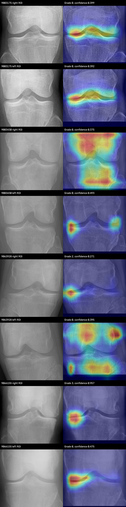

# Three-Model Weighted Soft-Voting App Evaluation

**Exact UTC evaluation timestamp:** 2026-07-24 09:03:08.287732 UTC

## Outcome

EfficientNet-B0 was added to the application ensemble alongside DenseNet-121 and SE-ResNeXt-50. The deployed default is a probability-level soft vote with weights `0.50 / 0.35 / 0.15`, respectively. The historical `/predict` response schema is unchanged.

The integration is technically successful: all 19 containerized tests passed, all 20 sampled radiographs returned HTTP 200, all 40 detected knees produced normalized probability vectors, and all returned heatmaps decoded at 384x384. These test images do not have KL labels, so this smoke test cannot establish that any weight scheme is more accurate.

The verified ensemble container is running at `http://127.0.0.1:8006`. The pre-existing healthy app on port 8005 was left running to avoid replacing an active service without an explicit deployment request.

## Checkpoints and Weight Rationale

| Component | Checkpoint run | Epoch | Test accuracy | Test QWK | Test macro F1 | Test macro AP | Default weight |
| --- | --- | ---: | ---: | ---: | ---: | ---: | ---: |
| DenseNet-121 | 2026-07-23 01:31:37.184239 UTC | 27 | **0.6612** | 0.8178 | **0.6811** | **0.7334** | **0.50** |
| SE-ResNeXt-50 | 2026-07-23 01:25:36.772175 UTC | 24 | 0.6389 | **0.8194** | 0.6671 | 0.7248 | **0.35** |
| EfficientNet-B0 | 2026-07-24 04:45:25.604705 UTC | 10 | 0.6051 | 0.7992 | 0.6258 | 0.6817 | **0.15** |

DenseNet receives the largest weight because it has the best accuracy, macro F1, macro AP, and macro AUC. SE-ResNeXt receives the second-largest weight because its predictive results are close to DenseNet, it has the best QWK, and it has the strongest CAM localization audit. EfficientNet-B0 receives 15% because it is the weakest standalone classifier but still provides different decisions and stronger Grade 1 validation recall.

This is a conservative deployment prior, not a learned optimum. Equal weighting would give the weakest model too much influence. A 20% B0 weight was also tested and produced almost the same decisions as 15%.

## Dynamic Heatmap Selection

For an ensemble prediction, the app first finds components whose individual argmax agrees with the final ensemble grade. It then chooses among those components using:

`component probability for final grade x joint_energy x (1 - border_energy)`

The localization reliability values derived from the completed CAM audits are:

| Component | Joint energy | Border energy | Reliability product |
| --- | ---: | ---: | ---: |
| DenseNet-121 | 0.7996 | 0.1323 | 0.6938 |
| SE-ResNeXt-50 | **0.8707** | **0.0749** | **0.8055** |
| EfficientNet-B0 | 0.8280 | 0.1080 | 0.7386 |

Across the 40 smoke-test knee predictions, heatmaps came from EfficientNet-B0 18 times, DenseNet-121 11 times, and SE-ResNeXt-50 11 times. The response does not expose this internal source, so the client-facing schema remains unchanged.

## Weight Trials

The same deterministic sample (`seed=20260724`) of 20 radiographs and 40 YOLO knee ROIs was used for every trial.

| Trial | Dense / SE / B0 | Grade distribution 0/1/2/3/4 | Mean confidence | Mean entropy | Matches a 2-model majority | Changed from DenseNet |
| --- | --- | --- | ---: | ---: | ---: | ---: |
| Equal | 33.3 / 33.3 / 33.3 | 13 / 8 / 13 / 5 / 1 | 0.4496 | 1.2348 | 23/40 | 25/40 |
| User example | 50 / 30 / 20 | 20 / 3 / 11 / 6 / 0 | 0.4246 | 1.2688 | 23/40 | 17/40 |
| **Selected** | **50 / 35 / 15** | **21 / 3 / 10 / 6 / 0** | **0.4206** | **1.2744** | **23/40** | **16/40** |
| Dense + SE only | 55 / 45 / 0 | 21 / 6 / 8 / 5 / 0 | 0.4153 | 1.2832 | 20/40 | 15/40 |
| Dense dominant | 60 / 30 / 10 | 27 / 3 / 6 / 4 / 0 | 0.4220 | 1.2788 | 20/40 | 9/40 |

Equal voting has the highest confidence on this sample, but confidence on unlabeled images is not evidence of correctness and can instead indicate overconfidence. The selected scheme and the user's 50/30/20 example differ on only one of 40 knees. The 15% B0 choice is preferred because it retains diversity while limiting the weakest standalone model's ability to overturn the two stronger models.

## API Smoke-Test Results

`D`, `S`, and `E` identify DenseNet-121, SE-ResNeXt-50, and EfficientNet-B0 as the dynamically selected heatmap source. Values are reported right knee / left knee.

| Image ID | Ensemble grades R/L | Confidence R/L | CAM source R/L | Request seconds |
| --- | --- | --- | --- | ---: |
| 9003175 | 0 / 0 | 0.399 / 0.392 | E / E | 1.225 |
| 9003430 | 0 / 0 | 0.375 / 0.493 | D / S | 1.013 |
| 9063928 | 2 / 0 | 0.271 / 0.395 | E / D | 0.977 |
| 9066155 | 3 / 0 | 0.957 / 0.475 | S / S | 1.218 |
| 9071669 | 2 / 2 | 0.797 / 0.659 | S / E | 1.218 |
| 9073948 | 0 / 0 | 0.537 / 0.547 | E / S | 0.968 |
| 9092247 | 0 / 0 | 0.427 / 0.379 | D / D | 0.983 |
| 9101270 | 0 / 2 | 0.312 / 0.377 | D / E | 0.989 |
| 9103642 | 3 / 1 | 0.514 / 0.410 | D / S | 1.314 |
| 9113501 | 1 / 0 | 0.475 / 0.509 | S / D | 1.035 |
| 9130855 | 2 / 3 | 0.347 / 0.341 | S / E | 1.014 |
| 9144057 | 0 / 0 | 0.337 / 0.407 | D / E | 1.014 |
| 9148091 | 3 / 0 | 0.288 / 0.242 | E / D | 1.039 |
| 9174216 | 1 / 3 | 0.404 / 0.424 | S / E | 1.033 |
| 9175204 | 2 / 2 | 0.432 / 0.472 | E / E | 1.021 |
| 9206908 | 0 / 3 | 0.319 / 0.336 | D / S | 1.011 |
| 9224866 | 0 / 0 | 0.402 / 0.398 | E / E | 1.027 |
| 9237473 | 0 / 0 | 0.328 / 0.403 | E / E | 1.003 |
| 9242457 | 0 / 2 | 0.315 / 0.273 | D / E | 0.988 |
| 9252748 | 2 / 2 | 0.356 / 0.301 | E / S | 0.980 |

Mean end-to-end request time was `1.053 seconds` on the CPU container, and the maximum was `1.314 seconds`. The 20 images produced 40 knee predictions with grade distribution `21 / 3 / 10 / 6 / 0`.

The validator checked the exact top-level keys `filename`, `predictions`, and `annotated_image`, plus the exact established per-knee keys. It also decoded every ROI, annotated image, and heatmap and verified that every five-grade probability vector summed to one.

## Heatmap Visual Review

The first bilateral case demonstrates that B0 can provide clean joint-line coverage. Several SE-ResNeXt maps are compact around the medial or lateral joint margin. However, the DenseNet maps for the right knee of image 9003430 and the left knee of image 9063928 include broad femoral and lower-tibial activation. Some other maps emphasize only one outer joint edge.

**Assessment:** the implementation and output are acceptable for an experimental deployment, but the heatmaps are not consistently anatomically perfect. Dynamic selection improves flexibility; it cannot correct a poor map when the only component agreeing with the ensemble grade is poorly localized.

## How to Obtain Defensible Best Weights

The best weights cannot be selected from these unlabeled images or from standalone summary metrics. The next evaluation should:

1. Export all three five-class probability vectors for every image in the same locked labeled validation split.
2. Fit temperature scaling for each model on that validation split before voting, because uncalibrated confidence changes the effective weight.
3. Search the probability simplex, for example in 0.05 increments where the three weights sum to one.
4. Rank weights using the predefined validation objective combining QWK, macro F1, and Grade 1 recall; include calibration error as a secondary check.
5. Compare the winner against DenseNet alone and the DenseNet + SE ensemble with paired bootstrap confidence intervals.
6. Freeze the weights and evaluate once on a newly locked holdout. Do not select weights using the repeatedly evaluated test set.

Until that experiment is available, `0.50 / 0.35 / 0.15` is the safest supported configuration, not a claim of optimality.

## Verification

| Check | Result |
| --- | --- |
| Strict loading of all three checkpoint architectures | Pass |
| Full containerized automated test suite | 19 passed |
| Docker build | Pass, image `knee-oa-ensemble-b0:20260724` |
| API requests | 20/20 HTTP 200 |
| Knee predictions | 40/40 valid |
| Existing `/predict` JSON schema | Unchanged |
| Probability normalization | Pass |
| Heatmap decoding and 384x384 dimensions | Pass |
| Visual CAM review | Mixed but operationally acceptable; limitations documented |
| Docker cleanup | 10 stopped project containers and 19 obsolete project image IDs removed |
| Remaining Docker images | Two, both referenced by healthy running containers |
