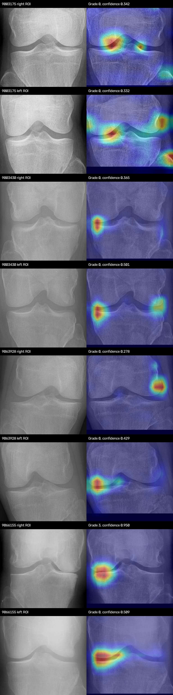

# Deployed Knee-OA API Full Test

**Test identifier:** `2026-07-24_16-50-26_365170_UTC`  
**Test start timestamp:** `2026-07-24 16:50:26.365170 UTC`  
**Report completed:** `2026-07-24 17:15:24.638256 UTC`  
**Deployment:** `http://54.254.113.71:8005`  
**Input folder:** `test_images`

## Executive Summary

The deployed API passed the complete sequential operational test. All 105
source images returned HTTP 200 and produced 209 knee predictions. Every
response preserved the established JSON schema, every five-class probability
vector summed to one, and every returned native-CAM image decoded at 384x384.
No request timed out and no HTTP 4xx/5xx response occurred.

The deployed model configuration is correct: DenseNet-121 epoch 27 and
SE-ResNeXt50-32x4d epoch 24 use probability-level soft voting with weights
0.55/0.45. Heatmaps use the gradient-free per-case anatomy-gated native-CAM
selector. EfficientNet-B0 is not loaded by production ensemble mode.

The primary operational concern is CPU latency. Mean end-to-end response time
was `11.893 s`, p95 was
`25.553 s`, and the maximum was
`38.501 s`. This is acceptable for batch review
but slow and variable for an interactive application.

This is not an accuracy evaluation. The test folder has no ground-truth KL
labels, so QWK, F1, precision, recall, AP, AUC, sensitivity, and specificity
cannot be calculated from this run.

## Deployed Configuration

| Field | Deployed value |
| --- | --- |
| Health | `healthy` |
| Device | `cpu` |
| Model | `densenet121+seresnext50_32x4d` |
| Architecture | `two_model_weighted_soft_voting_native_cam_ensemble` |
| Loss | `cross_entropy` |
| DenseNet checkpoint | `/app/checkpoints/densenet121/best_model.pth` |
| DenseNet selected epoch | `27` |
| SE-ResNeXt checkpoint | `/app/checkpoints/se_resnext50_32x4d/best_model (1).pth` |
| SE-ResNeXt selected epoch | `24` |
| Voting weights | DenseNet `0.55`, SE-ResNeXt `0.45` |
| Input | Resize `400x400`, center crop `384x384` |
| Laterality canonicalization | `True` |
| Heatmap method | `native_class_activation_map` |
| Heatmap source | `dynamic_per_case_anatomy_gate five-map head for the selected grade` |
| Gradient-free | `True` |

The `/health` endpoint exposed the selected validation metrics embedded in
both checkpoints. These are checkpoint metadata, not measurements from the
105 deployment images.

| Model | Validation accuracy | QWK | Macro F1 | Grade 1 recall | AP | AUC | Selection |
| --- | ---: | ---: | ---: | ---: | ---: | ---: | ---: |
| DenseNet-121 | 0.6683 | 0.8139 | 0.6952 | 0.4052 | 0.7198 | 0.8877 | 0.7276 |
| SE-ResNeXt50 | 0.6235 | 0.7873 | 0.6498 | 0.4183 | 0.6915 | 0.8752 | 0.7003 |

## API Contract Verification

| Check | Result |
| --- | --- |
| Source images | `105/105` completed |
| HTTP 200 | `105/105` |
| Knee predictions | `209` |
| One-knee source images | `1` |
| Two-knee source images | `104` |
| Empty-prediction responses | `0` |
| Top-level and per-knee schema | `unchanged` |
| Probability keys | Grades 0-4 present for every prediction |
| Probability normalization | Passed for 209/209 predictions |
| Annotated source images | All decoded |
| ROI images | All present ROI values decoded |
| Native-CAM images | `209/209 decoded at 384x384` |
| Request timeouts | `0` |
| HTTP 4xx/5xx | `0` |

The unchanged top-level keys are `filename`, `predictions`, and
`annotated_image`. Each prediction retains `predicted_class`,
`predicted_grade`, `confidence`, `description`, `details`, `box`,
`yolo_confidence`, `knee_side`, `roi_image`, and `gradcam_image`.
The historical `gradcam_image` field contains a native-CAM overlay.

## Prediction Distribution

| Predicted grade | Count | Share |
| ---: | ---: | ---: |
| 0 | 132 | 63.2% |
| 1 | 36 | 17.2% |
| 2 | 26 | 12.4% |
| 3 | 13 | 6.2% |
| 4 | 2 | 1.0% |

The grade distribution is not evidence of class-specific accuracy because
true grades are unavailable. Grade 0 dominates the predictions (132/209),
which should be checked against the expected deployment population once
labels or a representative audit sample are available.

## Confidence Distribution

| Measure | Value |
| --- | ---: |
| Mean | 0.4298 |
| Median | 0.3870 |
| Minimum | 0.2467 |
| Maximum | 0.9832 |
| Below 0.30 | 27 (12.9%) |
| Below 0.40 | 110 (52.6%) |
| Below 0.50 | 156 (74.6%) |

More than half of predictions are below 0.40 confidence. This does not prove
they are wrong, but the client should present them as uncertain and avoid
turning the top class into an unconditional clinical statement. Calibration
must be measured on labeled, patient-separated data before selecting a
clinical confidence threshold.

## Latency

Times are sequential public-network, upload-to-complete-response measurements.
They include image upload, YOLO, both CNNs, native-CAM selection/rendering,
JPEG/base64 serialization, and response download.

| Measure | Seconds |
| --- | ---: |
| Minimum | 4.269 |
| Median | 10.253 |
| Mean | 11.893 |
| p90 | 21.136 |
| p95 | 25.553 |
| p99 | 30.084 |
| Maximum | 38.501 |
| Cumulative request time | 1248.813 |

### Ten Slowest Requests

| Seconds | Knees | Predicted grades | Image |
| ---: | ---: | --- | --- |
| 38.501 | 2 | 1, 2 | `9113529_20050809_00990604_png.rf.CD48yLcMciyqzMinCXxt.png` |
| 30.084 | 2 | 2, 1 | `9211011_20050412_00706803_png.rf.LxaEv53I6v3WTqarjWr5.png` |
| 29.670 | 2 | 1, 1 | `9125977_20050117_00535303_png.rf.Fl4ivIDmMgDuna2p79HY.png` |
| 28.250 | 2 | 0, 0 | `9062161_20050622_00908903_png.rf.JkoIrCc0GopURMxamq6s.png` |
| 26.745 | 2 | 0, 0 | `9023617_20050606_00829903_png.rf.MgcYqK7oyB7fEp3X166B.png` |
| 25.553 | 2 | 0, 0 | `9016121_20050531_00840103_png.rf.Kl0XDRx5PMGs3SvepTxy.png` |
| 24.639 | 2 | 2, 3 | `9093126_20050328_00674603_png.rf.FqpuZ37ilL8Z1U3Mb3Uo.png` |
| 21.884 | 2 | 1, 0 | `9153255_20050829_01083703_png.rf.NDbfMDPztKl5l5NlhF8Z.png` |
| 21.869 | 2 | 3, 1 | `9103642_20050727_00953903_png.rf.OBJR97nzL02JNKCy3bR1.png` |
| 21.803 | 2 | 1, 1 | `9310416_20051129_01252703_png.rf.BbR6UeL0njDo3hXIsOfv.png` |

Latency varies too much for a predictable interactive experience. The slowest
two-knee request was 38.501 seconds, while the fastest request was 4.269
seconds. This run was sequential, so the variance was not caused by this
client sending concurrent requests.

## Heatmap Review

The deployed endpoint returns the expected anatomy-gated native-CAM behavior:

- `9003430` no longer has the large diffuse upper-femur/lower-tibia map
  produced by the former global-agreement selector. Its activation is now
  concentrated near the lateral joint margin.
- `9063928` similarly changes from broad off-joint activation to joint-level
  lateral activation.
- `9003175` and some other Grade 0 cases retain secondary edge or lower-tibia
  activation. The maps are not uniformly clean.
- `9066155` Grade 3 has high confidence and joint-level activation, but the
  hotspot remains localized to a lateral region rather than displaying every
  radiographic feature relevant to the KL grade.

The visual conclusion is therefore **improved broad joint localization, not
lesion-exact explanation**. A native CAM is faithful to the model's class-map
head, but it is not a segmentation of osteophytes or joint-space narrowing.
The endpoint returns only the blended overlay, so joint energy, border energy,
and anatomy-gate pass/fallback counts cannot be independently recomputed from
the remote response. Those metrics require the unblended CAM or server logs.

## Per-Image Results

Grades and confidences are listed in API prediction order. With two detected
knees, the application normally returns anatomical right then left after
sorting the YOLO boxes left-to-right.

| Image | HTTP | Knees | Grades | Confidences | Seconds |
| --- | ---: | ---: | --- | --- | ---: |
| `1-3-10001-14-16884261493054281463096396612987982484_png.rf.DRJWNylAfyDMaqhZcZzY.png` | 200 | 1 | 2 | 0.7979 | 9.865 |
| `9002116_20050608_00829603_png.rf.LxHKIP5p75roIZJ7vJl0.png` | 200 | 2 | 2 / 3 | 0.7290 / 0.6587 | 19.148 |
| `9003175_20050511_00771504_png.rf.IoxlFMVl0YwSkDAlE75n.png` | 200 | 2 | 0 / 0 | 0.3420 / 0.3317 | 10.253 |
| `9003430_20050602_00834204_png.rf.Kpd9DSkhjuW0yLXWtExz.png` | 200 | 2 | 0 / 0 | 0.3648 / 0.5008 | 5.752 |
| `9007422_20041130_00406404_png.rf.LqRaNgiaqvX8VQ2wKGey.png` | 200 | 2 | 1 / 3 | 0.4477 / 0.6907 | 5.414 |
| `9011420_20050610_00849804_png.rf.P3Ff9BKWLnZFwzcTN93e.png` | 200 | 2 | 0 / 0 | 0.3472 / 0.3848 | 12.372 |
| `9014209_20050420_00764204_png.rf.BgYjHFaw9P7Zjj2Hi9DB.png` | 200 | 2 | 3 / 0 | 0.6379 / 0.3259 | 5.766 |
| `9016121_20050531_00840103_png.rf.Kl0XDRx5PMGs3SvepTxy.png` | 200 | 2 | 0 / 0 | 0.6842 / 0.6342 | 25.553 |
| `9022197_20050425_00756604_png.rf.F7er1mizejdQ3sAA3ltY.png` | 200 | 2 | 0 / 0 | 0.3274 / 0.2829 | 12.159 |
| `9023407_20050627_00893604_png.rf.LtXd1EbyiZZl23pdtyyC.png` | 200 | 2 | 0 / 0 | 0.5043 / 0.6175 | 8.105 |
| `9023617_20050606_00829903_png.rf.MgcYqK7oyB7fEp3X166B.png` | 200 | 2 | 0 / 0 | 0.4629 / 0.5983 | 26.745 |
| `9028786_20040804_00166004_png.rf.Bsl66novNjJgoVtHFNqz.png` | 200 | 2 | 0 / 0 | 0.3698 / 0.3665 | 8.010 |
| `9028904_20050614_00862704_png.rf.NtRNOk6gwZ1jzPPYWBrv.png` | 200 | 2 | 0 / 0 | 0.4794 / 0.4112 | 19.388 |
| `9035779_20041028_00368804_png.rf.MoNZGRxe0kpuGqGDdNXC.png` | 200 | 2 | 1 / 0 | 0.3068 / 0.3040 | 10.046 |
| `9036770_20041103_00355704_png.rf.JfYUy3p48lj2mDUCIFcy.png` | 200 | 2 | 0 / 1 | 0.3684 / 0.3770 | 9.741 |
| `9037223_20050504_00787304_png.rf.ONoi3w5ER8WyfOL3hwZV.png` | 200 | 2 | 0 / 1 | 0.2847 / 0.3166 | 11.579 |
| `9043005_20050624_00866304_png.rf.MEMbrd4J97iyDpE06sk1.png` | 200 | 2 | 1 / 0 | 0.3712 / 0.3203 | 5.420 |
| `9043507_20050628_00894004_png.rf.ILoBR5eUgJ8V3OnFd61t.png` | 200 | 2 | 1 / 0 | 0.3161 / 0.3820 | 5.876 |
| `9044005_20050630_00918404_png.rf.HPSTMXezinz1eoHTAuuZ.png` | 200 | 2 | 0 / 0 | 0.3061 / 0.3223 | 11.233 |
| `9058960_20050708_00883504_png.rf.KWBGRsADgxzHr9CosB4U.png` | 200 | 2 | 0 / 0 | 0.3560 / 0.3000 | 4.697 |
| `9059946_20050629_00894404_png.rf.KHVXglOqZiHuZTZbJGAb.png` | 200 | 2 | 0 / 0 | 0.6191 / 0.6610 | 5.477 |
| `9062161_20050622_00908903_png.rf.JkoIrCc0GopURMxamq6s.png` | 200 | 2 | 0 / 0 | 0.4317 / 0.4069 | 28.250 |
| `9063428_20050713_00883304_png.rf.FC2L6MLVmvyike0UiS6Q.png` | 200 | 2 | 0 / 0 | 0.3692 / 0.3870 | 12.413 |
| `9063928_20050706_00936604_png.rf.LRfuXW5YKk9oloWTXpP5.png` | 200 | 2 | 0 / 0 | 0.2783 / 0.4290 | 9.578 |
| `9066155_20050708_00966103_png.rf.MPbUeDHCeJ08c8TNVNVc.png` | 200 | 2 | 3 / 0 | 0.9499 / 0.5094 | 11.569 |
| `9069117_20050628_00907403_png.rf.IJ2Oenzw0AV8h8252JDt.png` | 200 | 2 | 2 / 2 | 0.6059 / 0.4463 | 10.055 |
| `9069736_20040812_00216303_png.rf.HqiZ3eq4ht4hHLE6Wqiu.png` | 200 | 2 | 0 / 0 | 0.4628 / 0.6466 | 21.136 |
| `9071669_20050708_00965703_png.rf.HKQqLbzxnyMTEG8gxBOw.png` | 200 | 2 | 2 / 2 | 0.8385 / 0.6285 | 15.685 |
| `9073948_20050720_00872804_png.rf.DKP8MOkczeKpzMXYuhzY.png` | 200 | 2 | 0 / 0 | 0.5176 / 0.5521 | 7.062 |
| `9074437_20050714_00882504_png.rf.M151RetlhthIeG1kvPtb.png` | 200 | 2 | 0 / 0 | 0.3192 / 0.3011 | 11.782 |
| `9075880_20051108_01201903_png.rf.EfeHguUUHr6aThhNXsyq.png` | 200 | 2 | 0 / 0 | 0.6047 / 0.5155 | 16.204 |
| `9078486_20060207_01363303_png.rf.GKIYVOY4lgIEy5TnSfeh.png` | 200 | 2 | 3 / 2 | 0.4158 / 0.5176 | 19.326 |
| `9082640_20060131_01355806_png.rf.Jfoohg20sy10zd2HgoNx.png` | 200 | 2 | 0 / 1 | 0.3859 / 0.3002 | 5.808 |
| `9083500_20051102_01231103_png.rf.LGPWgLqVHmVaqERLhRGf.png` | 200 | 2 | 2 / 0 | 0.4649 / 0.3987 | 15.482 |
| `9084244_20050713_00882904_png.rf.KeLFWmXZVUYLTcl0AP46.png` | 200 | 2 | 0 / 0 | 0.3044 / 0.3608 | 16.207 |
| `9086407_20050725_00954404_png.rf.IKDcVHr9lQLozCRYjGmE.png` | 200 | 2 | 0 / 0 | 0.4773 / 0.5228 | 6.664 |
| `9090740_20050728_00961104_png.rf.J4XyzfOlcX0GMzLv4lkv.png` | 200 | 2 | 0 / 0 | 0.3120 / 0.3709 | 5.605 |
| `9090860_20050121_00470304_png.rf.IPMmoSCf5RpDraatpUV3.png` | 200 | 2 | 0 / 0 | 0.6914 / 0.7181 | 13.638 |
| `9091337_20050110_00515703_png.rf.Kg7MTUR6gUAINYv6sEzq.png` | 200 | 2 | 1 / 4 | 0.5283 / 0.6240 | 17.634 |
| `9092247_20050725_00954504_png.rf.FqZVZAVbMGRmTOIOIOZ1.png` | 200 | 2 | 0 / 0 | 0.4638 / 0.4132 | 5.467 |
| `9093126_20050328_00674603_png.rf.FqpuZ37ilL8Z1U3Mb3Uo.png` | 200 | 2 | 2 / 3 | 0.4427 / 0.7586 | 24.639 |
| `9095715_20051216_01282904_png.rf.GYRH8Kxd0KhNhPGfnyzh.png` | 200 | 2 | 3 / 0 | 0.2554 / 0.2964 | 5.142 |
| `9095839_20050110_00515603_png.rf.IXJ2hcdV5MmPwN6bYIvl.png` | 200 | 2 | 0 / 0 | 0.6054 / 0.6153 | 13.697 |
| `9101270_20060112_01341904_png.rf.HnrorxY9UUFgR284D2Su.png` | 200 | 2 | 0 / 2 | 0.3430 / 0.3020 | 10.387 |
| `9103642_20050727_00953903_png.rf.OBJR97nzL02JNKCy3bR1.png` | 200 | 2 | 3 / 1 | 0.5676 / 0.4618 | 21.869 |
| `9106510_20051020_01199604_png.rf.HHVUbYFPou1GD6SiHbIW.png` | 200 | 2 | 1 / 0 | 0.2851 / 0.3259 | 10.527 |
| `9109062_20051108_01265903_png.rf.J5v8ffaCxfDkphk4XoyP.png` | 200 | 2 | 2 / 2 | 0.5102 / 0.4500 | 19.917 |
| `9113018_20050823_01021904_png.rf.OuHM1BOTusoaKaVkcEnV.png` | 200 | 2 | 3 / 2 | 0.3218 / 0.4226 | 7.007 |
| `9113501_20050121_00470204_png.rf.MTsZZYtp4OkpgvBIuFwS.png` | 200 | 2 | 1 / 0 | 0.5000 / 0.5007 | 7.066 |
| `9113529_20050809_00990604_png.rf.CD48yLcMciyqzMinCXxt.png` | 200 | 2 | 1 / 2 | 0.3946 / 0.3868 | 38.501 |
| `9114285_20060217_01415504_png.rf.ExVzm5qyHBzjsZjx0H23.png` | 200 | 2 | 0 / 0 | 0.4260 / 0.3730 | 9.941 |
| `9121030_20050111_00467004_png.rf.DrxZnAAPXAsBCr7il6ZU.png` | 200 | 2 | 1 / 0 | 0.4409 / 0.4919 | 8.922 |
| `9123289_20050426_00756904_png.rf.MzcZcL5w2JiHkMxRtUEQ.png` | 200 | 2 | 0 / 1 | 0.3596 / 0.3376 | 5.409 |
| `9125977_20050117_00535303_png.rf.Fl4ivIDmMgDuna2p79HY.png` | 200 | 2 | 1 / 1 | 0.4066 / 0.5505 | 29.670 |
| `9127197_20050803_00969503_png.rf.O9p1cNkXG9HcNb49BFA6.png` | 200 | 2 | 0 / 0 | 0.5236 / 0.6611 | 19.778 |
| `9130855_20050901_01066504_png.rf.OSLq7IuCFDRCDHM7xZCF.png` | 200 | 2 | 2 / 3 | 0.3483 / 0.2786 | 14.250 |
| `9140600_20050928_01160704_png.rf.IUVhrv61NA6IULRd2wV8.png` | 200 | 2 | 0 / 0 | 0.2669 / 0.3694 | 6.507 |
| `9143628_20051118_01261503_png.rf.FdG1dwxw8evFkkitFtso.png` | 200 | 2 | 1 / 0 | 0.4427 / 0.4404 | 18.789 |
| `9144057_20050912_01075604_png.rf.OxxKxv8WYL4dvgD4mPBv.png` | 200 | 2 | 0 / 1 | 0.3099 / 0.3969 | 5.363 |
| `9148091_20050930_01161004_png.rf.MfZAR6uPUg9kMXvPKd39.png` | 200 | 2 | 1 / 0 | 0.2809 / 0.2686 | 7.302 |
| `9150876_20050914_01075204_png.rf.FvZJJ2AHOLrfinO11ZAx.png` | 200 | 2 | 0 / 2 | 0.4434 / 0.3436 | 14.670 |
| `9152569_20050923_01110604_png.rf.E36WKBOQFNaNfjZ7OEBb.png` | 200 | 2 | 0 / 0 | 0.3339 / 0.3524 | 14.527 |
| `9153255_20050829_01083703_png.rf.NDbfMDPztKl5l5NlhF8Z.png` | 200 | 2 | 1 / 0 | 0.4541 / 0.4630 | 21.884 |
| `9155861_20050503_00786904_png.rf.C8oFpqKfFYEodqwS10Zl.png` | 200 | 2 | 0 / 0 | 0.2979 / 0.3403 | 14.143 |
| `9156694_20050927_01115704_png.rf.J4JKpNek135J8aDKD4Z5.png` | 200 | 2 | 0 / 1 | 0.3107 / 0.3492 | 15.096 |
| `9156716_20050812_02452901_png.rf.M74Saer5VCjpPQry7ppJ.png` | 200 | 2 | 1 / 0 | 0.3451 / 0.4977 | 4.269 |
| `9157384_20050921_00972004_png.rf.I8ljDYc7A3y6UuSetn72.png` | 200 | 2 | 3 / 2 | 0.3409 / 0.2467 | 5.632 |
| `9159401_20051013_01127304_png.rf.LrppOnkIDYjASRMCUHuP.png` | 200 | 2 | 0 / 0 | 0.3036 / 0.2899 | 6.041 |
| `9168012_20050406_00708603_png.rf.M5GcCgRehIUykQDl4mBt.png` | 200 | 2 | 0 / 0 | 0.4808 / 0.5144 | 17.177 |
| `9173792_20050914_01149903_png.rf.MKrb6lxzAohnPIfdzKhH.png` | 200 | 2 | 4 / 2 | 0.9832 / 0.4597 | 15.024 |
| `9174216_20050928_01115804_png.rf.BsFZbCBfLWl1efhF5Ssr.png` | 200 | 2 | 1 / 3 | 0.3984 / 0.3597 | 9.362 |
| `9175204_20051010_01049404_png.rf.IcbG1jLJcU6DIpEOay8E.png` | 200 | 2 | 2 / 2 | 0.3995 / 0.4239 | 13.306 |
| `9175691_20050928_01115904_png.rf.DyY0pf7jhhGAPCGDvLl3.png` | 200 | 2 | 0 / 0 | 0.2833 / 0.3050 | 14.587 |
| `9180105_20050216_00602804_png.rf.Jkw8q4kZ5UcDJ5CCOfhJ.png` | 200 | 2 | 1 / 1 | 0.4917 / 0.4830 | 5.736 |
| `9184556_20051012_01049804_png.rf.N4jBqxcN7yl4T1WnqInh.png` | 200 | 2 | 0 / 0 | 0.3277 / 0.3531 | 15.044 |
| `9184790_20050829_01083403_png.rf.LOQ5Zn6XmYasUjxjv6ju.png` | 200 | 2 | 0 / 0 | 0.5741 / 0.5452 | 7.227 |
| `9194860_20051013_01167704_png.rf.MlvwcjwqCfyluj75LsSA.png` | 200 | 2 | 0 / 0 | 0.5949 / 0.5088 | 15.205 |
| `9197274_20051118_01264204_png.rf.Odscjw6oWDI9bf5axevZ.png` | 200 | 2 | 0 / 1 | 0.3202 / 0.2827 | 9.935 |
| `9205285_20050831_01086503_png.rf.GLVnS3Bm4HIDZIacUlhJ.png` | 200 | 2 | 0 / 1 | 0.4257 / 0.4120 | 10.773 |
| `9206908_20051004_01139304_png.rf.CpWGwHfQsWejBXEtqKfU.png` | 200 | 2 | 0 / 3 | 0.3598 / 0.4054 | 7.383 |
| `9207905_20051017_01170404_png.rf.MS7V0CjqV4nbiReJHyNc.png` | 200 | 2 | 0 / 0 | 0.3203 / 0.2947 | 6.067 |
| `9209533_20050516_00727004_png.rf.CM0Sggw7OUGjef6MRtYs.png` | 200 | 2 | 1 / 0 | 0.3574 / 0.2756 | 4.873 |
| `9211011_20050412_00706803_png.rf.LxaEv53I6v3WTqarjWr5.png` | 200 | 2 | 2 / 1 | 0.5525 / 0.4334 | 30.084 |
| `9211751_20051027_01196605_png.rf.KE409NhzYAbQCZ1wCBZi.png` | 200 | 2 | 0 / 0 | 0.3550 / 0.2875 | 5.128 |
| `9221040_20050617_00859604_png.rf.I5LRYvYoUs93imwjYtOT.png` | 200 | 2 | 0 / 2 | 0.3849 / 0.2887 | 6.571 |
| `9224866_20060412_01476204_png.rf.L1nP9Xcg59jClZwOgxDY.png` | 200 | 2 | 0 / 0 | 0.3502 / 0.3372 | 7.348 |
| `9226514_20050523_00801204_png.rf.EVaOFSlvKzApIyWiYGBh.png` | 200 | 2 | 0 / 0 | 0.3143 / 0.3303 | 6.718 |
| `9230363_20060503_01516804_png.rf.MIGftIPDm2odAQQuTrdE.png` | 200 | 2 | 0 / 0 | 0.3687 / 0.3371 | 6.413 |
| `9231843_20051108_01265803_png.rf.H2p6sl096USudJhHmbh6.png` | 200 | 2 | 0 / 0 | 0.4749 / 0.4570 | 13.224 |
| `9232259_20050920_01148903_png.rf.COzEFflpV65sT6dk1Sr4.png` | 200 | 2 | 0 / 0 | 0.7791 / 0.6795 | 16.899 |
| `9233869_20060315_01442704_png.rf.D7d6CW8GVwKQ7jt8CAcI.png` | 200 | 2 | 1 / 1 | 0.2979 / 0.3065 | 4.560 |
| `9237029_20050222_00588104_png.rf.M38BhdM04YLXnNL83fTX.png` | 200 | 2 | 0 / 0 | 0.5793 / 0.6243 | 5.771 |
| `9237473_20050620_00859904_png.rf.JVsHfc30mkvXWUwv9UxA.png` | 200 | 2 | 0 / 1 | 0.2666 / 0.3547 | 14.792 |
| `9240045_20041102_00372003_png.rf.JMDd6N1aOVKIgB8wPzNx.png` | 200 | 2 | 1 / 2 | 0.4686 / 0.4919 | 12.878 |
| `9240548_20060425_01505504_png.rf.JehPynnTkRfCmj8bl4uJ.png` | 200 | 2 | 0 / 0 | 0.6188 / 0.5235 | 4.908 |
| `9242457_20050519_00797004_png.rf.OU3MQpn884Iyff4c7kJM.png` | 200 | 2 | 0 / 0 | 0.3447 / 0.2946 | 6.233 |
| `9245448_20050518_00726804_png.rf.JC9iMc1JXMvlVtMUk3TF.png` | 200 | 2 | 1 / 2 | 0.2568 / 0.2731 | 4.900 |
| `9245760_20050920_01148803_png.rf.GA7QfipfpwP6DrKLXSN6.png` | 200 | 2 | 0 / 0 | 0.7762 / 0.7117 | 13.189 |
| `9249027_20060504_01523204_png.rf.F3tyXKnwKGyPHxWVrwch.png` | 200 | 2 | 0 / 0 | 0.3188 / 0.3218 | 7.815 |
| `9249760_20060222_01417904_png.rf.Kg0BRYF8ru9qRAYGg1xT.png` | 200 | 2 | 0 / 0 | 0.3042 / 0.2651 | 6.557 |
| `9252748_20060221_01387304_png.rf.Jdkdta7ph5qJHZF1g1hb.png` | 200 | 2 | 2 / 2 | 0.3343 / 0.3057 | 5.495 |
| `9254422_20050510_00771704_png.rf.NdYUX5YqKKKxz83XDka8.png` | 200 | 2 | 0 / 0 | 0.3226 / 0.3063 | 15.322 |
| `9258563_20060522_01573404_png.rf.P0rgZCUMTeyWwZDUwSNe.png` | 200 | 2 | 0 / 0 | 0.4173 / 0.4384 | 12.159 |
| `9262046_20060522_01573204_png.rf.BVwM9brENrzJKyVkdq4V.png` | 200 | 2 | 0 / 0 | 0.2892 / 0.3303 | 5.241 |
| `9310416_20051129_01252703_png.rf.BbR6UeL0njDo3hXIsOfv.png` | 200 | 2 | 1 / 1 | 0.4235 / 0.4728 | 21.803 |

## Assessment

### Acceptable

- Correct production checkpoints, epochs, architecture, vote weights, and
  native-CAM selector are deployed.
- All 105 images completed without an API error.
- The `/predict` response schema is unchanged.
- Every prediction has a valid probability vector and decodable explanation.
- The known gross heatmap-placement failures are improved at deployment.

### Needs Improvement

1. **Instrument and reduce latency.** Record YOLO, DenseNet, SE-ResNeXt, CAM
   rendering, and serialization times separately. Check EC2 CPU credit
   throttling, thread oversubscription, available vCPUs, and memory pressure.
   Benchmark after fixing `torch`/OpenMP thread counts. Consider ONNX Runtime
   or a suitable GPU only after stage-level profiling identifies CNN inference
   as the dominant cost.
2. **Expose uncertainty safely.** A majority of predictions are below 0.40.
   Keep all five probabilities visible and present low-confidence output as
   review-required. Do not invent a clinical threshold from this unlabeled run.
3. **Audit the 42 known local anatomy-gate fallback cases on the server.** The
   public schema should remain unchanged, but server-side structured logs can
   record heatmap source, gate pass/fallback, joint energy, border energy, and
   lower-tibia energy for monitoring.
4. **Do not overstate CAM precision.** Lateral joint hotspots remain. Exact
   osteophyte/JSN explanation requires landmark, compartment, or lesion-level
   supervision and expert review, not stronger post-processing alone.
5. **Secure the public endpoint.** The tested deployment uses public plain HTTP
   and exposes interactive API documentation. Place it behind HTTPS, define
   authentication/authorization as appropriate, restrict security-group access,
   cap upload size, and add rate limiting before handling clinical data.
6. **Lock runtime dependencies.** Pin and test the Python dependency set so a
   rebuild cannot silently change inference or image-encoding behavior.

## Evidence Files

- [Raw all-image result](assets/2026-07-24_16-50-26_365170_UTC_remote_api_smoke.json)
- [Health response](assets/2026-07-24_16-50-26_365170_UTC_remote_health.json)
- [Model metadata response](assets/2026-07-24_16-50-26_365170_UTC_remote_models.json)
- [Remote heatmap montage](assets/2026-07-24_16-50-26_365170_UTC_remote_heatmap_montage.jpg)
- [Complete three-model and ensemble documentation](../../three_model_kl_system.md)

## Final Decision

The deployed API is functionally correct and stable across the entire local
test-image folder. It is suitable for controlled demonstration and further
validation. It is not yet supported as a clinical diagnostic system because
this deployment test has no labels, latency is high and variable, confidence
is frequently low, CAMs are not lesion-exact, and the endpoint still needs
production security and monitoring controls.
