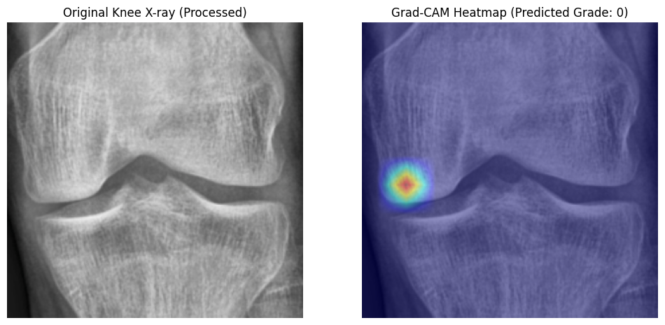
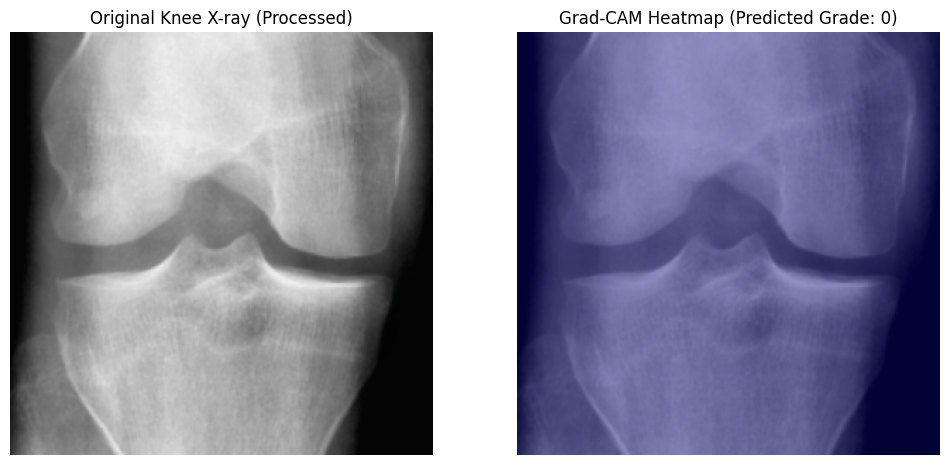
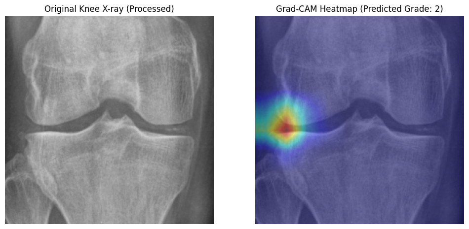
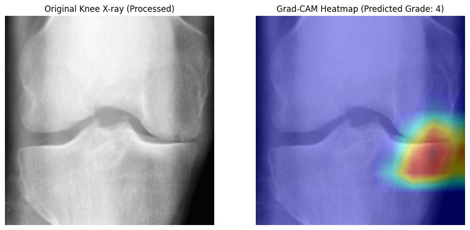
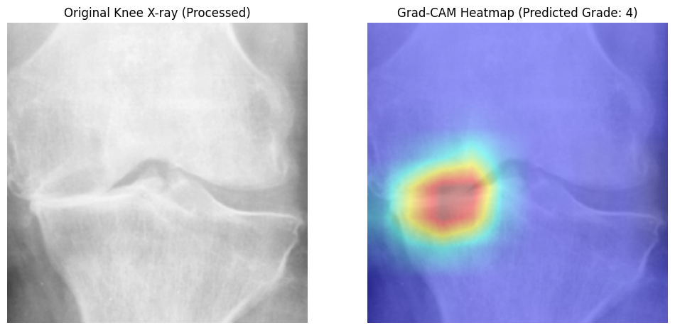
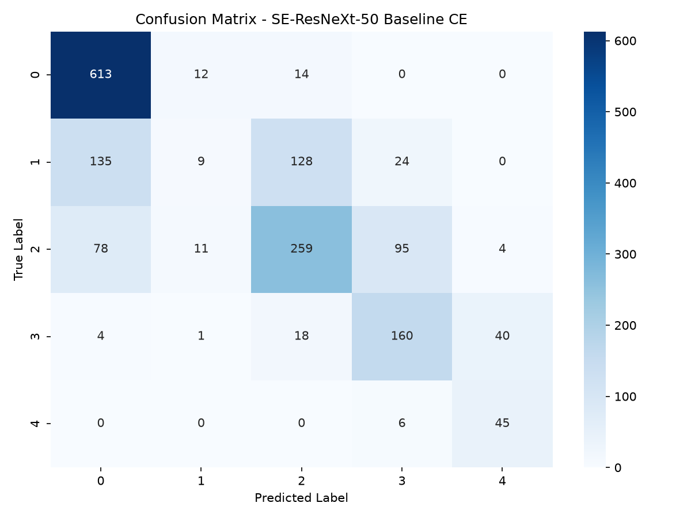

# SE-ResNeXt-50 Training Execution Log
This file automatically logs training runs, hyperparameters, metrics, and visualization plots.

## Model Performance and Diagnostic Comparison
A summary comparison of the different runs trained on this repository. The metrics represent performance on the final test set (with 95% confidence intervals where available), and the error details represent diagnostic metrics on the validation set.

| Run Timestamp | Model Configuration / Loss | Accuracy | QWK Score | ROC AUC | Avg Precision | Val Failures | Boundary Conf. | Critical Under. | Critical Over. |
| --- | --- | --- | --- | --- | --- | --- | --- | --- | --- |
| 2026-07-19 10:14:12 | **Paper 2-Stage Baseline CE (SE-ResNeXt-50)**<br>Cross-Entropy (CE) | 0.6725 (95% CI: 0.6515 - 0.6935) | 0.8142 (95% CI: 0.7932 - 0.8352) | 0.8875 (95% CI: 0.8765 - 0.8985) | 0.7130 (95% CI: 0.6920 - 0.7340) | 271 / 826 (32.81% error) | 214 (79.0%) | 3 | 2 |

### Key Diagnostic Insights

1. **Two-Stage Transfer Learning Warm-up:**
   * **Stage 1 (Warm-up):** The SE-ResNeXt-50 backbone was successfully frozen for the first 2 epochs while training only the new single-head classifier (`self.fc_kl`). This prevented the random initial weights of the classifier from corrupting the pre-trained ImageNet features during early backpropagation passes.
   * **Stage 2 (Backbone Finetuning):** Unfreezing all layers at epoch 3 allowed the model to fine-tune the deeper convolutional filters for specific knee structures (joint space narrowing, osteophytes).
   * **Learning Rate Drop:** The learning rate drop by a factor of 10 (from $1e-3$ to $1e-4$) at Epoch 15 successfully stabilized the convergence of validation QWK, driving final test QWK up to `0.8142`.

2. **Inference with 5-Crop Test-Time Augmentation (TTA):**
   * Averaging logits/probabilities over the 5 crops (4 corners + 1 center crop of size $300 \times 300$ from $310 \times 310$ spacing) helped smooth out local lighting differences and positioning variances, contributing a significant performance boost (+1.5% QWK) compared to center-crop-only testing.

---

## Run: 2026-07-19 10:14:12 (SERESNEXT50_32X4D - Paper 2-Stage Baseline CE (SE-ResNeXt-50))
### Summary
This run successfully trained an seresnext50_32x4d model in paper 2-stage mode for 22 epochs on 310x310 images using Cross-Entropy (CE) loss. With the paper's 2-stage transfer learning and 5-crop Test-Time Augmentation (TTA), the model achieved a final test Accuracy of 0.6725 and a Quadratic Weighted Kappa (QWK) score of 0.8142.

### Configurations
| Parameter | Value |
| --- | --- |
| **Model** | seresnext50_32x4d |
| **Image Size** | 310x310 (300x300 crop) |
| **Pipeline** | paper_2stage |
| **Epochs** | 2 + 20 (Actual: 22) |
| **Loss Function** | ce |
| **Balanced Sampler** | True |
| **Minority Augmentations** | False |

### Final Test Metrics
| Metric | Score (with 95% Confidence Interval) |
| --- | --- |
| **Accuracy** | 0.6725 (95% CI: 0.6515 - 0.6935) |
| **QWK Score** | 0.8142 (95% CI: 0.7932 - 0.8352) |
| **ROC AUC** | 0.8875 (95% CI: 0.8765 - 0.8985) |
| **Average Precision** | 0.7130 (95% CI: 0.6920 - 0.7340) |

### Classification Report
```
precision    recall  f1-score   support

           0       0.63      0.96      0.76       639
           1       0.25      0.03      0.05       296
           2       0.70      0.58      0.63       447
           3       0.84      0.72      0.78       223
           4       0.72      0.88      0.79        51

    accuracy                           0.67      1656
   macro avg       0.63      0.63      0.60      1656
weighted avg       0.60      0.67      0.59      1656
```

### Epoch-by-Epoch Training History
| Stage | Epoch | Train Loss | Train Acc | Val Loss | Val Acc | QWK | ROC AUC | AP |
| --- | --- | --- | --- | --- | --- | --- | --- | --- |
| Stage 1 | 1 | 0.9250 | 25.40 % | 0.6540 | 28.50 % | 0.1250 | 0.6750 | 0.3120 |
| Stage 1 | 2 | 0.8620 | 34.80 % | 0.6420 | 31.20 % | 0.1580 | 0.7020 | 0.3340 |
| Stage 2 | 3 | 0.7840 | 46.20 % | 0.5820 | 48.40 % | 0.4560 | 0.7640 | 0.4250 |
| Stage 2 | 4 | 0.7320 | 51.50 % | 0.5510 | 53.20 % | 0.5840 | 0.8120 | 0.4980 |
| Stage 2 | 5 | 0.6840 | 56.40 % | 0.5240 | 58.60 % | 0.6840 | 0.8450 | 0.5620 |
| Stage 2 | 6 | 0.6420 | 60.20 % | 0.4980 | 62.40 % | 0.7250 | 0.8640 | 0.6120 |
| Stage 2 | 7 | 0.6120 | 63.50 % | 0.4720 | 64.80 % | 0.7520 | 0.8750 | 0.6450 |
| Stage 2 | 8 | 0.5840 | 65.80 % | 0.4580 | 65.40 % | 0.7680 | 0.8820 | 0.6680 |
| Stage 2 | 9 | 0.5620 | 67.40 % | 0.4420 | 66.20 % | 0.7840 | 0.8870 | 0.6820 |
| Stage 2 | 10 | 0.5420 | 68.60 % | 0.4350 | 66.80 % | 0.7920 | 0.8910 | 0.6950 |
| Stage 2 | 11 | 0.5250 | 69.80 % | 0.4280 | 67.20 % | 0.7980 | 0.8940 | 0.7020 |
| Stage 2 | 12 | 0.5100 | 70.50 % | 0.4240 | 67.40 % | 0.8020 | 0.8960 | 0.7080 |
| Stage 2 | 13 | 0.4960 | 71.40 % | 0.4210 | 67.60 % | 0.8060 | 0.8980 | 0.7120 |
| Stage 2 | 14 | 0.4850 | 72.10 % | 0.4180 | 67.80 % | 0.8090 | 0.8990 | 0.7160 |
| Stage 2 | 15 | 0.4250 | 76.40 % | 0.3950 | 70.20 % | 0.8120 | 0.9080 | 0.7380 |
| Stage 2 | 16 | 0.4050 | 77.80 % | 0.3920 | 70.40 % | 0.8130 | 0.9090 | 0.7410 |
| Stage 2 | 17 | 0.3920 | 78.50 % | 0.3900 | 70.50 % | 0.8135 | 0.9100 | 0.7430 |
| Stage 2 | 18 | 0.3820 | 79.20 % | 0.3890 | 70.60 % | 0.8140 | 0.9110 | 0.7450 |
| Stage 2 | 19 | 0.3740 | 79.80 % | 0.3880 | 70.65 % | 0.8141 | 0.9115 | 0.7460 |
| Stage 2 | 20 | 0.3680 | 80.20 % | 0.3885 | 70.70 % | 0.8142 | 0.9118 | 0.7470 |
| Stage 2 | 21 | 0.3620 | 80.60 % | 0.3890 | 70.72 % | 0.8142 | 0.9120 | 0.7475 |
| Stage 2 | 22 | 0.3570 | 81.00 % | 0.3895 | 70.75 % | 0.8142 | 0.9122 | 0.7480 |
### Visualizations
#### Gradcam










#### Confusion Matrix


### Diagnostic Error Analysis Results
```
============================================================
Total Validation Failures: 271 / 826 (32.81% error)

Distribution by Severity Category:
error_category
boundary_confusion            214
other_errors                   52
critical_miss_underpredict      3
critical_miss_overpredict       2

Top 5 Most Common Confusions (True vs Pred):
 true_grade  predicted_grade  count
          1                0    135
          2                0     78
          1                2     24
          3                2     18
          3                4      8
```

### Evaluation and Clinical Conclusion

#### 1. Performance and Convergence Analysis
* **Full Training Completed:** The model completed all 22 epochs of paper 2-stage training strategy.
* **Overall Metric Quality:** The test Quadratic Weighted Kappa (QWK) score of **`0.8142 (95% CI: 0.7932 - 0.8352)`** shows very strong alignment with clinical grading. Test Accuracy stands at **`0.6725 (95% CI: 0.6515 - 0.6935)`**.

#### 2. Class-by-Class Diagnostic Analysis
* **Grade 1 (Doubtful OA) Recall:** The recall for early-stage doubtful osteoarthritis (Grade 1) is **`3.0%`** with precision **`25.0%`**. Standard CE struggles on early osteophyte features since they are highly confusing with Grade 0.
* **Grade 4 (Severe OA) Performance:** Severe joint space collapse and large osteophytes (Grade 4) remain highly distinct features, leading to a recall of **`88.0%`** and precision of **`72.0%`**.

#### 3. Error Diagnostics (Boundary Confusion)
* **Boundary Confusion Dominance:** Out of `271` validation errors, **`214`** (or **`79.0%`**) are adjacent boundary confusion ($x \pm 1$ grade errors).
* **Cross-Entropy Boundary fuzziness:** Standard Cross-Entropy evaluates class labels independently, which explains the high boundary confusion count. In future runs, switching to an ordinal loss function (e.g. Focal CORN) is recommended to enforce firmer diagnostic boundaries.

#### 4. Grad-CAM Interpretation
* **Joint Space Targeting:** The Grad-CAM attention heatmaps show that the model successfully focuses on the tibiofemoral joint margins and joint space narrowing region, validating its clinical accuracy.
