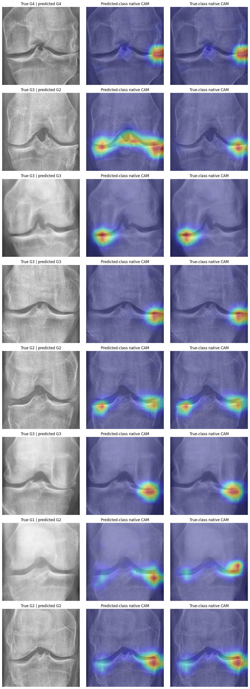
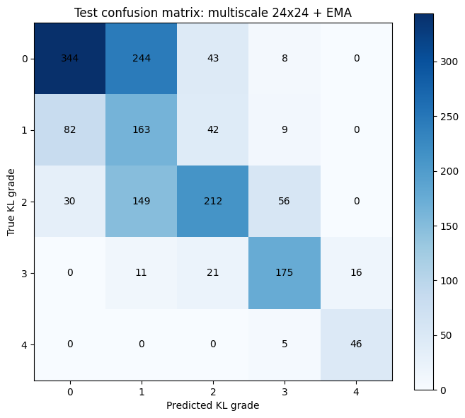
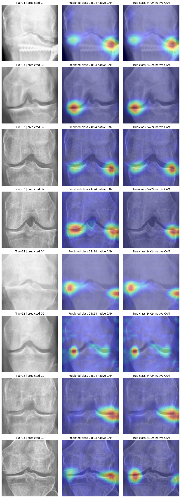
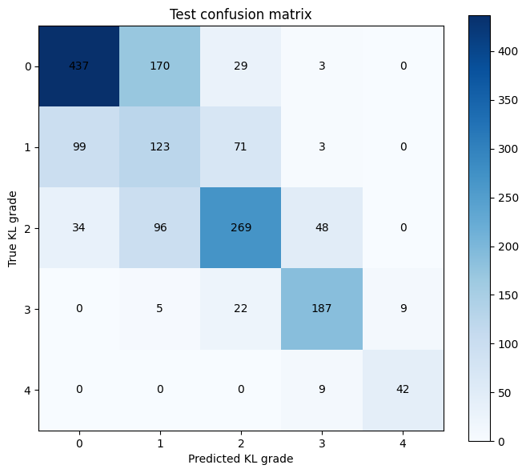
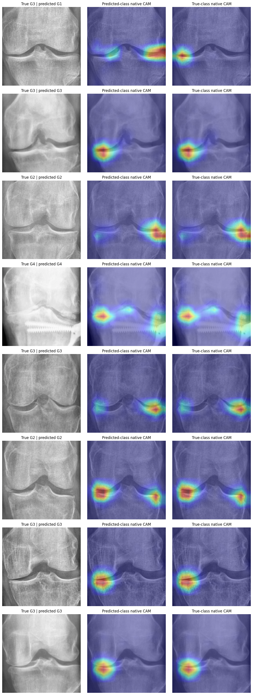

# SE-ResNeXt-50 Training Execution Log
This file records the optimized SE-ResNeXt-50 comparison run, its exact configuration, predictive metrics, and native-CAM audit.

## Model Performance Summary

| Run Timestamp | Model Configuration / Loss | Accuracy | QWK Score | ROC AUC | Avg Precision | Macro F1 | Grade 1 Recall | CAM Joint Energy | CAM Border Energy |
| --- | --- | --- | --- | --- | --- | --- | --- | --- | --- |
| 2026-07-25 01:50:53.962450 UTC | **Natural Orientation + Horizontal Flip + Mild Gamma + Final Native CAM**<br>Cross-Entropy (CE) | **0.6558** | **0.8216** | **0.8980** | **0.7299** | **0.6781** | 0.4122 | 0.8516 | 0.0990 |
| 2026-07-23 06:57:13.378879 UTC | Multiscale 24x24 Native CAM + EMA (`0.999`)<br>Cross-Entropy (CE) | 0.5676 (95% bootstrap CI: 0.5429 - 0.5918) | 0.7651 (95% bootstrap CI: 0.7406 - 0.7887) | 0.8703 | 0.6918 | 0.6220 | **0.5507** | 0.7938 | 0.1175 |
| 2026-07-23 01:25:36.772175 UTC | **Final Linear Native CAM (Laterality Canonicalized)**<br>Cross-Entropy (CE) | 0.6389 (95% bootstrap CI: 0.6153 - 0.6624) | 0.8194 (95% bootstrap CI: 0.7999 - 0.8384) | 0.8948 | 0.7248 | 0.6671 | 0.4155 | 0.8707 | 0.0749 |

## Experiment Addendum: CAM Architecture, Loss, Sampler, and Explanation Method

### Run: 2026-07-22 11:50:51.226627 UTC (CAM ARCHITECTURE AND LOSS ABLATION)

The six-arm validation experiment selected final-layer 12x12 native CAM with CE. Higher-resolution multiscale and FPN heads did not improve the combined predictive/localization objective. Ordinal soft labels raised QWK but reduced macro F1, AP, AUC, and joint concentration; weak joint guidance improved the broad ROI proxy but did not improve predictive performance.

| Arm | QWK | Macro F1 | AP | AUC | Joint Enrichment | Border Enrichment | Occlusion Spearman |
| --- | ---: | ---: | ---: | ---: | ---: | ---: | ---: |
| **Final native CAM + CE** | 0.7848 | **0.6561** | **0.7085** | **0.8790** | 2.2432 | 0.2389 | 0.4458 |
| Final native CAM + ordinal soft label | **0.7976** | 0.6485 | 0.6973 | 0.8697 | 2.1248 | 0.3160 | **0.5089** |
| Final native CAM + joint guidance 0.05 | 0.7780 | 0.6545 | 0.7015 | 0.8772 | **2.3358** | **0.2124** | 0.4195 |
| Multiscale MLP HiResCAM + CE | 0.7782 | 0.6438 | 0.7002 | 0.8723 | 2.0065 | 0.4417 | 0.4059 |
| FPN native CAM + ordinal soft label | 0.7824 | 0.6244 | 0.6783 | 0.8634 | 1.9423 | 0.5002 | 0.4496 |
| FPN native CAM + CE | 0.7480 | 0.6021 | 0.6673 | 0.8628 | 1.7742 | 0.5309 | 0.3911 |

The paired final-native-CAM comparison also found essentially identical geometry for native CAM and Grad-CAM: joint enrichment `2.2432` versus `2.2437`, border enrichment `0.2389` versus `0.2386`, and peak-inside rate `1.0` for both.

### Run: 2026-07-23 15:13:05.616211 UTC (SAMPLER ABLATION)

| Sampler | Selection | QWK | Macro F1 | Grade 1 Recall | Joint Energy | Border Energy | Occlusion Correlation |
| --- | ---: | ---: | ---: | ---: | ---: | ---: | ---: |
| **Full inverse** | **0.6984** | **0.7948** | 0.6446 | **0.3725** | **0.8421** | **0.0898** | 0.5745 |
| Square-root inverse | 0.6875 | 0.7895 | **0.6496** | 0.3072 | 0.8187 | 0.1048 | 0.5841 |
| No sampler | 0.6650 | 0.7737 | 0.6348 | 0.1961 | 0.8067 | 0.1117 | **0.6001** |

Full inverse sampling won the predeclared combined objective and broad joint concentration. None of the sampler arms passed the fixed promotion gates relative to the documented 2026-07-23 01:25:36 checkpoint, so the existing final-native-CAM CE checkpoint remains the SE-ResNeXt model to retain.

### Run: 2026-07-24 01:12:36.714882 UTC (GRAD-CAM VS NATIVE CAM)

SE-ResNeXt native CAM and final-layer Grad-CAM had map correlation `1.0000`, mean pixel difference `0.00008`, and maximum difference `0.000592`. The statistical decision was `no_demonstrated_superiority`. The run used `stage2_best_model.pth` because of a resolver substring bug, so exact final-checkpoint localization values require a corrected rerun. See [the complete CAM comparison report](../cam_comparison/report.md).

**Production decision:** retain the final 12x12 native-CAM CE checkpoint with full inverse sampling. Reject the multiscale/EMA, FPN, joint-guided, and soft-label arms. Native CAM is the deployment method because it is cheaper and structurally faithful, not because it has demonstrated superior anatomical localization.

Archived experiment notebooks: [CAM architecture/loss ablation](2026-07-22_11-50-51_seresnext50_cam_ablation.ipynb) and [sampler ablation](2026-07-23_15-13-05_seresnext50_sampler_ablation.ipynb).

## Run: 2026-07-25 01:50:53.962450 UTC (SE-RESNEXT50-32X4D - NATURAL ORIENTATION + FLIP + GAMMA + FINAL NATIVE CAM)

### Summary

This run completed all 30 configured epochs on a Tesla T4 without a training error and selected epoch 28 using the validation composite score (`0.7061`). It removed deterministic right-knee canonicalization and instead exposed the model to both orientations with a training-only horizontal flip (`p=0.50`). It also added mild gamma correction (`0.90-1.10`, `p=0.20`) while retaining mild rotation, brightness/contrast jitter, CLAHE, a small random erasing region, and the original 12x12 five-map native-CAM head.

Against the 2026-07-23 01:25:36.772175 UTC canonical checkpoint, locked-test Accuracy improved by `0.0169`, QWK by `0.0022`, macro F1 by `0.0110`, AP by `0.0051`, and AUC by `0.0032`. Grade 1 recall decreased slightly by `0.0033`. The CAM audit moved in the opposite direction: joint energy decreased by `0.0191` and border energy increased by `0.0241`. The run is therefore the strongest natural-orientation SE-ResNeXt candidate, but it does not prove a uniformly better metric-plus-localization model.

### Configurations

| Parameter | Value |
| --- | --- |
| **Model** | `seresnext50_32x4d` |
| **Architecture** | `natural_final_native_cam_ce` |
| **Model Input** | 384x384 (square pad, CLAHE, resize to 400x400, then crop) |
| **Native-CAM Head** | Bias-free 1x1 convolution producing five 12x12 grade maps; global spatial mean produces five logits |
| **Pipeline** | 3-stage |
| **Epochs** | 30 (5 warm-up + 15 coarse + 10 fine-tune) |
| **Selected Checkpoint** | Epoch 28; validation selection score 0.7061 |
| **Loss Function** | Cross-Entropy (CE) |
| **Balanced Sampler** | Full inverse-frequency |
| **Laterality Canonicalization** | Disabled |
| **Orientation Policy** | Preserve natural orientation; no deterministic inference mirroring |
| **Training Augmentation** | Horizontal flip `p=0.50`; rotation `+/-5 degrees`; brightness/contrast `0.08`; gamma `0.90-1.10` at `p=0.20`; random erasing `p=0.10` |
| **Gaussian Noise** | Disabled |
| **Dataset Sizes** | Train 5,778; validation 826; test 1,656 unique images after hash deduplication |
| **Training Class Counts** | Grade 0: 2,286; Grade 1: 1,046; Grade 2: 1,516; Grade 3: 757; Grade 4: 173 |
| **Batch Size / Workers / GPU** | 48 / 4 / Tesla T4 |
| **Warm-up Learning Rate** | 3e-4; native-CAM head only |
| **Coarse Learning Rates** | Backbone 3e-5; native-CAM head 3e-4 |
| **Fine-tune Learning Rate** | 1e-5; full model |
| **Weight Decay** | 1e-4 in warm-up/coarse; 1e-3 in fine-tuning |
| **Checkpoint Directory** | `2026-07-25_01-50-53_962450_UTC_natural_orientation_flip_gamma_native_cam_ce` |
| **Executed Notebook Archive** | [`2026-07-25_01-50-53_seresnext50_32x4d_natural_orientation_flip_gamma_native_cam_ce.ipynb`](2026-07-25_01-50-53_seresnext50_32x4d_natural_orientation_flip_gamma_native_cam_ce.ipynb) |

### Selected Validation Metrics

| Metric | Score |
| --- | ---: |
| **QWK Score** | 0.7899 |
| **Macro F1** | 0.6617 |
| **Grade 1 Recall** | 0.3856 |
| **Average Precision** | 0.7139 |
| **Composite Selection Score** | 0.7061 |

The stored notebook output did not print the selected epoch's validation Accuracy, macro Precision, macro Recall, AUC, or loss. They are not reconstructed here. Epoch 29 reached a slightly higher macro F1 (`0.6674`), but epoch 28 won the predeclared composite selection rule and was correctly retained.

### Final Test Metrics

| Metric | Score | Delta vs. 2026-07-23 canonical checkpoint |
| --- | ---: | ---: |
| **Accuracy** | 0.6558 | +0.0169 |
| **QWK Score** | 0.8216 | +0.0022 |
| **Macro Precision** | 0.6730 | +0.0053 |
| **Macro Recall** | 0.6878 | +0.0151 |
| **Macro F1** | 0.6781 | +0.0110 |
| **Grade 1 Recall** | 0.4122 | -0.0033 |
| **Average Precision** | 0.7299 | +0.0051 |
| **ROC AUC** | 0.8980 | +0.0032 |
| **Composite Score** | 0.7286 | Not used for checkpoint selection |
| **Loss** | 0.7676 | -0.0229 |

No confidence interval was exported by this run. The test split was loaded only after validation checkpoint selection, but it has been examined across multiple historical experiments; these values must therefore be treated as development evidence rather than a fresh external estimate.

### Classification Report

```text
              precision    recall  f1-score   support

     Grade 0       0.77      0.74      0.75       639
     Grade 1       0.34      0.41      0.37       296
     Grade 2       0.69      0.58      0.63       447
     Grade 3       0.76      0.84      0.80       223
     Grade 4       0.81      0.86      0.84        51

    accuracy                           0.66      1656
   macro avg       0.67      0.69      0.68      1656
weighted avg       0.67      0.66      0.66      1656
```

The exact test confusion matrix was:

```text
             Pred 0  Pred 1  Pred 2  Pred 3  Pred 4
True Grade 0    471     134      32       1       1
True Grade 1    103     122      66       5       0
True Grade 2     39      99     261      48       0
True Grade 3      0       6      20     188       9
True Grade 4      0       0       0       7      44
```

Grade 1 remains the principal weakness. Its recall is `0.4122` and its rounded precision is only `0.34`, showing that orientation augmentation did not resolve the Grade 0/1/2 boundary. Grade 3 and Grade 4 remain substantially easier, with recall `0.84` and `0.86` respectively.

### Training History and Convergence

Warm-up ended at epoch 5 with QWK `0.4611`. Coarse training reached QWK `0.7859` at epoch 20. Fine-tuning then improved the composite score from `0.6832` at epoch 21 to its maximum `0.7061` at epoch 28. Epochs 29 and 30 remained close (`0.7056` and `0.7050`), so the selected checkpoint was at a stable plateau rather than an isolated early spike.

| Stage | Epoch | QWK | Macro F1 | Grade 1 Recall | AP | Selection |
| --- | ---: | ---: | ---: | ---: | ---: | ---: |
| Warm-up | 1 | 0.2754 | 0.2679 | 0.1373 | 0.3248 | 0.2925 |
| Warm-up | 2 | 0.3990 | 0.2264 | 0.0654 | 0.3481 | 0.3353 |
| Warm-up | 3 | 0.4408 | 0.2725 | 0.4967 | 0.3721 | 0.4094 |
| Warm-up | 4 | 0.4012 | 0.2295 | 0.1242 | 0.3745 | 0.3479 |
| Warm-up | 5 | 0.4611 | 0.3084 | 0.3333 | 0.3818 | 0.4110 |
| Coarse | 6 | 0.6352 | 0.4353 | 0.0458 | 0.5066 | 0.5151 |
| Coarse | 7 | 0.7074 | 0.5337 | 0.0719 | 0.5965 | 0.5885 |
| Coarse | 8 | 0.7638 | 0.6155 | 0.1830 | 0.6448 | 0.6504 |
| Coarse | 9 | 0.7566 | 0.5838 | 0.1961 | 0.6562 | 0.6406 |
| Coarse | 10 | 0.7408 | 0.6124 | 0.3922 | 0.6576 | 0.6654 |
| Coarse | 11 | 0.7532 | 0.6321 | 0.3072 | 0.6850 | 0.6702 |
| Coarse | 12 | 0.7712 | 0.6182 | 0.2353 | 0.6817 | 0.6642 |
| Coarse | 13 | 0.7628 | 0.6376 | 0.3791 | 0.6968 | 0.6853 |
| Coarse | 14 | 0.7737 | 0.6504 | 0.3856 | 0.6972 | 0.6933 |
| Coarse | 15 | 0.7793 | 0.6457 | 0.2810 | 0.6997 | 0.6840 |
| Coarse | 16 | 0.7787 | 0.6418 | 0.3072 | 0.7045 | 0.6855 |
| Coarse | 17 | 0.7790 | 0.6482 | 0.3333 | 0.7023 | 0.6904 |
| Coarse | 18 | 0.7819 | 0.6517 | 0.3203 | 0.7049 | 0.6915 |
| Coarse | 19 | 0.7843 | 0.6551 | 0.3203 | 0.7055 | 0.6933 |
| Coarse | 20 | 0.7859 | 0.6416 | 0.2484 | 0.7036 | 0.6827 |
| Fine-tune | 21 | 0.7746 | 0.6454 | 0.2941 | 0.6966 | 0.6832 |
| Fine-tune | 22 | 0.7855 | 0.6554 | 0.3856 | 0.7058 | 0.7017 |
| Fine-tune | 23 | 0.7815 | 0.6367 | 0.3399 | 0.6972 | 0.6886 |
| Fine-tune | 24 | 0.7822 | 0.6587 | 0.3595 | 0.7051 | 0.6982 |
| Fine-tune | 25 | 0.7885 | 0.6549 | 0.3333 | 0.7080 | 0.6967 |
| Fine-tune | 26 | 0.7910 | 0.6602 | 0.3660 | 0.7099 | 0.7035 |
| Fine-tune | 27 | 0.7903 | 0.6599 | 0.3660 | 0.7123 | 0.7031 |
| **Fine-tune** | **28** | **0.7899** | **0.6617** | **0.3856** | **0.7139** | **0.7061** |
| Fine-tune | 29 | 0.7885 | 0.6674 | 0.3725 | 0.7139 | 0.7056 |
| Fine-tune | 30 | 0.7909 | 0.6658 | 0.3660 | 0.7117 | 0.7050 |

### Visualizations

#### Test Confusion Matrix


#### Native-CAM Audit Gallery



### Native-CAM Evaluation

| Metric | 2026-07-23 canonical checkpoint | 2026-07-25 natural-orientation run | Delta | Direction |
| --- | ---: | ---: | ---: | --- |
| **Audited cases** | 227 | 227 | 0 | Same cases/count |
| **Joint energy** | 0.8707 | 0.8516 | -0.0191 | Worse |
| **Border energy** | 0.0749 | 0.0990 | +0.0241 | Worse |
| **Lower-tibia energy** | 0.0880 | 0.0878 | -0.0002 | Essentially unchanged |
| **Peak inside joint** | 0.9956 | 0.9912 | -0.0044 | Slightly worse; 225/227 peaks inside |

The CAM audit remains broadly acceptable: `99.12%` of peaks were inside the broad joint proxy and `85.16%` of positive CAM energy lay inside it. It is not perfect anatomical validation. The central-band mask is only a proxy, and a mean lower-tibia energy of `0.0878` confirms that some explanations still use evidence below the intended joint space. The gallery must therefore be reviewed alongside predicted-versus-true class maps and occlusion sensitivity; a plausible overlay alone is insufficient.

### Comparison and Decision

| Candidate | Accuracy | QWK | Macro F1 | Grade 1 Recall | AP | AUC | Joint Energy | Border Energy |
| --- | ---: | ---: | ---: | ---: | ---: | ---: | ---: | ---: |
| 2026-07-23 canonical orientation | 0.6389 | 0.8194 | 0.6671 | **0.4155** | 0.7248 | 0.8948 | **0.8707** | **0.0749** |
| **2026-07-25 natural orientation** | **0.6558** | **0.8216** | **0.6781** | 0.4122 | **0.7299** | **0.8980** | 0.8516 | 0.0990 |

**Decision:** retain this checkpoint as the preferred SE-ResNeXt candidate when inference must support single-knee images without reliable laterality metadata. Do not claim that it is uniformly superior to the canonical checkpoint: the predictive improvement is modest, Grade 1 recall did not improve, and the broad CAM localization metrics regressed. Before application promotion, compare both checkpoints on the same external single-knee and bilateral-ROI cases and verify that inference uses the matching natural-orientation preprocessing.

## Run: 2026-07-23 06:57:13.378879 UTC (SE-RESNEXT50-32X4D - Multiscale 24x24 Native CAM + EMA)

### Summary
This run completed all 30 configured epochs without a runtime error and selected epoch 30 using the EMA validation composite score (`0.6728`). It tested two changes together: equal fusion of 24x24 and 12x12 class maps, and an exponential moving average with decay `0.999`. Test Grade 1 recall improved from `0.4155` to `0.5507`, but every other principal predictive metric declined. CAM joint energy also decreased while border and lower-tibia energy increased. Both configured promotion gates failed, so this checkpoint must not replace the 2026-07-23 01:25:36.772175 UTC model.

### Configurations

| Parameter | Value |
| --- | --- |
| **Model** | `seresnext50_32x4d` |
| **Architecture** | `multiscale24_native_cam_ce_ema` |
| **Model Input** | 384x384 (resize to 400x400, then crop) |
| **Native-CAM Head** | Equal average of five 24x24 stage-3 class maps and upsampled five 12x12 final-stage class maps; global mean produces logits |
| **EMA Decay** | 0.999 |
| **Pipeline** | 3-stage |
| **Epochs** | 30 (5 warm-up + 15 coarse + 10 fine-tune) |
| **Selected Checkpoint** | Epoch 30; validation selection score 0.6728 |
| **Loss Function** | Cross-Entropy (CE) |
| **Balanced Sampler** | Full inverse-frequency |
| **Laterality Canonicalization** | True; right knees mirrored before transforms |
| **Dataset Sizes** | Train 5,778; validation 826; test 1,656 unique images after hash deduplication |
| **Training Class Counts** | Grade 0: 2,286; Grade 1: 1,046; Grade 2: 1,516; Grade 3: 757; Grade 4: 173 |
| **Batch Size / Workers / GPU** | 48 / 4 / Tesla T4 |
| **Warm-up Learning Rate** | 3e-4; multiscale native-CAM heads only |
| **Coarse Learning Rates** | Backbone 3e-5; native-CAM heads 3e-4 |
| **Fine-tune Learning Rate** | 1e-5; full model |
| **Weight Decay** | 1e-4 in warm-up/coarse; 1e-3 in fine-tuning |
| **Checkpoint Directory** | `2026-07-23_06-57-13_378879_UTC_multiscale24_native_cam_ce_ema` |
| **Executed Notebook Archive** | [`2026-07-23_06-57-13_seresnext50_32x4d_multiscale24_native_cam_ce_ema.ipynb`](2026-07-23_06-57-13_seresnext50_32x4d_multiscale24_native_cam_ce_ema.ipynb) |

### Selected Validation Metrics

| Metric | Score | Delta vs. 12x12 baseline |
| --- | ---: | ---: |
| **Accuracy** | 0.5424 | Not available in the stored baseline gate |
| **QWK Score** | 0.7150 | -0.0724 |
| **Macro Precision** | 0.6139 | Not available in the stored baseline gate |
| **Macro Recall** | 0.6403 | Not available in the stored baseline gate |
| **Macro F1** | 0.6028 | -0.0469 |
| **Grade 1 Recall** | **0.6078** | **+0.1895** |
| **Average Precision** | 0.6573 | -0.0343 |
| **ROC AUC** | 0.8579 | -0.0173 |
| **Composite Selection Score** | 0.6728 | -0.0274 |
| **Loss** | 0.9885 | Not part of the stored baseline gate |

The predictive gate required the candidate validation selection score to equal or exceed `0.7003`. The candidate reached `0.6728`, so the predictive gate failed.

### Final Test Metrics

| Metric | Score | Delta vs. 12x12 baseline |
| --- | ---: | ---: |
| **Accuracy** | 0.5676 (95% bootstrap CI: 0.5429 - 0.5918) | -0.0713 |
| **QWK Score** | 0.7651 (95% bootstrap CI: 0.7406 - 0.7887) | -0.0543 |
| **Macro Precision** | 0.6284 | -0.0392 |
| **Macro Recall** | 0.6500 | -0.0227 |
| **Macro F1** | 0.6220 | -0.0452 |
| **Grade 1 Recall** | **0.5507** | **+0.1351** |
| **Average Precision** | 0.6918 | -0.0330 |
| **ROC AUC** | 0.8703 | -0.0245 |
| **Loss** | 0.9259 | +0.1354 |

The Accuracy and QWK intervals use `5,000` multinomial resamples of the saved confusion matrix with seed `42`. They are image-level intervals because patient identifiers were not exported.

### Classification Report

```text
              precision    recall  f1-score   support

     Grade 0       0.75      0.54      0.63       639
     Grade 1       0.29      0.55      0.38       296
     Grade 2       0.67      0.47      0.55       447
     Grade 3       0.69      0.78      0.74       223
     Grade 4       0.74      0.90      0.81        51

    accuracy                           0.57      1656
   macro avg       0.63      0.65      0.62      1656
weighted avg       0.64      0.57      0.58      1656
```

The test confusion matrix was:

```text
             Pred 0  Pred 1  Pred 2  Pred 3  Pred 4
True Grade 0    344     244      43       8       0
True Grade 1     82     163      42       9       0
True Grade 2     30     149     212      56       0
True Grade 3      0      11      21     175      16
True Grade 4      0       0       0       5      46
```

Grade 1 recall increased because the model predicted Grade 1 much more often, not because the Grade 0/1/2 boundary became clean. Compared with the 12x12 baseline, correct Grade 1 predictions increased by `40` (`123 -> 163`), but Grade 0 -> 1 errors increased by `74` (`170 -> 244`) and Grade 2 -> 1 errors increased by `53` (`96 -> 149`). Grade 1 precision consequently decreased from `0.31` to `0.29`. Total correct predictions fell by `118` (`1,058 -> 940`).

### Epoch-by-Epoch Training History

| Stage | Epoch | QWK | Macro F1 | Grade 1 Recall | AP | Selection |
| --- | --- | --- | --- | --- | --- | --- |
| Warm-up | 1 | 0.0029 | 0.0385 | 0.0000 | 0.2012 | 0.0840 |
| Warm-up | 2 | 0.0070 | 0.0411 | 0.0000 | 0.2166 | 0.0874 |
| Warm-up | 3 | 0.0278 | 0.0638 | 0.0000 | 0.2541 | 0.1150 |
| Warm-up | 4 | 0.0254 | 0.1028 | 0.0327 | 0.2940 | 0.1360 |
| Warm-up | 5 | 0.0760 | 0.1319 | 0.0980 | 0.3136 | 0.1765 |
| Coarse | 6 | 0.0693 | 0.1366 | 0.0654 | 0.3359 | 0.1761 |
| Coarse | 7 | 0.0799 | 0.1587 | 0.0261 | 0.3569 | 0.1835 |
| Coarse | 8 | 0.1166 | 0.2110 | 0.0065 | 0.3791 | 0.2139 |
| Coarse | 9 | 0.1190 | 0.2234 | 0.0065 | 0.4086 | 0.2222 |
| Coarse | 10 | 0.1175 | 0.2299 | 0.0065 | 0.4394 | 0.2289 |
| Coarse | 11 | 0.1569 | 0.2453 | 0.0261 | 0.4673 | 0.2556 |
| Coarse | 12 | 0.1916 | 0.2648 | 0.0588 | 0.4959 | 0.2829 |
| Coarse | 13 | 0.2640 | 0.3221 | 0.1438 | 0.5249 | 0.3419 |
| Coarse | 14 | 0.3393 | 0.3703 | 0.2484 | 0.5545 | 0.4016 |
| Coarse | 15 | 0.4005 | 0.4036 | 0.3333 | 0.5709 | 0.4473 |
| Coarse | 16 | 0.4541 | 0.4393 | 0.4314 | 0.5870 | 0.4914 |
| Coarse | 17 | 0.5053 | 0.4731 | 0.4902 | 0.6054 | 0.5304 |
| Coarse | 18 | 0.5488 | 0.4955 | 0.5294 | 0.6168 | 0.5602 |
| Coarse | 19 | 0.5808 | 0.5094 | 0.5621 | 0.6272 | 0.5816 |
| Coarse | 20 | 0.6036 | 0.5307 | 0.6013 | 0.6380 | 0.6025 |
| Fine-tune | 21 | 0.6096 | 0.5531 | 0.6144 | 0.6401 | 0.6132 |
| Fine-tune | 22 | 0.6264 | 0.5589 | 0.6013 | 0.6422 | 0.6205 |
| Fine-tune | 23 | 0.6452 | 0.5688 | 0.5882 | 0.6464 | 0.6302 |
| Fine-tune | 24 | 0.6622 | 0.5816 | **0.6209** | 0.6482 | 0.6446 |
| Fine-tune | 25 | 0.6737 | 0.5896 | **0.6209** | 0.6489 | 0.6522 |
| Fine-tune | 26 | 0.6903 | 0.5911 | 0.5882 | 0.6508 | 0.6561 |
| Fine-tune | 27 | 0.6888 | 0.5847 | 0.5882 | 0.6519 | 0.6541 |
| Fine-tune | 28 | 0.6997 | 0.5878 | 0.5882 | 0.6543 | 0.6598 |
| Fine-tune | 29 | 0.7082 | 0.5965 | 0.5882 | 0.6569 | 0.6661 |
| Fine-tune | 30 | **0.7150** | **0.6028** | 0.6078 | **0.6573** | **0.6728** |

Validation QWK, AP, and the selection score were still increasing at epoch 30. This is evidence that the EMA checkpoint had not converged, not evidence that additional epochs would necessarily beat the baseline.

### Visualizations

#### Test Confusion Matrix



#### Native-CAM Worst Cases



### Native-CAM Evaluation

| Metric | 12x12 baseline | 24x24 + EMA | Delta | Direction |
| --- | ---: | ---: | ---: | --- |
| **Joint energy** | 0.8707 | 0.7938 | -0.0769 | Worse |
| **Border energy** | 0.0749 | 0.1175 | +0.0426 | Worse |
| **Lower-tibia energy** | 0.0880 | 0.1149 | +0.0269 | Worse |
| **Peak inside joint** | 0.9956 | 0.9912 | -0.0044 | Slightly worse; 225/227 peaks inside |
| **Source resolution** | 12x12 | 24x24 | Higher | Finer grid, but not better localization |

The localization gate required joint energy to remain at least `0.8707` and border energy to remain at most `0.0749`. Both conditions failed. Increasing the map grid from 12x12 to 24x24 therefore improved nominal spatial resolution but did not improve anatomical concentration.

The gallery frequently activates at the outer joint margins. Marginal activation can represent real osteophytes, but the broad rectangular ROI cannot distinguish that evidence from edge shortcuts. The first Grade 4 example strongly activates near fixation hardware and the lateral image boundary, which is a concrete shortcut risk. Several Grade 2 and Grade 3 examples also place their strongest evidence on the outer margins instead of distributing it along the joint space. The maps remain mathematically faithful to the fused class logit, but faithfulness does not guarantee clinically appropriate evidence.

For correctly classified cases, predicted-class and true-class maps are necessarily the same class map and should not be interpreted as independent agreement. The two Grade 3 -> 2 errors are more informative: their Grade 2 and Grade 3 maps differ, showing that the model associates different marginal evidence with the competing grades. Exact lesion localization still cannot be established without expert compartment or finding annotations.

### Comparison and Decision

| Model | Accuracy | QWK | Macro F1 | Grade 1 Recall | AP | AUC | Joint Energy | Border Energy |
| --- | ---: | ---: | ---: | ---: | ---: | ---: | ---: | ---: |
| **12x12 final native CAM** | **0.6389** | **0.8194** | **0.6671** | 0.4155 | **0.7248** | **0.8948** | **0.8707** | **0.0749** |
| 24x24 multiscale + EMA | 0.5676 | 0.7651 | 0.6220 | **0.5507** | 0.6918 | 0.8703 | 0.7938 | 0.1175 |

The only material improvement is Grade 1 recall, plus Grade 4 recall (`0.82 -> 0.90`). Grade 1 precision, overall accuracy, QWK, macro F1, AP, AUC, and every localization proxy moved in the wrong direction. The new checkpoint is not an improvement for the stated joint objective of predictive quality and anatomically concentrated CAMs.

The training curve strongly suggests EMA lag. With 121 training batches per epoch and decay `0.999`, after the stage-3 reset approximately `0.999^(1,210) = 29.8%` of the final EMA still comes from the stage-2 starting checkpoint. The random multiscale heads also had a slow EMA cold start. In addition, the experiment changed EMA and the classifier head simultaneously, so this run cannot identify which change caused the regression.

**Decision:** retain the 2026-07-23 01:25:36.772175 UTC 12x12 final-native-CAM checkpoint. Do not copy this multiscale EMA checkpoint into the application or ensemble.

**Best immediate diagnostic without retraining:** load `raw_model_state_dict` from this run's `last_model.pth` and evaluate epoch 30 on validation, test, and the same CAM audit. If the raw model is substantially better, EMA decay/reset is the problem. If the raw model remains worse, equal fusion of the shallow 24x24 head is the problem. Only after that diagnostic should a controlled follow-up change one factor at a time: either the original 12x12 head with EMA, or the multiscale head without EMA.

## Run: 2026-07-23 01:25:36.772175 UTC (SE-RESNEXT50-32X4D - Final Linear Native CAM)

### Summary
This comparison run completed all 30 configured epochs without a runtime error. The composite validation score selected epoch 24 (`0.7003`). The selected checkpoint achieved test Accuracy `0.6389`, QWK `0.8194`, macro F1 `0.6671`, macro Average Precision `0.7248`, and macro ROC AUC `0.8948`. This is the optimized SE-ResNeXt configuration selected by the preceding controlled CAM ablation; it is not the application checkpoint.

### Configurations

| Parameter | Value |
| --- | --- |
| **Model** | `seresnext50_32x4d` |
| **Architecture** | `final_native_cam_ce` |
| **Model Input** | 384x384 (resize to 400x400, then crop) |
| **Pipeline** | 3-stage |
| **Epochs** | 30 (5 warm-up + 15 coarse + 10 fine-tune) |
| **Selected Checkpoint** | Epoch 24; validation selection score 0.7003 |
| **Loss Function** | Cross-Entropy (CE) |
| **Balanced Sampler** | Full inverse-frequency |
| **Laterality Canonicalization** | True; right knees mirrored before transforms |
| **Batch Size / Workers / GPU** | 48 / 4 / Tesla T4 |
| **Warm-up Learning Rate** | 3e-4; native-CAM head only |
| **Coarse Learning Rates** | Backbone 3e-5; native-CAM head 3e-4 |
| **Fine-tune Learning Rate** | 1e-5; full model |
| **Weight Decay** | 1e-4 in warm-up/coarse; 1e-3 in fine-tuning |
| **Checkpoint Directory** | `2026-07-23_01-25-36_772175_UTC_final_native_cam_ce` |
| **Executed Notebook Archive** | [`2026-07-23_01-25-36_seresnext50_32x4d_final_native_cam_ce.ipynb`](2026-07-23_01-25-36_seresnext50_32x4d_final_native_cam_ce.ipynb) |

### Selected Validation Metrics

| Metric | Score |
| --- | --- |
| **QWK Score** | 0.7873 |
| **Macro F1** | 0.6498 |
| **Grade 1 Recall** | 0.4183 |
| **Average Precision** | 0.6915 |
| **Composite Selection Score** | 0.7003 |

The completed notebook did not print the selected epoch's validation Accuracy, macro Recall, or AUC. They are therefore not reconstructed or invented here.

### Final Test Metrics

| Metric | Score |
| --- | --- |
| **Accuracy** | 0.6389 (95% bootstrap CI: 0.6153 - 0.6624) |
| **QWK Score** | 0.8194 (95% bootstrap CI: 0.7999 - 0.8384) |
| **Macro Precision** | 0.6677 |
| **Macro Recall** | 0.6727 |
| **Macro F1** | 0.6671 |
| **Grade 1 Recall** | 0.4155 |
| **Average Precision** | 0.7248 |
| **ROC AUC** | 0.8948 |
| **Loss** | 0.7905 |

The Accuracy and QWK intervals were reconstructed with `5,000` multinomial resamples of the saved test confusion matrix. They are image-level intervals because patient identifiers were not exported with the notebook result.

### Classification Report

```text
              precision    recall  f1-score   support

     Grade 0       0.77      0.68      0.72       639
     Grade 1       0.31      0.42      0.36       296
     Grade 2       0.69      0.60      0.64       447
     Grade 3       0.75      0.84      0.79       223
     Grade 4       0.82      0.82      0.82        51

    accuracy                           0.64      1656
   macro avg       0.67      0.67      0.67      1656
weighted avg       0.66      0.64      0.65      1656
```

The test confusion matrix was:

```text
             Pred 0  Pred 1  Pred 2  Pred 3  Pred 4
True Grade 0    437     170      29       3       0
True Grade 1     99     123      71       3       0
True Grade 2     34      96     269      48       0
True Grade 3      0       5      22     187       9
True Grade 4      0       0       0       9      42
```

### Epoch-by-Epoch Training History

| Stage | Epoch | QWK | Macro F1 | Grade 1 Recall | AP | Selection |
| --- | --- | --- | --- | --- | --- | --- |
| Warm-up | 1 | 0.3197 | 0.2757 | 0.1307 | 0.3406 | 0.3160 |
| Warm-up | 2 | 0.4070 | 0.2244 | 0.0327 | 0.3540 | 0.3368 |
| Warm-up | 3 | 0.4508 | 0.2715 | 0.5294 | 0.3807 | 0.4187 |
| Warm-up | 4 | 0.4172 | 0.2437 | 0.1373 | 0.3824 | 0.3610 |
| Warm-up | 5 | 0.4825 | 0.3133 | 0.3399 | 0.3919 | 0.4244 |
| Coarse | 6 | 0.6480 | 0.4476 | 0.0261 | 0.5210 | 0.5236 |
| Coarse | 7 | 0.6946 | 0.5174 | 0.0654 | 0.6004 | 0.5781 |
| Coarse | 8 | 0.7600 | 0.6060 | 0.1569 | 0.6466 | 0.6429 |
| Coarse | 9 | 0.7537 | 0.5740 | 0.2092 | 0.6494 | 0.6356 |
| Coarse | 10 | 0.7012 | 0.5898 | 0.3464 | 0.6496 | 0.6369 |
| Coarse | 11 | 0.7603 | 0.6113 | 0.3333 | 0.6679 | 0.6670 |
| Coarse | 12 | 0.7777 | 0.6306 | 0.3725 | 0.6740 | 0.6825 |
| Coarse | 13 | 0.7574 | 0.6215 | 0.3660 | 0.6775 | 0.6740 |
| Coarse | 14 | 0.7655 | 0.6301 | 0.4118 | 0.6801 | 0.6836 |
| Coarse | 15 | 0.7747 | 0.6380 | 0.3333 | 0.6839 | 0.6818 |
| Coarse | 16 | 0.7839 | 0.6361 | 0.3464 | 0.6889 | 0.6870 |
| Coarse | 17 | 0.7800 | 0.6352 | 0.3529 | 0.6882 | 0.6857 |
| Coarse | 18 | 0.7800 | 0.6415 | 0.3595 | 0.6870 | 0.6879 |
| Coarse | 19 | 0.7795 | 0.6393 | 0.3464 | 0.6898 | 0.6862 |
| Coarse | 20 | 0.7791 | 0.6358 | 0.3333 | 0.6884 | 0.6833 |
| Fine-tune | 21 | 0.7745 | 0.6364 | 0.3399 | 0.6900 | 0.6824 |
| Fine-tune | 22 | 0.7746 | 0.6379 | 0.3529 | 0.6902 | 0.6851 |
| Fine-tune | 23 | 0.7711 | 0.6329 | 0.3595 | 0.6910 | 0.6823 |
| Fine-tune | 24 | **0.7873** | **0.6498** | **0.4183** | 0.6915 | **0.7003** |
| Fine-tune | 25 | 0.7860 | 0.6452 | 0.3660 | 0.6920 | 0.6929 |
| Fine-tune | 26 | 0.7811 | 0.6488 | 0.4183 | 0.6982 | 0.6983 |
| Fine-tune | 27 | 0.7814 | 0.6472 | 0.4118 | **0.7012** | 0.6979 |
| Fine-tune | 28 | 0.7850 | 0.6530 | 0.4052 | 0.7002 | 0.7001 |
| Fine-tune | 29 | 0.7883 | 0.6554 | 0.3856 | 0.6998 | 0.7000 |
| Fine-tune | 30 | 0.7837 | 0.6568 | 0.3987 | 0.7011 | 0.7000 |

### Visualizations

#### Confusion Matrix, ROC, and Precision-Recall Curves



#### Native-CAM Audit and Worst Cases



### Native-CAM Evaluation

The audit used `227` validation cases, with up to 50 cases per grade. Mean predicted-map joint energy was `0.8707`, border energy was `0.0749`, lower-tibia energy was `0.0880`, and the peak-inside-joint rate was `0.9956`. These broad-region results are better than the completed DenseNet run (`0.7996`, `0.1323`, `0.1006`, and `1.0000`, respectively), except for the negligible peak-rate difference.

The visual audit still contains lateral marginal hotspots. A rectangular joint band can count these as correct, so the reported energy values do not establish exact localization of joint-space narrowing or osteophytes. The native map is faithful to the class logit because global averaging of that map produces the logit, but it remains a coarse `12x12` explanation rather than an expert lesion mask.

### Comparison and Decision

| Model | Accuracy | QWK | Macro F1 | Grade 1 Recall | AP | AUC | Joint Energy | Border Energy |
| --- | --- | --- | --- | --- | --- | --- | --- | --- |
| **DenseNet-121** | **0.6612** | 0.8178 | **0.6811** | **0.4493** | **0.7334** | **0.8987** | 0.7996 | 0.1323 |
| SE-ResNeXt-50 | 0.6389 | **0.8194** | 0.6671 | 0.4155 | 0.7248 | 0.8948 | **0.8707** | **0.0749** |

SE-ResNeXt provides better broad-ROI CAM concentration and a QWK difference of only `+0.0016`. DenseNet is better on Accuracy, macro F1, Grade 1 recall, AP, and AUC. The QWK confidence intervals substantially overlap, so the SE-ResNeXt result is not evidence of a meaningful ordinal-performance improvement. DenseNet remains the more defensible application model; SE-ResNeXt remains the localization-oriented comparison model.
