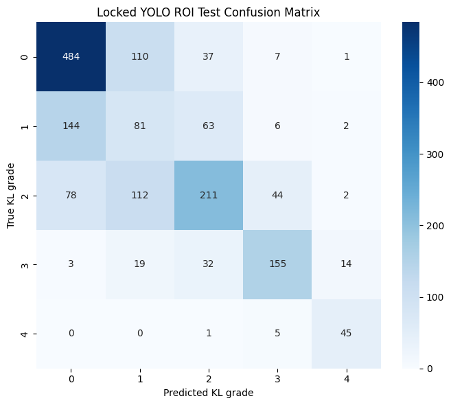

# SE-ResNeXt-50 Training Execution Log
This file records SE-ResNeXt-50 runs, their exact configurations, predictive metrics, and Grad-CAM evidence.

## Model Performance Summary

| Run Timestamp | Model Configuration / Loss | Accuracy | QWK Score | ROC AUC | Avg Precision | Macro F1 | Grade 1 Recall | CAM Joint Energy | CAM Border Energy |
| --- | --- | --- | --- | --- | --- | --- | --- | --- | --- |
| 2026-08-01 07:59:46.827053 UTC | **Paired Published/YOLO-ROI Adaptation + Post-hoc Grad-CAM**<br>Cross-Entropy (CE) | 0.5894 | 0.7461 | 0.8462 | 0.6368 | 0.6002 | 0.2736 | Not measured | Not measured |
| 2026-08-05 13:49:43.310215 UTC | **224x224 Paired Published/YOLO-ROI Adaptation + Post-hoc Grad-CAM**<br>Cross-Entropy (CE) | 0.5568 | 0.7155 | 0.8309 | 0.6008 | 0.5593 | Not measured | Not measured | Not measured |
| 2026-07-25 01:50:53.962450 UTC | **Natural Orientation + Horizontal Flip + Mild Gamma + Final Native CAM**<br>Cross-Entropy (CE) | **0.6558** | **0.8216** | **0.8980** | **0.7299** | **0.6781** | 0.4122 | 0.8516 | 0.0990 |

## Run: 2026-08-01 07:59:46.827053 UTC (SE-RESNEXT50-32X4D - PAIRED-VIEW YOLO-ROI ADAPTATION + GRAD-CAM)

### Summary

Notebook 03 fine-tuned the selected CE SE-ResNeXt checkpoint for five epochs using a 50/50 mixture of published `224x224` crops and production-style YOLO square ROIs. The model used a linear classifier head, but notebook 04 generated post-hoc Grad-CAM from the final SE-ResNeXt feature tensor. Epoch 4 won the validation-only two-domain score (`0.6997`) and was evaluated once on the locked YOLO-ROI test split.

The locked production-ROI test result was Accuracy `0.5894`, QWK `0.7461`, macro F1 `0.6002`, AP `0.6368`, and AUC `0.8462`. Grade 1 remains the largest weakness: only `81/296` cases were correct, giving precision `0.2516`, recall `0.2736`, and F1 `0.2621`.

The Grad-CAM galleries generally activate at a medial or lateral joint margin. Several misclassified examples have nearly identical predicted- and true-class maps, while others rely on a single border region. These figures demonstrate model evidence but do not establish lesion localization because no expert osteophyte or joint-space-narrowing masks were available. No numeric Grad-CAM anatomy audit was computed in this notebook, so joint-energy or border-energy values are not inferred from visual inspection.

### Configurations

| Parameter | Value |
| --- | --- |
| **Model** | `seresnext50_32x4d` |
| **Architecture** | Linear classifier head with post-hoc Grad-CAM |
| **Initialization** | `2026-08-01_03-46-16_723682_UTC_original_224_ce_3stage/best_model.pth` |
| **Training Run** | `2026-08-01_05-29-59_660657_UTC_paired_view_yolo_roi` |
| **Model Input** | `384x384` |
| **ROI Policy** | YOLO square ROI expanded by `1.15 * max(box width, box height)`; external black padding only |
| **Deterministic Processing** | LAB CLAHE `1.25` -> square pad -> resize `384x384` -> ImageNet normalization |
| **Training Views** | Published crop `p=0.50`; production YOLO ROI `p=0.50` |
| **Training Augmentation** | Horizontal flip `p=0.50`; rotation `+/-5 degrees`; brightness/contrast `0.08`; random erasing `p=0.10`, scale `0.02-0.05` |
| **Loss Function** | Cross-Entropy (CE); no MSE, ordinal, or CAM loss |
| **Balanced Sampler** | Full inverse-frequency `WeightedRandomSampler`, replacement enabled |
| **Adaptation Epochs** | 5 full-network epochs |
| **Selected Checkpoint** | Epoch 4; robust validation selection `0.699705` |
| **Optimizer** | AdamW; learning rate `1e-5`; weight decay `1e-3` |
| **Scheduler** | Cosine annealing to `1e-7` over five epochs |
| **Batch / Workers / Seed** | 48 / 2 / 42 |
| **AMP / Gradient Clipping** | CUDA AMP; global norm `1.0` |
| **Training Counts** | Grade 0: 2,286; Grade 1: 1,046; Grade 2: 1,516; Grade 3: 757; Grade 4: 173 |
| **Validation Counts** | Grade 0: 328; Grade 1: 153; Grade 2: 212; Grade 3: 106; Grade 4: 27 |
| **Checkpoint Selection** | Mean of published-view and YOLO-view `0.55 QWK + 0.30 macro F1 + 0.15 macro AP` |
| **Heatmap Method** | Post-hoc predicted-class and true-class Grad-CAM from the final feature tensor |
| **Training Notebook** | [`2026-08-01_05-29-59_seresnext50_32x4d_paired_view_yolo_adaptation.ipynb`](../../../notebooks/seresnext50_32x4d/archive/linear_gradcam/03_train_se_resnext50_paired_view_yolo_adaptation.ipynb) |
| **Evaluation Notebook** | [`2026-08-01_07-59-46_seresnext50_32x4d_paired_view_yolo_gradcam_evaluation.ipynb`](../../../notebooks/seresnext50_32x4d/archive/linear_gradcam/04_evaluate_se_resnext50_paired_view_yolo_gradcam.ipynb) |

### Complete Adaptation History

The test split was not used during these five epochs. Published and YOLO-ROI validation scores were computed separately after every epoch.

| Epoch | Train Loss | Published QWK | Published F1 | Published AP | YOLO QWK | YOLO F1 | YOLO AP | Robust Selection |
| ---: | ---: | ---: | ---: | ---: | ---: | ---: | ---: | ---: |
| 1 | 0.7579 | 0.7861 | 0.6517 | 0.7017 | 0.6731 | 0.5577 | 0.6166 | 0.6815 |
| 2 | 0.7041 | 0.7877 | 0.6599 | 0.7086 | 0.6981 | 0.5845 | 0.6314 | 0.6957 |
| 3 | 0.7057 | 0.7746 | 0.6269 | 0.7066 | 0.6934 | 0.5696 | 0.6334 | 0.6837 |
| **4** | **0.6917** | **0.7923** | **0.6636** | **0.7145** | **0.7013** | **0.5851** | **0.6408** | **0.6997** |
| 5 | 0.6856 | 0.7855 | 0.6413 | 0.7099 | 0.6964 | 0.5731 | 0.6383 | 0.6908 |

### Locked YOLO-ROI Test Metrics

Evaluation set: `1,656` production-style YOLO square ROIs.

| Metric | Score |
| --- | ---: |
| **Accuracy** | 0.5894 |
| **QWK** | 0.7461 |
| **Macro Precision** | 0.5930 |
| **Macro Recall** | 0.6161 |
| **Macro F1** | 0.6002 |
| **Average Precision** | 0.6368 |
| **ROC AUC (OvR)** | 0.8462 |
| **Composite Reference** | 0.6860; not used for checkpoint selection |

No confidence intervals were exported. The test set has also been examined by previous runs, so these metrics are development evidence rather than a new external clinical estimate.

### Classification Report

| True grade | Support | Precision | Recall | F1 |
| ---: | ---: | ---: | ---: | ---: |
| 0 | 639 | 0.6827 | 0.7574 | 0.7181 |
| 1 | 296 | 0.2516 | 0.2736 | 0.2621 |
| 2 | 447 | 0.6134 | 0.4720 | 0.5335 |
| 3 | 223 | 0.7143 | 0.6951 | 0.7045 |
| 4 | 51 | 0.7031 | 0.8824 | 0.7826 |
| **Macro average** | 1,656 | **0.5930** | **0.6161** | **0.6002** |

The exact confusion matrix was:

```text
             Pred 0  Pred 1  Pred 2  Pred 3  Pred 4
True Grade 0    484     110      37       7       1
True Grade 1    144      81      63       6       2
True Grade 2     78     112     211      44       2
True Grade 3      3      19      32     155      14
True Grade 4      0       0       1       5      45
```



### Grad-CAM Figures

Correct cases, five per true grade:

| True grade | Correct-case gallery |
| ---: | --- |
| 0 | [Grade 0 correct Grad-CAM](../archive/se_resnext50_32x4d/runs/2026-08-01_07-59-46_paired_view_yolo_gradcam_evaluation/assets/output_00.png) |
| 1 | [Grade 1 correct Grad-CAM](../archive/se_resnext50_32x4d/runs/2026-08-01_07-59-46_paired_view_yolo_gradcam_evaluation/assets/output_06.png) |
| 2 | [Grade 2 correct Grad-CAM](../archive/se_resnext50_32x4d/runs/2026-08-01_07-59-46_paired_view_yolo_gradcam_evaluation/assets/output_12.png) |
| 3 | [Grade 3 correct Grad-CAM](../archive/se_resnext50_32x4d/runs/2026-08-01_07-59-46_paired_view_yolo_gradcam_evaluation/assets/output_18.png) |
| 4 | [Grade 4 correct Grad-CAM](../archive/se_resnext50_32x4d/runs/2026-08-01_07-59-46_paired_view_yolo_gradcam_evaluation/assets/output_24.png) |

Misclassified predicted-class versus true-class Grad-CAM pairs:

| True grade | Five failure panels |
| ---: | --- |
| 0 | [1](../archive/se_resnext50_32x4d/runs/2026-08-01_07-59-46_paired_view_yolo_gradcam_evaluation/assets/output_01.png), [2](../archive/se_resnext50_32x4d/runs/2026-08-01_07-59-46_paired_view_yolo_gradcam_evaluation/assets/output_02.png), [3](../archive/se_resnext50_32x4d/runs/2026-08-01_07-59-46_paired_view_yolo_gradcam_evaluation/assets/output_03.png), [4](../archive/se_resnext50_32x4d/runs/2026-08-01_07-59-46_paired_view_yolo_gradcam_evaluation/assets/output_04.png), [5](../archive/se_resnext50_32x4d/runs/2026-08-01_07-59-46_paired_view_yolo_gradcam_evaluation/assets/output_05.png) |
| 1 | [1](../archive/se_resnext50_32x4d/runs/2026-08-01_07-59-46_paired_view_yolo_gradcam_evaluation/assets/output_07.png), [2](../archive/se_resnext50_32x4d/runs/2026-08-01_07-59-46_paired_view_yolo_gradcam_evaluation/assets/output_08.png), [3](../archive/se_resnext50_32x4d/runs/2026-08-01_07-59-46_paired_view_yolo_gradcam_evaluation/assets/output_09.png), [4](../archive/se_resnext50_32x4d/runs/2026-08-01_07-59-46_paired_view_yolo_gradcam_evaluation/assets/output_10.png), [5](../archive/se_resnext50_32x4d/runs/2026-08-01_07-59-46_paired_view_yolo_gradcam_evaluation/assets/output_11.png) |
| 2 | [1](../archive/se_resnext50_32x4d/runs/2026-08-01_07-59-46_paired_view_yolo_gradcam_evaluation/assets/output_13.png), [2](../archive/se_resnext50_32x4d/runs/2026-08-01_07-59-46_paired_view_yolo_gradcam_evaluation/assets/output_14.png), [3](../archive/se_resnext50_32x4d/runs/2026-08-01_07-59-46_paired_view_yolo_gradcam_evaluation/assets/output_15.png), [4](../archive/se_resnext50_32x4d/runs/2026-08-01_07-59-46_paired_view_yolo_gradcam_evaluation/assets/output_16.png), [5](../archive/se_resnext50_32x4d/runs/2026-08-01_07-59-46_paired_view_yolo_gradcam_evaluation/assets/output_17.png) |
| 3 | [1](../archive/se_resnext50_32x4d/runs/2026-08-01_07-59-46_paired_view_yolo_gradcam_evaluation/assets/output_19.png), [2](../archive/se_resnext50_32x4d/runs/2026-08-01_07-59-46_paired_view_yolo_gradcam_evaluation/assets/output_20.png), [3](../archive/se_resnext50_32x4d/runs/2026-08-01_07-59-46_paired_view_yolo_gradcam_evaluation/assets/output_21.png), [4](../archive/se_resnext50_32x4d/runs/2026-08-01_07-59-46_paired_view_yolo_gradcam_evaluation/assets/output_22.png), [5](../archive/se_resnext50_32x4d/runs/2026-08-01_07-59-46_paired_view_yolo_gradcam_evaluation/assets/output_23.png) |
| 4 | [1](../archive/se_resnext50_32x4d/runs/2026-08-01_07-59-46_paired_view_yolo_gradcam_evaluation/assets/output_25.png), [2](../archive/se_resnext50_32x4d/runs/2026-08-01_07-59-46_paired_view_yolo_gradcam_evaluation/assets/output_26.png), [3](../archive/se_resnext50_32x4d/runs/2026-08-01_07-59-46_paired_view_yolo_gradcam_evaluation/assets/output_27.png), [4](../archive/se_resnext50_32x4d/runs/2026-08-01_07-59-46_paired_view_yolo_gradcam_evaluation/assets/output_28.png), [5](../archive/se_resnext50_32x4d/runs/2026-08-01_07-59-46_paired_view_yolo_gradcam_evaluation/assets/output_29.png) |

### Comparison and Decision

| Candidate and evaluation domain | Accuracy | QWK | Macro F1 | Grade 1 Recall | AP | AUC |
| --- | ---: | ---: | ---: | ---: | ---: | ---: |
| 2026-07-25 SE-ResNeXt, published crops | **0.6558** | **0.8216** | **0.6781** | **0.4122** | **0.7299** | **0.8980** |
| 2026-08-01 SE-ResNeXt, production YOLO ROIs | 0.5894 | 0.7461 | 0.6002 | 0.2736 | 0.6368 | 0.8462 |
| Current DenseNet, production YOLO ROIs | 0.5972 | 0.7702 | 0.6215 | 0.3750 | 0.6696 | 0.8611 |

## 224x224 Paired-ROI Resolution Comparison

Run date: `2026-08-04` to `2026-08-05 UTC`
Archived notebooks: [01 dataset preparation](../../../notebooks/datasets/01_prepare_original_and_yolo_roi_datasets.ipynb), [02 original-crop training](../../../notebooks/seresnext50_32x4d/runs/2026-08-04_02_train_se_resnext50_original_224.ipynb), [03 paired-view adaptation](../../../notebooks/seresnext50_32x4d/runs/2026-08-04_03_train_se_resnext50_paired_view_yolo_224.ipynb), and [04 locked ROI evaluation](../../../notebooks/seresnext50_32x4d/runs/2026-08-04_04_evaluate_se_resnext50_paired_view_yolo_gradcam_224.ipynb).

Notebook 01 reused the existing derived YOLO ROI data, confirmed indirectly because Notebook 03 completed its paired-view validation. Notebook 02 trained the `224x224` CE base model and selected `2026-08-04_00-59-41_684745_UTC_original_224_ce_3stage/best_model.pth`; its published-crop test was Accuracy `0.6262`, QWK `0.7969`, macro F1 `0.6464`, AP `0.6864`, and AUC `0.8743`.

Notebook 03 completed five paired-view epochs. Epoch `2` had the highest robust validation selection (`0.6751`): published QWK `0.7665`, YOLO-ROI QWK `0.6991`, published selection `0.7086`, and ROI selection `0.6416`. Its DataLoader emitted non-fatal worker-shutdown assertions, but the run completed all epochs and saved the selected checkpoint. Notebook 04 evaluated that exact checkpoint once on the locked `n=1,656` YOLO-ROI test set and exported predicted-class Grad-CAM grids plus predicted-versus-true-class CAM pairs.

| Input | Accuracy | QWK | Macro F1 | Macro AP | Macro AUC | Decision |
| --- | ---: | ---: | ---: | ---: | ---: | --- |
| `224 x 224` paired view | 0.5568 | 0.7155 | 0.5593 | 0.6008 | 0.8309 | rejected |
| `384 x 384` paired view | **0.5894** | **0.7461** | **0.6002** | **0.6368** | **0.8462** | retained |

The test-domain comparison favors `384 x 384` on every reported metric: QWK by `0.0306`, macro F1 by `0.0409`, AP by `0.0360`, and AUC by `0.0153`. The 224 Grad-CAM galleries include joint-line-focused examples but also obvious one-sided/border activations, including a correct Grade 0 example dominated by the lateral image edge. There is no evidence that 224 produces more anatomically faithful explanations. Keep the 384 checkpoint for this model.

The first row uses a different crop domain and is not a controlled head-to-head comparison. The paired-view test row records the SE-ResNeXt result on production-style ROIs. Its Grad-CAM figures are useful qualitative evidence, but this notebook did not measure anatomy energy, border energy, or occlusion faithfulness.

## Sampler Ablation

### Run: 2026-07-23 15:13:05.616211 UTC (SAMPLER ABLATION)

| Sampler | Selection | QWK | Macro F1 | Grade 1 Recall | Joint Energy | Border Energy | Occlusion Correlation |
| --- | ---: | ---: | ---: | ---: | ---: | ---: | ---: |
| **Full inverse** | **0.6984** | **0.7948** | 0.6446 | **0.3725** | **0.8421** | **0.0898** | 0.5745 |
| Square-root inverse | 0.6875 | 0.7895 | **0.6496** | 0.3072 | 0.8187 | 0.1048 | 0.5841 |
| No sampler | 0.6650 | 0.7737 | 0.6348 | 0.1961 | 0.8067 | 0.1117 | **0.6001** |

Full inverse sampling won the predeclared combined objective and broad joint concentration. This is historical validation evidence only; it did not determine the current paired-view configuration.

Archived experiment notebook: [sampler ablation](../../../notebooks/seresnext50_32x4d/experiments/se_resnext50_32x4d_native_cam_sampler_strength_ablation.ipynb).

## Run: 2026-07-25 01:50:53.962450 UTC (SE-RESNEXT50-32X4D - NATURAL ORIENTATION + FLIP + GAMMA + FINAL NATIVE CAM)

### Summary

This run completed all 30 configured epochs on a Tesla T4 without a training error and selected epoch 28 using the validation composite score (`0.7061`). It removed deterministic right-knee canonicalization and instead exposed the model to both orientations with a training-only horizontal flip (`p=0.50`). It also added mild gamma correction (`0.90-1.10`, `p=0.20`) while retaining mild rotation, brightness/contrast jitter, CLAHE, a small random erasing region, and the original 12x12 five-map native-CAM head.

Against the 2026-07-23 01:25:36.772175 UTC canonical checkpoint, locked-test Accuracy improved by `0.0169`, QWK by `0.0022`, macro F1 by `0.0110`, AP by `0.0051`, and AUC by `0.0032`. Grade 1 recall decreased slightly by `0.0033`. The CAM audit moved in the opposite direction: joint energy decreased by `0.0191` and border energy increased by `0.0241`. The run is therefore the strongest natural-orientation SE-ResNeXt candidate, but it does not prove a uniformly better metric-plus-localization model.

### Configurations

| Parameter | Value |
| --- | --- |
| **Model** | `seresnext50_32x4d` |
| **Architecture** | `natural_final_native_cam_ce` |
| **Model Input** | 384x384 (square pad, CLAHE, resize to 400x400, then crop) |
| **Native-CAM Head** | Bias-free 1x1 convolution producing five 12x12 grade maps; global spatial mean produces five logits |
| **Pipeline** | 3-stage |
| **Epochs** | 30 (5 warm-up + 15 coarse + 10 fine-tune) |
| **Selected Checkpoint** | Epoch 28; validation selection score 0.7061 |
| **Loss Function** | Cross-Entropy (CE) |
| **Balanced Sampler** | Full inverse-frequency |
| **Laterality Canonicalization** | Disabled |
| **Orientation Policy** | Preserve natural orientation; no deterministic inference mirroring |
| **Training Augmentation** | Horizontal flip `p=0.50`; rotation `+/-5 degrees`; brightness/contrast `0.08`; gamma `0.90-1.10` at `p=0.20`; random erasing `p=0.10` |
| **Gaussian Noise** | Disabled |
| **Dataset Sizes** | Train 5,778; validation 826; test 1,656 unique images after hash deduplication |
| **Training Class Counts** | Grade 0: 2,286; Grade 1: 1,046; Grade 2: 1,516; Grade 3: 757; Grade 4: 173 |
| **Batch Size / Workers / GPU** | 48 / 4 / Tesla T4 |
| **Warm-up Learning Rate** | 3e-4; native-CAM head only |
| **Coarse Learning Rates** | Backbone 3e-5; native-CAM head 3e-4 |
| **Fine-tune Learning Rate** | 1e-5; full model |
| **Weight Decay** | 1e-4 in warm-up/coarse; 1e-3 in fine-tuning |
| **Checkpoint Directory** | `2026-07-25_01-50-53_962450_UTC_natural_orientation_flip_gamma_native_cam_ce` |
| **Executed Notebook Archive** | [`2026-07-25_01-50-53_seresnext50_32x4d_natural_orientation_flip_gamma_native_cam_ce.ipynb`](../../../notebooks/seresnext50_32x4d/runs/2026-07-25_se_resnext50_native_cam_orientation_gamma.ipynb) |

### Selected Validation Metrics

| Metric | Score |
| --- | ---: |
| **QWK Score** | 0.7899 |
| **Macro F1** | 0.6617 |
| **Grade 1 Recall** | 0.3856 |
| **Average Precision** | 0.7139 |
| **Composite Selection Score** | 0.7061 |

The stored notebook output did not print the selected epoch's validation Accuracy, macro Precision, macro Recall, AUC, or loss. They are not reconstructed here. Epoch 29 reached a slightly higher macro F1 (`0.6674`), but epoch 28 won the predeclared composite selection rule and was correctly retained.

### Final Test Metrics

| Metric | Score | Delta vs. 2026-07-23 canonical checkpoint |
| --- | ---: | ---: |
| **Accuracy** | 0.6558 | +0.0169 |
| **QWK Score** | 0.8216 | +0.0022 |
| **Macro Precision** | 0.6730 | +0.0053 |
| **Macro Recall** | 0.6878 | +0.0151 |
| **Macro F1** | 0.6781 | +0.0110 |
| **Grade 1 Recall** | 0.4122 | -0.0033 |
| **Average Precision** | 0.7299 | +0.0051 |
| **ROC AUC** | 0.8980 | +0.0032 |
| **Composite Score** | 0.7286 | Not used for checkpoint selection |
| **Loss** | 0.7676 | -0.0229 |

No confidence interval was exported by this run. The test split was loaded only after validation checkpoint selection, but it has been examined across multiple historical experiments; these values must therefore be treated as development evidence rather than a fresh external estimate.

### Classification Report

```text
              precision    recall  f1-score   support

     Grade 0       0.77      0.74      0.75       639
     Grade 1       0.34      0.41      0.37       296
     Grade 2       0.69      0.58      0.63       447
     Grade 3       0.76      0.84      0.80       223
     Grade 4       0.81      0.86      0.84        51

    accuracy                           0.66      1656
   macro avg       0.67      0.69      0.68      1656
weighted avg       0.67      0.66      0.66      1656
```

The exact test confusion matrix was:

```text
             Pred 0  Pred 1  Pred 2  Pred 3  Pred 4
True Grade 0    471     134      32       1       1
True Grade 1    103     122      66       5       0
True Grade 2     39      99     261      48       0
True Grade 3      0       6      20     188       9
True Grade 4      0       0       0       7      44
```

Grade 1 remains the principal weakness. Its recall is `0.4122` and its rounded precision is only `0.34`, showing that orientation augmentation did not resolve the Grade 0/1/2 boundary. Grade 3 and Grade 4 remain substantially easier, with recall `0.84` and `0.86` respectively.

### Training History and Convergence

Warm-up ended at epoch 5 with QWK `0.4611`. Coarse training reached QWK `0.7859` at epoch 20. Fine-tuning then improved the composite score from `0.6832` at epoch 21 to its maximum `0.7061` at epoch 28. Epochs 29 and 30 remained close (`0.7056` and `0.7050`), so the selected checkpoint was at a stable plateau rather than an isolated early spike.

| Stage | Epoch | QWK | Macro F1 | Grade 1 Recall | AP | Selection |
| --- | ---: | ---: | ---: | ---: | ---: | ---: |
| Warm-up | 1 | 0.2754 | 0.2679 | 0.1373 | 0.3248 | 0.2925 |
| Warm-up | 2 | 0.3990 | 0.2264 | 0.0654 | 0.3481 | 0.3353 |
| Warm-up | 3 | 0.4408 | 0.2725 | 0.4967 | 0.3721 | 0.4094 |
| Warm-up | 4 | 0.4012 | 0.2295 | 0.1242 | 0.3745 | 0.3479 |
| Warm-up | 5 | 0.4611 | 0.3084 | 0.3333 | 0.3818 | 0.4110 |
| Coarse | 6 | 0.6352 | 0.4353 | 0.0458 | 0.5066 | 0.5151 |
| Coarse | 7 | 0.7074 | 0.5337 | 0.0719 | 0.5965 | 0.5885 |
| Coarse | 8 | 0.7638 | 0.6155 | 0.1830 | 0.6448 | 0.6504 |
| Coarse | 9 | 0.7566 | 0.5838 | 0.1961 | 0.6562 | 0.6406 |
| Coarse | 10 | 0.7408 | 0.6124 | 0.3922 | 0.6576 | 0.6654 |
| Coarse | 11 | 0.7532 | 0.6321 | 0.3072 | 0.6850 | 0.6702 |
| Coarse | 12 | 0.7712 | 0.6182 | 0.2353 | 0.6817 | 0.6642 |
| Coarse | 13 | 0.7628 | 0.6376 | 0.3791 | 0.6968 | 0.6853 |
| Coarse | 14 | 0.7737 | 0.6504 | 0.3856 | 0.6972 | 0.6933 |
| Coarse | 15 | 0.7793 | 0.6457 | 0.2810 | 0.6997 | 0.6840 |
| Coarse | 16 | 0.7787 | 0.6418 | 0.3072 | 0.7045 | 0.6855 |
| Coarse | 17 | 0.7790 | 0.6482 | 0.3333 | 0.7023 | 0.6904 |
| Coarse | 18 | 0.7819 | 0.6517 | 0.3203 | 0.7049 | 0.6915 |
| Coarse | 19 | 0.7843 | 0.6551 | 0.3203 | 0.7055 | 0.6933 |
| Coarse | 20 | 0.7859 | 0.6416 | 0.2484 | 0.7036 | 0.6827 |
| Fine-tune | 21 | 0.7746 | 0.6454 | 0.2941 | 0.6966 | 0.6832 |
| Fine-tune | 22 | 0.7855 | 0.6554 | 0.3856 | 0.7058 | 0.7017 |
| Fine-tune | 23 | 0.7815 | 0.6367 | 0.3399 | 0.6972 | 0.6886 |
| Fine-tune | 24 | 0.7822 | 0.6587 | 0.3595 | 0.7051 | 0.6982 |
| Fine-tune | 25 | 0.7885 | 0.6549 | 0.3333 | 0.7080 | 0.6967 |
| Fine-tune | 26 | 0.7910 | 0.6602 | 0.3660 | 0.7099 | 0.7035 |
| Fine-tune | 27 | 0.7903 | 0.6599 | 0.3660 | 0.7123 | 0.7031 |
| **Fine-tune** | **28** | **0.7899** | **0.6617** | **0.3856** | **0.7139** | **0.7061** |
| Fine-tune | 29 | 0.7885 | 0.6674 | 0.3725 | 0.7139 | 0.7056 |
| Fine-tune | 30 | 0.7909 | 0.6658 | 0.3660 | 0.7117 | 0.7050 |

### Visualizations

#### Test Confusion Matrix


#### Native-CAM Audit Gallery


### Native-CAM Evaluation

| Metric | 2026-07-23 canonical checkpoint | 2026-07-25 natural-orientation run | Delta | Direction |
| --- | ---: | ---: | ---: | --- |
| **Audited cases** | 227 | 227 | 0 | Same cases/count |
| **Joint energy** | 0.8707 | 0.8516 | -0.0191 | Worse |
| **Border energy** | 0.0749 | 0.0990 | +0.0241 | Worse |
| **Lower-tibia energy** | 0.0880 | 0.0878 | -0.0002 | Essentially unchanged |
| **Peak inside joint** | 0.9956 | 0.9912 | -0.0044 | Slightly worse; 225/227 peaks inside |

The CAM audit remains broadly acceptable: `99.12%` of peaks were inside the broad joint proxy and `85.16%` of positive CAM energy lay inside it. It is not perfect anatomical validation. The central-band mask is only a proxy, and a mean lower-tibia energy of `0.0878` confirms that some explanations still use evidence below the intended joint space. The gallery must therefore be reviewed alongside predicted-versus-true class maps and occlusion sensitivity; a plausible overlay alone is insufficient.

### Comparison and Decision

| Candidate | Accuracy | QWK | Macro F1 | Grade 1 Recall | AP | AUC | Joint Energy | Border Energy |
| --- | ---: | ---: | ---: | ---: | ---: | ---: | ---: | ---: |
| 2026-07-23 canonical orientation | 0.6389 | 0.8194 | 0.6671 | **0.4155** | 0.7248 | 0.8948 | **0.8707** | **0.0749** |
| **2026-07-25 natural orientation** | **0.6558** | **0.8216** | **0.6781** | 0.4122 | **0.7299** | **0.8980** | 0.8516 | 0.0990 |

**Decision:** retain this checkpoint as the preferred SE-ResNeXt candidate when inference must support single-knee images without reliable laterality metadata. Do not claim that it is uniformly superior to the canonical checkpoint: the predictive improvement is modest, Grade 1 recall did not improve, and the broad CAM localization metrics regressed. Before application promotion, compare both checkpoints on the same external single-knee and bilateral-ROI cases and verify that inference uses the matching natural-orientation preprocessing.
