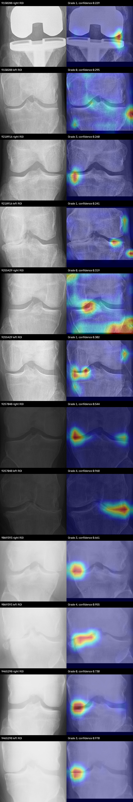

# Deployed API Test on YOLO Validation Images

**Test identifier:** `2026-07-25_01-12-45_382275_ICT`  
**Recoverable run started:** 2026-07-25 01:12:45.382275 ICT  
**Run and post-test health verification completed:** 2026-07-25 01:48:49.374500 ICT  
**Deployment:** `http://54.254.113.71:8005`  
**Source images:** `/home/viet/Downloads/Knee Xray Yolo.yolov8/valid/images`  
**Source labels:** `/home/viet/Downloads/Knee Xray Yolo.yolov8/valid/labels`  
**Execution:** sequential requests, 180-second per-request timeout

## Executive Summary

The deployed API passed the complete test on all 211 YOLO validation images. Every request returned HTTP 200. The API returned 421 knee predictions, exactly matching the 421 labeled ROI instances, with zero per-image count mismatches. Every response retained the established JSON schema; every five-grade probability vector summed to one; and every annotated image, ROI image, and native-CAM overlay decoded successfully. All 421 CAM overlays were 384x384.

This result is a strong operational test and an exact ROI-count test. It is not a YOLO localization-accuracy test because the harness did not retain the returned boxes for IoU calculation. It is also not a KL-grade accuracy test: the label files contain YOLO bounding boxes, not KL grades.

The API remained healthy after the load test and reported the expected DenseNet-121 epoch-27 plus SE-ResNeXt epoch-24 ensemble with weights 0.55/0.45.

## Source Dataset Check

| Check | Value |
| --- | ---: |
| Validation images | 211 |
| YOLO label files | 211 |
| Matched image/label stems | 211 |
| Images with one labeled knee | 1 |
| Images with two labeled knees | 210 |
| Total labeled ROI instances | 421 |
| Missing labels | 0 |
| Orphan labels | 0 |

## API Contract and Media Validation

| Check | Result |
| --- | --- |
| HTTP 200 | 211/211 |
| Empty prediction responses | 0 |
| Exact top-level schema | Pass |
| Exact per-knee schema | Pass |
| Five expected grade-probability keys | 421/421 |
| Probability sum within 1e-5 of one | 421/421 |
| Annotated source images decoded | 211/211 |
| Returned ROI images decoded | 421/421 |
| Native-CAM overlays decoded at 384x384 | 421/421 |
| Timeout, HTTP 4xx, or HTTP 5xx | 0 |
| Post-test health | Healthy |

The unchanged top-level fields are `filename`, `predictions`, and `annotated_image`. Each prediction retains `predicted_class`, `predicted_grade`, `confidence`, `description`, `details`, `box`, `yolo_confidence`, `knee_side`, `roi_image`, and `gradcam_image`. The historical `gradcam_image` field contains the selected native-CAM overlay.

## ROI Count Comparison

| Measure | Result |
| --- | ---: |
| Expected labeled ROIs | 421 |
| Returned knee predictions | 421 |
| Per-image count matches | 211/211 |
| Per-image count mismatches | 0 |
| Returned one-knee images | 1 |
| Returned two-knee images | 210 |

This demonstrates perfect count agreement on this folder. It does not prove that every returned box has sufficient IoU with its annotation. A future detector audit should preserve the API box coordinates and calculate per-box IoU, precision, recall, mAP, and laterality correctness.

## Unlabeled KL Prediction Distribution

| Predicted KL grade | Knees | Share |
| ---: | ---: | ---: |
| 0 | 211 | 50.1% |
| 1 | 85 | 20.2% |
| 2 | 72 | 17.1% |
| 3 | 40 | 9.5% |
| 4 | 13 | 3.1% |

Grade 0 accounts for half of predictions. This distribution cannot be scored as correct or incorrect without KL ground truth and should not be used to estimate deployment prevalence.

### Confidence Distribution

| Measure | Value |
| --- | ---: |
| Minimum | 0.2289 |
| p10 | 0.3001 |
| Median | 0.4693 |
| Mean | 0.4966 |
| p90 | 0.7471 |
| Maximum | 0.9940 |
| Below 0.30 | 42/421 (10.0%) |
| Below 0.40 | 142/421 (33.7%) |
| Below 0.50 | 246/421 (58.4%) |

Grade 1 had the lowest mean confidence (`0.4041`), consistent with the known Grade 0/1 and Grade 1/2 ambiguity. A confidence below 0.40 should be presented as uncertain and requiring review; it must not be treated as a calibrated probability of correctness until calibration is measured on labeled, patient-separated data.

### Confidence by Predicted Grade

| Predicted grade | Count | Mean | Median | Minimum | Maximum | Below 0.40 |
| ---: | ---: | ---: | ---: | ---: | ---: | ---: |
| 0 | 211 | 0.4977 | 0.4811 | 0.2407 | 0.8215 | 68 |
| 1 | 85 | 0.4041 | 0.4013 | 0.2289 | 0.6689 | 41 |
| 2 | 72 | 0.5465 | 0.5375 | 0.2552 | 0.8545 | 19 |
| 3 | 40 | 0.5228 | 0.4498 | 0.2506 | 0.9696 | 13 |
| 4 | 13 | 0.7276 | 0.8585 | 0.3246 | 0.9940 | 1 |

### Bilateral Prediction Difference

The following is a consistency description, not an accuracy metric. Different grades between a patient's two knees may be clinically valid.

| Absolute left/right grade difference | Bilateral images | Share |
| ---: | ---: | ---: |
| 0 | 112 | 53.3% |
| 1 | 51 | 24.3% |
| 2 | 27 | 12.9% |
| 3 | 17 | 8.1% |
| 4 | 3 | 1.4% |

## Latency

Times are sequential public-network upload-to-complete-response measurements. They include large image upload, YOLO, both CNNs, native-CAM selection/rendering, base64 serialization, and response download.

| Measure | Seconds |
| --- | ---: |
| Minimum | 4.431 |
| Median | 8.248 |
| Mean | 10.029 |
| p90 | 18.614 |
| p95 | 20.942 |
| p99 | 28.152 |
| Maximum | 34.636 |
| Cumulative request time | 2116.186 |

### Ten Slowest Requests

| Seconds | Knees | Predicted grades | Confidence | Image |
| ---: | ---: | --- | --- | --- |
| 34.636 | 2 | 0 / 1 | 0.3193 / 0.3020 | `9255429_20050510_00772004_png.rf.7ijUwR7auaBQvtadGixV.png` |
| 28.664 | 2 | 1 / 4 | 0.5437 / 0.9684 | `9257048_20050322_00672204_png.rf.B0c1iyAeQfYmWC97tuns.png` |
| 28.164 | 2 | 0 / 0 | 0.6123 / 0.5673 | `9061162_20050621_00912003_png.rf.3Kl3p6OWPQOHPTZvpEyt.png` |
| 28.043 | 2 | 0 / 0 | 0.5619 / 0.4914 | `9130641_20060110_01339403_png.rf.0gxv3X3u8OzwQZ12pI1E.png` |
| 24.140 | 2 | 0 / 0 | 0.5244 / 0.6470 | `9330186_20050829_00995203_png.rf.7cr5PjFYfFG6N1EIig6N.png` |
| 24.086 | 2 | 0 / 0 | 0.6533 / 0.7392 | `9003126_20050531_00839803_png.rf.5Mto4P5WKBAzIfcgOvfl.png` |
| 23.592 | 2 | 0 / 0 | 0.4062 / 0.6170 | `9178780_20050829_01083603_png.rf.04WetwK3GtPqJHENE9Fn.png` |
| 23.528 | 2 | 0 / 0 | 0.5091 / 0.6097 | `9258864_20050926_01149303_png.rf.BGTENmK9JQaHeJpMNtoM.png` |
| 23.346 | 2 | 2 / 2 | 0.7505 / 0.6884 | `9021102_20050608_00829503_png.rf.4XXhbF8rMDFWDtYDF2ZV.png` |
| 22.169 | 2 | 2 / 2 | 0.6719 / 0.5642 | `9058692_20050406_00682303_png.rf.0GzSVbc0SWBDunUweffx.png` |

## CAM Visual Review

The representative montage deliberately includes low-confidence, high-grade, slow, and asymmetric cases. It shows mixed explanation quality:

- `9150288` contains a knee prosthesis. KL grading is not an appropriate   normal target for a replaced knee, and the low-confidence Grade 1 CAM   follows a lateral hardware/edge region. This is an out-of-distribution   input that should be rejected or explicitly routed to manual review.
- The other `9150288` knee has a strong far-lateral hotspot outside the   useful central joint evidence, despite producing a normal-grade result.
- `9218916`, `9255429`, and `9465298` retain compact medial/lateral margin   hotspots. Some maps are at joint level, but several include border or   lower-region energy and are not lesion-exact.
- The Grade 4 maps in `9257048` and `9069393` are concentrated near the   joint line and are broadly plausible, but still cannot identify every   KL feature or prove a lesion boundary.

The anatomy gate improves the worst diffuse maps but cannot guarantee a good explanation when neither component passes or when a lateral hotspot still satisfies the broad rectangular joint criterion. The response does not expose the selected model, gate pass/fallback state, or unblended CAM, so those facts cannot be reconstructed remotely. They should be recorded in server logs.

Right-knee CAM backgrounds are also returned in canonical mirrored orientation while `roi_image` remains in original orientation. This is model-aligned but can confuse side-by-side interpretation and should be corrected in presentation code or explicitly labeled.

## Lowest-Confidence Predictions

| Confidence | Grade | Knee index | Image |
| ---: | ---: | ---: | --- |
| 0.2289 | 1 | 0 | `9150288_20050517_00727104_png.rf.AFdz46NoLGOwwYhTRKJL.png` |
| 0.2381 | 1 | 1 | `9461520_20050623_00863704_png.rf.2wII3HktbbKEc7DlP1J2.png` |
| 0.2407 | 0 | 1 | `9238970_20050519_00797104_png.rf.ADligeVt1GjPjPnlljwR.png` |
| 0.2409 | 1 | 1 | `9218916_20041124_00411504_png.rf.4CE0w5xh57EGwW3EQwE2.png` |
| 0.2506 | 3 | 1 | `9004669_20050601_00826204_png.rf.33ILQkj2K5pD9OtGqHrX.png` |
| 0.2539 | 1 | 1 | `9425737_20051026_01196404_png.rf.73Rn5Z5feaMyENGF2xVq.png` |
| 0.2552 | 2 | 0 | `9351700_20060130_01355404_png.rf.AeDF5i7VJrxJAHWCUkZD.png` |
| 0.2562 | 0 | 0 | `9435525_20050628_00917504_png.rf.BTXjkO9Gg28cWGRn3IiQ.png` |
| 0.2570 | 1 | 0 | `9253255_20060327_01453404_png.rf.24oIyoDZT8IJ5vvuy9LG.png` |
| 0.2579 | 3 | 1 | `9211547_20050706_00932204_png.rf.9zvpnowrwhWbQT8ldQWX.png` |
| 0.2597 | 3 | 0 | `9218916_20041124_00411504_png.rf.4CE0w5xh57EGwW3EQwE2.png` |
| 0.2607 | 0 | 1 | `9435525_20050628_00917504_png.rf.BTXjkO9Gg28cWGRn3IiQ.png` |
| 0.2634 | 1 | 0 | `9326801_20060316_01446604_png.rf.1leRPtV07RB3P8FfHsJ7.png` |
| 0.2674 | 0 | 0 | `9004669_20050601_00826204_png.rf.33ILQkj2K5pD9OtGqHrX.png` |
| 0.2677 | 2 | 0 | `9363201_20050708_00932001_png.rf.01ArUyRJwsar7Az6ei8w.png` |

## Per-Image Results

The confidence list follows the API prediction order. Expected ROI count comes from the matching YOLO label file.

| Image | Expected ROIs | Returned knees | Grades | Confidences | Seconds |
| --- | ---: | ---: | --- | --- | ---: |
| `1-3-10001-14-432794811287987932664717771738058649075_png.rf.45l9O8AYt9l5FuFdssZY.png` | 1 | 1 | 3 | 0.8250 | 6.763 |
| `9003126_20050531_00839803_png.rf.5Mto4P5WKBAzIfcgOvfl.png` | 2 | 2 | 0 / 0 | 0.6533 / 0.7392 | 24.086 |
| `9004669_20050601_00826204_png.rf.33ILQkj2K5pD9OtGqHrX.png` | 2 | 2 | 0 / 3 | 0.2674 / 0.2506 | 5.819 |
| `9009927_20050613_00862204_png.rf.AmuB5ShZpPOMJONjrTYE.png` | 2 | 2 | 2 / 0 | 0.3913 / 0.4153 | 7.024 |
| `9011641_20050601_00839103_png.rf.8BMv5v0j73e9ARyZ6qGT.png` | 2 | 2 | 0 / 0 | 0.5824 / 0.7743 | 21.362 |
| `9017909_20050622_00887904_png.rf.4D5GJ62MQf1pBtrxUiPj.png` | 2 | 2 | 0 / 0 | 0.2895 / 0.3309 | 8.591 |
| `9021102_20050608_00829503_png.rf.4XXhbF8rMDFWDtYDF2ZV.png` | 2 | 2 | 2 / 2 | 0.7505 / 0.6884 | 23.346 |
| `9022902_20050613_00862604_png.rf.1XVYekj51ubYZZ6DCGhw.png` | 2 | 2 | 0 / 3 | 0.3388 / 0.3313 | 7.311 |
| `9028418_20041201_00430403_png.rf.6oa6oQzsaHTL3wXh3zqC.png` | 2 | 2 | 2 / 2 | 0.7772 / 0.8489 | 16.124 |
| `9029415_20050620_00887604_png.rf.7No3oQL2ER4MJYo7OvwP.png` | 2 | 2 | 0 / 0 | 0.3310 / 0.3344 | 5.255 |
| `9030718_20050405_00696504_png.rf.6MHqu6pQD5WD2LOsYeKK.png` | 2 | 2 | 3 / 0 | 0.3918 / 0.3422 | 5.515 |
| `9034644_20050615_00898403_png.rf.3uqjOdzpwiCdqRMv3yLH.png` | 2 | 2 | 0 / 0 | 0.4681 / 0.6058 | 17.096 |
| `9041458_20050804_00976404_png.rf.0kcFRewZHb9uSA5W4heq.png` | 2 | 2 | 0 / 0 | 0.4703 / 0.4668 | 4.963 |
| `9048308_20050121_00537404_png.rf.15Z3uSriqVq9DHBihfA1.png` | 2 | 2 | 0 / 1 | 0.2960 / 0.3133 | 7.952 |
| `9049223_20050616_00898103_png.rf.AoTgxr2dJoExIkaL3W6S.png` | 2 | 2 | 0 / 2 | 0.4343 / 0.5387 | 13.230 |
| `9049729_20050317_00654503_png.rf.BXJ3smMRd0HyB920qkTT.png` | 2 | 2 | 0 / 0 | 0.7917 / 0.8117 | 12.051 |
| `9051696_20050711_00965903_png.rf.8krQnIRdkzKmwz3AK2Id.png` | 2 | 2 | 2 / 1 | 0.5124 / 0.4867 | 9.285 |
| `9052207_20050624_00908203_png.rf.6EutQufpm7heUPBcrtuY.png` | 2 | 2 | 0 / 0 | 0.7347 / 0.6988 | 9.249 |
| `9056363_20040820_00215704_png.rf.1HxUvi1KPA5jSJJ1mO7B.png` | 2 | 2 | 0 / 2 | 0.3840 / 0.3742 | 7.540 |
| `9058692_20050406_00682303_png.rf.0GzSVbc0SWBDunUweffx.png` | 2 | 2 | 2 / 2 | 0.6719 / 0.5642 | 22.169 |
| `9061162_20050621_00912003_png.rf.3Kl3p6OWPQOHPTZvpEyt.png` | 2 | 2 | 0 / 0 | 0.6123 / 0.5673 | 28.164 |
| `9061936_20050720_00872504_png.rf.9jqy2yowUKXDy30zYNPF.png` | 2 | 2 | 0 / 0 | 0.3336 / 0.4202 | 7.805 |
| `9062645_20050720_00946303_png.rf.B2hEP6VC2TKfhRmkRpSx.png` | 2 | 2 | 2 / 0 | 0.4246 / 0.5526 | 18.481 |
| `9065433_20050719_00872404_png.rf.5UzyKkOySzwiDXy9iAtm.png` | 2 | 2 | 0 / 1 | 0.2948 / 0.3447 | 6.145 |
| `9069393_20051006_01060703_png.rf.2YUCUEIegr6DoKuYjpdd.png` | 2 | 2 | 3 / 4 | 0.6611 / 0.9552 | 10.028 |
| `9071463_20050721_00954904_png.rf.0KBdMxWzZtLMoOdZwyHg.png` | 2 | 2 | 3 / 2 | 0.4165 / 0.3744 | 6.271 |
| `9071924_20050103_00514004_png.rf.3KsfypMAiGKnhHCjU7z1.png` | 2 | 2 | 2 / 1 | 0.7824 / 0.3821 | 5.759 |
| `9072956_20050711_00883104_png.rf.2yaGpYuvTASbs5Qnjw4l.png` | 2 | 2 | 2 / 0 | 0.5514 / 0.4608 | 4.724 |
| `9075939_20050720_00872904_png.rf.6992D7LdD4nJfC0IXKVG.png` | 2 | 2 | 3 / 3 | 0.4021 / 0.3739 | 5.379 |
| `9082159_20060208_01401504_png.rf.3zEPvVythIl4UGdSjcZ8.png` | 2 | 2 | 0 / 2 | 0.3001 / 0.2888 | 5.878 |
| `9089138_20050429_00777403_png.rf.7WtVwju1TOJO4KCgLsQt.png` | 2 | 2 | 4 / 2 | 0.3246 / 0.7362 | 8.130 |
| `9089627_20050719_00946203_png.rf.9TVd5q54mSEJkroCqJqo.png` | 2 | 2 | 0 / 0 | 0.5064 / 0.5453 | 19.551 |
| `9092628_20050714_00944403_png.rf.8mTFuRuZwLVlM7DeGFzW.png` | 2 | 2 | 3 / 1 | 0.5711 / 0.4768 | 18.614 |
| `9092643_20050718_00962204_png.rf.43U3xliZwpeFLAIPSeyT.png` | 2 | 2 | 1 / 1 | 0.3358 / 0.2848 | 5.575 |
| `9095103_20050718_00944603_png.rf.1UPpwg4DauGryMee6gJe.png` | 2 | 2 | 0 / 4 | 0.4617 / 0.9723 | 17.476 |
| `9096724_20060123_01335904_png.rf.2hWNG12yPsHOv0QfqXEQ.png` | 2 | 2 | 1 / 1 | 0.2725 / 0.2908 | 9.910 |
| `9098924_20050822_01021704_png.rf.8acg3b7ekkjn0qxJOu3p.png` | 2 | 2 | 0 / 0 | 0.6124 / 0.4838 | 12.591 |
| `9099360_20040825_00227504_png.rf.4tib2MRhmWHAcysAoA83.png` | 2 | 2 | 3 / 2 | 0.2919 / 0.3176 | 12.116 |
| `9114544_20050815_01010404_png.rf.ASzJVfEJgVzIAwDMmdrT.png` | 2 | 2 | 0 / 0 | 0.3724 / 0.4011 | 9.541 |
| `9115049_20050920_01073104_png.rf.BGbVUz2mIGZU57BiWbIA.png` | 2 | 2 | 2 / 4 | 0.4720 / 0.5215 | 9.436 |
| `9116754_20050810_00968503_png.rf.6trHeN1kYpZfnPfLibPw.png` | 2 | 2 | 1 / 0 | 0.4239 / 0.6170 | 13.102 |
| `9117066_20050830_01065104_png.rf.2bahprZJf6CMVmcghYyV.png` | 2 | 2 | 0 / 0 | 0.3683 / 0.3350 | 5.773 |
| `9117304_20050419_00764104_png.rf.3RvQ2XCwSYo1zhzEalV5.png` | 2 | 2 | 1 / 0 | 0.3039 / 0.3067 | 7.091 |
| `9122877_20050811_01017704_png.rf.AkjxPKf0pRLaazA5BYXq.png` | 2 | 2 | 3 / 3 | 0.3651 / 0.4045 | 10.200 |
| `9127180_20050901_01066704_png.rf.7crSubeFChwy3RrXywAO.png` | 2 | 2 | 0 / 3 | 0.3050 / 0.2815 | 5.308 |
| `9130641_20060110_01339403_png.rf.0gxv3X3u8OzwQZ12pI1E.png` | 2 | 2 | 0 / 0 | 0.5619 / 0.4914 | 28.043 |
| `9130672_20050802_00965403_png.rf.6GHskYjkBGP7RH8rgI4O.png` | 2 | 2 | 2 / 3 | 0.4994 / 0.3524 | 16.102 |
| `9131850_20050831_01065604_png.rf.BPpmoBbXY0W2MAXCmxcM.png` | 2 | 2 | 0 / 3 | 0.2751 / 0.2746 | 8.315 |
| `9131969_20050418_00738803_png.rf.0M66JiiqJxq9g5DTULqe.png` | 2 | 2 | 2 / 2 | 0.7691 / 0.6746 | 15.277 |
| `9133694_20050817_00995303_png.rf.6YGG9I5zFU8OUtoD1wKY.png` | 2 | 2 | 0 / 0 | 0.8102 / 0.8003 | 20.321 |
| `9135752_20040803_00159504_png.rf.2hcCGFsvCQxY00mjdagz.png` | 2 | 2 | 2 / 1 | 0.5749 / 0.3466 | 8.495 |
| `9136240_20050817_00995503_png.rf.6WIoNlgvebg8OuJ9R0BF.png` | 2 | 2 | 2 / 2 | 0.5566 / 0.4524 | 13.517 |
| `9137248_20050817_00995403_png.rf.3YdVkJzVURBt4ZVe11ay.png` | 2 | 2 | 0 / 0 | 0.5203 / 0.7064 | 8.261 |
| `9137556_20050127_00507604_png.rf.9ieCN4CIZHGgH6isvCtv.png` | 2 | 2 | 1 / 1 | 0.3959 / 0.4565 | 12.078 |
| `9141244_20050418_00744304_png.rf.6uMo2Ivd1aNHfOBQZt8D.png` | 2 | 2 | 0 / 0 | 0.3208 / 0.3266 | 9.158 |
| `9145695_20050819_00995803_png.rf.5n6ym2aNZk8beDojVBLr.png` | 2 | 2 | 4 / 0 | 0.9940 / 0.4693 | 20.134 |
| `9145709_20050912_01075504_png.rf.3CjWP4zC5WEvR2w8MjpI.png` | 2 | 2 | 0 / 2 | 0.3892 / 0.4087 | 11.082 |
| `9148828_20041026_00383403_png.rf.4g21eNPr1ANvF9NbgQPE.png` | 2 | 2 | 4 / 3 | 0.8585 / 0.9128 | 14.745 |
| `9149679_20050914_01075304_png.rf.8DcTSG7nNUxnYIbh46bb.png` | 2 | 2 | 0 / 1 | 0.3752 / 0.3479 | 5.295 |
| `9150288_20050517_00727104_png.rf.AFdz46NoLGOwwYhTRKJL.png` | 2 | 2 | 1 / 0 | 0.2289 / 0.2948 | 7.489 |
| `9152295_20050425_00756704_png.rf.4GX22dasO9Ro5WTjU8ou.png` | 2 | 2 | 0 / 0 | 0.2821 / 0.3036 | 9.656 |
| `9156214_20050921_00971904_png.rf.0E3y0utWVdydGJlRfoNK.png` | 2 | 2 | 0 / 0 | 0.3035 / 0.3433 | 14.351 |
| `9158391_20050915_01097004_png.rf.ABMTVYGUJ2wdEkgREWpA.png` | 2 | 2 | 4 / 2 | 0.4899 / 0.3389 | 5.687 |
| `9162770_20050408_00707403_png.rf.5V2vLDhILM5hM8iouXU3.png` | 2 | 2 | 0 / 0 | 0.7702 / 0.7766 | 7.633 |
| `9162906_20050913_01074904_png.rf.3Wf6tIMBawWGYNY5Gepd.png` | 2 | 2 | 0 / 0 | 0.3450 / 0.3830 | 5.489 |
| `9167275_20050826_01084003_png.rf.3CvtSk1iduA7eo08CSRm.png` | 2 | 2 | 2 / 1 | 0.5105 / 0.4797 | 6.824 |
| `9167589_20051027_01196504_png.rf.5h6sQYIFynShfOSEQxP7.png` | 2 | 2 | 0 / 0 | 0.3431 / 0.3039 | 10.930 |
| `9174582_20051215_01282504_png.rf.AkWwSv13m3dV4xogPkpv.png` | 2 | 2 | 1 / 0 | 0.3065 / 0.3502 | 8.897 |
| `9176441_20040915_00277404_png.rf.A5imtCbYWG6BbfBKxJRM.png` | 2 | 2 | 0 / 1 | 0.4753 / 0.3923 | 5.096 |
| `9178212_20051011_01049604_png.rf.88yxcTxtd47qHkhxBwpN.png` | 2 | 2 | 2 / 0 | 0.4397 / 0.4897 | 4.680 |
| `9178780_20050829_01083603_png.rf.04WetwK3GtPqJHENE9Fn.png` | 2 | 2 | 0 / 0 | 0.4062 / 0.6170 | 23.592 |
| `9179789_20050912_01088403_png.rf.54SvAGcUelVTZFnBjlXI.png` | 2 | 2 | 3 / 3 | 0.9400 / 0.8754 | 20.179 |
| `9184495_20050203_00546603_png.rf.385HM0OkRKNQzWRE4iVa.png` | 2 | 2 | 0 / 0 | 0.7049 / 0.5868 | 16.202 |
| `9185786_20050829_01083203_png.rf.23UA77jWn4nav9yBCRT9.png` | 2 | 2 | 0 / 0 | 0.6695 / 0.7471 | 15.253 |
| `9188012_20050303_00618503_png.rf.6aMsSm4CkgeIW3QVsKUI.png` | 2 | 2 | 2 / 2 | 0.8115 / 0.8277 | 14.266 |
| `9188345_20050830_01083103_png.rf.9R5ai7MvBafLipSNTb1m.png` | 2 | 2 | 2 / 1 | 0.6810 / 0.4218 | 11.860 |
| `9188806_20040830_00227104_png.rf.22UmmOk7EL1YGhvCjfa2.png` | 2 | 2 | 3 / 3 | 0.2724 / 0.6000 | 4.723 |
| `9189553_20050127_00545603_png.rf.2bZFrlMgp9LIJY0wll1Q.png` | 2 | 2 | 0 / 0 | 0.6331 / 0.6754 | 6.358 |
| `9193363_20051013_01127504_png.rf.8HKGhO6V7VYZnqIoRSK3.png` | 2 | 2 | 0 / 0 | 0.4811 / 0.5264 | 8.895 |
| `9200078_20050927_01116104_png.rf.A7CGEpnkUkmjIAE5dfwL.png` | 2 | 2 | 1 / 0 | 0.3107 / 0.4836 | 6.587 |
| `9208283_20050912_01087903_png.rf.5By3Af0Pd2tcfGP9JOh0.png` | 2 | 2 | 0 / 0 | 0.8156 / 0.6595 | 7.471 |
| `9209042_20050601_00826104_png.rf.2AXcEj6YfZXFX7jYIQ08.png` | 2 | 2 | 1 / 1 | 0.3268 / 0.3307 | 7.822 |
| `9211547_20050706_00932204_png.rf.9zvpnowrwhWbQT8ldQWX.png` | 2 | 2 | 0 / 3 | 0.3269 / 0.2579 | 5.860 |
| `9217260_20051028_01191303_png.rf.3CDuszqG13eVjWb7MuXM.png` | 2 | 2 | 1 / 0 | 0.4504 / 0.4866 | 9.237 |
| `9218916_20041124_00411504_png.rf.4CE0w5xh57EGwW3EQwE2.png` | 2 | 2 | 3 / 1 | 0.2597 / 0.2409 | 7.757 |
| `9222048_20060411_01482304_png.rf.5ApAu6Rn6o3Yh2EdwVoD.png` | 2 | 2 | 0 / 0 | 0.3885 / 0.4164 | 5.245 |
| `9223685_20060411_01482404_png.rf.6xnQj2c5ztFbqEEXnW70.png` | 2 | 2 | 0 / 0 | 0.5659 / 0.4241 | 5.238 |
| `9225871_20060419_01468104_png.rf.1th8V0oDPAq47l1VkAtM.png` | 2 | 2 | 0 / 0 | 0.5579 / 0.5179 | 4.719 |
| `9226100_20040611_00094703_png.rf.1aU7i4OB1LOfryYjQrrO.png` | 2 | 2 | 0 / 0 | 0.6419 / 0.5770 | 8.107 |
| `9226752_20051011_01058003_png.rf.28ijqi4JTQiY10gWHCFM.png` | 2 | 2 | 0 / 0 | 0.3621 / 0.6164 | 12.418 |
| `9228295_20050912_01088003_png.rf.16EAV2svHuCHtGEZvAkR.png` | 2 | 2 | 3 / 2 | 0.8426 / 0.5364 | 7.094 |
| `9229585_20050221_00584504_png.rf.0i8nHp4wo6hWakNtE8wR.png` | 2 | 2 | 1 / 1 | 0.6333 / 0.5653 | 8.916 |
| `9238970_20050519_00797104_png.rf.ADligeVt1GjPjPnlljwR.png` | 2 | 2 | 0 / 0 | 0.3329 / 0.2407 | 5.606 |
| `9241544_20060427_01510304_png.rf.25F7j26PH3lIZjDSEbHW.png` | 2 | 2 | 0 / 0 | 0.5221 / 0.5092 | 11.977 |
| `9241780_20060213_01402504_png.rf.7fj9xTlU0ioTPyy9BZ3y.png` | 2 | 2 | 0 / 0 | 0.2970 / 0.3032 | 7.450 |
| `9244001_20050221_00584404_png.rf.3XxFF55V20zGrbUDajFo.png` | 2 | 2 | 1 / 0 | 0.5464 / 0.5548 | 5.082 |
| `9250574_20040420_00034103_png.rf.1N9auOKcwGPCcLhLZU3O.png` | 2 | 2 | 0 / 0 | 0.7042 / 0.7013 | 11.400 |
| `9251736_20050927_01148103_png.rf.0DVE0RJcI9yWWD3wFwyD.png` | 2 | 2 | 0 / 1 | 0.5740 / 0.5101 | 9.407 |
| `9252427_20050714_00931104_png.rf.1J0WEnCbxb60lVuexgGE.png` | 2 | 2 | 1 / 0 | 0.2741 / 0.3441 | 5.611 |
| `9253255_20060327_01453404_png.rf.24oIyoDZT8IJ5vvuy9LG.png` | 2 | 2 | 1 / 3 | 0.2570 / 0.4767 | 9.361 |
| `9254514_20060504_01523304_png.rf.9ajKVRqtFz4G6alckHUF.png` | 2 | 2 | 0 / 0 | 0.5857 / 0.4686 | 16.306 |
| `9255429_20050510_00772004_png.rf.7ijUwR7auaBQvtadGixV.png` | 2 | 2 | 0 / 1 | 0.3193 / 0.3020 | 34.636 |
| `9257048_20050322_00672204_png.rf.B0c1iyAeQfYmWC97tuns.png` | 2 | 2 | 1 / 4 | 0.5437 / 0.9684 | 28.664 |
| `9258864_20050926_01149303_png.rf.BGTENmK9JQaHeJpMNtoM.png` | 2 | 2 | 0 / 0 | 0.5091 / 0.6097 | 23.528 |
| `9263547_20060512_01569205_png.rf.4j4B8ipnX52wFBesbv7G.png` | 2 | 2 | 0 / 0 | 0.4981 / 0.5443 | 8.292 |
| `9265514_20050228_00603004_png.rf.2nP7XQ8pIiUGd4u2NvsS.png` | 2 | 2 | 1 / 1 | 0.4940 / 0.4970 | 9.154 |
| `9267198_20060509_01560404_png.rf.6qPrsR7E0xveQOCVqwm1.png` | 2 | 2 | 0 / 3 | 0.2791 / 0.3207 | 15.092 |
| `9270239_20051024_01200204_png.rf.2CZk7XD8jkachH6MnMrO.png` | 2 | 2 | 1 / 1 | 0.4004 / 0.3992 | 15.532 |
| `9271023_20050304_00620704_png.rf.3gFUMYn6e71aNI40CAKV.png` | 2 | 2 | 1 / 0 | 0.4595 / 0.5174 | 8.335 |
| `9275159_20051205_01286903_png.rf.2yb5tjISSpmafIoZbQ6h.png` | 2 | 2 | 4 / 0 | 0.4639 / 0.5232 | 13.294 |
| `9276150_20050425_00748604_png.rf.1WkUnmEUOivXuSNoFR6N.png` | 2 | 2 | 1 / 0 | 0.4013 / 0.5640 | 8.830 |
| `9277154_20050412_00714804_png.rf.0DW352yQlnTSFHJ9r5zW.png` | 2 | 2 | 4 / 1 | 0.4719 / 0.4341 | 6.273 |
| `9280320_20060531_01554704_png.rf.0f6KxB3VjypEwmMPjkdF.png` | 2 | 2 | 0 / 0 | 0.4211 / 0.4714 | 6.264 |
| `9281202_20051128_01293603_png.rf.6gSM4mkY3FkxSKOf680s.png` | 2 | 2 | 0 / 0 | 0.3991 / 0.5787 | 10.954 |
| `9285693_20060607_01546604_png.rf.28VNH81kbFbulF3LgeDv.png` | 2 | 2 | 0 / 0 | 0.3768 / 0.3927 | 5.271 |
| `9287511_20050310_00655103_png.rf.5WVQCmMI7Q4ZBQeK9JWp.png` | 2 | 2 | 0 / 0 | 0.4651 / 0.4186 | 7.723 |
| `9290211_20050415_00709704_png.rf.4rmEkDe72LUf9bSGdeZZ.png` | 2 | 2 | 1 / 2 | 0.4974 / 0.6036 | 5.772 |
| `9297957_20050323_00671504_png.rf.AFjcij5qKnV3rflDeQe3.png` | 2 | 2 | 0 / 0 | 0.6101 / 0.6828 | 4.575 |
| `9299340_20040322_00040004_png.rf.8g8s2MAcneP4qFN4JEGx.png` | 2 | 2 | 2 / 0 | 0.3689 / 0.4542 | 10.066 |
| `9303539_20050307_00632303_png.rf.0kGtlYZ5JBgztFSZ4VR6.png` | 2 | 2 | 2 / 4 | 0.4831 / 0.8644 | 6.107 |
| `9304726_20060530_01554504_png.rf.BRPZchUVnHViIdyuh3f8.png` | 2 | 2 | 0 / 0 | 0.3925 / 0.4556 | 4.935 |
| `9308174_20051003_01060103_png.rf.9XLDZTu4ZTLMRTRzuD2M.png` | 2 | 2 | 0 / 1 | 0.3856 / 0.4262 | 8.681 |
| `9311411_20051129_01258303_png.rf.7VXB4UFUor3MvS4kqAtK.png` | 2 | 2 | 0 / 0 | 0.6535 / 0.4638 | 19.167 |
| `9312419_20051129_01252603_png.rf.BVnhNBQx4gNVcrgvT5Uu.png` | 2 | 2 | 0 / 0 | 0.6007 / 0.5099 | 13.480 |
| `9323439_20051201_01253203_png.rf.8ik08arDbHiegkmMl850.png` | 2 | 2 | 0 / 0 | 0.6546 / 0.5728 | 8.299 |
| `9326106_20050906_01074704_png.rf.AIPwHrVJGmsbz8Vl4hAL.png` | 2 | 2 | 0 / 0 | 0.4997 / 0.5308 | 5.472 |
| `9326801_20060316_01446604_png.rf.1leRPtV07RB3P8FfHsJ7.png` | 2 | 2 | 1 / 1 | 0.2634 / 0.2878 | 8.092 |
| `9326831_20041006_00327605_png.rf.1bS22BTNghEQZUY3ilby.png` | 2 | 2 | 3 / 2 | 0.4335 / 0.3980 | 8.893 |
| `9327704_20041108_00384203_png.rf.9HehYfkflMZVSUumslJ2.png` | 2 | 2 | 2 / 1 | 0.8193 / 0.5217 | 7.771 |
| `9328163_20051027_01244903_png.rf.5UsPLTyL51p0Z7kkpkx5.png` | 2 | 2 | 0 / 1 | 0.4988 / 0.4707 | 9.759 |
| `9328963_20041229_00478403_png.rf.3PenLP7xLOvHXbDa0zdE.png` | 2 | 2 | 0 / 0 | 0.8215 / 0.7470 | 18.856 |
| `9329159_20051019_01244203_png.rf.BK6L0oxyHmdd0W5P54xm.png` | 2 | 2 | 0 / 0 | 0.5694 / 0.6975 | 15.977 |
| `9330186_20050829_00995203_png.rf.7cr5PjFYfFG6N1EIig6N.png` | 2 | 2 | 0 / 0 | 0.5244 / 0.6470 | 24.140 |
| `9333528_20060118_01340103_png.rf.33Nz9wplj4OlDykrbxj3.png` | 2 | 2 | 3 / 3 | 0.4513 / 0.4328 | 9.532 |
| `9336356_20050502_00788004_png.rf.0gpCoSOpGyJUvKQze869.png` | 2 | 2 | 0 / 0 | 0.7699 / 0.6863 | 5.847 |
| `9339337_20050425_00748204_png.rf.4mvN58X4GRTJIc8QFryg.png` | 2 | 2 | 0 / 0 | 0.4087 / 0.4735 | 8.472 |
| `9340335_20050426_00783104_png.rf.1R1dYOaTZlcuiRkhObXA.png` | 2 | 2 | 2 / 2 | 0.6468 / 0.5154 | 5.780 |
| `9340468_20050923_01165803_png.rf.1dV32gaqya4MHpucoxHZ.png` | 2 | 2 | 0 / 0 | 0.6405 / 0.6335 | 13.310 |
| `9341535_20050609_00844004_png.rf.7hKvQydQABAVa5B5SbSG.png` | 2 | 2 | 0 / 0 | 0.3242 / 0.3501 | 5.066 |
| `9346033_20050323_00671704_png.rf.Ab3EQp1HSB62ZWRMPLjU.png` | 2 | 2 | 0 / 0 | 0.5751 / 0.4658 | 4.680 |
| `9351700_20060130_01355404_png.rf.AeDF5i7VJrxJAHWCUkZD.png` | 2 | 2 | 2 / 3 | 0.2552 / 0.4515 | 5.177 |
| `9353884_20041004_00328104_png.rf.3Gvk6o4yLmqWymzwErPD.png` | 2 | 2 | 2 / 0 | 0.3260 / 0.3111 | 5.464 |
| `9355648_20041119_00392503_png.rf.AvopZW6sLgPc7TB85PsU.png` | 2 | 2 | 0 / 0 | 0.4290 / 0.6052 | 9.886 |
| `9360243_20050526_00732803_png.rf.8v1R3rX1rPw52MtMLhiZ.png` | 2 | 2 | 0 / 0 | 0.6600 / 0.6178 | 12.005 |
| `9362264_20050127_00538504_png.rf.2P9lMooHY1LoT2WNOiNt.png` | 2 | 2 | 1 / 1 | 0.2968 / 0.3139 | 5.163 |
| `9363201_20050708_00932001_png.rf.01ArUyRJwsar7Az6ei8w.png` | 2 | 2 | 2 / 1 | 0.2677 / 0.3285 | 6.069 |
| `9364970_20050412_00714104_png.rf.8qjA892WIQPhtokBzCMG.png` | 2 | 2 | 1 / 1 | 0.5396 / 0.5714 | 5.811 |
| `9369225_20050411_00705703_png.rf.8lQ6xqyMOMxB4lL9xmrl.png` | 2 | 2 | 0 / 2 | 0.5617 / 0.5290 | 13.952 |
| `9369616_20050112_00519003_png.rf.9PRS4CmMRgd2txrP1n3v.png` | 2 | 2 | 1 / 3 | 0.4746 / 0.7638 | 11.254 |
| `9375300_20040924_00326103_png.rf.19XzSbAXX6THKqS8mISH.png` | 2 | 2 | 0 / 2 | 0.4214 / 0.3315 | 13.243 |
| `9376106_20051024_01179003_png.rf.4T9XpTDpIUIv7WdUypmj.png` | 2 | 2 | 2 / 1 | 0.3894 / 0.4700 | 20.043 |
| `9378009_20050401_00662204_png.rf.4INZyJXn3HLIHE3F7vWu.png` | 2 | 2 | 0 / 3 | 0.5258 / 0.9425 | 7.913 |
| `9380143_20050509_00768104_png.rf.5zmy52GLkTPenaFiLTX2.png` | 2 | 2 | 2 / 2 | 0.6711 / 0.5832 | 4.819 |
| `9382992_20050407_00690804_png.rf.4wZNwB5B0GvYrTlH9TaO.png` | 2 | 2 | 0 / 1 | 0.4781 / 0.4546 | 5.836 |
| `9386206_20050816_01015604_png.rf.8ZpdXnsvocLibhkzo3pa.png` | 2 | 2 | 0 / 3 | 0.3497 / 0.5800 | 7.544 |
| `9390263_20040416_00039204_png.rf.01Mu83ZzcBS3FYu3hfOc.png` | 2 | 2 | 0 / 0 | 0.5573 / 0.7212 | 5.292 |
| `9390312_20051020_01199704_png.rf.6rfP9g1Y8FllUo22uosk.png` | 2 | 2 | 2 / 0 | 0.2706 / 0.3628 | 6.474 |
| `9391984_20050418_00721604_png.rf.6mdTyQq247uydtVWd0lQ.png` | 2 | 2 | 4 / 1 | 0.5862 / 0.6689 | 5.752 |
| `9393975_20050415_00722404_png.rf.6iU0EsRSQvLMd73qYJay.png` | 2 | 2 | 0 / 0 | 0.4334 / 0.5458 | 7.084 |
| `9394203_20050714_00931304_png.rf.04NqE1AfB4WJWAc1wmfl.png` | 2 | 2 | 3 / 0 | 0.4641 / 0.4451 | 7.243 |
| `9396982_20050325_00673204_png.rf.7x0I55YWLRPlKaP3zJMn.png` | 2 | 2 | 2 / 2 | 0.8545 / 0.6597 | 8.248 |
| `9399129_20050523_00805304_png.rf.4YKW6ppJMlgaLMLWe5MU.png` | 2 | 2 | 0 / 0 | 0.6489 / 0.4895 | 6.825 |
| `9400127_20050520_00805104_png.rf.8R1YVOVAyWGs2GPQcnrz.png` | 2 | 2 | 1 / 2 | 0.4880 / 0.7160 | 6.029 |
| `9407928_20050414_00709904_png.rf.66s6yoIWnsUhXOnOy8xF.png` | 2 | 2 | 3 / 2 | 0.7898 / 0.7561 | 5.830 |
| `9409250_20050711_00965603_png.rf.6DtaOAQkO5XP5pPk7mGY.png` | 2 | 2 | 1 / 1 | 0.4585 / 0.4433 | 7.134 |
| `9409935_20050404_00660204_png.rf.3pZZkub3PFyWYuaREAK9.png` | 2 | 2 | 2 / 2 | 0.7056 / 0.5864 | 6.652 |
| `9409941_20041214_00437404_png.rf.8h0gDbE0W4HLOIu8sakG.png` | 2 | 2 | 0 / 0 | 0.3892 / 0.3990 | 5.251 |
| `9411555_20050926_01059003_png.rf.6HQifyf9cOzJfz7KNbm8.png` | 2 | 2 | 1 / 2 | 0.3750 / 0.6795 | 12.408 |
| `9413071_20050516_00815403_png.rf.67DkcUYZbg8Hy9t32eXc.png` | 2 | 2 | 4 / 1 | 0.9885 / 0.3926 | 14.587 |
| `9413377_20051104_01232703_png.rf.5LhIFAiSBuNCM7dynUhK.png` | 2 | 2 | 0 / 2 | 0.4551 / 0.3526 | 17.519 |
| `9413676_20051025_01177504_png.rf.5U3ZLAHjl4V0mErGr00Y.png` | 2 | 2 | 0 / 0 | 0.3015 / 0.3233 | 4.974 |
| `9419001_20041115_00388804_png.rf.65m5VzzjvaRZKwqTBV0U.png` | 2 | 2 | 0 / 0 | 0.3136 / 0.3645 | 10.307 |
| `9421088_20040216_00000304_png.rf.0lrDpNzRlRbA8j2AV7ZL.png` | 2 | 2 | 2 / 1 | 0.4206 / 0.4299 | 6.217 |
| `9423086_20040220_00000804_png.rf.BHXly9HaiUoaTGlPJnEd.png` | 2 | 2 | 1 / 0 | 0.4625 / 0.7278 | 11.391 |
| `9425737_20051026_01196404_png.rf.73Rn5Z5feaMyENGF2xVq.png` | 2 | 2 | 0 / 1 | 0.3127 / 0.2539 | 5.248 |
| `9426003_20050107_00464104_png.rf.8smn4lt9jakhOqOOPovZ.png` | 2 | 2 | 0 / 1 | 0.3418 / 0.3080 | 7.528 |
| `9429578_20060317_01446904_png.rf.5tvt9bAThE16Hlg5zDAf.png` | 2 | 2 | 0 / 0 | 0.2712 / 0.2993 | 5.195 |
| `9430006_20050407_00662704_png.rf.B77suZMQWhHqveiMbuYc.png` | 2 | 2 | 1 / 2 | 0.4756 / 0.4534 | 5.705 |
| `9430234_20051102_01227403_png.rf.7NPfzMKRvrRVFYTdjHi4.png` | 2 | 2 | 0 / 0 | 0.7989 / 0.7644 | 14.301 |
| `9432585_20060313_01441904_png.rf.AmHDXyJDYZDZGQsdKbDF.png` | 2 | 2 | 1 / 1 | 0.3952 / 0.3594 | 4.883 |
| `9433278_20050413_00705903_png.rf.2ynxKL8AKr54nU5GAbrs.png` | 2 | 2 | 0 / 2 | 0.4323 / 0.6111 | 20.523 |
| `9433383_20050516_00729803_png.rf.0nc7sr7MEzmuM3gnvzkK.png` | 2 | 2 | 0 / 0 | 0.4334 / 0.4749 | 11.340 |
| `9433580_20060331_01482204_png.rf.1gWTCNn3M9Ngr51DOgs2.png` | 2 | 2 | 1 / 1 | 0.2983 / 0.3363 | 4.431 |
| `9434318_20050516_00704004_png.rf.0eHfnLTwdd9zPRgRBJ9K.png` | 2 | 2 | 0 / 1 | 0.5879 / 0.4222 | 7.737 |
| `9435525_20050628_00917504_png.rf.BTXjkO9Gg28cWGRn3IiQ.png` | 2 | 2 | 0 / 0 | 0.2562 / 0.2607 | 4.689 |
| `9436006_20050407_00691604_png.rf.3OUtwsjZ69uSdFDg171K.png` | 2 | 2 | 2 / 2 | 0.7495 / 0.7112 | 5.155 |
| `9438237_20051101_01180103_png.rf.4o19vaWzZ5nay6GD91Hl.png` | 2 | 2 | 1 / 1 | 0.5141 / 0.4624 | 18.840 |
| `9440005_20050411_00713604_png.rf.1AWXev7VRIDfkPzkwxNV.png` | 2 | 2 | 1 / 1 | 0.4237 / 0.4101 | 9.879 |
| `9441432_20060103_01298303_png.rf.4rkqleuNCFpADR9FQfjZ.png` | 2 | 2 | 3 / 2 | 0.5203 / 0.3966 | 14.214 |
| `9441528_20050627_00864404_png.rf.25HlEZmaJJLvRhoDLtgA.png` | 2 | 2 | 1 / 0 | 0.2921 / 0.2918 | 4.709 |
| `9442268_20050427_00755203_png.rf.9sZU4PDlaAowF6orGlNS.png` | 2 | 2 | 1 / 1 | 0.4255 / 0.4525 | 16.698 |
| `9444295_20050516_00704204_png.rf.6gDr3MF3eQQuiORhCh4z.png` | 2 | 2 | 0 / 0 | 0.7263 / 0.6281 | 4.910 |
| `9445105_20050414_00710104_png.rf.AkpsbroY0lzbhWmxcBPo.png` | 2 | 2 | 2 / 0 | 0.4924 / 0.7587 | 4.615 |
| `9445852_20060410_01501804_png.rf.0Yjg61XrtXzpRJz1L2es.png` | 2 | 2 | 0 / 0 | 0.3273 / 0.3133 | 5.307 |
| `9446531_20040414_00039304_png.rf.5RjK4AwxkLu94NASw5sl.png` | 2 | 2 | 2 / 2 | 0.4605 / 0.5197 | 6.795 |
| `9452479_20040421_00024204_png.rf.BO0zE3ukI8tq7npxP0A2.png` | 2 | 2 | 2 / 0 | 0.3679 / 0.4495 | 7.116 |
| `9453107_20050404_00660504_png.rf.0nTMFt8dqBYTwK3sxtWI.png` | 2 | 2 | 1 / 1 | 0.5209 / 0.5255 | 9.754 |
| `9454213_20051107_01227603_png.rf.2qzAfnNLJOk9zvHX38oN.png` | 2 | 2 | 0 / 1 | 0.4437 / 0.3981 | 12.480 |
| `9456548_20060407_01501404_png.rf.4Ms2kDyDhdfYs63lI1Uu.png` | 2 | 2 | 3 / 1 | 0.4305 / 0.3661 | 7.994 |
| `9457264_20050525_00804204_png.rf.2Qjiss8NcJmbUARGxxI0.png` | 2 | 2 | 1 / 2 | 0.5390 / 0.5593 | 5.282 |
| `9458868_20041109_00373704_png.rf.6KDUaDX8lxc70Okkcfmv.png` | 2 | 2 | 0 / 3 | 0.4062 / 0.4725 | 9.531 |
| `9460287_20050603_00825404_png.rf.4XdZccEaNhGmpUeK0EVF.png` | 2 | 2 | 0 / 0 | 0.6416 / 0.6331 | 5.201 |
| `9461110_20050422_00748804_png.rf.5COALxxVhG4OT7jNf5KY.png` | 2 | 2 | 0 / 0 | 0.6436 / 0.6750 | 6.081 |
| `9461271_20050415_00738403_png.rf.BOYffRdYtZhtugjaH3Ai.png` | 2 | 2 | 0 / 0 | 0.6968 / 0.7134 | 9.577 |
| `9461520_20050623_00863704_png.rf.2wII3HktbbKEc7DlP1J2.png` | 2 | 2 | 2 / 1 | 0.2833 / 0.2381 | 5.888 |
| `9463310_20050520_00805204_png.rf.2VKSOeysevMlUMG4sPZT.png` | 2 | 2 | 2 / 2 | 0.6925 / 0.7744 | 4.769 |
| `9463326_20060120_01335304_png.rf.2aOpCjCO5TgNbCHkdeP8.png` | 2 | 2 | 0 / 2 | 0.3143 / 0.3903 | 5.328 |
| `9465298_20050504_00780903_png.rf.A7MqFf1iVXS9uqJKg9iv.png` | 2 | 2 | 0 / 3 | 0.7295 / 0.9696 | 10.672 |
| `9465413_20050413_00708103_png.rf.0bVVd7iNRhvwBvzeVyhQ.png` | 2 | 2 | 0 / 3 | 0.5101 / 0.4484 | 19.797 |
| `9466873_20051108_01217204_png.rf.7RQVHlw74LvXhqdaAcfJ.png` | 2 | 2 | 1 / 1 | 0.3401 / 0.2894 | 5.397 |
| `9468561_20051021_01176703_png.rf.1kV10A5nfv1miaaOoa4x.png` | 2 | 2 | 2 / 3 | 0.5491 / 0.8078 | 9.313 |

## Assessment and Recommendations

### What passed

1. The deployment remained healthy under 211 sequential large-image requests.
2. The response contract, probability vectors, and every returned image passed.
3. YOLO ROI counts matched all 211 label files exactly: 421/421 instances.
4. Both classifier checkpoints, ensemble weights, and heatmap method remained    unchanged after the test.

### What should improve

1. Add input-quality and out-of-distribution screening for knee replacement,    non-radiograph input, missing joint, extreme exposure, and unsupported views.
2. Present predictions below 0.40 as uncertain and requiring expert review.    Do not call 0.40 a calibrated clinical threshold yet.
3. Preserve API box coordinates in future validation artifacts and calculate    IoU against these label files; count agreement alone is insufficient.
4. Log per-component CAM metrics, selected heatmap source, and anatomy-gate    fallback status for every prediction.
5. Fix or label the canonical mirrored orientation of right-knee overlays.
6. Profile YOLO, DenseNet, SE-ResNeXt, CAM, JPEG, and base64 stages separately.    CPU latency remains too variable for a consistently responsive UI.
7. Do not retrain or change the classifier architecture based only on this    unlabeled folder. Use a newly locked, patient-separated KL-labeled holdout    before making model-performance decisions.

## Final Decision

The deployed API is operationally stable and its YOLO detector has perfect ROI count agreement on this validation folder. The test does not establish box IoU or KL-grade accuracy. The model architecture should remain unchanged for now. The immediate priorities are prosthesis/OOD screening, low-confidence UX, CAM telemetry and orientation correction, and latency profiling.

## Evidence

- [Raw complete API result](assets/2026-07-25_01-12-45_382275_ICT_yolo_valid_api_smoke.json)
- [Representative CAM montage](assets/2026-07-25_01-12-45_382275_ICT_yolo_valid_cam_montage.jpg)
- [Post-test health response](assets/2026-07-25_01-12-45_382275_ICT_post_test_health.json)
- [Complete system technical report](2026-07-25_00-26-04_635853_ICT_complete_system_technical_report.md)
