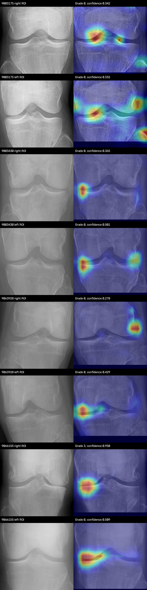

# Three-Model KL-Grading System

This document describes the final DenseNet-121, SE-ResNeXt50-32x4d, and
EfficientNet-B0 classifiers, the production ensemble, and the native-CAM
explanation path. Training metrics come from the exact executed runs listed
below. Deployment checks use unlabeled `test_images` and therefore validate
software behavior and heatmap geometry, not diagnostic accuracy.

## Production Decision

The deployed `ensemble` mode uses two models:

| Component | Voting weight | Role |
| --- | ---: | --- |
| DenseNet-121 | 0.55 | Strongest overall Accuracy, macro F1, Grade 1 recall, AP, and AUC |
| SE-ResNeXt50-32x4d | 0.45 | Similar QWK and strongest broad joint localization |
| EfficientNet-B0 | 0.00 | Standalone comparison mode; excluded until labeled paired validation proves ensemble value |

The weights are a conservative deployment choice, not a validation-optimized
claim. The available application images have no KL labels, so they cannot be
used to optimize voting weights. A future weight search must use saved paired
validation probabilities and then be evaluated once on a newly locked holdout.

## Exact Model Runs

| Model | Exact selected run | Selected epoch | Architecture | Checkpoint |
| --- | --- | ---: | --- | --- |
| DenseNet-121 | 2026-07-23 01:31:37.184239 UTC | 27 | `canonical_final_linear_cam` | `checkpoints/densenet121/best_model.pth` |
| SE-ResNeXt50-32x4d | 2026-07-23 01:25:36.772175 UTC | 24 | `final_native_cam_ce` | `checkpoints/se_resnext50_32x4d/best_model (1).pth` |
| EfficientNet-B0 | 2026-07-24 04:45:25.604705 UTC | 10, coarse stage | `efficientnet_b0_final_native_cam_ce` | `checkpoints/efficientnet_b0/best_model.pth` |

Checkpoint integrity at documentation time:

| Model | Size | SHA-256 |
| --- | ---: | --- |
| DenseNet-121 | 28 MB | `cce1602b382411ada19883b180be501f333a5301de2c69aa00d61b031905efd1` |
| SE-ResNeXt50-32x4d | 98 MB | `98630fdfe4618a11bdc0149b1ba7429c22ae2d63e5d3729a784957f30815af95` |
| EfficientNet-B0 | 16 MB | `47238a3ee5350b6521e3f292d30493e7a7e37d0c7aee748b46424c0859fe60ff` |
| YOLOv8 ROI detector | 24 MB | `3e18a09e58df0ae1f8e3102d5e63893c72d2508bba5ffd80c84dac8356161d2b` |

## Data Protocol

The completed final runs used the Kaggle knee-osteoarthritis severity dataset
with five Kellgren-Lawrence classes. Hash deduplication produced 5,778 training,
826 validation, and 1,656 test images. Training class counts were Grade 0:
2,286; Grade 1: 1,046; Grade 2: 1,516; Grade 3: 757; and Grade 4: 173.

Common preprocessing:

1. Deduplicate images across split directories by content hash.
2. Infer laterality from the filename during training and from the YOLO ROI
   order/location in the application.
3. Mirror anatomical right knees so all knees use one orientation.
4. Pad each ROI to a square without distorting its aspect ratio.
5. Apply LAB-space CLAHE with clip limit 2.0 and an 8x8 tile grid.
6. Resize to 400x400 and center-crop to 384x384.
7. Convert to a tensor and apply ImageNet channel normalization.

Training augmentation was deliberately mild: random rotation of 5 degrees,
brightness/contrast jitter of 0.08, and one small random erasing operation with
probability 0.10. Random horizontal flip, minority-only transforms, test-time
augmentation, multiscale fusion, and EMA were disabled in the selected runs.
Full inverse-frequency sampling was used in each final run.

The historical test split was evaluated only after checkpoint selection inside
each final notebook. However, it has now been examined across many experiments,
so it is no longer a pristine holdout for future model-selection claims.

## Shared Training Objective

All three selected models use five-class cross-entropy. A 1x1 convolution
produces five spatial class maps. Global average pooling of each map produces
the corresponding class logit.

Checkpoint selection was validation-only and used:

```text
0.40 * QWK
+ 0.20 * macro F1
+ 0.10 * macro recall
+ 0.10 * Grade 1 recall
+ 0.15 * macro average precision
+ 0.05 * macro ROC AUC
```

This prevents a checkpoint with high QWK but poor minority-class behavior from
winning on QWK alone.

The common three-stage optimizer schedule was:

| Stage | Epochs | Trainable parameters | Optimizer and learning rate |
| --- | ---: | --- | --- |
| Warm-up | 5 | Native-CAM head only | AdamW, head LR 3e-4, weight decay 1e-4 |
| Coarse | 15 | Final backbone stages plus head | AdamW, backbone LR 3e-5, head LR 3e-4, weight decay 1e-4 |
| Fine-tune | 10 | Full network | AdamW, LR 1e-5, weight decay 1e-3 |

Coarse and fine-tune stages used cosine annealing to `1e-7`. Automatic mixed
precision was enabled on GPU. DenseNet and SE-ResNeXt used physical batch size
48 with four workers. EfficientNet-B0 used physical batch size 24 and two-step
gradient accumulation for effective batch size 48, also with four workers.

## DenseNet-121

DenseNet connects each layer to all later layers inside a dense block, which
encourages feature reuse. The final backbone output has a five-channel 1x1
native-CAM head. At 384x384 input, the saved model produces five 12x12 class
maps.

Selected validation result at epoch 27:

| Accuracy | QWK | Macro P | Macro R | Macro F1 | Grade 1 R | AP | AUC | Selection |
| ---: | ---: | ---: | ---: | ---: | ---: | ---: | ---: | ---: |
| 0.6683 | 0.8139 | 0.6901 | 0.7018 | 0.6952 | 0.4052 | 0.7198 | 0.8877 | 0.7276 |

Final test result:

| Accuracy | QWK | Macro P | Macro R | Macro F1 | Grade 1 R | AP | AUC |
| ---: | ---: | ---: | ---: | ---: | ---: | ---: | ---: |
| **0.6612** | 0.8178 | **0.6873** | **0.6783** | **0.6811** | **0.4493** | **0.7334** | **0.8987** |

The 227-case validation CAM audit measured joint energy 0.7996, border energy
0.1323, lower-tibia energy 0.1006, and a broad-joint peak rate of 1.0000.
DenseNet has the strongest overall predictive result, but its visual worst cases
include lateral and off-joint hotspots. Those failures motivated the per-case
deployment heatmap gate.

Sources: [full report](report/dense_net_121/report.md),
[executed notebook](report/dense_net_121/dense_net_121.ipynb), and
[clean production notebook](../notebooks/production/dense_net_121_production.ipynb).

## SE-ResNeXt50-32x4d

This model combines a ResNeXt grouped-convolution backbone with squeeze-and-
excitation channel attention. Its selected final head also produces five 12x12
class maps whose spatial means are the logits.

Selected validation result at epoch 24:

| QWK | Macro F1 | Grade 1 R | AP | Selection |
| ---: | ---: | ---: | ---: | ---: |
| 0.7873 | 0.6498 | 0.4183 | 0.6915 | 0.7003 |

The executed notebook did not print the selected epoch's validation Accuracy,
macro precision, macro recall, or AUC; they are not reconstructed here.

Final test result:

| Accuracy | QWK | Macro P | Macro R | Macro F1 | Grade 1 R | AP | AUC |
| ---: | ---: | ---: | ---: | ---: | ---: | ---: | ---: |
| 0.6389 | **0.8194** | 0.6677 | 0.6727 | 0.6671 | 0.4155 | 0.7248 | 0.8948 |

The 227-case validation CAM audit measured joint energy 0.8707, border energy
0.0749, lower-tibia energy 0.0880, and a broad-joint peak rate of 0.9956. This
is the best broad-ROI localization of the three models, although lateral-margin
activation remains visible and the metrics do not identify osteophytes or joint-
space narrowing precisely.

Sources: [full report](report/se_resnext50_32x4d/report.md) and
[executed notebook](report/se_resnext50_32x4d/2026-07-23_01-25-36_seresnext50_32x4d_final_native_cam_ce.ipynb).

## EfficientNet-B0

The controlled B0-B4 scale experiment found B0 had the strongest completed
validation composite and the smallest architecture. B1-B3 did not improve the
combined objective, and B4 was interrupted. The completed standalone B0 run
therefore used the B0 backbone with the same five-map, global-average native-CAM
head.

Selected validation result at coarse epoch 10:

| Accuracy | QWK | Macro P | Macro R | Macro F1 | Grade 1 R | AP | AUC | Selection |
| ---: | ---: | ---: | ---: | ---: | ---: | ---: | ---: | ---: |
| 0.6150 | 0.7743 | 0.6279 | 0.6616 | 0.6317 | 0.4771 | 0.6690 | 0.8660 | 0.6936 |

Final test result:

| Accuracy | QWK | Macro P | Macro R | Macro F1 | Grade 1 R | AP | AUC |
| ---: | ---: | ---: | ---: | ---: | ---: | ---: | ---: |
| 0.6051 | 0.7992 | 0.6260 | 0.6418 | 0.6258 | 0.3986 | 0.6817 | 0.8723 |

The 227-case audit measured joint energy 0.8280, border energy 0.1080,
lower-tibia energy 0.0797, broad-joint peak rate 0.9956, and CAM/occlusion
correlation 0.6172. B0 is useful as an architectural comparison and remains an
available application mode, but it does not beat the two production components.

Sources: [full report](report/efficientnet_b0/report.md) and
[executed notebook](report/efficientnet_b0/2026-07-24_04-45-25_efficientnet_b0_final_native_cam_ce.ipynb).

## Direct Model Comparison

| Model | Accuracy | QWK | Macro F1 | Grade 1 R | AP | AUC | Joint energy | Border energy | Lower tibia |
| --- | ---: | ---: | ---: | ---: | ---: | ---: | ---: | ---: | ---: |
| DenseNet-121 | **0.6612** | 0.8178 | **0.6811** | **0.4493** | **0.7334** | **0.8987** | 0.7996 | 0.1323 | 0.1006 |
| SE-ResNeXt50 | 0.6389 | **0.8194** | 0.6671 | 0.4155 | 0.7248 | 0.8948 | **0.8707** | **0.0749** | 0.0880 |
| EfficientNet-B0 | 0.6051 | 0.7992 | 0.6258 | 0.3986 | 0.6817 | 0.8723 | 0.8280 | 0.1080 | **0.0797** |

DenseNet is the best standalone predictive model. SE-ResNeXt provides nearly
the same ordinal agreement and better broad anatomical concentration. B0 is
lower on every reported predictive metric and does not have a sufficient
localization advantage to compensate.

## Native CAM and Grad-CAM

For class `k`, every final model computes a spatial class map `A_k` and logit:

```text
z_k = mean over x,y of A_k(x, y)
```

The displayed native CAM is the positive evidence:

```text
CAM_k = normalize(bilinear_resize(ReLU(A_k)))
```

This map is faithful to the linear head because the same unmodified class map
is averaged into the logit. The API retains the historical response field name
`gradcam_image`, but its value is a native-CAM overlay.

The controlled 2026-07-24 01:12:36.714882 UTC experiment found map correlation
1.0000 between final-layer Grad-CAM and native CAM for DenseNet and SE-ResNeXt.
Mean absolute differences were 0.00014 and 0.00008. For a linear 1x1 head plus
global average pooling, final-layer Grad-CAM analytically reduces to the same
bias-free class map. Native CAM is retained because it needs one forward pass,
no hooks, and no backward pass. It is not claimed to be more anatomically
accurate than Grad-CAM.

Important limitation: positive CAM for Grade 0 explains positive evidence for
the normal class; it cannot directly visualize the absence of osteophytes or
joint-space narrowing. A 12x12 map is also coarse. A plausible map is neither a
lesion segmentation nor proof that the prediction used a clinically causal
feature.

See the [controlled CAM report](report/cam_comparison/report.md).

## Production Ensemble

For DenseNet logits `z_D` and SE-ResNeXt logits `z_S`, the service computes:

```text
p = 0.55 * softmax(z_D) + 0.45 * softmax(z_S)
predicted grade = argmax(p)
```

The vote combines probabilities, not logits or hard classes. Both weights must
be non-negative and are normalized at runtime. No temperature scaling is
currently applied, so the weights are not a substitute for calibration.

EfficientNet-B0 is excluded from the vote. The prior three-model smoke test used
0.50/0.35/0.15, but the images were unlabeled and could not establish an
accuracy gain. The completed B0 standalone result is also weaker than both
active components. A three-model production claim would therefore be premature.

## Per-Case Heatmap Selection

The ensemble prediction and the heatmap source are separate decisions. For the
ensemble's predicted grade, both active models produce a native map. Each map is
measured on the exact processed ROI:

| Measure | Region or rule |
| --- | --- |
| Joint energy | Energy in x=6%-94%, y=28%-72% |
| Border energy | Energy in the outer 8% image border |
| Lower-tibia energy | Energy in x=6%-94%, y=72%-96% |
| Peak check | Maximum activation must lie inside the broad joint band |
| Anatomy score | `joint * (1 - border) * (1 - lower_tibia)` |

A candidate passes when joint energy is at least 0.55, border energy is at most
0.25, lower-tibia energy is at most 0.25, and the peak is inside the joint band.
Among passing candidates, the selected map maximizes:

```text
model probability for ensemble grade * per-case anatomy score
```

Individual-model argmax agreement is not required. This is deliberate: the
2026-07-24 montage showed two cases where DenseNet was the only model agreeing
with the ensemble but its map peaked in upper femur or lower tibia, while the
other model's map for the same ensemble grade was anatomically concentrated.

If no component passes, the service renders the best available score and emits
a server warning. This preserves the response schema while making the failure
observable. The gate does not alter class probabilities or the predicted grade.
It is a presentation safeguard, not training-time anatomical supervision.

## End-to-End Application Pipeline

1. Accept a PNG or JPEG radiograph at `POST /api/v1/predict`.
2. YOLOv8 detects knee-joint boxes at confidence threshold 0.45.
3. Boxes are sorted left-to-right. With two knees, the image-left ROI is the
   anatomical right knee and the image-right ROI is the anatomical left knee.
4. Each ROI is square-padded, CLAHE-enhanced, laterality-canonicalized, resized,
   cropped, normalized, and sent to the selected classifier mode.
5. `ensemble` computes the 0.55/0.45 probability vote.
6. The per-case anatomy gate chooses the predicted-grade native CAM.
7. The heatmap is overlaid 40% on the aligned processed ROI.
8. The service returns the established JSON response and an annotated source
   image. No training occurs in the application.

## Runtime Modes

`MODEL_MODE` supports:

| Value | Loaded classifier checkpoints | Prediction |
| --- | --- | --- |
| `ensemble` | DenseNet + SE-ResNeXt | Production 0.55/0.45 soft vote |
| `densenet121` | DenseNet only | DenseNet softmax and native CAM |
| `se_resnext` | SE-ResNeXt only | SE-ResNeXt softmax and native CAM |
| `efficientnet_b0` | EfficientNet-B0 only | B0 softmax and native CAM |

The default is `ensemble`. Every loaded checkpoint is strict-validated against
its declared architecture and state dictionary. Missing or incompatible weights
stop startup; the application does not silently use random weights.

## API Contract

The prediction response remains unchanged. Top-level fields are:

```text
filename, predictions, annotated_image
```

Every knee prediction retains:

```text
predicted_class, predicted_grade, confidence, description, details,
box, yolo_confidence, knee_side, roi_image, gradcam_image
```

`details` contains probabilities for all five KL grades and sums to one. The
historical `gradcam_image` name contains a 384x384 native-CAM overlay.

## Deployment

Build and run directly with the checkpoints mounted read-only:

```bash
docker build -t knee-oa-anatomy-gated:20260724 .
docker run --rm \
  --name knee-oa-anatomy-gated \
  -p 8005:8005 \
  -e MODEL_MODE=ensemble \
  -v "$(pwd)/checkpoints:/app/checkpoints:ro" \
  knee-oa-anatomy-gated:20260724
```

Health, model metadata, prediction, and ROI inspection are available at
`/api/v1/health`, `/api/v1/models`, `/api/v1/predict`, and
`/api/v1/predict/detect-roi`.

## Verification Record

Verification completed at `2026-07-24 16:22:25.858570 UTC` with Docker image
`knee-oa-anatomy-gated:20260724`, image ID
`sha256:4886015224504a2d2601d90d97ebe2b692d3dff87c6464b23060cf53222084ec`.
The updated application was started directly with `docker run` on host port
8006 because port 8005 was already occupied by the existing application. The
checkpoint directory was mounted read-only.

| Check | Result |
| --- | --- |
| Containerized tests | 22 passed in 5.65 seconds |
| Strict DenseNet loading | Pass; `canonical_final_linear_cam`, epoch 27 |
| Strict SE-ResNeXt loading | Pass; `final_native_cam_ce`, epoch 24 |
| Strict YOLO loading | Pass |
| Source images submitted | 105 / 105 returned HTTP 200 |
| Detected knee predictions | 209 |
| Existing `/predict` top-level and prediction key sets | Unchanged |
| Five probabilities sum to one | Pass for 209 / 209 predictions |
| Annotated and ROI images decode | Pass |
| Native-CAM images decode at 384x384 | Pass for 209 / 209 predictions |
| Mean / maximum CPU request time | 1.421 / 1.763 seconds |

The unlabeled prediction distribution was Grade 0: 132, Grade 1: 36, Grade 2:
26, Grade 3: 13, and Grade 4: 2. This distribution is a drift/debugging signal,
not an accuracy result.

### Heatmap Gate Audit

The internal audit reran both component models on the same 209 detected ROIs and
compared the former global-agreement selector against the new per-case anatomy
gate.

| Measure | Old selector | New selector |
| --- | ---: | ---: |
| Selected map passed the anatomy gate | 117 / 209 (56.0%) | 167 / 209 (79.9%) |
| DenseNet selected | 110 | 50 |
| SE-ResNeXt selected | 99 | 159 |

The selected source changed in 64 cases. The new gate increased the count of
passing selected maps by 50, or 23.9 percentage points. In 42 cases neither
component passed, so the service returned the best available map and logged the
fallback. This rate is important: the deployment gate improves selection but
does not make every explanation anatomically acceptable.

For `9003430` right knee, the old DenseNet map had joint energy 0.3699, lower-
tibia energy 0.2298, and an upper-femur peak (`y=0.1253`). The new selector used
SE-ResNeXt with joint energy 0.8079, lower-tibia energy 0.0839, and a peak inside
the joint band. For `9063928` left knee, the old DenseNet map had joint energy
0.3765 and lower-tibia energy 0.2842; the selected SE-ResNeXt map had joint
energy 0.8042 and lower-tibia energy 0.0722.



Visual review agrees with the broad metrics: the two formerly diffuse upper-
femur/lower-tibia maps now activate at joint level. Their hotspots remain near
lateral joint margins, so they are improved but not lesion-exact. This is the
maximum defensible conclusion without compartment landmarks or expert lesion
annotations.

These checks establish strict loading, endpoint stability, valid probabilities,
decodable images, and improved heatmap selection. They cannot establish ensemble
QWK, F1, precision, recall, AP, AUC, calibration, or clinical validity because
`test_images` has no ground-truth KL labels.

## Limitations and Required Future Validation

- Grade 1 is the weakest class for all three models because Grade 0/1/2
  boundaries are subtle and label imbalance is substantial.
- The repeatedly inspected historical test set must not be used for another
  configuration decision.
- The heatmap gate uses a broad rectangular anatomical prior. It can reject
  grossly misplaced maps but cannot verify a specific osteophyte or joint-space
  narrowing lesion.
- The ensemble weights are not yet optimized on paired, calibrated validation
  probabilities.
- Image-level bootstrap intervals do not account for correlation between two
  knees from the same patient. Future evaluation should retain patient IDs and
  use patient-clustered resampling.
- A final system claim requires a newly locked patient-level holdout and manual
  radiologist review of explanation failures.
- Runtime dependencies use broad lower bounds rather than a lock file. The clean
  Docker build resolved substantially newer packages and downloaded duplicate
  OpenCV wheels; pinning a tested dependency set is the next deployment
  reproducibility improvement.

## Research Basis

- Dense connectivity: [Huang et al., 2017](https://doi.org/10.1109/CVPR.2017.243)
- ResNeXt grouped transformations: [Xie et al., 2017](https://doi.org/10.1109/CVPR.2017.634)
- Squeeze-and-excitation: [Hu et al., 2018](https://doi.org/10.1109/CVPR.2018.00745)
- EfficientNet compound scaling: [Tan and Le, 2019](https://arxiv.org/abs/1905.11946)
- Class activation maps: [Zhou et al., 2016](https://doi.org/10.1109/CVPR.2016.319)
- Grad-CAM: [Selvaraju et al., 2017](https://doi.org/10.1109/ICCV.2017.74)
- Saliency sanity checks: [Adebayo et al., 2018](https://arxiv.org/abs/1810.03292)
- Automated knee-OA grading and standardized knee ROI:
  [Tiulpin et al., 2019](https://doi.org/10.1038/s41598-019-56527-3)
